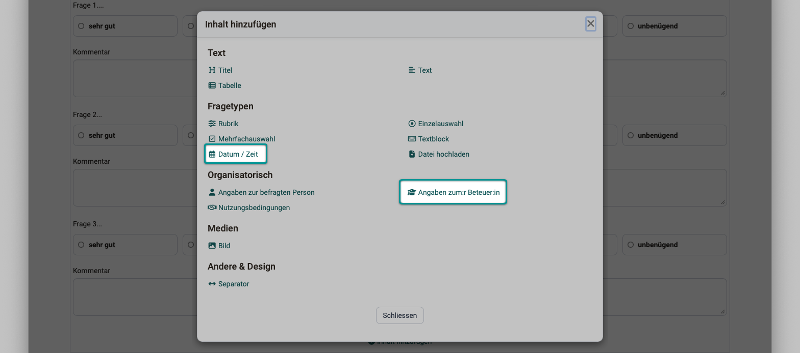
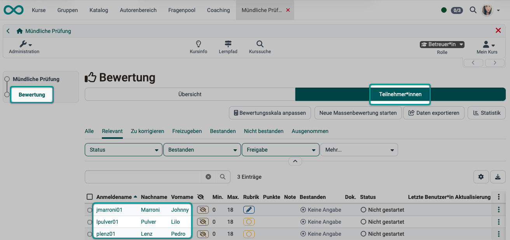
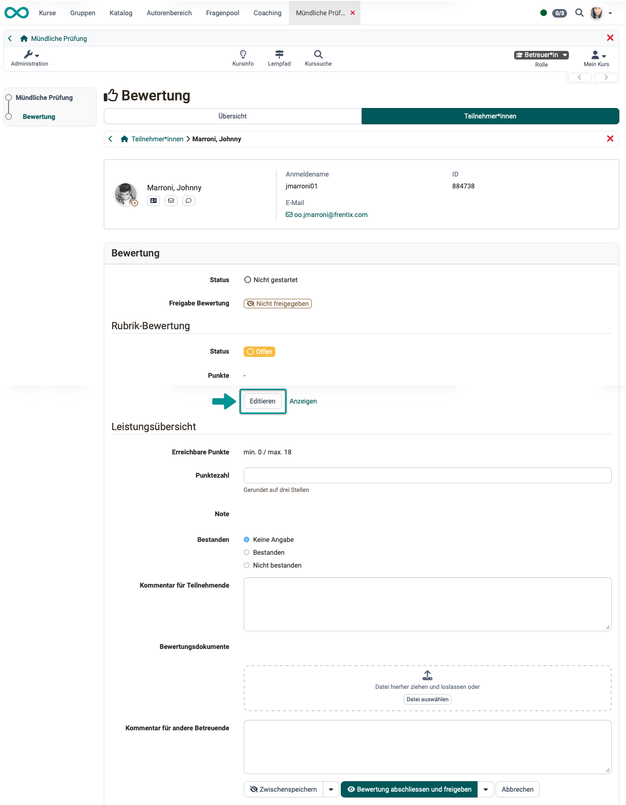
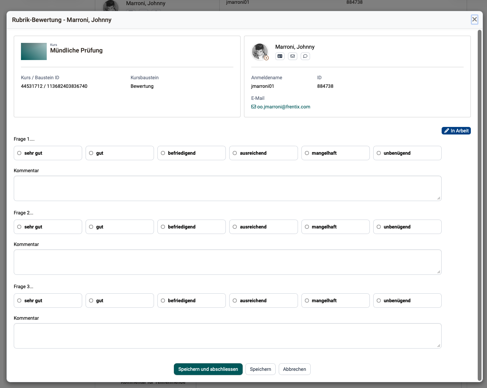
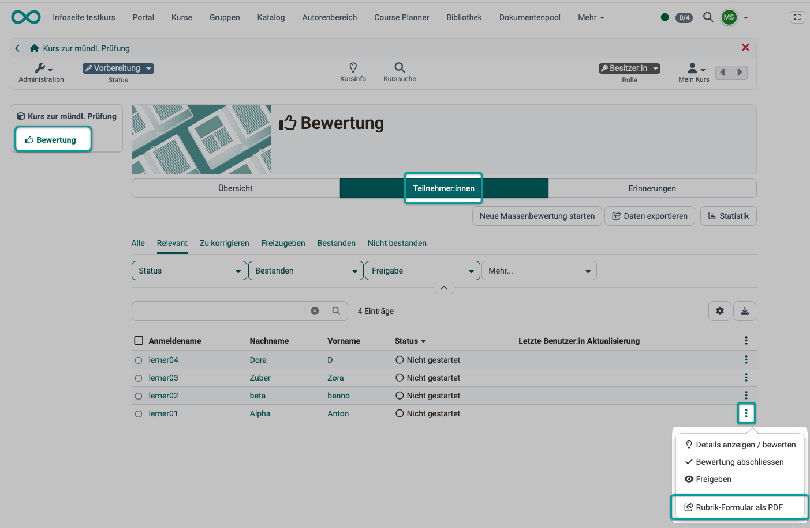
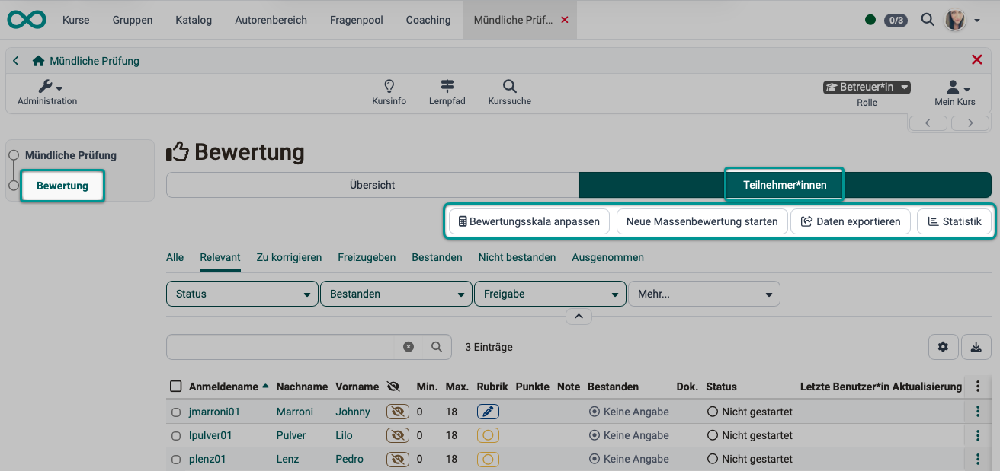
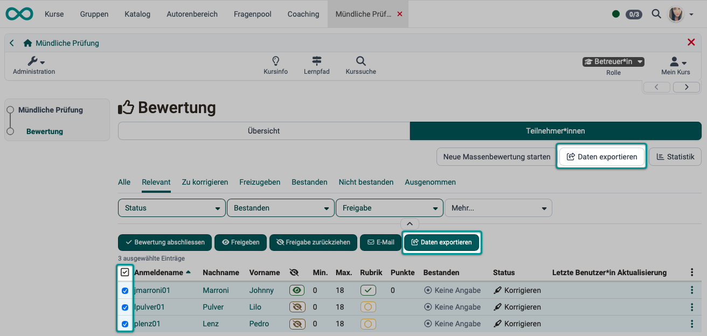
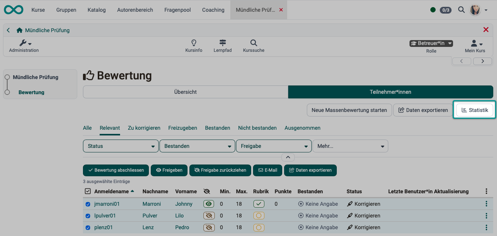
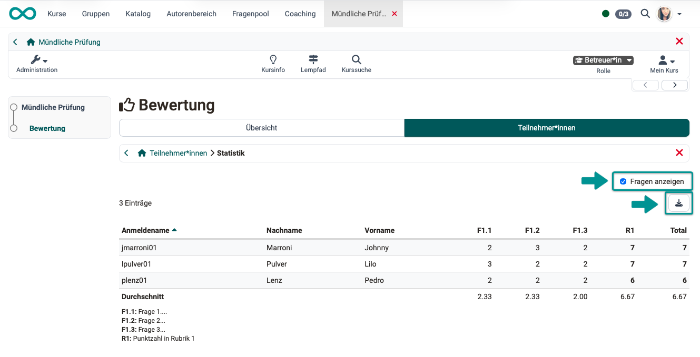
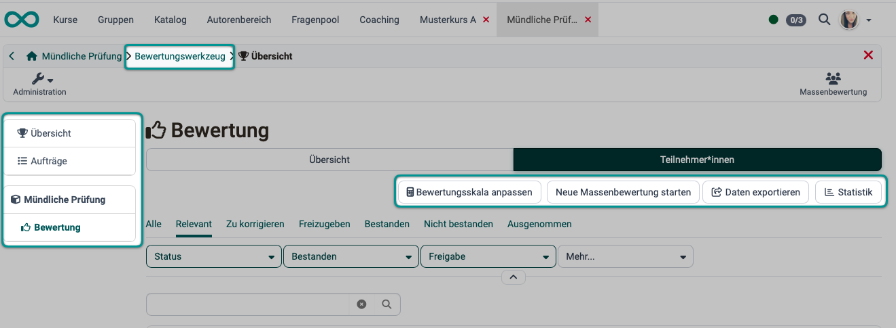

# Wie protokolliere ich eine mündliche Prüfung in OpenOlat? {: #oral_exam}

??? abstract "Ziel und Inhalt dieser Anleitung"

    Mit Hilfe dieser Anleitung sollten Sie in der Lage sein, mündliche Prüfungen mit OpenOlat durchzuführen. Sie erfahren, wie Sie einen Kurs aufsetzen, mit dem sich mündliche Prüfungen effizient protokollieren lassen.

??? abstract "Zielgruppe"

    [x] Autor:innen [x] Betreuer:innen  [ ] Teilnehmer:innen

    [x] Anfänger:innen [x] Fortgeschrittene  [x] Experten/Expertinnen

??? abstract "Erwartete Vorkenntnisse"

    * ["Wie erstelle ich meinen ersten OpenOlat-Kurs?"](../my_first_course/my_first_course.de.md) 
    * Vertrautheit mit dem [Formular-Element Rubrik >](../../manual_user/learningresources/Form_Element_Rubric.de.md)

---

## Warum mündliche Prüfungen in OpenOlat? {: #why}

Haben Lernende bereits OpenOlat-Kurse besucht und schriftliche Prüfungen in OpenOlat absolviert, sind diese Daten und alle Angaben zu den Lernenden bereits in OpenOlat erfasst. Damit es für die mündliche Prüfung keine separate erneute Erfassung der Teilnehmerdaten braucht, macht es Sinn, dass auch mündliche Prüfungen mit OpenOlat durchgeführt werden. Dann können alle Teilnehmerdaten und Ergebnisse gemeinsam in OpenOlat gepflegt werden. Auch Gesamtergebnisse aus schriftlichen und mündlichen Prüfungen können sofort in OpenOlat errechnet werden.

In OpenOlat können Formulare erstellt werden - insbesondere das [Formular-Element Rubrik](../../manual_user/learningresources/Form_Element_Rubric.de.md), mit denen der Ablauf und die Fragen einer mündlichen Prüfung vorbereitet werden können.   

[Zum Seitenanfang ^](#oral_exam)

---

## Schritt 1: Sind alle Teilnehmer:innen der mündlichen Prüfung in OpenOlat erfasst? {: #step_1}

Meistens sind alle Prüfungsteilnehmer:innen bereits in OpenOlat registriert. Kontrollieren Sie jedoch zu Beginn der Vorbereitung, ob alle Teilnehmer:innen der mündlichen Prüfung bereits in OpenOlat registriert sind. Falls nicht, müssten sie in der Benutzerverwaltung noch ergänzt werden.
Gehen Sie dazu in die **Benutzerverwaltung > Konto erstellen**

Falls Sie mit der Benutzerverwaltung noch nicht vertraut sind, können Sie sich hier informieren: 
[Administrationshandbuch: Benutzerverwaltung >](../../manual_admin/usermanagement/index.de.md)

[Zum Seitenanfang ^](#oral_exam)

---

## Schritt 2: Erstellen eines Kurses für die mündliche Prüfung {: #step_2}

Erstellen Sie im Autorenbereich einen eigenständigen Kurs. Das Erstellen eines Kurses wird Ihnen hier erklärt:
[Wie erstelle ich meinen ersten OpenOlat-Kurs? >](../../manual_how-to/my_first_course/my_first_course.de.md)

### Welcher Kursbaustein? {: #step_2a}

In der Regel enthält das Protokoll einer mündlichen Prüfung eine manuell ausgefüllte Bewertung. Es kann ein Online-Formular oder eine ausgedruckte Version verwendet werde. Für beide Situationen ist besonders der [Kursbaustein "Bewertung"](../../manual_user/learningresources/Course_Element_Assessment.de.md) geeignet.

(Im Prinzip kann auch ein Kursbaustein "Formular" verwendet werden, dieser gibt aber kein "Bestanden" aus. Deshalb ist in diesem Fall dann ein zusätzlicher Kursbaustein "Bewertung" erforderlich.)

### Aufteilung der mündlichen Prüfungsthemen {: #step_2b}

Je nach Prüfungsgegenstand sollen meistens verschiedene Themenbereiche geprüft werden. Die Themenstruktur/Prüfungsbereiche bestimmen mit, wie eine sinnvolle Aufteilung der Formulare vorgenommen werden kann.

**Beispiel 1:** 
Es kann ein Kurs mit 1 Kursbaustein "Bewertung" erstellt werden, der 1 Formular enthält, das dann 10 Rubrik-Elemente zu 10 Themenbereichen enthält.

**Beispiel 2:** 
Es können 10 Kursbausteine vom Typ "Bewertung" mit je 1 Formular erstellt werden.

### Einstellungen im Tab "Bewertung"

{ class="shadow lightbox" } 

**Status "Korrigieren" setzen, wenn Zugriff gewährt:** 
Während einer mündlichen Prüfung werden die Beurteilungen direkt gemacht, eine spätere Korrektur wie bei schriftlichen Prüfungen entfällt. Die Option kann deshalb deaktiviert bleiben.

**Rubrik-Bewertung:** 
Das Rubrik-Element ist zentraler Bestandteil für die Bewertung einer mündlichen Prüfung.
Schalten Sie diesen Toggle-Button ein und wählen, importieren oder erstellen Sie im Anschluss ein Rubrik-Formular. 

Wenn Sie zunächst noch kein Formular erstellen wollen, können Sie dies auch erst im Autorenbereich tun (Schritt 3) und anschliessend einbinden (Schritt 4).

{ class="shadow lightbox" } 

**Punkte vergeben:** 
Da wir für die mündlichen Prüfungen ein Rubrik-Formular verwenden, können die Punkte aus dem Rubrik übernommen werden.

Verwenden Sie mehrere Kursbausteine "Bewertung" innerhalb einer mündlichen Prüfung (eines Kurses), können Sie den **Skalierungsfaktor** z.B. dazu benutzen, um separat bewertete Teile der mündlichen Prüfung für die Gesamtbewertung anzupassen.

Beispiel: Die mündliche Prüfung besteht aus 3 Teilen, die je zu einem Drittel zur Gesamtbewertung zählen. Wenn es im Formular zu einem Prüfungsteil max. 50 Punkte gibt, im Formular der anderen Prüfungsteile dagegen je max. 100 Punkte, müssen die Punkte des ersten Prüfungsteils verdoppelt werden, damit er in der Gesamtbewertung das gleiche Gewicht erhält.   

**Bewertung mit Einstufung/Noten:** 
Sobald "Punkte vergeben" eingeschaltet wurde, kann auch die Option "Bewertung mit Einstufung/Noten" eingeschaltet und weiter konfiguriert werden. 
Standardmässig werden Ergebnisse in OpenOlat mit Punkten bewertet. Durch Aktivierung dieser Option, werden die Punkte auch in eine Notenskala oder ein anderes Bewertungssystem umgerechnet.  
[Mehr zu Bewertungssystemen >](../../manual_admin/administration/Assessment_translate_points_in_grades_admin.de.md) 

**Bewertungsskala:** 
Klicken Sie auf "Bewertungsskala bearbeiten" um eine Skala auszuwählen und eventuell weitere Einstellungen vorzunehmen. In der Skala ist auch definiert, ob bzw. ab wann eine Bewertungsskala mit einem bestanden/nicht bestanden verbunden ist.

Unter **Zuweisung** definieren Sie, ob die Zuweisung zur gewählten Bewertungsskala manuell durch die Betreuenden oder automatisch durch die Zuordnung der erreichten Punktzahl erfolgen soll.

**Bestanden/Nicht bestanden ausgeben:** 
Haben Sie sich für eine Bewertung mit Einstufung/Noten entschieden, wird Ihnen der Grenzwert für das "Bestanden" der gewählten Bewertungsskala angezeigt. 
Verwenden Sie *keine* Bewertung mit Einstufung/Noten, können Sie sich entscheiden, ob Sie das "Bestanden/Nicht bestanden" des Kursbausteins den Teilnehmer:innen anzeigen möchten. 
Wenn zusätzlich zu "Bestanden/Nicht bestanden" auch "Punkte" aktiviert wurden, kann neben der standardmässigen manuellen Bewertung durch die Betreuer:innen auch eine automatische, punkteabhängige Bewertung aktiviert werden.

**Bei Kursbewertung berücksichtigen:** 
Ist die Option aktiviert, werden die in diesem Kursbaustein erreichten Punkte auf die in der Administration -> Einstellungen -> Bewertung definierten Punktschwelle, die für das Bestehen des Kurses notwendig ist, angerechnet. Bzw. der Kursbaustein wird als Teil der notwendigen Kursbausteine, die für das Bestehen des gesamten Kurses dienen, berücksichtigt. 
Werden für die mündliche Prüfung mehrere Kursbausteine "Bewerten" verwendet, denken Sie bitte daran, dass in allen Kursbausteinen diese Option gewählt ist. 

**Individuelle Kommentare:** 
Wenn diese Checkbox aktiviert ist, erhalten die Prüfer:innen (Rolle "Betreuer:in) ein Feld angezeigt, in dem sie individuelle Kommentare für die Prüfungsteilnehmer:innen eintragen können.

**Individuelle Bewertungsdokumente:** 
Aktivieren Sie diese Checkbox, damit die Prüfer:innen individuelle Dokumente z.B. als Feedback bereitstellen können.

**Erweiterte Konfigurationen** 
Unter dem Link "Erweiterte Konfigurationen eingeben" können Sie generelle Informationen für die Prüfer:innen (Rolle Betreuer:innen) hinterlegen. Sie können so z.B. alle Prüfer:innen an allgemeine Grundsätze der mündlichen Prüfung erinnern.

**Ergebnis, wie es die Prüfer:innen später sehen:**

{ class="shadow lightbox" } 
---

### Einstellung von Zeitangaben

Ein Durchführungszeitraum, der in den Einstellungen im Tab "Durchführung" angegeben wurde, gilt nur für Teilnehmer:innen. Da während der mündlichen Prüfung nur die Prüfer:innen (Rolle Betreuer:in oder Besitzer:in) auf den Kurs zugreifen, ist diese Angabe in diesem Fall irrelevant.

[Zum Seitenanfang ^](#oral_exam)

---

## Schritt 3: Erstellung eines Formulars für die mündliche Prüfung {: #step_3}

Wenn Sie noch kein Rubrik-Formular beim Einrichten des Kursbausteins im vorhergehenden Schritt 2 erstellt haben, können Sie ein neues (oder anderes Formular zum Auswechseln) im Autorenbereich erstellen: 
**Autorenbereich > Erstellen > Formular**

{ class="shadow lightbox" } 

Ein neu erstelltes Formular beinhaltet zunächst noch kein Rubrik-Element. Dieses muss im Kurs über "Bearbeiten" oder alternativ direkt in der Lernressource im Formular-Editor hinzugefügt werden.

### Layout und Inhalte des Formulars {: #step_3_layout_content}

Mündliche Prüfungen bestehen oft aus einer Kombination verschiedener Formate, etwa Präsentationen, erklärenden Fachfragen, kurzen Abfragen von Inhalten, sowie Reflexions- und Transferfragen. Ein gutes Bewertungsraster bildet diese Vielfalt ab und macht sichtbar, was in welchem Teil geprüft wird und wie die Bewertung erfolgt.

In OpenOlat können frei definierbare Bewertungsraster am besten mit dem Rubrik-Element erstellt werden.
Ein Rubrik-Element besteht aus einem Gitter mit Zeilen und Spalten. In den Zeilen werden die Bewertungskategorien bzw. Statements aufgeführt, während die Spaltenüberschriften die Bewertungsskalen wiedergeben. So können sich mehrere unterschiedliche Statements auf eine Bewertungsskala beziehen. Je nach konkreter Konfiguration können dabei sehr unterschiedliche Rubrik-Varianten entstehen.

{ class="shadow lightbox" } 

Öffnen Sie in der neu erstellten Formular-Lernressource den Editor unter **Administration > Inhalt editieren** und erstellen Sie ein Rubrik-Formular, das zu Ihrer mündlichen Prüfung passt. 

{ class="shadow lightbox" } 

Zur Erstellung eines Rubrik-Formulars finden Sie hier ausführliche Informationen:

[Das Formular-Element Rubrik >](../../manual_user/learningresources/Form_Element_Rubric.de.md) 
[Formular als Rubrik Bewertung >](../../manual_user/learningresources/Forms_in_Rubric_Scoring.de.md) 
[Layout hinzufügen >](../../manual_user/learningresources/Form_Editor.de.md#insert_layout) 
[Inhaltselemente hinzufügen >](../../manual_user/learningresources/Form_Editor.de.md#insert_content_element)

### Informationen im Kopfbereich {: #step_3_header}

!!! hint "Hinweis"

    Teilnehmerdaten werden im Kopf der… angegeben und brauchen nicht als Feld im Formular enthalten sein (Sie würden sonst doppelt enthalten sein.)

Im Kopfbereich des Formulars wird die allgemeine Anzeige eines Benutzers verwendet.
Diese wird an ganz vielen anderen Stellen im OpenOlat verwendet (Termine, Coaching, Tests, Aufgabe, Lernpfadübersicht, Portfolio, Projekt, ...). Es ist nicht möglich, das nur im Formular zu ändern. (Die allgemeine Anzeige des Benutzers wird über User Property Context "UserShortDescription" gesteuert.)

Fügen Sie im Inhaltseditor des Formulars für 

- Prüfungsstart
- Prüfungsende
- und für beteiligte Prüfer:innen 

jeweils Angaben in einem Inhaltselement oberhalb des Rubrik-Elements hinzu. Diese werden dann im Kopfbereich angezeigt.

{ class="shadow lightbox" } 

[Zum Seitenanfang ^](#oral_exam)

---

## Schritt 4: Einbindung des Formulars in den Kurs {: #step_4}

Wurde das Formular nicht sofort beim Einrichten des Kursbausteins erstellt (Schritt 2), sondern separat im Autorenbereich (Schritt 3), muss nochmals der Kurseditor geöffnet werden und im Kursbaustein "Bewertung" im Tab "Bewertung" das Formular eingebunden werden. 

[Zum Seitenanfang ^](#oral_exam)

---

## Schritt 5: Prüfungsteilnehmer:innen und Prüfer:innen hinzufügen {: #step_5}

Sind Formular und Kurs inhaltlich fertig gestellt, können die Prüfungsteilnehmer:innen der mündlichen Prüfung zugeordnet werden.

**Kurs > Administration > Mitgliederverwaltung > Mitglied hinzufügen**

Prüfer:innen weisen Sie die Kursrolle "Betreuer:in" zu.

Falls Sie mit der Mitgliederverwaltung noch nicht vertraut sind, können Sie sich hier informieren: 
[Mitgliederverwaltung >](../../manual_user/learningresources/Members_management.de.md)

!!! hint "Hinweis"

    Oft sind an mündlichen Prüfungen externe Personen als Prüfer:innen beteiligt. Denken Sie daran, dass auch diese idealerweise in OpenOlat als Benutzer:in angelegt sein sollten (siehe Schritt 1). 
    Ein Tipp, wenn Sie neu in OpenOlat sind: 
    Unterscheiden Sie: [Benutzerverwaltung](../../manual_admin/usermanagement/index.de.md) und [Mitgliederverwaltung](../../manual_user/learningresources/Members_management.de.md)

[Zum Seitenanfang ^](#oral_exam)

---

## Schritt 6, Variante a): Durchführung der mündlichen Prüfung mit Online-Formular {: #step_6a}

!!! hint "Hinweis"

    Denken Sie als Kursbesitzer:in daran: Wurde der Status des Kurses auf "Veröffentlicht" gestellt?

Bestimmen Sie, wer von den Prüfer:innen das Protokoll in OpenOlat führt. 
Als Protokollant:in (OpenOlat-Rolle "Betreuer:in") gehen Sie folgendermassen vor:

- Öffnen Sie den Kurs.
- Wählen Sie den betreffenden Kursbaustein "Bewertung".
- Wählen Sie den/die Prüfungsteilnehmer:in im Tab "Teilnehmer:innen" indem Sie auf den Namen klicken.

{ class="shadow lightbox" } 

Sie können in den angezeigten Feldern nun Ihre Bewertung während der mündlichen Prüfung dieser Person eintragen:

- Punkte
- ob bestanden oder nicht bestanden
- Der Kommentar für Teilnehmende macht dann Sinn, wenn diese nach der mündlichen Prüfung auch selbst auf diesen Kurs zugreifen können/sollen.
- Es können Bewertungsdokumente (Dateien) angehängt werden.
- Im Feld "Kommentar für andere Betreuende" können z.B. Stichworte der Besprechung unter den Prüfern notiert werden.
- **Um das Rubrik-Formular zu verwenden, klicken Sie im Abschnitt "Rubrik-Bewertung" auf den Button "Editieren".**
- Sie schliessen die mündliche Prüfung, indem Sie den Button "Bewertung abschliessen und freigeben" am unteren Rand wählen.

{ class="shadow lightbox" } 

Nach dem Klick auf "Editieren" im Abschnitt "Rubrik-Bewertung" steht Ihnen das Rubrik-Formular zur Eingabe Ihrer Bewertungen und Kommentare zur Prüfungsleistung zur Verfügung.

!!! hint "Hinweis"

    Vergewissern Sie sich als Ersteller:in des Rubrik-Formulars bitte **vor** der ersten mündlichen Prüfung, dass die Prüfer:innen alle erforderlichen Angaben machen können.
    Denn wenn das Formular einmal verwendet wurde, kann es nicht mehr einfach für die anderen Prüfungsteilnehmer:innen abgeändert werden. (Alle Prüfungsteilnehmer:innen sollen mit dem gleichen Formular, nach den gleichen Kriterien bewertet werden.)

{ class="shadow lightbox" } 

[Zum Seitenanfang ^](#oral_exam)

---

## Schritt 6, Variante b): Durchführung der mündlichen Prüfung mit Ausdruck (pdf) {: #step_6b}

Soll das Prokoll zur mündlichen Prüfung ausgedruckt werden, kann in OpenOlat ein pdf erstellt werden.
Z.B. kann Prüfer:innen, die nicht zur Online-Protokollierung in OpenOlat eingeteilt sind, ein solches Formular ausgedruckt werden.

- Wählen Sie die gewünschte Prüfungsteilnehmer:in, dann sind im Kopf der pdf-Datei bereits alle Angaben zur Person angezeigt.
- Unter dem Icon mit den 3 Punkten finden Sie die Option "Rubrik-Formular als pdf". 
- Laden Sie diese pdf-Datei herunter und drucken Sie sie aus.

{ class="shadow lightbox" }  

[Zum Seitenanfang ^](#oral_exam)

---

## Schritt 7: Auswertung der mündlichen Prüfung {: #step_7}

Wenn Sie die Bewertung mit dem Rubrik-Formular online gemacht haben (Schritt 6a), sind bereits alle Eintragungen in OpenOlat vorhanden und Sie können sofort mit der Auswertung beginnen. 
Wurde das Rubrik-Formular ausgedruckt, müssen relevante Daten zuerst von den handschriftlichen Notizen in OpenOlat übertragen werden.

Die durch das Rubrik-Formular generierte Punktzahl wird automatisch als Summe oder Durchschnitt übernommen. Bei Wahl der "Summe" werden die Punkte, die pro Zeile vergeben werden, aufaddiert. Bei Wahl "Durchschnitt" wird die Durchschnittsumme aller Rubrik-Zeilen ermittelt. Alternativ kann auch eine manuelle Punktevergabe gewählt oder ganz auf Punkte verzichtet werden.

Oberhalb der Teilnehmerliste finden Sie Buttons für die nachfolgend beschriebenen Optionen.

{ class="shadow lightbox" }  

### Bewertungsskala anpassen {: #step_7_scale}

Solange noch keine Bewertung abgeschlossen wurde, kann die Bewertungsskala noch angepasst werden.

### Massenbewertung {: #step_7_bulk_action}

Sollen mehrere Personen gemeinsam bewertet werden, z.B. wenn die Präsentation einer Gruppenarbeit bewertet wird, können Sie dies mit dem Button "Neue Massenbewertung starten" tun.

### Daten exportieren (Export der Prüfungsergebnisse) {: #step_7_export}

Auch einen Button zum Export der Prüfungsergebnisse finden Sie über der Liste der Teilnehmer:innen. Hier werden die Ergebnisse aller Teilnehmer:innen exportiert.  
Wenn Sie Ergebnisse einzelner Teilnehmer:innen exportieren möchten, selektieren Sie die betreffenden Personen in der ersten Spalte. Dann erscheint ein weiterer Button zum Export über der Liste.

Sie erhalten die Ergebnisse als Excel-Datei mit den Rohdaten und auf Wunsch zusätzlich als pdf-Datei mit detaillierten Angaben.

{ class="shadow lightbox" } 

### Statistik {: #step_7_statistics}

Der Button "Statistik" zeigt eine Tabelle mit den Ergebnissen der Rubrik-Elemente, sowohl die Punkte einzelner Fragen als auch die Gesamtpunktzahl der Teilnehmer:innen und die Durchschnitte. 

{ class="shadow lightbox" } 

Mit Klick auf den Button "Statistik" öffnet sich die Tabelle mit Detailangaben.

Wenn Sie die Checkbox "Fragen anzeigen" selektieren, werden Ihnen auch Details der Rubrik-Fragen tabellarisch angezeigt. Unterhalb der Teilnehmer:innen finden Sie die Durchschnitte in der Tabelle. 

Mit dem Download-Button erhalten Sie eine Excel-Datei der Ergebnisse.

{ class="shadow lightbox" } 

### Bewertungswerkzeug {: #step_7_assessment_tool}

Alternativ sind die gleichen Buttons auch im Bewertungswerkzeug zu finden. 
**Bewertungswerkzeug > Kursbaustein Bewertung > Tab Teilnehmer:innen > Button ...**

{ class="shadow lightbox" }  

[Zum Seitenanfang ^](#oral_exam)

---

## Checkliste {: #checklist}

- [x] Sind alle Teilnehmer:innen der mündlichen Prüfung in OpenOlat erfasst?
- [x] Ist ein separater Kurs für die mündliche Prüfung erstellt?
- [x] Wurde ein Kursbaustein vom Typ "Bewertung" in den Kurs eingefügt?
- [x] Ist ein Rubrik-Formular erstellt und in den Kursbaustein "Bewertung" eingebunden?
- [x] Ist der Bewertungsbaustein passend konfiguriert (Punkte, Bestehensgrenze, Kommentare aktiv)?
- [x] Sollen mehrere Kursbausteine "Bewertung" und mehrere Rubrik-Formulare in Kurs eingebunden werden?
- [x] Ist die Ablaufstruktur der mündlichen Prüfung in den Rubrik-Formularen passend abgebildet?
- [x] Sind die Sichtbarkeitsregeln abgestimmt (sofortige Anzeige oder Freigabe nach Abschluss)?
- [x] Sind alle Prüfungsteilnehmer:innen als Mitglieder im Prüfungskurs erfasst?
- [x] Sind alle Prüfer:innen (auch externe) als Mitglieder im Prüfungskurs erfasst?
- [x] Haben alle Prüfer:innen die Rolle "Betreuer:in" und können sie das Bewertungswerkzeug öffnen?
- [x] Ist der Kurs publiziert und für Prüfer:innen zugänglich?
- [x] Sind die Prüfungstermine vergeben und allen Beteiligten bekannt?
- [x] Wurde eine Testprüfung mit einem Dummy-Teilnehmer erfolgreich durchgeführt?

[Zum Seitenanfang ^](#oral_exam)

---

## Häufige Fragen {: #faq}

**Kann ich nachträglich die Punkte korrigieren?** 
Ja. Als Betreuer oder Besitzer öffnen Sie den/die Teilnehmer:in erneut im Bewertungswerkzeug und überschreiben die Werte. Alle Änderungen werden in einem Audit-Log erfasst.

**Wie exportiere ich die Ergebnisse?** 
Im Bewertungswerkzeug gibt es oben rechts die Aktion „Export“. Sie erhalten eine Excel- bzw. CSV-Datei mit allen Punkten, Noten und Kommentaren.

**Was tun, wenn ein Teilnehmer nicht erschienen ist?** 
Tragen Sie im Bewertungsbaustein "0 Punkte" und "Nicht bestanden" ein und halten Sie in der internen Notiz "nicht erschienen" fest. Alternativ können Sie den Status "Nicht teilgenommen" setzen, falls dies im Notensystem konfiguriert ist.

**Können Teilnehmer ihre Bewertung herunterladen?** 
Ja, über *”Mein Kurs” > Leistungsnachweis* erhalten Sie ein PDF mit den erzielten Ergebnissen aller bewerteten Bausteine.

**Ist eine Online-Prüfung über Video möglich?** 
Ja. Kombinieren Sie den Kurs mit einem Videokonferenz-System (z. B. dem integrierten BigBlueButton-Baustein), um die Prüfung remote durchzuführen. Die Bewertung bleibt im Bewertungsbaustein.

[Zum Seitenanfang ^](#oral_exam)

---

## Weiterführende Informationen {: #further_information}

[Wie erstelle ich meinen ersten OpenOlat-Kurs? >](../../manual_how-to/my_first_course/my_first_course.de.md) 
[Formulare: Übersicht >](../../manual_user/learningresources/Form.de.md) 
[Das Formular-Element Rubrik >](../../manual_user/learningresources/Form_Element_Rubric.de.md) 
[Layout hinzufügen >](../../manual_user/learningresources/Form_Editor.de.md#insert_layout) 
[Inhaltselemente hinzufügen >](../../manual_user/learningresources/Form_Editor.de.md#insert_content_element) 

[Zum Seitenanfang ^](#oral_exam)

