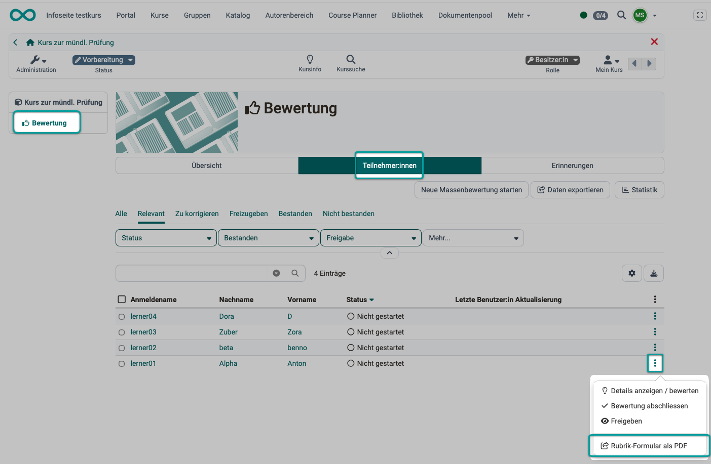

# Wie protokolliere ich eine mündliche Prüfung in OpenOlat? {: #oral_exam}

!!! warning "Achtung"

    Dieser Artikel ist noch in Bearbeitung.

??? abstract "Ziel und Inhalt dieser Anleitung"

    Mit Hilfe dieser Anleitung sollten Sie in der Lage sein, mündliche Prüfungen mit OpenOlat durchzuführen.

??? abstract "Zielgruppe"

    [ ] Autor:innen [x] Betreuer:innen  [ ] Teilnehmer:innen

    [x] Anfänger:innen [x] Fortgeschrittene  [x] Experten/Expertinnen

??? abstract "Erwartete Vorkenntnisse"

    * ["Wie erstelle ich meinen ersten OpenOlat-Kurs?"](../my_first_course/my_first_course.de.md) 
    * Vertrautheit mit dem [Formular-Element Rubrik >](../../manual_user/learningresources/Form_Element_Rubric.de.md)

---

## Warum mündliche Prüfungen in OpenOlat? {: #why}

Haben Lernende bereits OpenOlat-Kurse besucht und schriftliche Prüfungen in OpenOlat absolviert, sind diese Daten und alle Angaben zu den Lernenden bereits in OpenOlat erfasst. Damit es für die mündliche Prüfung keine separate erneute Erfassung der Teilnehmerdaten braucht, macht es Sinn, dass auch mündliche Prüfungen mit OpenOlat durchgeführt werden. Dann können alle Teilnehmerdaten und Ergebnisse gemeinsam in OpenOlat gepflegt werden. Auch Gesamtergebnisse aus schriftlichen und mündlichen Prüfungen können sofort in OpenOlat errechnet werden.

[Zum Seitenanfang ^](#oral_exam)

---

## Schritt 1: Sind alle Teilnehmer:innen der mündlichen Prüfung in OpenOlat erfasst? {: #step_1}

Kontrollieren Sie während der Vorbereitung, ob alle Teilnehmer:innen der mündlichen Prüfung bereits in OpenOlat registriert sind. Falls nicht, müssten sie in der Benutzerverwaltung noch ergänzt werden.
Gehen Sie dazu in die 
Benutzerverwaltung > 

screen?

[Zum Seitenanfang ^](#oral_exam)

---

## Schritt 2: Erstellen eines Kurses für die mündliche Prüfung {: #step_2}

### Welcher Kursbaustein? {: #step_2a}

In der Regel enthält das Protokoll einer mündlichen Prüfung eine manuelle Bewertung. Dazu ist besonders der Kursbaustein „Bewertung“ geeignet.

(Im Prinzip kann auch ein Kursbaustein „Formular“ verwendet werden, dieser gibt aber kein „Bestanden“ aus. Deshalb ist dazu dann ein zusätzlicher Kursbaustein „Bewertung“ erforderlich.)

### Aufteilung der mündlichen Prüfungsthemen {: #step_2b}

Je nach Prüfungsgegenstand sollen meist verschiedene Themen geprüft werden. Die Themenstruktur/Prüfungsbereiche bestimmen mit, wie eine sinnvolle Aufteilung der Formulare vorgenommen werden kann.

Beispiel 1: 
Es kann ein Kurs mit 1 Kursbaustein „Bewertung“ erstellt werden, der 1 Formular enthält, das dann 10 Rubrik-Elemente zu 10 Themenbereichen enthält.

Beispiel 2: 
Es können 10 Kursbausteine vom Typ „Bewertung“ mit je 1 Formular erstellt werden.

### Informationen im Kopfbereich {: #step_2c}

Im Kopfbereich des Formulars wird die allgemeine Anzeige eines Benutzers verwendet.
Diese wird an ganz vielen anderen Stellen im OpenOlat verwendet (Termine,
Coaching, Tests, Aufgabe, Lernpfadübersicht, Portfolio, Projekt, ...). Es ist
nicht möglich, das nur im Formular zu ändern. (Die allgemeine Anzeige des Benutzers wird über User Property Context "UserShortDescription" gesteuert.)

screen 

[Zum Seitenanfang ^](#oral_exam)

---

## Schritt 3: Erstellung eines Formulars für die mündliche Prüfung {: #step_3}

Autorenbereich > Erstellen > Formular

Hinweis: Teilnehmerdaten werden im Kopf der… angegeben und brauchen nicht als Feld im Formular enthalten sein (würden sonst doppelt enthalten sein)

tbd

Mündliche Prüfungen bestehen oft aus einer Kombination verschiedener Formate, etwa Präsentationen,
erklärenden Fachfragen, kurzen Abfragen von Inhalten sowie ReXexions- oder Transferfragen. Ein guter
Bewertungsraster bildet diese Vielfalt ab und macht sichtbar, was in welchem Teil geprüft wird und wie
die Bewertung erfolgt.
Fachliche Entscheidung statt starre Vorgaben.
In OpenOlat können frei de:nierte Bewertungsraster erstellt und die Gewichtung pro Frage gezielt
gesteuert werden. Entscheidend ist dabei nicht das Tool, sondern das fachliche Urteil der Prüfenden.
Bewertung als Teil des Lernprozesses.
Bewertungen sind nicht nur ein Endpunkt, sondern eine strukturierte Rückmeldung. Sie unterstützen
Lernende in ihrer Weiterentwicklung und bleiben für alle Beteiligten nachvollziehbar.

[Zum Seitenanfang ^](#oral_exam)

---

## Schritt 4: Einbindung des Formulars in den Kurs {: #step_4}

[Zum Seitenanfang ^](#oral_exam)

---

## Schritt 5, Variante a): Durchführung der mündlichen Prüfung mit Online-Formular {: #step_5a}

tbd

[Zum Seitenanfang ^](#oral_exam)

---

## Schritt 5, Variante b): Durchführung der mündlichen Prüfung mit Ausdruck (pdf) {: #step_5b}

Soll das Prokoll zur mündlichen Prüfung ausgedruckt werden, kann in OpenOlat ein pdf erstellt werden:

- Wählen Sie die gewünschte Prüfungsteilnehmer:in, dann sind im Kopf der pdf-Datei bereits alle Angaben zur Person angezeigt.
- Unter dem Icon mit den 3 Punkten finden Sie die Option "Rubrik-Formular als pdf". 
- Laden Sie diese pdf-Datei herunter und drucken Sie sie aus.

{ class="shadow lightbox" }  

[Zum Seitenanfang ^](#oral_exam)

---

## Schritt 6: Auswertung der mündlichen Prüfung {: #step_6}

Wenn Sie die Bewertung mit dem Rubrik-Formular online gemacht haben (Schritt 5a), sind bereits alle Eintragungen in OpenOlat vorhanden und Sie können sofort mit der Auswertung beginnen. 
Wurde das Rubrik-Formular ausgedruckt, müssen relevante Daten zuerst von den handschriftlichen Notizen in OpenOlat übertragen werden.

tbd

### Auswertung Einzelperson
Auswertung Rubrik-Formular (mehrere Rubrik in einer Prüfung=Themengebiete?)

### Auswertung gesamtergebnis der Einzelperson 
(Verrechnung mit anderen Prüfungen, schriftlich oder mündlich)

### Auswertung der Gesamtprüfung, 
Vergleich aller Prüfungsteilnehmer und Durchschnitt der Prüfungsgruppe usw.

[Zum Seitenanfang ^](#oral_exam)

---

## Checkliste {: #checklist}

- [x] Sind alle Teilnehmer:innen der mündlichen Prüfung in OpenOlat erfasst?
- [x] Ist ein separater Kurs für die mündliche Prüfung erstellt?
- [x] Ist die Ablaufstruktur der mündlichen Prüfung in passenden Rubrik-Formularen abgebildet?
- [x] Sollen mehrere Kursbausteine zur Bewertung verwendet werden?
- [x] ...?
- [x] ...?

[Zum Seitenanfang ^](#oral_exam)

---

## Weiterführende Informationen {: #further_information}

[Wie erstelle ich meinen ersten OpenOlat-Kurs? >](../../manual_how-to/my_first_course/my_first_course.de.md) 
[Formulare: Übersicht >](../../manual_user/learningresources/Form.de.md) 
[Das Formular-Element Rubrik >](../../manual_user/learningresources/Form_Element_Rubric.de.md) 

[Zum Seitenanfang ^](#oral_exam)

