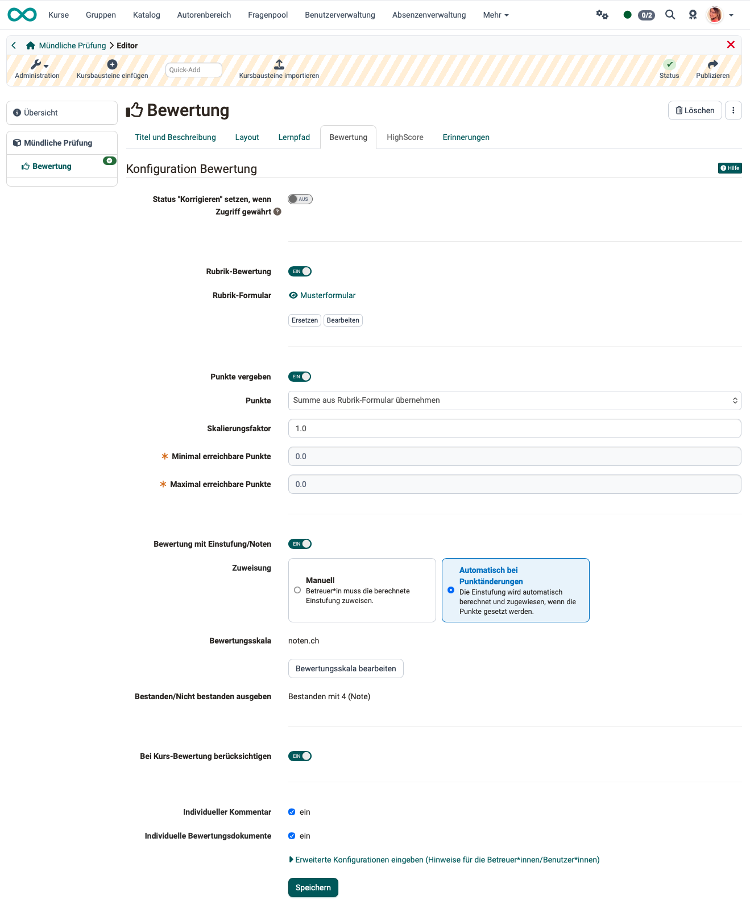
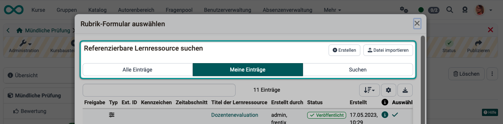
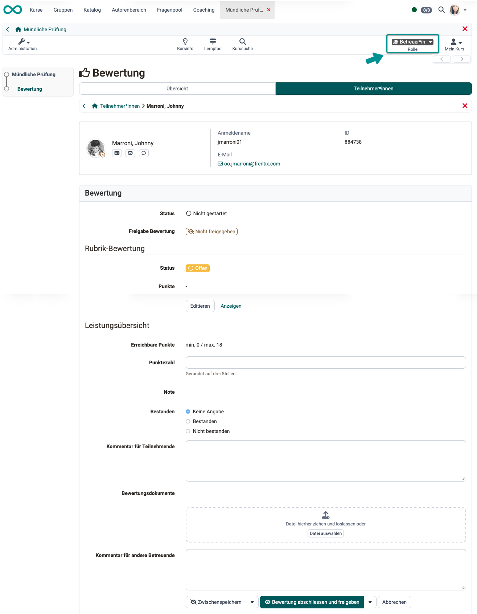
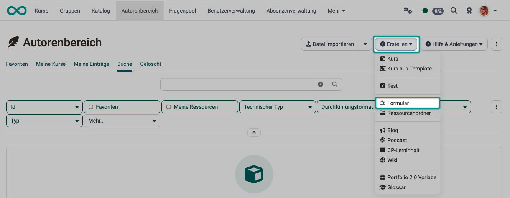
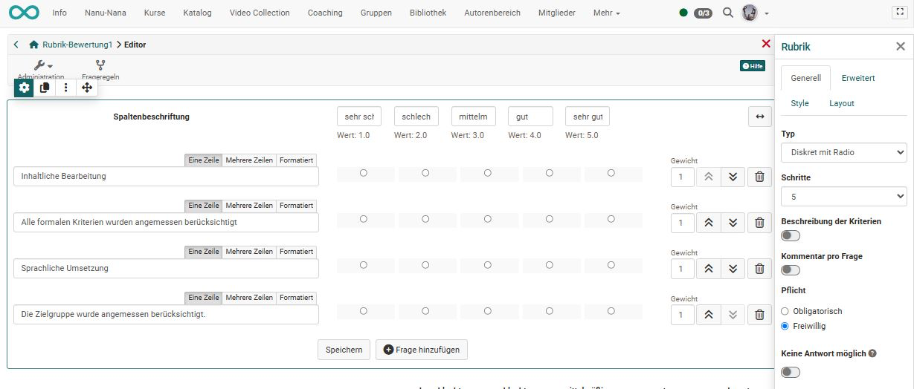
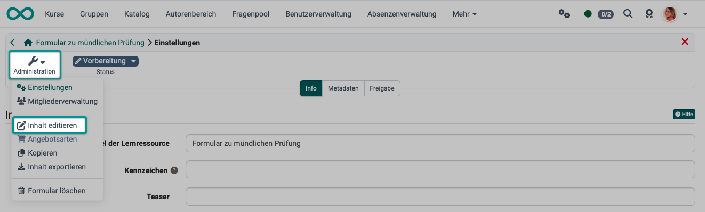

# How do I record an oral exam in OpenOlat? {: #oral_exam}

??? abstract "Objectives and content of this instruction"

    With the help of this guide, you should be able to conduct oral exams using OpenOlat. You will learn how to set up a course that allows you to efficiently record oral exams.

??? abstract "Target group"

    [x] Authors [x] Coaches  [ ] Participants

    [x] Beginners [x] Amateurs  [x] Experts

??? abstract "Expected previous knowledge"

    * ["How do I create my first OpenOlat course?"](../my_first_course/my_first_course.md) 
    * Familiarity with [form element rubric >](../../manual_user/learningresources/Form_Element_Rubric.md)

---

## Why oral exams in OpenOlat? {: #why}

If learners have already taken OpenOlat courses and completed written exams in OpenOlat, this data and all information about the learners is already recorded in OpenOlat. To avoid having to re-enter participant data separately for the oral exam, it makes sense to conduct oral exams using OpenOlat as well. This way, all participant data and results can be managed together in OpenOlat. Overall results from both written and oral exams can also be calculated immediately in OpenOlat.

In OpenOlat, you can create forms—specifically the [Form Element: Rubric](../../manual_user/learningresources/Form_Element_Rubric.md)— which can be used to prepare the structure and questions for an oral exam.

[To the top of the page ^](#oral_exam)

---

## Step 1: Are all participants in the oral exam registered in OpenOlat? {: #step_1}

In most cases, all exam participants are already registered in OpenOlat. However, at the start of your preparations, please check whether all participants in the oral exam are already registered in OpenOlat. If not, they will need to be added in the user management section.
To do this, go to **User Management > Create Account**

If you are not yet familiar with user management, you can find more information here:  
[Admin Manual: User Management >](../../manual_admin/usermanagement/index.md)

[To the top of the page ^](#oral_exam)

---

## Step 2: Creating a course for the oral exam {: #step_2}

Create a standalone course in the Authoring Area. Here's how to create a course:
[How do I create my first OpenOlat course? >](../../manual_how-to/my_first_course/my_first_course.md)

### Which course element? {: #step_2a}

Typically, the record of an oral exam includes a handwritten evaluation. Either an online form or a printed version may be used. The [Course Element "Assessment"](../../manual_user/learningresources/Course_Element_Assessment.md) is particularly well-suited for both situations.

(In principle, a "Form" course block can also be used, but it does not issue a "Pass" status. Therefore, in this case, an additional "Grading" course block is required.)

### Breakdown of oral exam topics {: #step_2b}

Depending on the subject matter of the exam, different topic areas are usually covered. The topic structure and exam sections help determine how the forms can be divided up in a logical manner.

**Example 1:** 
You can create a course with one course module titled "Assessment", which contains one form that, in turn, contains 10 rubric items covering 10 topic areas.

**Example 2:** 
You can create 10 course modules of the "Assessment" type, each with one form.

### Settings in the tab "Assessment"

{ class="shadow lightbox" } 

**Set the "Correct" status when access is granted:** 
During an oral exam, assessments are made on the spot; there is no need for a later review, as is the case with written exams. This option can therefore remain disabled.

**Rubric Assessment:** 
The rubric is a key component of the evaluation process for an oral exam.
Toggle this button on, and then select, import, or create a rubric form.

If you don't want to create a form right away, you can do so later in the authoring area (Step 3) and then embed it (Step 4).

{ class="shadow lightbox" } 

**Award points:** 
Since we use a rubric for the oral exams, the scores can be transferred from the rubric.

If you use multiple "Grading" course blocks within an oral exam (for a course), you can use the **scaling factor**, for example, to adjust separately graded parts of the oral exam for the overall grade.

Example: The oral exam consists of three parts, each of which accounts for one-third of the overall grade. If the scoring rubric for one part of the exam allows for a maximum of 50 points, while the rubrics for the other parts allow for a maximum of 100 points each, the points for the first part must be doubled so that it carries the same weight in the overall grade.   

**Grading with ratings/grades:** 
Once "Assign points" has been enabled, you can also enable and further configure the "Grading with ratings/grades" option. 

By default, results in OpenOlat are graded using points. By enabling this option, the points are converted into a letter grade scale or another grading system.  
[More about grading systems >](../../manual_admin/administration/Assessment_translate_points_in_grades_admin.md) 

**Rating scale:** 
Click "Edit Grading Scale" to select a scale and make any additional settings. The scale also specifies whether a grading scale is associated with a pass/fail designation and, if so, at what point.

Under **Assignment**, you can specify whether the assignment to the selected grading scale should be done manually by the instructors or automatically based on the score achieved.

**Display Pass/Fail:** 
If you have chosen a grading scale, the passing score for the selected scale will be displayed. 
If you *do not* use a grading scale, you can choose whether to display the "Pass/Fail" status of the course module to participants. 
If "Points" has been enabled in addition to "Pass/Fail", an automatic, point-based grading system can be activated in addition to the standard manual grading by instructors.

**To be considered in course assessment:** 
If this option is enabled, the points earned in this course module will count toward the passing score defined in Administration -> Settings -> Grading, which is required to pass the course. Alternatively, the course module will be considered part of the required course modules needed to pass the entire course. 
If you are using multiple "Grade" course blocks for the oral exam, please make sure this option is selected in all of them. 

**Individual comments:** 
If this checkbox is selected, examiners (with the "Coach" role) will see a field where they can enter individual comments for the examinees.

**Individual assessment documents:** 
Check this box to allow reviewers to provide individual documents, such as feedback.

**Further configurations** 
Under the "Enter advanced configurations" link, you can enter general information for the examiners (in the role of coaches). For example, you can use this to remind all examiners of the general guidelines for the oral exam.

**The result as the examiners will see it later:**

{ class="shadow lightbox" } 
---

### Setting the time
The delivery period specified in the "Delivery" tab of the settings applies only to participants. Since only the examiners (with the role of coach or owner) access the course during the oral exam, this setting is irrelevant in this case.

[To the top of the page ^](#oral_exam)

---

## Step 3: Creating a form for the oral exam {: #step_3}

If you did not create a category form when setting up the course module in step 2 above, you can create a new one (or a different form to replace the existing one) in the authoring area: 
**Author Area > Create > Form**

{ class="shadow lightbox" } 

A newly created form does not initially contain any section elements. These must be added in the course via "Edit" or, alternatively, directly in the learning resource using the form editor.

### Form layout and content {: #step_3_layout_content}

Oral exams often consist of a combination of different formats, such as presentations, technical questions requiring explanation, brief content-based questions, as well as reflective and application-based questions. A good rubric reflects this diversity and makes it clear what is being assessed in each section and how the assessment is conducted.

In OpenOlat, the best way to create customizable grading rubrics is to use the "Rubric" element.
A rubric element consists of a grid with rows and columns. The rows list the assessment categories or statements, while the column headers represent the rating scales. This allows multiple different statements to correspond to a single rating scale. Depending on the specific configuration, this can result in a wide variety of rubric variations.

{ class="shadow lightbox" } 

In the newly created form learning resource, open the editor under **Administration > Edit Content** and create a rubric form that is appropriate for your oral exam. 

{ class="shadow lightbox" } 

For detailed information on how to create a category form, please see below:

## Further information {: #further_information}

[How do I create my first OpenOlat course? >](../../manual_how-to/my_first_course/my_first_course.md) 
[Forms: overview >](../../manual_user/learningresources/Form.md) 
[The form element rubric >](../../manual_user/learningresources/Form_Element_Rubric.md) 

[To the top of the page ^](#oral_exam)
