# How do I record an oral exam in OpenOlat? {: #oral_exam}

??? abstract "Objectives and content of this instruction"

    With the help of this guide, you should be able to conduct oral exams using OpenOlat. You will learn how to set up a course that allows you to efficiently record oral exams.

??? abstract "Target group"

    [x] Authors [x] Coaches  [ ] Participants

    [x] Beginners [x] Advanced  [x] Experts

??? abstract "Expected previous knowledge"

    * ["How do I create my first OpenOlat course?"](../my_first_course/my_first_course.md) 
    * Familiarity with the [form element rubric >](../../manual_user/learningresources/Form_Element_Rubric.md)

---

## Oral exams in OpenOlat: Why? {: #why}

If learners have already taken OpenOlat courses and completed written exams in OpenOlat, this data and all information about the learners is already recorded in OpenOlat. To avoid having to re-enter participant data separately for the oral exam, it makes sense to conduct oral exams using OpenOlat as well. This way, all participant data and results can be managed together in OpenOlat. Overall results from both written and oral exams can also be calculated immediately in OpenOlat.

In OpenOlat, you can create forms, specifically with the [form element rubric](../../manual_user/learningresources/Form_Element_Rubric.md), which can be used to prepare the structure and questions for an oral exam.   

[To the top of the page ^](#oral_exam)

---

## Step 1: Are all participants in the oral exam registered in OpenOlat? {: #step_1}

In most cases, all exam participants are already registered in OpenOlat. However, at the start of your preparations, please check whether all participants in the oral exam are already registered in OpenOlat. If not, they will need to be added in the user management.
To do this, go to the user management: 
`User management > Create user`

If you are not yet familiar with user management, you can find more information here: 
[Administration manual: User management >](../../manual_admin/usermanagement/index.md)

[To the top of the page ^](#oral_exam)

---

## Step 2: Creating a course for the oral exam {: #step_2}

Create a standalone course in the authoring area. Here's how to create a course: 
[How do I create my first OpenOlat course? >](../../manual_how-to/my_first_course/my_first_course.md)

### Which course element? {: #step_2a}

Typically, the record of an oral exam includes a manually completed assessment. Either an online form or a printed version may be used. The [course element "Assessment"](../../manual_user/learningresources/Course_Element_Assessment.md) is particularly well-suited for both situations.

(In principle, a course element "Form" can also be used, but it does not issue a "Passed". Therefore, in this case, an additional course element "Assessment" is required.)

### Breakdown of oral exam topics {: #step_2b}

Depending on the subject matter of the exam, different topic areas are usually covered. The topic structure and exam sections help determine how the forms can be divided up in a logical manner.

**Example 1:** 
You can create a course with 1 course element "Assessment", which contains 1 form that, in turn, contains 10 rubric elements covering 10 topic areas.

**Example 2:** 
You can create 10 course elements of the type "Assessment", each with 1 form.

### Settings in the tab "Assessment"

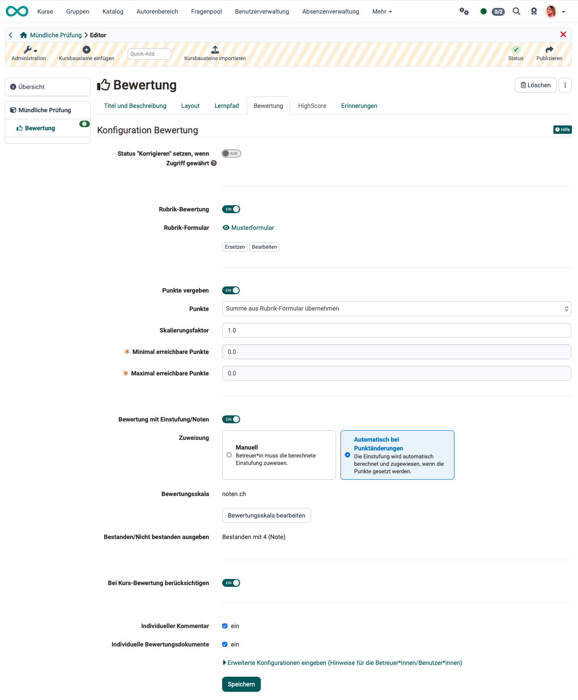{ class="shadow lightbox" title="Tab Assessment of the course element Assessment" } 

#### Set status "To review" if accessible {: #initial_status}

During an oral exam, assessments are made on the spot; there is no need for a later review, as is the case with written exams. This option can therefore remain disabled.

#### Rubric assessment {: #rubric_assessment}

The rubric element is a key component of the assessment of an oral exam.
Switch on this toggle button, and then select, import, or create a rubric form.

If you don't want to create a form right away, you can do so later in the authoring area (Step 3) and then embed it (Step 4).

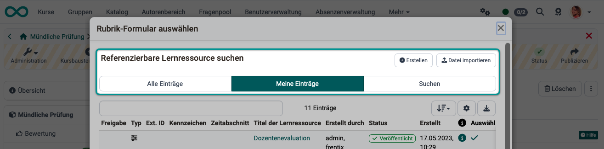{ class="shadow lightbox" title="Dialog for choosing the rubric form" } 

#### Score granted {: #score_granted}

Since we use a rubric form for the oral exams, the points can be taken from the rubric.

If you use multiple course elements "Assessment" within an oral exam (a course), you can use the **scaling factor**, for example, to adjust separately assessed parts of the oral exam for the overall assessment.

Example: The oral exam consists of 3 parts, each of which accounts for one third of the overall assessment. If the form for one part of the exam allows for a maximum of 50 points, while the forms for the other parts allow for a maximum of 100 points each, the points for the first part must be doubled so that it carries the same weight in the overall assessment.   

#### Levels/Grading {: #grading}

Once "Score granted" has been switched on, you can also switch on and further configure the option "Levels/Grading". 
By default, results in OpenOlat are assessed using points. By enabling this option, the points are also converted into a grade scale or another rating system.  
[More about rating systems >](../../manual_admin/administration/Assessment_translate_points_in_grades_admin.md) 

#### Rating scale {: #rating_scale}

Click "Edit rating scale" to select a scale and make any additional settings. The scale also specifies whether and from which point a rating scale is associated with a passed/not passed.

Under **Assignment**, you define whether the assignment to the selected rating scale should be done manually by the coaches or automatically based on the score achieved.

#### Display passed / not passed {: #display_passed}

If you have chosen an assessment with levels/grading, the threshold for "Passed" of the selected rating scale is displayed. 
If you do *not* use an assessment with levels/grading, you can decide whether to display the "passed / not passed" of the course element to the participants. 
If "Score" has been enabled in addition to "passed / not passed", an automatic, score-based assessment can be activated in addition to the standard manual assessment by the coaches.

#### Include in course assessment {: #course_assessment}

If this option is enabled, the points earned in this course element count toward the score threshold defined under `Course > Administration > Settings > Assessment`, which is required to pass the course. Alternatively, the course element is considered part of the required course elements needed to pass the entire course. 
If you are using multiple course elements "Assessment" for the oral exam, please make sure this option is selected in all of them. 

#### Individual comment {: #individual_comment}

If this checkbox is selected, the examiners (role "Coach") see a field where they can enter individual comments for the examinees.

#### Individual assessment documents {: #individual_assessment_documents}

Check this box to allow the examiners to provide individual documents, e.g. as feedback.

#### Instructions for the coach {: #instructions_for_coaches}

You store general information for the examiners (role Coach) in the tab "Title and description" of the course element under the link "Insert additional information (Objectives, instructions, instructions for the coach)". For example, you can use this to remind all examiners of the general guidelines for the oral exam.

**The result as the examiners will see it later:**

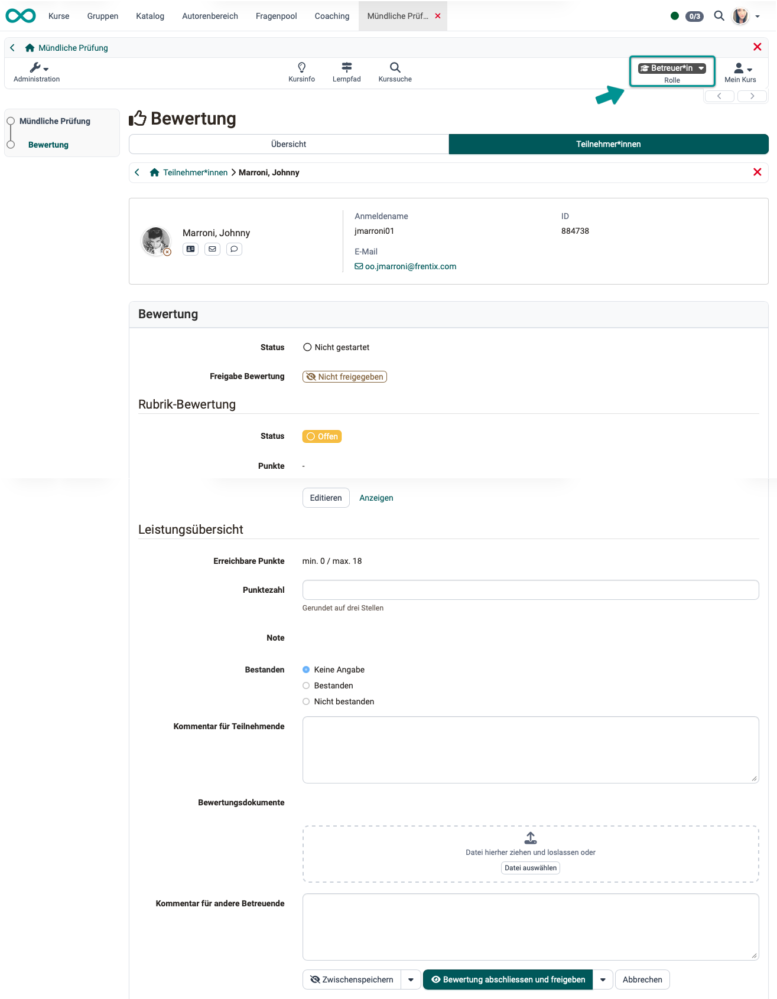{ class="shadow lightbox" title="Assessment of a participant as seen by the coaches" } 

---

### Setting the time

An execution period specified in the settings in the tab "Execution" applies only to participants. Since only the examiners (role coach or owner) access the course during the oral exam, this setting is irrelevant in this case.

[To the top of the page ^](#oral_exam)

---

## Step 3: Creating a form for the oral exam {: #step_3}

If you did not create a rubric form when setting up the course element in the previous step 2, you can create a new one (or a different form to replace the existing one) in the authoring area: 
`Authoring > Create > Form`

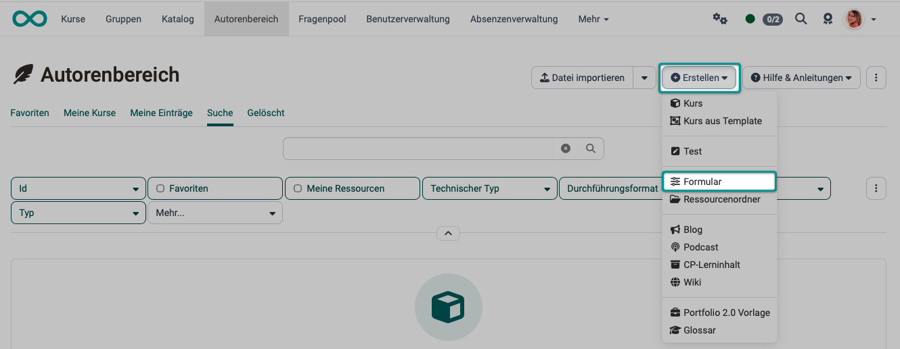{ class="shadow lightbox" title="Authoring area" } 

A newly created form does not initially contain any rubric element. It must be added in the course via "Edit" or, alternatively, directly in the learning resource in the form editor.

### Layout and content of the form {: #step_3_layout_content}

Oral exams often consist of a combination of different formats, such as presentations, technical questions requiring explanation, brief content-based questions, as well as reflective and transfer questions. A good rubric reflects this diversity and makes it clear what is being assessed in each part and how the assessment is conducted.

In OpenOlat, freely definable assessment grids are best created with the rubric element.
A rubric element consists of a grid with rows and columns. The rows list the assessment categories or statements, while the column headers represent the rating scales. This allows multiple different statements to refer to one rating scale. Depending on the specific configuration, this can result in very different rubric variants.

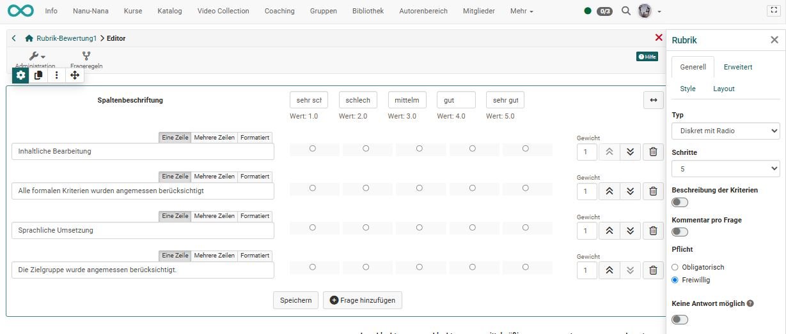{ class="shadow lightbox" title="Rubric element in the form editor" } 

In the newly created form learning resource, open the editor under `Administration > Form editor` and create a rubric form that is appropriate for your oral exam. 

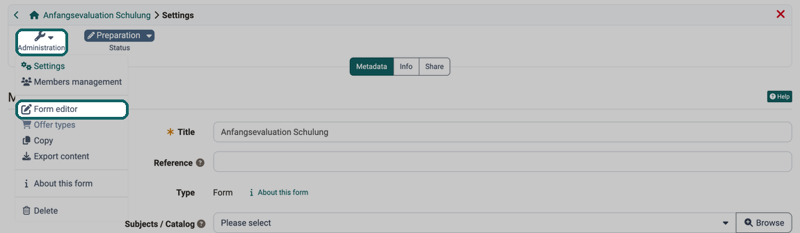{ class="shadow lightbox" title="Menu Administration of the form learning resource · 2026.09.28" } 

For detailed information on how to create a rubric form, see here:

[The form element rubric >](../../manual_user/learningresources/Form_Element_Rubric.md) 
[Forms in Rubric Scoring >](../../manual_user/learningresources/Forms_in_Rubric_Scoring.md) 
[Insert layout >](../../manual_user/learningresources/Form_Editor.md#insert_layout) 
[Insert content elements >](../../manual_user/learningresources/Form_Editor.md#insert_content_element)

### Information in the header {: #step_3_header}

!!! note "Note"

    Participant data is shown in the header of the form and does not need to be included as a field in the form (otherwise, it would appear twice).

The header of the form uses the general display of the user.
This display is used in many other places in OpenOlat (events, coaching, tests, task, learning path overview, portfolio, project, ...). It is not possible to change it for the form alone. The general display applies to the whole OpenOlat instance. frentix customers contact the frentix support for a change: [support@frentix.com](mailto:support@frentix.com)

In the form editor, add information for 

- exam start
- exam end
- and the examiners involved 

in a content element above the rubric element. This information is then displayed in the header.

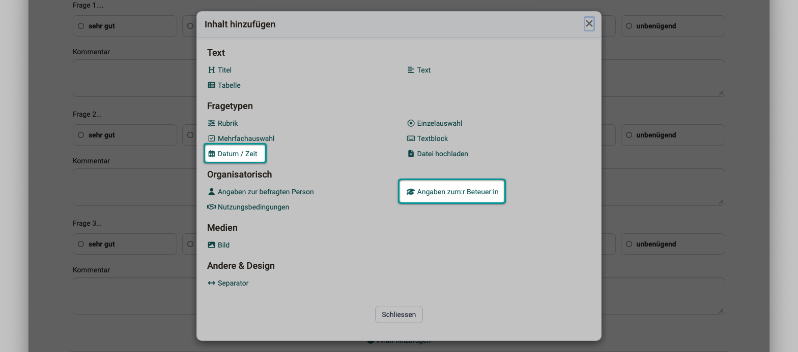{ class="shadow lightbox" title="Dialog Add content in the form editor" } 

[To the top of the page ^](#oral_exam)

---

## Step 4: Embedding the form in the course {: #step_4}

If the form was not created immediately when setting up the course element (Step 2), but separately in the authoring area (Step 3), you must reopen the course editor and embed the form in the course element "Assessment" in the tab "Assessment". 

[To the top of the page ^](#oral_exam)

---

## Step 5: Add examinees and examiners {: #step_5}

Once the form and the course content have been finalized, the examinees can be assigned to the oral exam.

`Course > Administration > Members management > Add member`

Assign the course role "Coach" to the examiners.

If you are not yet familiar with the members management, you can find more information here: 
[Members management >](../../manual_user/learningresources/Members_management.md)

!!! tip "Tip"

    External examiners are often involved in oral exams. Keep in mind that, ideally, these examiners should also be set up as users in OpenOlat (see Step 1). 
    A tip if you're new to OpenOlat: 
    Note the difference between [User management](../../manual_admin/usermanagement/index.md) and [Members management](../../manual_user/learningresources/Members_management.md)

[To the top of the page ^](#oral_exam)

---

## Step 6, Method a): Conducting the oral exam using an online form {: #step_6a}

!!! tip "Tip"

    As a course owner, please remember: Has the status of the course been set to "Published"?

Determine which examiner keeps the record in OpenOlat. 
As the recorder (OpenOlat role "Coach"), proceed as follows:

- Open the course.
- Select the relevant course element "Assessment".
- Select the examinee in the tab "Participants" by clicking on the name.

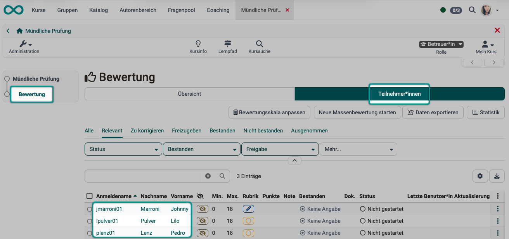{ class="shadow lightbox" title="Course element Assessment as seen by the coaches" } 

You can now enter your assessment of this person's oral exam in the fields displayed:

- Score
- whether passed or not passed
- The comment for participants is useful if they are able to or are expected to access this course themselves after the oral exam.
- Assessment documents (files) can be attached.
- In the field "Comment for other coaches", you can, for example, note down key points from the discussion among the examiners.
- **To use the rubric form, click the button "Edit" in the section "Rubric assessment".**
- To complete the oral exam, click the button "Finalize assessment and release" at the bottom.

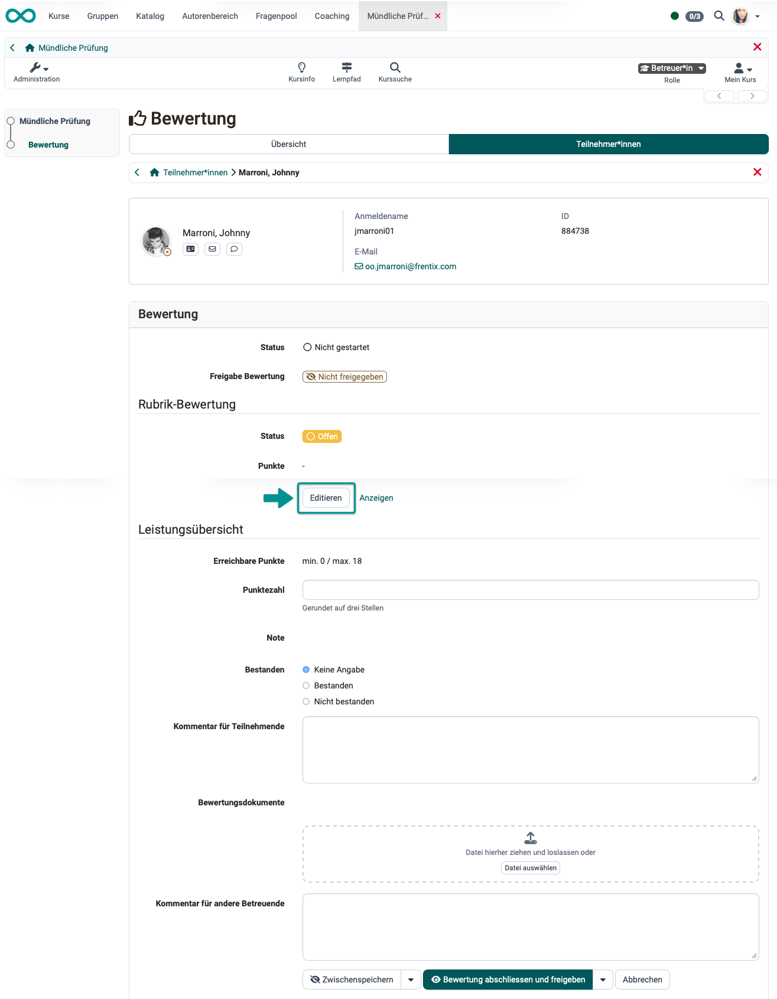{ class="shadow lightbox" title="Assessment of an examinee" } 

After clicking "Edit" in the section "Rubric assessment", the rubric form is available for entering your ratings and comments on the exam performance.

!!! tip "Tip"

    As the creator of the rubric form, please make sure **before** the first oral exam that the examiners can provide all the necessary information.
    Once the form has been used, it cannot simply be modified for the other examinees. (All examinees should be assessed with the same form and according to the same criteria.)

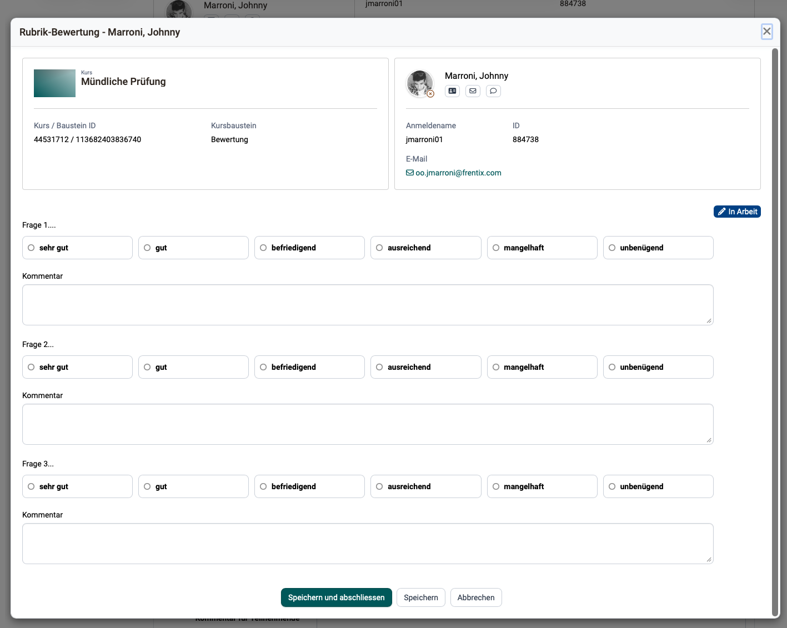{ class="shadow lightbox" title="Dialog Rubric assessment" } 

[To the top of the page ^](#oral_exam)

---

## Step 6, Method b): Conducting the oral exam with a printout (pdf) {: #step_6b}

If the record of the oral exam is to be printed, a pdf can be generated in OpenOlat.
For example, examiners who are not assigned to the online recording in OpenOlat can be provided with a printed copy of such a form.

- Select the desired examinee; all information about the person is then already displayed in the header of the pdf file.
- Under the icon with the 3 dots, you will find the option "Rubric form as pdf". 
- Download this pdf file and print it out.

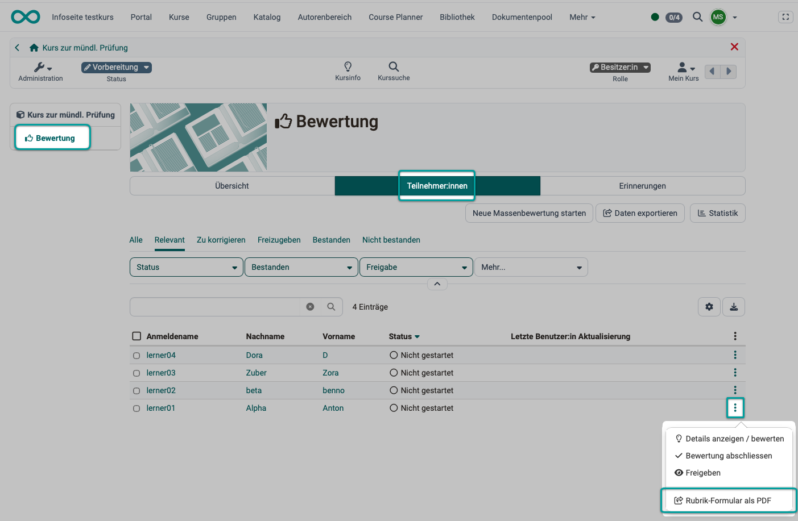{ class="shadow lightbox" title="Tab Participants in the course element Assessment" }  

[To the top of the page ^](#oral_exam)

---

## Step 7: Evaluation of the oral exam {: #step_7}

If you completed the assessment using the online rubric form (Step 6a), all entries are already in OpenOlat, and you can begin the evaluation immediately. 
If the rubric form was printed out, the relevant data must first be transferred into OpenOlat from the handwritten notes.

The score generated by the rubric form is automatically taken over as a sum or an average. If "Sum" is selected, the points assigned for each row are added up. If "Average" is selected, the average of all rubric rows is calculated. Alternatively, you can choose to assign points manually or not to use points at all.

Above the list of participants, you will find buttons for the options described below.

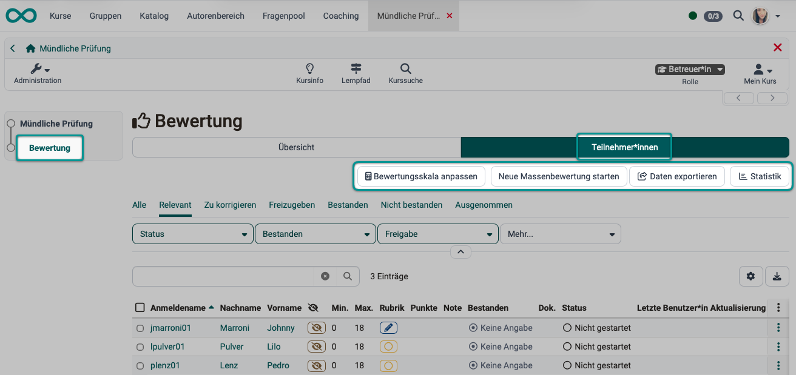{ class="shadow lightbox" title="Actions in the tab Participants" }  

### Adjust the rating scale {: #step_7_scale}

As long as no assessment has been completed yet, the rating scale can still be adjusted.

### Bulk assessment {: #step_7_bulk_action}

If several persons are to be assessed together, for example when the presentation of a group project is assessed, you can do so with the button "Start new bulk assessment".

### Export data (export of the exam results) {: #step_7_export}

You will also find a button to export the exam results above the list of participants. It exports the results of all participants.  
If you want to export results of individual participants, select the relevant persons in the first column. An additional export button then appears above the list.

You receive the results as an Excel file containing the raw data and, on request, additionally as a pdf file with detailed information.

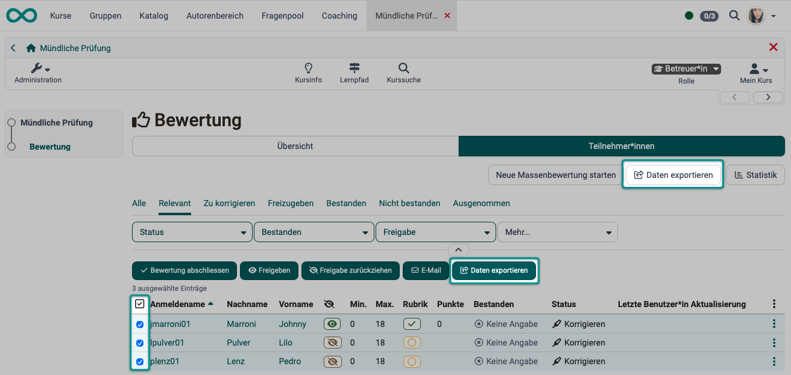{ class="shadow lightbox" title="Export of the exam results" } 

### Statistic {: #step_7_statistics}

The button "Statistic" displays a table with the results of the rubric elements, both the points of individual questions and the total score of the participants and the averages. 

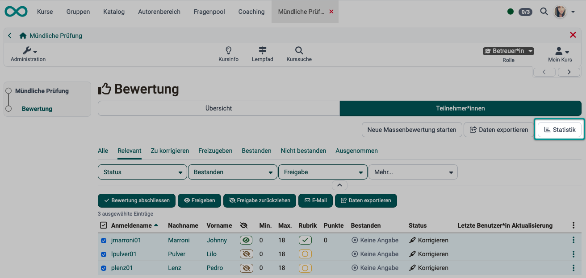{ class="shadow lightbox" title="Button Statistic in the tab Participants" } 

Clicking the button "Statistic" opens the table with detailed information.

If you select the checkbox "Show questions", details of the rubric questions are also displayed in the table. Below the participants, you will find the averages in the table. 

With the download button you get an Excel file of the results.

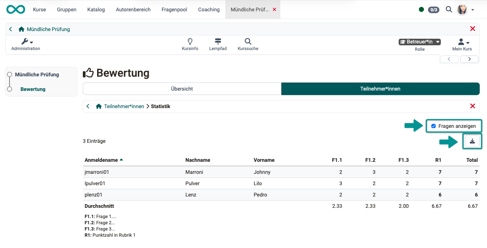{ class="shadow lightbox" title="Statistic of the course element Assessment" } 

### Assessment tool {: #step_7_assessment_tool}

Alternatively, the same buttons can also be found in the assessment tool: 
`Assessment tool > "Course element Assessment" > Participants`

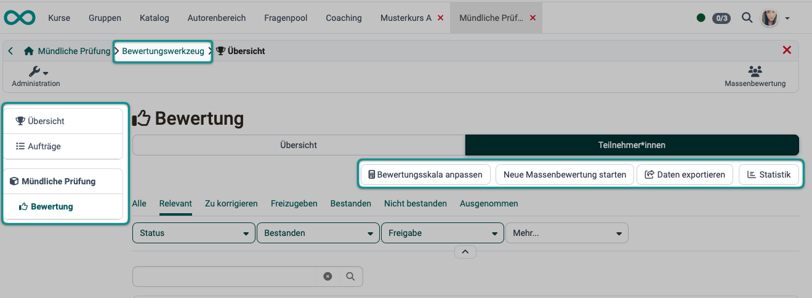{ class="shadow lightbox" title="Assessment tool of the course" }  

[To the top of the page ^](#oral_exam)

---

## Checklist {: #checklist}

- [x] Are all participants of the oral exam registered in OpenOlat?
- [x] Has a separate course been created for the oral exam?
- [x] Has a course element of the type "Assessment" been added to the course?
- [x] Has a rubric form been created and embedded in the course element "Assessment"?
- [x] Is the assessment element configured appropriately (points, passing threshold, comments enabled)?
- [x] Should multiple course elements "Assessment" and multiple rubric forms be embedded in the course?
- [x] Is the structure of the oral exam represented appropriately in the rubric forms?
- [x] Have the visibility rules been agreed upon (immediate display or release after completion)?
- [x] Are all examinees registered as members of the exam course?
- [x] Are all examiners (including external ones) registered as members of the exam course?
- [x] Do all examiners have the role "Coach" and can they open the assessment tool?
- [x] Has the course been published and is it accessible to the examiners?
- [x] Have the exam dates been set and communicated to everyone involved?
- [x] Was a test exam successfully conducted with a dummy participant?

[To the top of the page ^](#oral_exam)

---

## Frequently asked questions {: #faq}

**Can I correct the points later?** 
Yes. As a coach or owner, open the participant again in the assessment tool and overwrite the values. All changes are recorded in an audit log.

**How do I export the results?** 
Above the list of participants in the course element "Assessment" and in the assessment tool, you find the button "Export data". You receive an Excel file with the raw data and, if required, an additional PDF file with detailed data for each participant (see [Export data](#step_7_export)).

**What should I do if a participant doesn't show up?** 
Enter "0 points" and "Not passed" in the course element "Assessment" and note in the field "Comment for other coaches" that the person did not attend.

**Can participants download their assessment?** 
Participants see their results in the course under `My course > Evidence of achievement`, provided that the [evidence of achievement](../../manual_user/learningresources/Course_Settings_Assessment.md#section_evidence_of_achievements) is switched on in the course settings. They receive a file to download if the course issues a [PDF certificate](../../manual_user/learningresources/Course_Settings_Assessment_Certificate.md#certificate) or if the examiners provide individual assessment documents.

**Is an online exam via video possible?** 
Yes. Combine the course with a video conferencing system (e.g. the integrated BigBlueButton element) to conduct the exam remotely. The assessment remains in the assessment element.

[To the top of the page ^](#oral_exam)

---

## Further information {: #further_information}

**Mentioned on this page** 
[How do I create my first OpenOlat course? >](../../manual_how-to/my_first_course/my_first_course.md) 
[The form element rubric >](../../manual_user/learningresources/Form_Element_Rubric.md) 
[User management >](../../manual_admin/usermanagement/index.md) 
[Course Element "Assessment" >](../../manual_user/learningresources/Course_Element_Assessment.md) 
[e-Assessment Administration: Levels/Grading >](../../manual_admin/administration/Assessment_translate_points_in_grades_admin.md) 
[Forms in Rubric Scoring >](../../manual_user/learningresources/Forms_in_Rubric_Scoring.md) 
[The Form Editor >](../../manual_user/learningresources/Form_Editor.md) 
[Members management >](../../manual_user/learningresources/Members_management.md)

**Further reading** 
[Forms - Overview >](../../manual_user/learningresources/Form.md) 
[How do I create a form learning resource? >](../create_a_form/create_a_form.md) 
[Assessment tool - overview >](../../manual_user/learningresources/Assessment_tool_overview.md)

[To the top of the page ^](#oral_exam)
