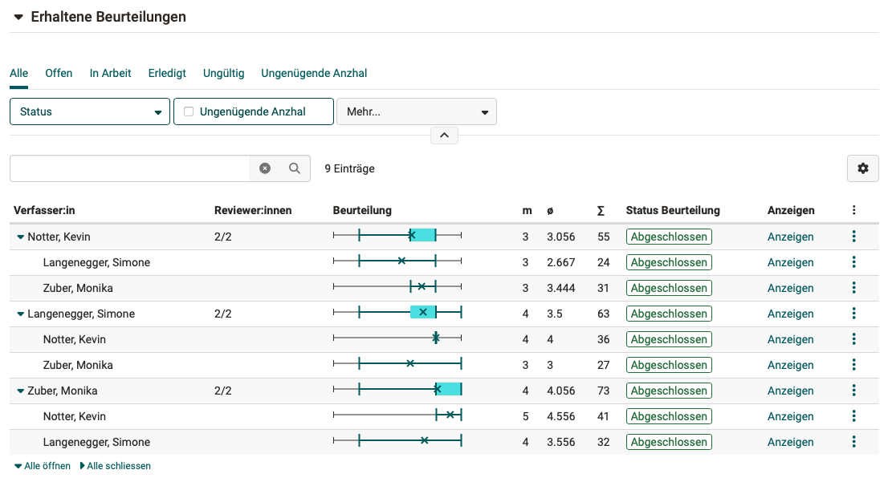

# Wie führe ich ein Peer-Review durch?

??? abstract "Ziel und Inhalt dieser Anleitung"

    Sie haben bereits einen Kurs mit einem Kursbaustein "Aufgabe" erstellt? 
    Sie möchten die Ergebnisse dieser Aufgabe von den Kursteilnehmer:innen gegenseitig reviewen lassen?  
    Die folgende Anleitung zeigt Ihnen, wie Sie dazu vorgehen.

??? abstract "Zielgruppe"

    [x] Autor:innen [x] Betreuer:innen  [ ] Teilnehmer:innen

    [ ] Anfänger:innen [x] Fortgeschrittene  [ ] Experten/Expertinnen

??? abstract "Erwartete Vorkenntnisse"

    * ["Wie erstelle ich meinen ersten OpenOlat-Kurs?"](../my_first_course/my_first_course.de.md)
    * [Erste Erfahrung mit dem Kursbaustein "Aufgabe"](../../manual_user/learningresources/Course_Element_Task.de.md)

---

## Wie bereite ich ein Peer-Review vor?

Bei einem Peer-Review sollen Kursteilnehmer:innen gegenseitig abgegebene Aufgabenergebnisse reviewen. Dies kann mit Hilfe eines **Formulars** im Kursbaustein "**Aufgabe**" vorbereitet werden. 

1. Fügen Sie im Kurseditor einen **Kursbaustein "Aufgabe"** in Ihren Kurs ein.

2. Editieren Sie den Kursbaustein und wählen Sie den **Tab "Workflow"**.

3. Ein Schritt im Workflow des Kursbausteins "Aufgabe" ist der **Schritt "Feedback"**. Aktivieren Sie diesen Schritt für die Aufgabe.
{ class="shadow lightbox" }

4. Wählen Sie die Option **"Mit Peer-Review"**. 

5. Bestimmen Sie einen **Zeitraum**, in dem das Peer-Review durchgeführt werden muss.

6. Wurde im Tab Workflow die Option "Mit Peer-Review" gewählt, können nun im **Tab "Rückgabe und Feedback"** die Regeln für die Abgabe eines Feedbacks durch andere Teilnehmer:innen festgelegt werden. 
{ class="shadow lightbox" }

7. Das Feedback der Reviewer:innen wird jeweils in einem **Formular** gegeben. Als Kursbesitzer:in geben Sie dieses Formular vor. Wählen Sie ein bereits vorhandenes oder erstellen Sie ein neues Formular, mit dem die Kursteilnehmer:innen den Review vornehmen können. Für den Anfang wird ein Formular mit nur einer Rubrik-Frage empfohlen.

8. Beziehung 
Es kann gewählt werden, ob Teilnehmer:innen sich gegenseitig reviewen sollen oder nicht.

9. Review-Form 
    * **Doppelblind-Review**: alle Namen sind anonym (ausgenommen Betreuende)
    * **Einfachblind-Review**: Name des Reviewers/der Reviewerin ist anonym
    * **Offenes Review**: Alle Namen sind ersichtlich.

10. Zuweisung 
    * **Dieselbe Aufgabenstellung**: Die Reviewer:innen erhalten Review-Objekte mit derselben Aufgabenstellung wie sie selbst.
    * **Andere Aufgabenstellung**: Die Reviewer:innen erhalten Review-Objekte mit der gleichen Aufgabenstellung, aber nicht wie die eigene.
    * **Zufällig**: Die Reviewer:innen erhalten zufällige Review-Objekte.

11. Anzahl Reviews 
Die Teilnehmer:innen des Kurses erhalten einen Reviewauftrag für eine bestimmte Anzahl anderer Teilnehmener:innen (nicht für *alle* anderen Teilnehmer:innen). Diese Anzahl wird hier vorgegeben.

12. Qualitäts-Feedback für Reviewer:in 
Auch eine Rückmeldung an die Reviewer:innen kann ermöglicht werden. Wird der Toggle-Button eingeschaltet, kann die Form der Abfrage gewählt werden. ("Hilfreich?" und "Sternebewertung").

 

---

### Empfohlener Musterprozess
Als Standard empfehlen wir:

- Führen Sie das Peer-Review mit einem **klar definierten Zeitraum** durch.
- Verwenden Sie ein **Formular**, das nur eine **Rubrik-Frage** als Pflicht-Rubrik enthält. Die Option "Keine Antwort" sollte deaktiviert sein. 
- Lassen Sie die Bewertung durch Teilnehmer:innen erfolgen. (Das heisst, die Punkte werden von den Teilnehmer:innen vergeben.)

### Variante 1: Ohne Bewertung durch Kursteilnehmer:innen

Soll das Peer-Review der Teilnehmer:innen **nicht** in die Bewertung einfliessen, sondern nur ein allgemeines Feedback abgegeben werden, zählt nur die Bewertung des Experten/der Expertin. Für eine Bewertung ausschliesslich durch den Experten/die Expertin, gehen Sie folgendermassen vor:

* Erstellen und konfigurieren Sie den Kursbaustein Aufgabe, wie oben beschrieben.
* Verwenden Sie für den Peer-Review z.B. ein Formular, das nur ein Textfeld für eine allgemeines Feedback der Reviewer:innen ermöglicht. 
* Lassen Sie im **Tab "Workflow"** die Einstellung "Mit Peer-Review" selektiert. Wenn sie hier umstellen auf "Durch Betreuende" würde der Peer-Review-Prozess insgesamt deaktiviert. Auch eine allgemeine Rückmeldung ohne Punktebewertung würde damit deaktiviert.
* Die Bewertung nur durch Expert:innen (Betreuer:innen), konfigurieren Sie im **Tab "Bewertung"**. Wenn Sie "Bestanden/Nicht bestanden" manuell durch die Betreuer:innen ermöglichen, ist nicht zwingend eine Punktevergabe erforderlich. Statt dessen kann für die Betreuer:innen auch ein Rubrik-Formular aktiviert werden.

Ein Setting dieser Art kann z.B. verwendet werden, wenn die Reviews der Teilnehmer:innen den Expert:innen als Input dienen sollen, die Bewertung aber ausschliesslich bei den Expert:innen/Betreuer:innen bleiben soll.

### Variante 2: Gegenseitige Bewertung in Selbstlerngruppen

Ist es Ihr Ziel, weitgehend selbstständig arbeitende Lerngruppen ohne grosse Betreuungsaufwand zu haben, sollte auch das Peer-Review entsprechend organisiert sein.

* Erstellen und konfigurieren Sie den Kursbaustein Aufgabe, wie oben beschrieben.
* Schalten Sie im Tab "Bewertung" "Punkte vergeben" ein.
* Aktivieren Sie im Tab "Bewertung" unter "Bestanden/Nicht bestanden ausgeben" die Ausgabe durch eine automatische Punkteschwelle.
* Wurde die Punktevergabe aktiviert, werden im Tab "Bewertung" die möglichen Quellen für die Punkteberechnung sichtbar. 
Gesamtpunkte können kommen aus 
\- Rubrik-Bewertung 
\- Rubrik-Peer-Review 
\- Abgegebene Reviews

### Variante 3: Gemeinsame Bewertung durch Teilnehmer:innen und Expert:innen

Sie können auch ein Setting einrichten, bei dem Teilnehmer:innen und Expert:innen gemeinsam bewerten.
Zum Beispiel könnte eine Gewichtung vorgenommen werden bei der die Reviews der Teilnehmer:innen einfach zählen und die Reviews der Expert:innen doppelt. 

!!! tip "Empfehlung für Selbstlerngruppen"

    Aktivieren Sie "Gesamtpunkte aus > Abgegebene Reviews". Es erhöht die Wahrscheinlichkeit, dass in Selbstlerngruppen gegenseitige Reviews gemacht werden, wenn die Reviewer:innen pro gemachtem Review eine fixe Punktzahl erhalten. Wenn es nur darum geht, ob ein Review abgegeben wurde, entfallen ausserdem viele ergebnisverzerrende soziale Prozesse in der Gruppe.

!!! tip "Allgemeine Empfehlungen"

    Der Kursbaustein Aufgabe und das Peer-Review können in vielen, auch ungewöhnlichen Varianten konfiguriert werden. Insbesondere für Anfänger gibt es deshalb ein paar Stolpersteine.
    
    * Vermeiden Sie Peer-Reviews ohne Zeitangabe.
    * Vermeiden Sie Peer-Reviews mit relativen Datumsangaben.
    * Zu beachten bei Peer-Review mit Gruppen und Gruppenbetreuer:innen: 
     Kursbetreuer:innen sehen nur Teilnehmer:innen der eigenen Gruppe. So kann es vorkommen, dass Kursbetreuer:innen zwar Punktevergaben sehen, aber nicht zuordnen können, woher sie kommen.
     

 

---

## Wie betreue ich ein Peer-Review?

Wurde das Peer-Review vom Kursbesitzer/der Kursbesitzerin vorbereitet, können Sie als Betreuer:in im Kursmenü einfach auf den entsprechenden Kursbaustein mit der Aufgabe klicken. Sie erhalten als Betreuer:in dann eine andere Ansicht als die Teilnehmer:innen. 

Im Tab Workflow erhalten Sie eine Übersicht über alle getätigten Peer-Reviews Ihrer Kursteilnehmer:innen. 

{ class="shadow lightbox" }

{ class="shadow lightbox" }

{ class="shadow lightbox" }

 

---

## Muster zum Download

[Musterformular für Peer-Review](assets/Musterformular_PeerReview.zip)

## Weitere Informationen

[Kursbaustein Aufgabe](../../manual_user/learningresources/Course_Element_Task.de.md) 
[Wie erstelle ich eine Formular-Lernressource?](../../manual_how-to/create_a_form/create_a_form.de.md) 

## Checkliste

- [x] Ist der gewünschte Prozess für das Peer-Review geklärt und beschrieben?
- [x] Welche Rolle nehmen die Betreuer:innen beim Peer-Review ein?
- [x] Zeigt der Kursbaustein "Aufgabe" im Kurseditor keine Fehlermeldungen mehr?  (z.B. "Aufgabenstellung fehlt", u.ä.)
- [x] Ist im Tab "Workflow" der Schritt "Feedback und Rückgabe" aktiviert? (Ist im Kurseditor der Tab "Rückgabe und Feedback" aktiv?)
- [x] Deckt das zum Review verwendete Formular alle Anforderungen ab?
- [x] Wurde ein Zeitraum für das Peer-Review festgelegt?
- [x] Wurde die Punktebewertung sinnvoll geregelt?

