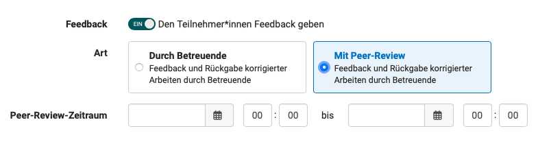
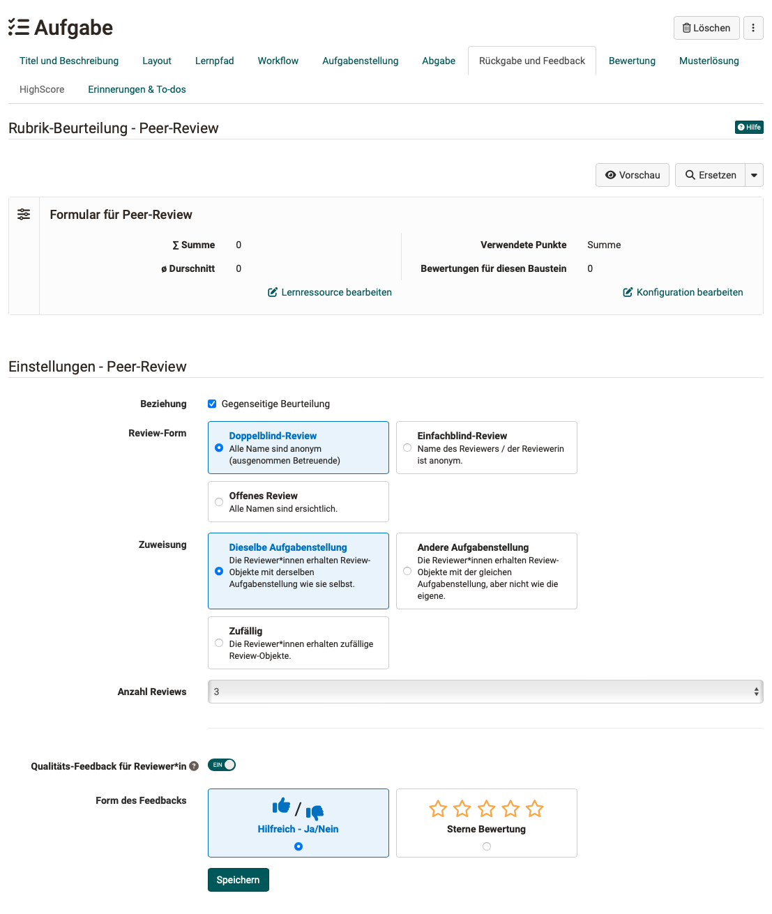
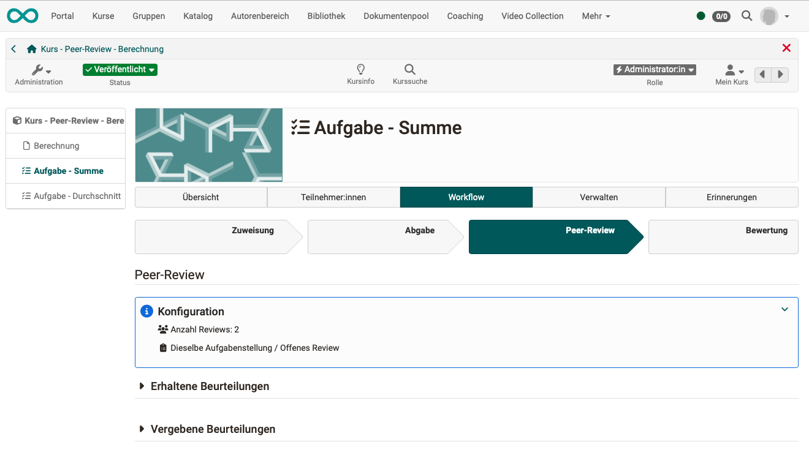
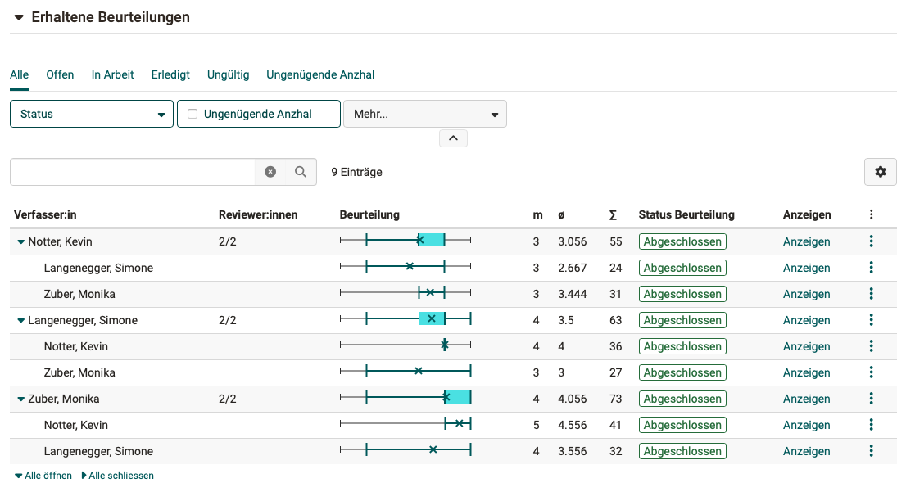
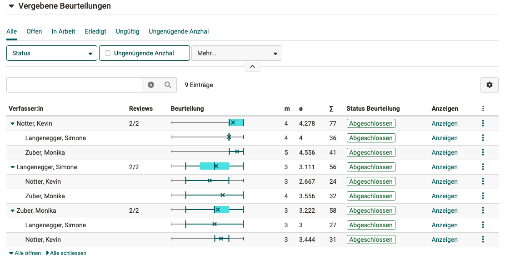

# How do I perform a peer review? {: #peer_review} 

??? abstract "Objectives and content of this instruction"

    You have already created a course with the course element "Task". 
    Would you like to have the results of this task reviewed by the course participants? 
    The following instructions show you how to do this.

??? abstract "Target group"

    [x] Authors [x] Coaches  [ ] Participants

    [ ] Beginners [x] Advanced users  [ ] Experts

??? abstract "Expected previous knowledge"

    * ["How do I create my first OpenOlat course?"](../my_first_course/my_first_course.md)
    * [First experience with the course element "Task"](../../manual_user/learningresources/Course_Element_Task.md)

---

## How do I prepare a peer review? {: #prepare_peer_review} 

In a peer review, course participants should review each other's assignment results. This can be prepared with the help of a **form** in the course element "**Task**".

1. In the course editor, add a **course element "Task"** to your course.

2. Edit the course element and select the **Tab "Workflow"**.

3. One step in the workflow of the course element "Task" is the **step "Feedback"**. Activate this step for the task.
{ class="shadow lightbox" title="Workflow tab in the course element Task" }

4. Under **Types**, select the option **"With peer review"**.

5. Specify the **peer review time period** in which the peer review must be carried out.

6. If the "With peer review" option has been selected in the Workflow tab, the rules for the submission of feedback by other participants can now be defined in the **"Revisions and feedback" tab**.
{ class="shadow lightbox" title="Revisions and feedback tab in the course element Task" }

7. The feedback from the reviewers is given in a **form**. As the course owner, you provide this form. Choose an existing form or create a new form that course participants can use to complete the review. A form with only one rubric question is recommended to start with.

8. Relationship 
With the **"Mutual review"** checkbox you specify whether participants should review each other or not.

9. Form of the review 
    * **Double-blind review**: all names are anonymous (except for coaches)
    * **Single-blind review**: The name of the reviewer is anonymous.
    * **Open review**: All names are visible.

10. Assignment 
    * **Same task**: The reviewers receive review objects with the same task as themselves.
    * **Other task**: The reviewers receive review objects with the same task, but not as their own.
    * **Random task**: The reviewers receive random review objects.

11. Number of reviews 
The participants of the course receive a review assignment for a certain number of other participants (not for *all* other participants). This number is specified here: 1 to 5 reviews, the default is 3.

12. Quality feedback for reviewer 
Feedback to the reviewers can also be enabled. If the switch is turned on, choose between "Helpful - Yes/No" and "Star rating" under **"Form of feedback"**.

13. Rights 
By default, only course owners see the "Trigger review assignment" button in the "Workflow" tab. Under **"Trigger of automatic review assignment"**, activate the option "Coach" if coaches may also trigger the review assignment.

 

---

### Recommended sample process

As standard, we recommend:

- Carry out the peer review with a **clearly defined time period**.
- Use a **form** that contains only one **rubric question** as a mandatory rubric. The "No answer" option should be deactivated.
- Have the assessment carried out by participants. (This means that the points are awarded by the participants.)

### Variant 1: Without assessment by course participants

If the peer review of the participants is **not** to be included in the assessment, but only general feedback is to be provided, only the expert's assessment counts. For an assessment exclusively by the expert, proceed as follows:

* Create and configure the course element Task as described above.
* For the peer review, for example, use a form that only provides a text field for general feedback from the reviewers.
* Leave the setting "With peer review" selected in the **"Workflow" tab**. If you change this to "By coaches", the peer review process would be deactivated altogether. General feedback without scoring would also be deactivated.
* You configure the assessment only by experts (coaches) in the **"Grading" tab**. If you select the type "Manually by coach" under "Display passed / not passed", points do not necessarily have to be awarded. Instead, the "Rubric assessment" can also be turned on for the coaches.

A setting of this kind can be used, for example, if the reviews of the participants are to serve as input for the experts, but the assessment is to remain exclusively with the experts/coaches.

### Variant 2: Mutual assessment in self-learning groups

If your goal is to have learning groups that work largely independently without a great deal of coaching effort, the peer review should also be organized accordingly.

* Create and configure the course element Task as described above.
* Switch on "Score granted" in the "Grading" tab.
* In the "Grading" tab, select the type "Automatic (using cut value)" under "Display passed / not passed".
* If scoring has been activated, the possible sources for calculating points become visible in the "Grading" tab. 
Under "Total score from" you can choose: 
\- Rubric assessment 
\- Rubric peer review 
\- Submitted reviews

### Variant 3: Joint assessment by participants and experts

You can also set up a setting in which participants and experts assess together.
For example, a weighting could be applied in which the participants' reviews count once and the experts' reviews count twice.

!!! tip "Recommendation for self-learning groups"

    Under "Total score from", activate the option "Submitted reviews". It increases the likelihood of mutual reviews being made in self-learning groups if the reviewers receive a fixed number of points per review made. If it is only a question of whether a review has been submitted, many result-distorting social processes in the group are also eliminated.

!!! tip "General recommendations"

    The course element Task and the peer review can be configured in many, even unusual, ways. There are therefore a few stumbling blocks, especially for beginners.

    * Avoid peer reviews without time specification.
    * Avoid peer reviews with relative dates.
    * Please note for peer review with groups and group coaches: 
     Course coaches only see participants from their own group. This means that course coaches may be able to see the points awarded, but not where they come from.

 

---

## How do I coach a peer review? {: #coach_peer_review} 

If the peer review has been prepared by the course owner, as a coach you can simply click on the corresponding course element with the task in the course menu. As a coach, you will then see a different view than the participants.

In the "Workflow" tab, the "Peer review" step gives you an overview of all peer reviews completed by your course participants. The "Configuration" area summarizes the settings, the expandable lists "Awarded ratings" and "Received ratings" show the reviews per person with their status.

{ class="shadow lightbox" title="Workflow tab in the view for coaches" }

{ class="shadow lightbox" title="List Received ratings" }

{ class="shadow lightbox" title="List Awarded ratings" }

 

---

## Sample to download {: #sample} 

[Sample form for peer reviews](assets/Musterformular_PeerReview.zip)

## Checklist {: #checklist} 

- [x] Has the desired process for the peer review been clarified and described?
- [x] What role do coaches play in peer review?
- [x] Does the course element "Task" in the course editor no longer show error messages?  (e.g. "You have not created any tasks yet" or "You don't have defined a form for peer-review.")
- [x] Is the "Feedback" step activated in the "Workflow" tab? (Is the "Revisions and feedback" tab active in the course editor?)
- [x] Does the form used for the review cover all requirements?
- [x] Has a time period been set for the peer review?
- [x] Has the scoring been sensibly regulated?

[To the top of the page ^](#peer_review)

---

## Further information {: #further_information}

[How do I create my first OpenOlat course? >](../my_first_course/my_first_course.md) 
[Course Element "Task" >](../../manual_user/learningresources/Course_Element_Task.md) 
[How do I create a form learning resource? >](../../manual_how-to/create_a_form/create_a_form.md) 
[Forms in Rubric Scoring >](../../manual_user/learningresources/Forms_in_Rubric_Scoring.md) 
[The form element rubric >](../../manual_user/learningresources/Form_Element_Rubric.md) 
[Assessing tasks and group tasks >](../../manual_user/learningresources/Assessing_tasks_and_group_tasks.md)

[To the top of the page ^](#peer_review)
