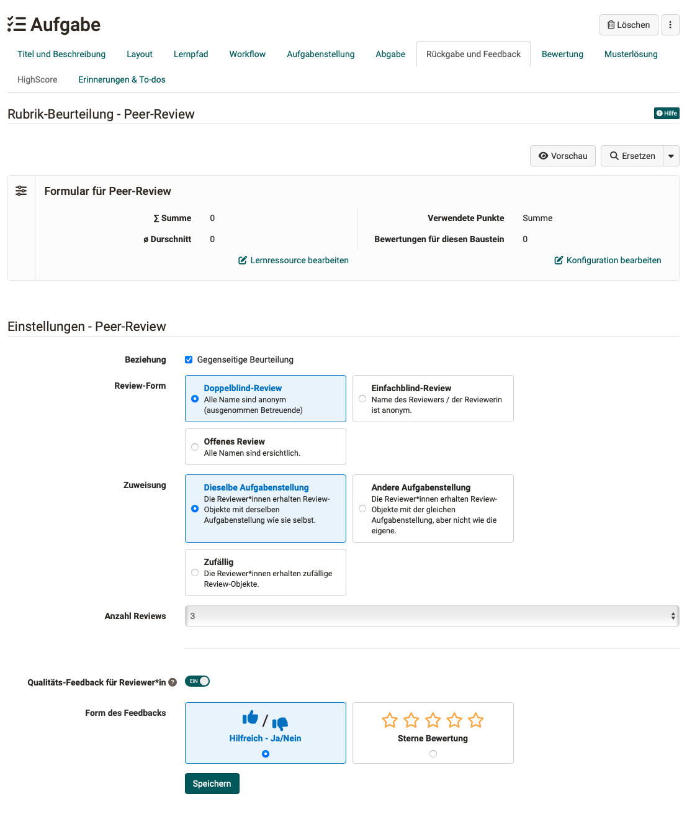

# How do I perform a peer review?

??? abstract "Objectives and content of this instruction"

    You have already created a course with the course element "Task". 
    Would you like to have the results of this task reviewed by the course participants? 
    The following instructions show you how to do this.

??? abstract "Target group"

    [x] Authors [x] Coaches  [ ] Participants

    [ ] Beginners [x] Amateurs  [ ] Experts

??? abstract "Expected previous knowledge"

    * ["How do I create my first OpenOlat course?"](../my_first_course/my_first_course.md)
    * ["How do I proceed when I create a test?"](../test_creation_procedure/test_creation_procedure.md)

---

## How do I prepare a peer review?

In a peer review, course participants should review each other's assignment results. This can be prepared with the help of a **form** in the course element "**Task**".

1. In the course editor, add the course element "Task" to a course.

2. Edit the course element and select the **Tab "Workflow"**

3. One step in the workflow of the course element "Task" is the step **"Feedback"**. Activate this step for the task.
{ class="shadow lightbox" }

4. Select the option **"With peer review"**

5. Specify a **period** in which the peer review must be carried out.

6. If the "With peer review" option has been selected in the Workflow tab, the rules for the submission of feedback by other participants can now be defined in the "Return and feedback" tab.
{ class="shadow lightbox" }

7. The feedback from the reviewers is given in a **form**. As the course owner, you provide this form. Choose an existing form or create a new form that course participants can use to complete the review. A form with only one rubric question is recommended to start with.

8. Relations 
You can choose whether participants should review each other or not.

9. Review form 
    * **Double-blind-review**: all names are anonymous (except for coaches)
    * **Single-blind-review**: Name of the reviewer is anonymous
    * **Open review**: All names can be seen

10. Assignment 
    * **Same assignment**: The reviewers receive review objects with the same assignment as themself.
    * **Different assignment**: The reviewers receive review objects with the same assignment, but not the same.
    * **Random**: The reviewers receive random review objects.

11. Number of reviews 
The participants of the course receive a review assignment for a certain number of other participants (not for *all* other participants). This number is specified here.

12. Quality feedback for reviewers 
Feedback to the reviewers can also be enabled. If the toggle button is activated, the form of the query can be selected. (“Helpful?” and “Star rating”).

 

---

### Recommended sample process
As standard, we recommend:

- Carry out the peer review with a **clearly defined time period**.
- Use a **form** that contains only one **heading question** as a mandatory heading. The "No answer" option should be deactivated.
- Have the assessment carried out by participants. (This means that the points are awarded by the participants).

### Variant 1: Without assessment from course participants

If the peer review of the participants is **not** to be included in the assessment, but only general feedback is to be provided, only the expert's assessment counts. For an evaluation exclusively by the expert, proceed as follows:

* Create and configure the course element Task as described above.
* For the peer review, for example, use a form that only allows a text field for general feedback from the reviewers.
* Leave the setting "With peer review" selected in the **"Workflow"** tab. If you change this to "By coach", the peer review process would be deactivated altogether. General feedback without scoring would also be deactivated.
* * You can configure the assessment only by experts (coaches) in the **"Assessment"** tab. If you enable "Passed/Failed" manually by the coaches, points do not necessarily have to be awarded. Instead, a rubric form can also be activated for the coaches.

### Variant 2: Mutual evaluation in self-learning groups

If your goal is to have learning groups that work largely independently without a great deal of coaching effort, the peer review should also be organized accordingly.

* Create and configure the course element Task as described above.
* Switch on "Award points" in the "Rating" tab.
* In the "Assessment" tab under "Output pass/fail", activate the output using an automatic points threshold.
* If scoring has been activated, the possible sources for calculating points are visible in the "Scoring" tab. 
Total points can come from 
\- Rubric assessment 
\- Rubric peer review 
\- Submitted reviews

### Variant 3: Joint assessment by participants and experts

You can also create a setting in which participants and experts evaluate together.
For example, a weighting could be applied in which the participants' reviews count once and the experts' reviews count twice.

!!! tip "Recommendation for self study groups"

    Activate "Total points from > Submitted reviews". It increases the likelihood of mutual reviews being made in self-study groups if the reviewers receive a fixed number of points per review made. If it is only a question of whether a review has been submitted, many result-distorting social processes in the group are also eliminated.

!!! tip "General recommendation"

    The course element task and the peer review can be configured in many, even unusual, ways. There are therefore a few stumbling blocks, especially for beginners.

    * Avoid peer reviews without time specification
    * Avoid peer reviews with relative dates.
    * Please note for peer review with groups and group coaches: 
     Course coaches only see participants from their own group. This means that course coaches may be able to see the points awarded, but not where they come from.

 

---

## How do I coach a peer review?

If the peer review has been prepared by the course owner, as a coach you can simply click on the corresponding course element with the task in the course menu. As a coach, you will then see a different view than the participants.

The Workflow tab provides you with an overview of all peer reviews completed by your course participants.

{ class="shadow lightbox" }

{ class="shadow lightbox" }

{ class="shadow lightbox" }

 

---

## Sample to download

[Sample form for peer reviews](assets/Musterformular_PeerReview.zip)

## Further information

[Course element "task"](../../manual_user/learningresources/Course_Element_Task.md) 
[How do I create a form learning resource?](../../manual_how-to/create_a_form/create_a_form.md) 

## Checklist

- [x] Has the desired process for the peer review been clarified and described?
- [x] What role do coaches play in peer review?
- [x] Does the course element "Task" in the course editor no longer show error messages?  (e.g. "Task missing", etc.)
- [x] Is the "Feedback and return" step activated in the "Workflow" tab? (Is the "Return and feedback" tab active in the course editor?)
- [x] Does the form used for the review cover all requirements?
- [x] Has a time period been set for the peer review?
- [x] Has the scoring been sensibly regulated?

