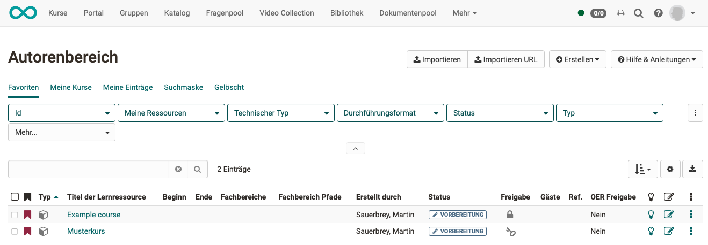
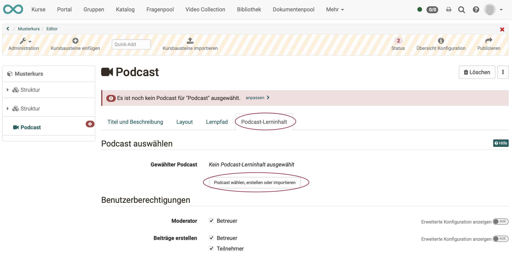
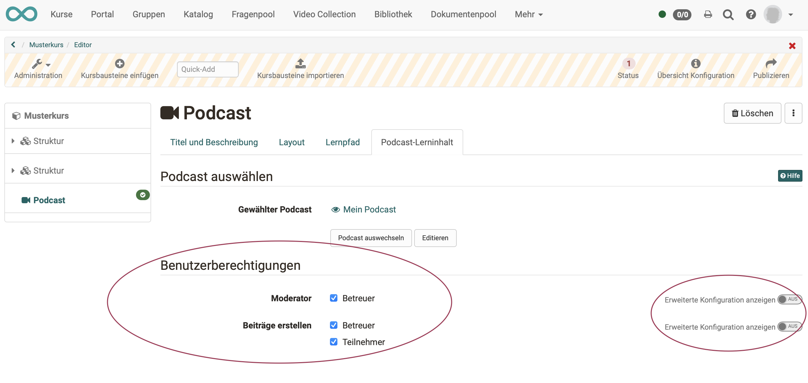
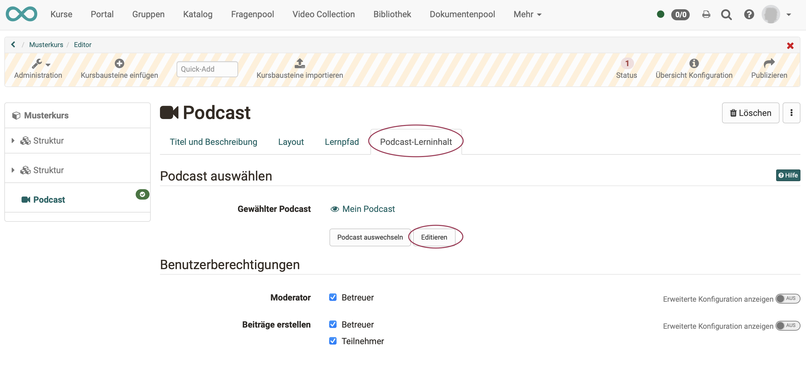
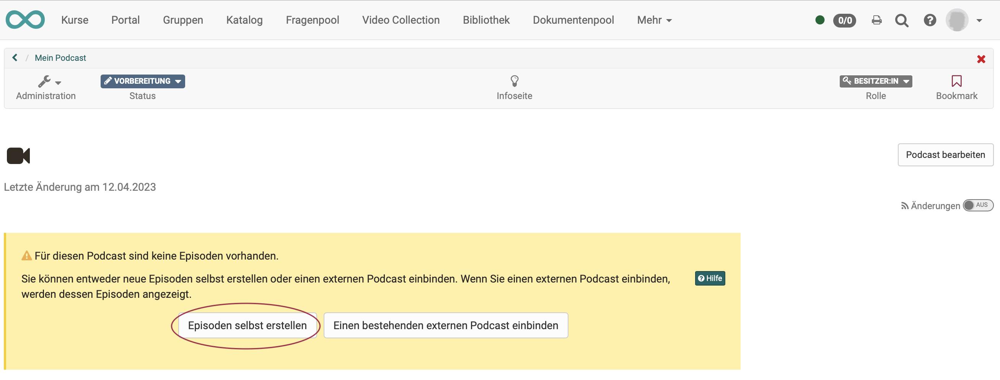
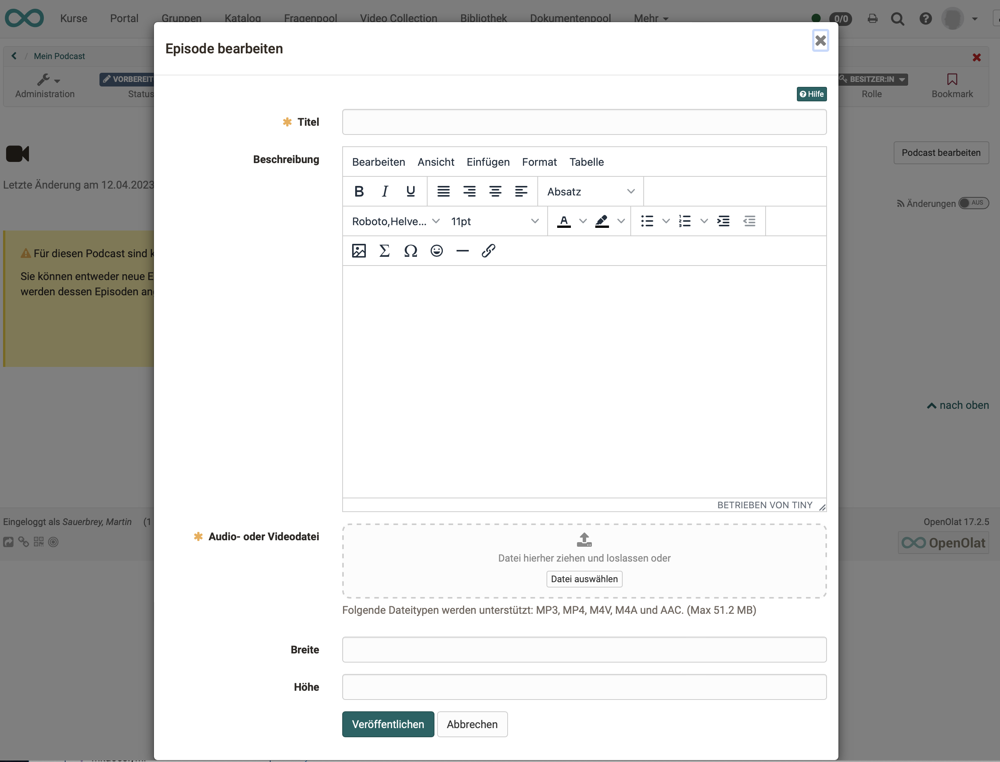

# Wie erstelle ich einen Podcast?

Mit dieser Anleitung haben Sie in kurzer Zeit Ihrem Kurs einen Podcast hinzugefügt und eine erste Episode erstellt.

##  Voraussetzungen

<h3> a) Inhalte für den Podcast</h3>
Produzieren Sie die Audio- oder Videodatei für Ihre Podcast-Episode mit einer dafür vorgesehenen Aufnahmesoftware (z.B. [GarageBand](http://www.apple.com/ilife/garageband/ "GarageBand")) und speichern Sie sie in einem der angegebenen Formate: MP3, MP4, M4V, M4A oder AAC. Achten Sie auf die angegebene Maximalgrösse.

<h3> b) Ein OpenOlat-Kurs</h3>
Der Podcast wird innerhalb eines OpenOlat-Kurses eingebunden. Wenn Sie noch keinen Kurs erstellt haben, steht im Kapitel [„Wie erstelle ich meinen ersten OpenOlat-Kurs"](../my_first_course/my_first_course.de.md), wie Sie vorgehen müssen, bevor Sie mit Hilfe der folgenden Anleitung Ihren Podcast erstellen.

---

## Schritt 1: Kurseditor öffnen und Podcast-Kursbaustein einfügen  

a) Gehen Sie in den **Autorenbereich** und suchen Sie dort den Kurs, in den der Podcast eingefügt werden soll.

{ class="shadow lightbox" }  

b) Öffnen Sie den gewünschten Kurs im **Kurseditor**, der sich im Menü "Administration" befindet.

c) Wählen Sie die Stelle im Kursmenü, an der der Baustein hinzugefügt werden soll. Kursbausteine werden immer unterhalb des aktuell ausgewählten Kursbausteins eingefügt. 

d) Klicken Sie in der Kopfzeile des Editors auf **"Kursbaustein einfügen"** oder nutzen Sie die Quick-Add Funktion und wählen Sie im Popup mit der Auswahlliste "Podcast".

Damit ist der Kursbaustein schon dem Kurs hinzugefügt.

e) Vergeben Sie nun noch einen passenden **Titel** im Tab „Titel und Beschreibung“ und speichern Sie den Kursbaustein. 

!!! tip "Hinweis"

    Wenn Sie den Kurseditor bereits jetzt schliessen, wird im Menü kein Podcast angezeigt, denn der Kursbaustein ist noch unvollständig. Es fehlt noch die Lernressource.

---
   
## Schritt 2: Podcast (Lernressource) erstellen  

a) Gehen Sie in den <b>Tab „Podcast-Lerninhalt“</b> und klicken Sie auf „Podcast wählen, erstellen oder importieren“.

{ class="shadow lightbox" }  
  
b) Hier können Sie nun 

* einen **neuen** Podcast erstellen, 
* einen Podcast **hochladen**, der Ihnen als Datei vorliegt (z.B. durch einen Export), 
* oder eine **URL** für den Podcast-Import angeben.

Wir gehen im Folgenden davon aus, dass Sie einen **neuen** Podcast beginnen möchten. 
  
c) Klicken Sie auf den **Button „Erstellen“**. 

d) Geben Sie einen **Titel** für Ihre Podcast-Lernressource ein und bestätigen Sie mit <b>"Erstellen"</b>. 

Fertig. Damit ist eine neue Podcast-Lernressource angelegt und weitere Einstellungen sowie die konkrete Ausgestaltung können vorgenommen werden.

!!! tip "Tipp"

    Alternativ kann ein OpenOlat-Podcast (so wie alle anderen Lernressourcen) auch im Autorenbereich erstellt und anschliessend im Kurseditor im Tab "Podcast-Lerninhalt" in den gewünschten Kurs eingebunden werden. 
    
    Bei diesem Vorgehen wird deutlich, dass Lernressourcen kursübergreifende Elemente sind und die Einbindung im gewählten Kurs nur eine der Verwendungsmöglichkeiten darstellt. 
    
    Derselbe Podcast kann in mehreren OpenOlat-Kursen eingebunden und auch kursunabhängig verwendet werden.

---

## Schritt 3: Benutzerberechtigungen definieren 

a) Im Tab **"Podcast-Lerninhalt"** wird festgelegt, wer Podcastbeiträge erstellen und den Podcast moderieren darf. 
Differenziertere Einstellungen sind auch über die erweiterte Konfiguration möglich. 

{ class="shadow lightbox" }  

b) **Podcast-Moderatoren** verfügen zusätzlich im Kursrun* über den <b>Button "Podcast bearbeiten"</b> und können Titel, Beschreibung und Bild eines Podcasts bestimmen. Auch entscheiden sie zu Beginn, ob ein externer Podcast oder ein OpenOlat-Podcast verwendet werden soll. Diese Entscheidung ist notwendig, bevor Podcastbeiträge z.B. von Teilnehmenden erstellt werden können.

(*Kursrun = Modus „aktiver Kurs“, im Unterschied zum Kurs, der im Editor geöffnet ist)

c) Abschließend muss der Kurs **publiziert** und der Kurseditor geschlossen werden, damit die Änderungen sichtbar werden. 

---

## Schritt 4: Podcast mit Inhalt (Episoden) füllen  

a) Öffnen Sie den Kurseditor erneut und klicken Sie im Tab "Podcast Lerninhalt" auf „Editieren“.

{ class="shadow lightbox" } 

b) Beim **ersten Editieren** werden Sie nun gefragt, ob Sie eine Podcast-Episode neu erstellen wollen oder einen bestehenden Podcast einbinden möchten. Im Folgenden zeigen wir, wie Sie eine neue Podcast-Episode erstellen.

{ class="shadow lightbox" }

Klicken Sie auf "Episoden selbst erstellen" um die **Initial-Episode** des Podcasts zu erstellen. Dieser Schritt ist notwendig, damit Podcastepisoden von der definierten Zielgruppe anschließend ebenfalls eingestellt werden können.

c) Fügen Sie nun den eigentlichen Inhalt Ihrer Podcast-Episode ein.

{ class="shadow lightbox" }

* Vergeben Sie einen Titel.
* Einen (optionalen) Text fügen Sie unter "Beschreibung" ein.
* Die Audio- oder Videodatei wird am einfachsten durch Ziehen (drag & drop) auf die Zielfläche eingefügt.

d) Wenn Sie alle gewünschten Felder ausgefüllt haben, veröffentlichen Sie die Episode durch Klick auf den Button "Veröffentlichen" am unteren Rand des Fensters.
 
  
!!! info ""

    Weitere Episoden können später mit demselben Vorgehen oder direkt in der Kursansicht hinzugefügt werden.

!!! warning "Achtung"

    Schritt 4 (Initial-Episode) ist auch erforderlich, wenn die Lernenden Podcasts hochladen sollen. Es muss auf jeden Fall zunächst vom Lehrenden die erste Episode, also das erste Video hochgeladen werden, bevor die Lernenden selbst Videos hochladen können.

---

## Schritt 5: Kurs publizieren und Status auf "Veröffentlicht" ändern  
  
Gehen Sie dazu vor, wie in [„Wie erstelle ich meinen ersten OpenOlat-Kurs"](../my_first_course/my_first_course.de.md) beschrieben.

Der Podcast ist nun eingebunden und Kursteilnehmende können die erste Episode
herunterladen.

