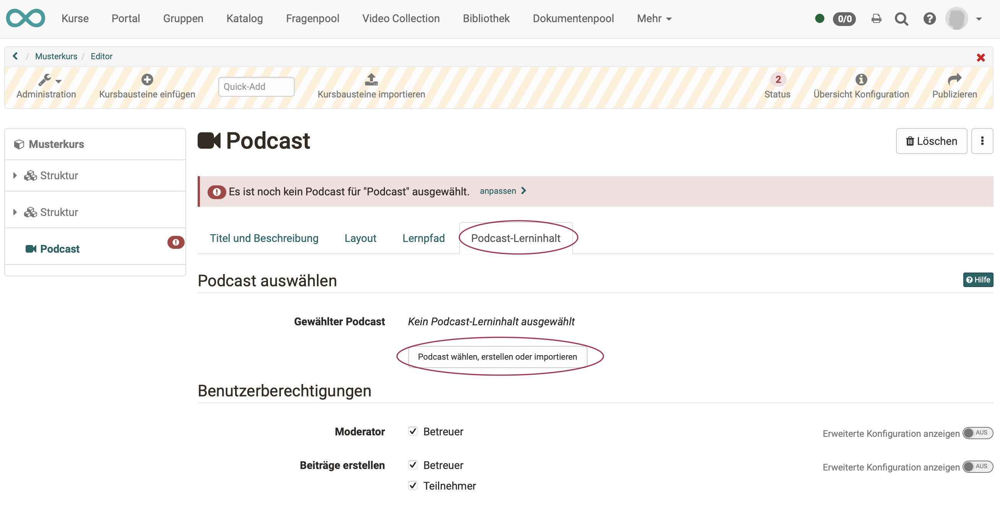
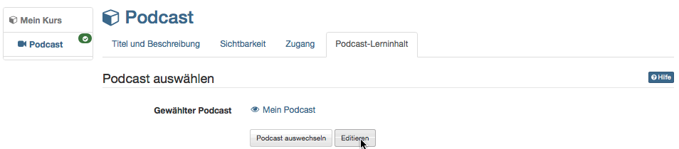
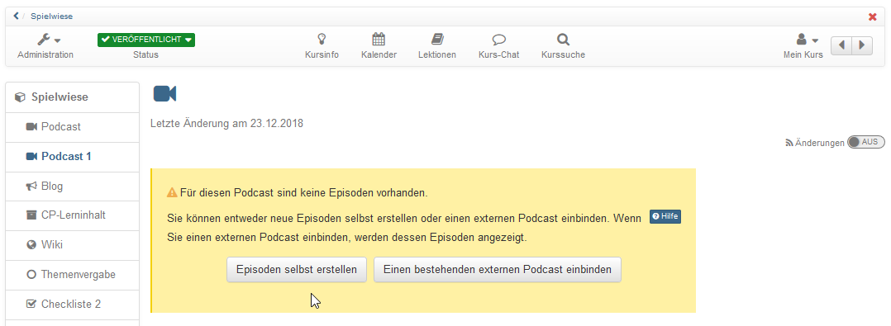

# Wie erstelle ich einen Podcast?

Mit dieser Anleitung haben Sie in kurzer Zeit Ihrem Kurs einen Podcast hinzugefügt und eine erste Episode erstellt.

##  Voraussetzungen

### a) Inhalte für den Podcast
Produzieren Sie die Audio- oder Videodatei für Ihre Podcast-Episode mit einer dafür vorgesehenen Aufnahmesoftware (z.B. [GarageBand](http://www.apple.com/ilife/garageband/ "GarageBand")) und speichern Sie sie in einem der angegebenen Formate: MP3, MP4, M4V, M4A oder AAC. Achten Sie auf die angegebene Maximalgrösse.

### b) Ein OpenOlat-Kurs
Der Podcast wird innerhalb eines OpenOlat-Kurses eingebunden. Wenn Sie noch keinen Kurs erstellt haben, steht im Kapitel [„Kurs erstellen"](../my_first_course/my_first_course.de.md), wie Sie vorgehen müssen, bevor Sie mit Hilfe der folgenden Anleitung Ihren Podcast erstellen.

## Schritt 1: Kurseditor öffnen und Podcast-Kursbaustein einfügen  

a) Gehen Sie in den **Autorenbereich** und suchen Sie dort den Kurs, in den der Podcast eingefügt werden soll.

  

b) Öffnen Sie den gewünschten Kurs im **Kurseditor**, der sich im Menü "Administration befindet.

c) Wählen Sie die Stelle im Kursmenü, an der der Baustein hinzugefügt werden soll. Kursbausteine werden immer unterhalb des aktuell ausgewählten Kursbausteins eingefügt. 

d) Klicken Sie in der Kopfzeile des Editors auf **"Kursbaustein einfügen"** oder nutzen Sie die Quick-Add Funktion und wählen Sie im Popup mit der Auswahlliste "Podcast".

Damit ist der Kursbaustein schon dem Kurs hinzugefügt.

e) Vergeben Sie nun noch einen passenden **Titel** im Tab „Titel und Beschreibung“ und speichern Sie den Kursbaustein. 

!!! tip "Hinweis"

    Wenn Sie den Kurseditor bereits jetzt schliessen, wird im Menü kein Podcast angezeigt, denn der Kursbaustein ist noch unvollständig. Es fehlt noch die Lernressource.

   
## Schritt 2: Podcast (Lernressource) erstellen  

a) Gehen Sie in den <b>Tab „Podcast-Lerninhalt“</b> und klicken Sie auf „Podcast wählen, erstellen oder importieren“.

  
  
b) Hier können Sie nun 

* einen **neuen** Podcast erstellen, 
* einen Podcast **hochladen**, der Ihnen als Datei vorliegt (z.B. durch einen Export), 
* oder eine **URL** für den Podcast-Import angeben.

Wir gehen im Folgenden davon aus, dass Sie einen **neuen** Podcast beginnen möchten. 
  
c) Klicken Sie auf den **Button „Erstellen“**. 

d) Geben Sie einen **Titel** für Ihre Podcast-Lernressource ein und bestätigen Sie mit <b>"Erstellen"</b>. 

Fertig. Damit ist eine neue Podcast-Lernressource angelegt und weitere Einstellungen sowie die konkrete Ausgestaltung können vorgenommen werden.

!!! tip "Tipp"

    Alternativ kann ein OpenOlat-Podcast (so wie alle anderen Lernressourcen) auch im Autorenbereich erstellt und anschliessend im Kurseditor im Tab "Podcasst-Lerninhalt" in den gewünschten Kurs eingebunden werden. 
    
    Bei diesem Vorgehen wird deutlich, dass Lernressourcen kursübergreifende Elemente sind und die Einbindung im gewählten Kurs nur eine der Verwendungsmöglichkeiten darstellt. 
    
    Derselbe Podcast kann in mehreren OpenOlat-Kursen eingebunden und auch kursunabhängig verwendet werden.

## Schritt 3: Podcast mit Inhalt füllen  
---  
1. Im Kurseditor im Tab "Podcast Lerninhalt" auf „Editieren“ klicken.

  
  
  
  
2. „Episoden selbst erstellen“ wählen.

!!! info ""

    Falls Sie schon über einen externen Podcast verfügen können Sie diesen ebenfalls einbinden.

  
  
  
3. Titel eingeben, Audio- oder Videodatei von Ihrem Rechner wählen und auf
„Veröffentlichen“ klicken. Bei Bedarf noch eine Beschreibung ergänzen.  
  
!!! info ""

    Weitere Episoden können später mit demselben Vorgehen oder direkt in der Kursansicht hinzugefügt werden.

!!! warning "Achtung"

    Schritt 3 ist auch erforderlich, wenn die Lernenden Podcasts hochladen sollen. Es muss auf jeden Fall zunächst vom Lehrenden die erste Episode, also das erste Video hochgeladen werden bevor die Lernenden selbst Videos hochladen können.

### Schritt 4: Kurs publizieren und freischalten  
---  
1. Am einfachsten erfolgt das Publizieren, wenn Sie den Kurseditor schließen und
direkt in die normale Kursansicht wechseln.

    Klicken Sie dafür einfach in der Bread-Crumb-Leiste auf den Kurstitel und es erscheint die Abfrage wie Sie den Kurs publizieren wollen.

    Wählen sie hier "**ja, automatisch**" wenn alle gemachten Änderungen publiziert
werden sollen. Wählen sie "**Ja, manuell**" wenn Sie nur einige Änderungen zum
publizieren auswählen wollen.

  
  
!!! tip "Tipp"

    Alternativ kann auch der ausführliche Publizier-Prozess über den Link in der Toolbar im Kurseditor gewählt werden.

Der Podcast ist nun eingebunden und Kursteilnehmende können die erste Episode
herunterladen.

Wie bei allen OpenOlat Lernressourcen kann auch zunächst die Lernressource
(hier Podcast) erstellt und dann die erstellte Lernressource in den
gewünschten Kurs eingebunden werden.

