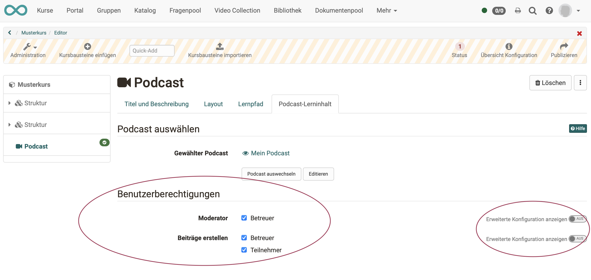
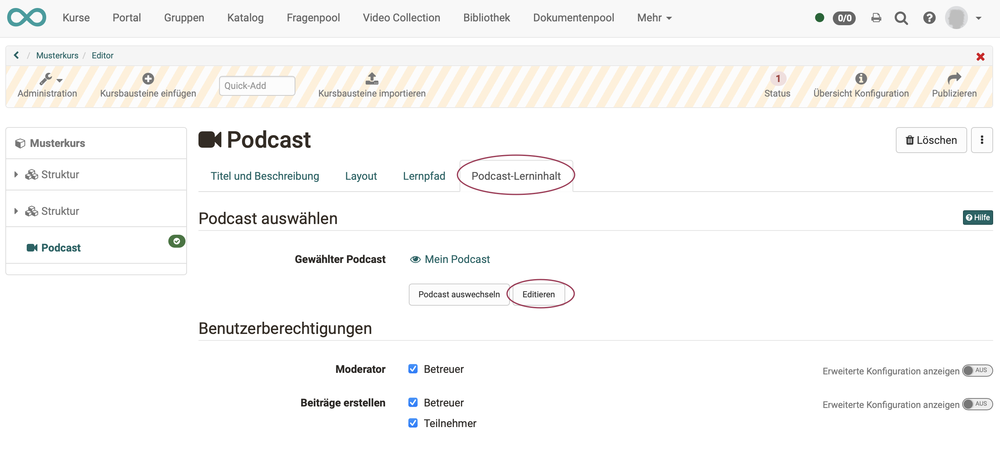
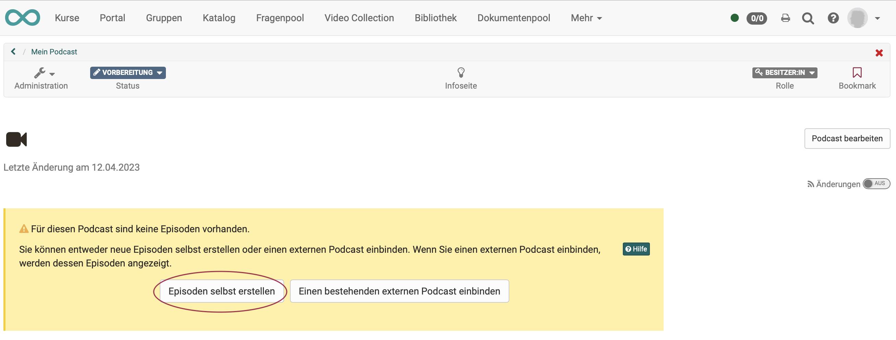
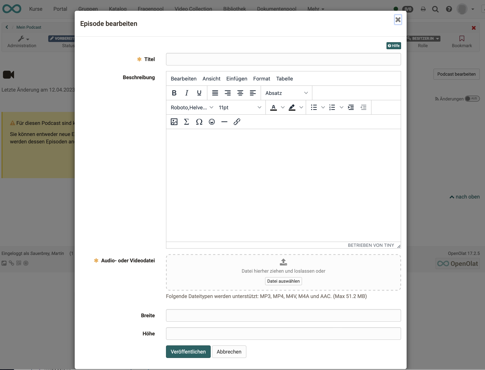

# How do I create a podcast?

With this guide, you'll have added a podcast to your course and created your first episode in a short time.

##  Requirements

### a) Content for the podcast
Produce the audio or video file for your podcast episode using a designated recording software (e.g. [GarageBand](http://www.apple.com/ilife/garageband/ "GarageBand")) and save it in one of the specified formats: MP3, MP4, M4V, M4A or AAC. Pay attention to the specified maximum size.

### b) An OpenOlat course
The podcast is included within an OpenOlat course. If you have not yet created a course, the chapter ["How do I create my first OpenOlat course"](../my_first_course/my_first_course.md) tells you how to proceed before creating your podcast using the following instructions.

---

## Step 1: Open course editor and insert course element podcast 

a) Go to the **Authoring** area and there find the course where you want to insert the podcast.

  

b) Open the desired course in the **Course editor** located in the "Administration" menu.

c) Select the position in the course menu where the course element is to be added. Course elements are always inserted below the currently selected course element.

d) Click **"Insert course element"** in the editor header or use the Quick-Add function and select "Podcast" in the pop-up with the selection list.

The course element has already been added to the course.

e) Now assign a suitable **title** in the tab "Title and description" and save the course element.

!!! tip "Note"

    If you close the course editor already now, no podcast will be displayed in the menu because the course element is still incomplete. The learning resource is still missing.

---
   
## Step 2: Create a podcast (learning resource)

a) Go to the <b>"Podcast learning content"</b> tab and click "Select, create or import podcast".

  
  
b) Here you can now 

* create a **new** podcast,
* **upload** a podcast that is available to you as a file (e.g. through an export), 
* or specify a **URL** for the podcast import.

We will assume below that you want to start a **new** podcast. 
  
c) Click on the **Create** button.

d) Geben Sie einen **Titel** für Ihre Podcast-Lernressource ein und bestätigen Sie mit <b>"Erstellen"</b>. 

Fertig. Damit ist eine neue Podcast-Lernressource angelegt und weitere Einstellungen sowie die konkrete Ausgestaltung können vorgenommen werden.

!!! tip "Tipp"

    Alternativ kann ein OpenOlat-Podcast (so wie alle anderen Lernressourcen) auch im Autorenbereich erstellt und anschliessend im Kurseditor im Tab "Podcasst-Lerninhalt" in den gewünschten Kurs eingebunden werden. 
    
    Bei diesem Vorgehen wird deutlich, dass Lernressourcen kursübergreifende Elemente sind und die Einbindung im gewählten Kurs nur eine der Verwendungsmöglichkeiten darstellt. 
    
    Derselbe Podcast kann in mehreren OpenOlat-Kursen eingebunden und auch kursunabhängig verwendet werden.

---

## Schritt 3: Benutzerberechtigungen definieren 

a) Im Tab **"Podcast-Lerninhalt"** wird festgelegt, wer Podcastbeiträge erstellen und den Podcast moderieren darf. 
Differenziertere Einstellungen sind auch über die erweiterte Konfiguration möglich. 

  

b) **Podcast-Moderatoren** verfügen zusätzlich im Kursrun* über den <b>Button "Podcast bearbeiten"</b> und können Titel, Beschreibung und Bild eines Podcasts bestimmen. Auch entscheiden sie zu Beginn, ob ein externer Podcast oder ein OpenOlat-Podcast verwendet werden soll. Diese Entscheidung ist notwendig, bevor Podcastbeiträge z.B. von Teilnehmenden erstellt werden können.

(*Kursrun = Modus „aktiver Kurs“, im Unterschied zum Kurs, der im Editor geöffnet ist)

c) Abschließend muss der Kurs **publiziert** und der Kurseditor geschlossen werden, damit die Änderungen sichtbar werden. 

---

## Schritt 4: Podcast mit Inhalt (Episoden) füllen  

a) Öffnen Sie den Kurseditor erneut und klicken Sie im Tab "Podcast Lerninhalt" auf „Editieren“.

 

b) Beim **ersten Editieren** werden Sie nun gefragt, ob Sie eine Podcast-Episode neu erstellen wollen oder einen bestehenden Podcast einbinden möchten. Im Folgenden zeigen wir, wie Sie eine neue Podcast-Episode erstellen.

Klicken Sie auf "Episoden selbst erstellen" um die **Initial-Episode** des Podcasts zu erstellen. Dieser Schritt ist notwendig, damit Podcastepisoden von der definierten Zielgruppe anschließend ebenfalls eingestellt werden können.

c) Fügen Sie nun den eigentlichen Inhalt Ihrer Podcast-Episode ein.

* Vergeben Sie einen Titel.
* Einen (optionalen) Text fügen Sie unter "Beschreibung" ein.
* Die Audio- oder Videodatei wird am einfachsten durch Ziehen (drag & drop) auf die Zielfläche eingefügt.

d) Wenn Sie alle gewünschten Felder ausgefüllt haben, veröffentlichen Sie die Episode durch Klick auf den Button "Veröffentlichen" am unteren Rand des Fensters.
 
  
!!! info ""

    Weitere Episoden können später mit demselben Vorgehen oder direkt in der Kursansicht hinzugefügt werden.

!!! warning "Achtung"

    Schritt 4 (Initial-Episode) ist auch erforderlich, wenn die Lernenden Podcasts hochladen sollen. Es muss auf jeden Fall zunächst vom Lehrenden die erste Episode, also das erste Video hochgeladen werden, bevor die Lernenden selbst Videos hochladen können.

---

## Schritt 5: Kurs publizieren und Status auf "Veröffentlicht" ändern  
  
Gehen Sie dazu vor, wie in [„Wie erstelle ich meinen ersten OpenOlat-Kurs"](../my_first_course/my_first_course.de.md) beschrieben.

Der Podcast ist nun eingebunden und Kursteilnehmende können die erste Episode
herunterladen.

