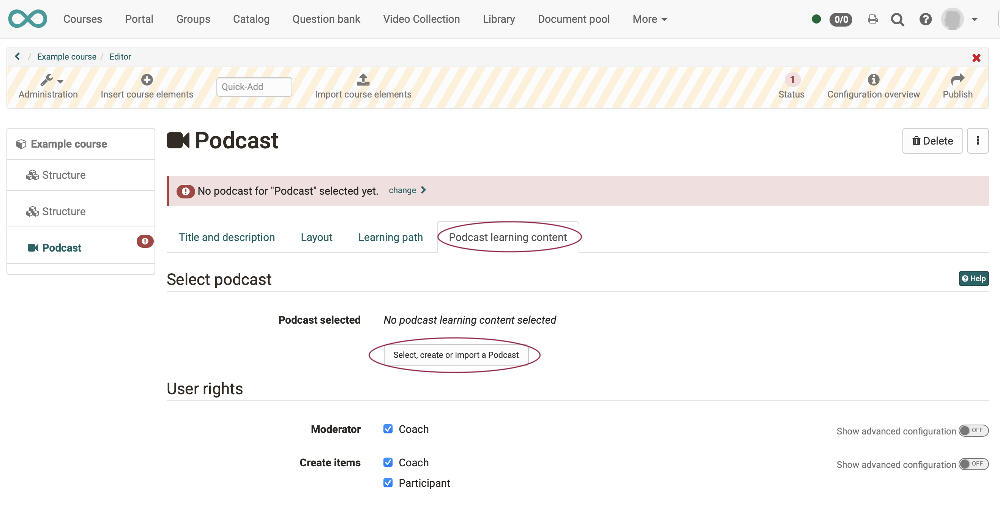
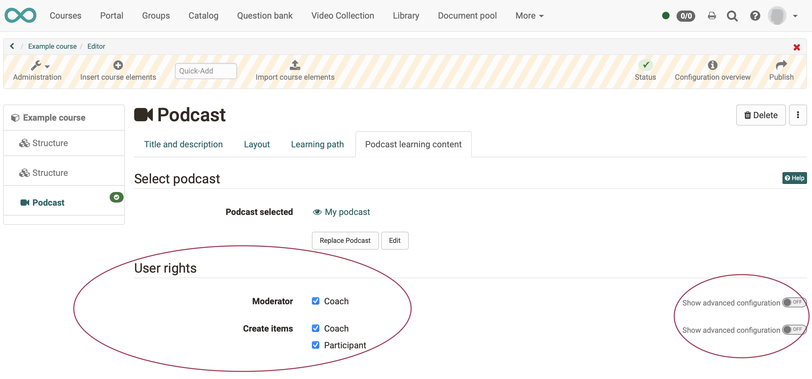
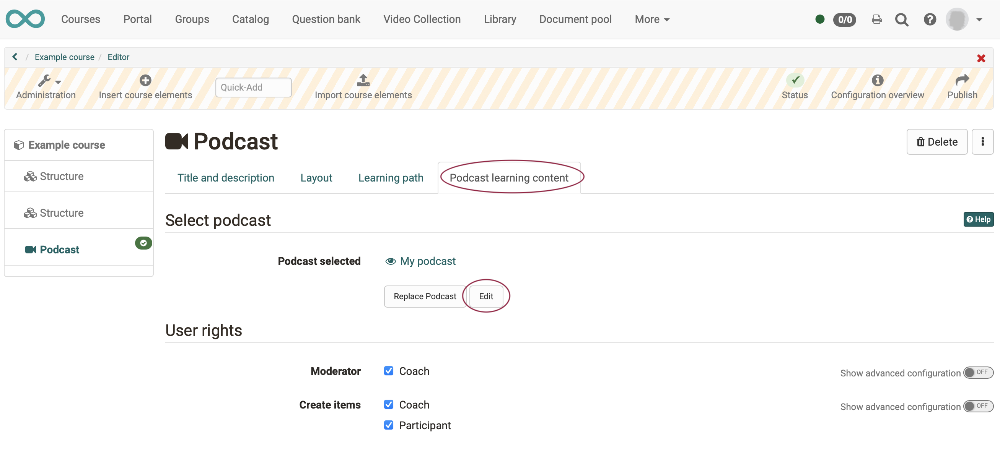
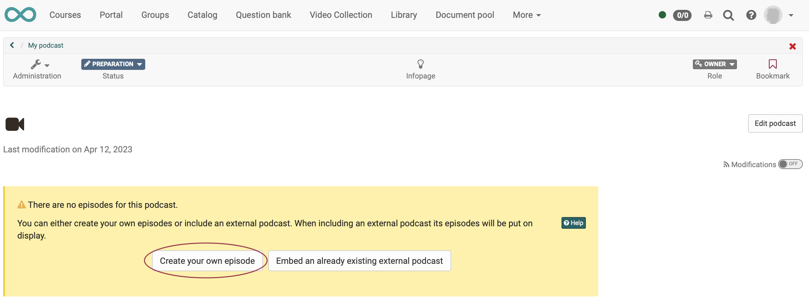
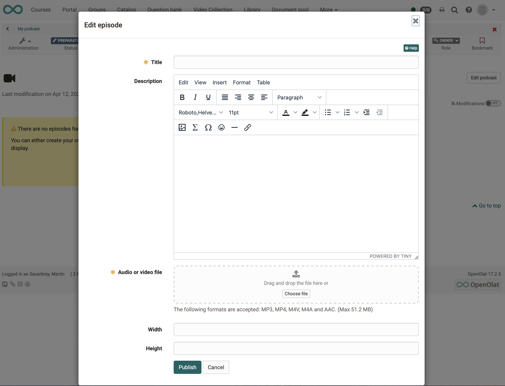

# How do I create a podcast?

With this guide, you'll have added a podcast to your course and created your first episode in a short time.

##  Requirements

<h3> a) Content for the podcast</h3>
Produce the audio or video file for your podcast episode using a designated recording software (e.g. [GarageBand](http://www.apple.com/ilife/garageband/ "GarageBand")) and save it in one of the specified formats: MP3, MP4, M4V, M4A or AAC. Pay attention to the specified maximum size.

<h3> b) An OpenOlat course</h3>
The podcast is included within an OpenOlat course. If you have not yet created a course, the chapter ["How do I create my first OpenOlat course"](../my_first_course/my_first_course.md) tells you how to proceed before creating your podcast using the following instructions.

---

## Step 1: Open course editor and insert course element podcast 

a) Go to the **Authoring** area and there find the course where you want to insert the podcast.

{ class="shadow lightbox" }  

b) Open the desired course in the **Course editor** located in the "Administration" menu.

c) Select the position in the course menu where the course element is to be added. Course elements are always inserted below the currently selected course element.

d) Click **"Insert course element"** in the editor header or use the Quick-Add function and select "Podcast" in the pop-up with the selection list.

The course element has already been added to the course.

e) Now assign a suitable **title** in the tab "Title and description" and save the course element.

!!! tip "Note"

    If you close the course editor already now, no podcast will be displayed in the menu because the course element is still incomplete. The learning resource is still missing.

---
   
## Step 2: Create a podcast (learning resource)

a) Go to the <b>"Podcast learning content"</b> tab and click "Select, create or import a podcast".

{ class="shadow lightbox" }  
  
b) Here you can now 

* create a **new** podcast,
* **upload** a podcast that is available to you as a file (e.g. through an export), 
* or specify a **URL** for the podcast import.

We will assume below that you want to start a **new** podcast. 
  
c) Click on the **Create** button.

d) Enter a **title** for your podcast learning resource and confirm with <b>"Create"</b>.

Done. A new podcast learning resource is now created and further settings and the concrete design can be made.

!!! tip "Hint"

    Alternatively, an OpenOlat podcast (like all other learning resources) can also be created in the authoring area and then integrated into the desired course in the course editor in the tab "Podcast learning content". 
    
    This procedure makes it clear that learning resources are cross-course elements and that embedding them in the selected course is only one of the possible uses. 
    
    The same podcast can be included in multiple OpenOlat courses and can also be used independently of the course.

---

## Step 3: Define user rights 

a) The **"Podcast learning content "** tab is used to define who can create podcast posts and moderate the podcast. 
More sophisticated settings are also possible via the advanced configuration.

{ class="shadow lightbox" }  

b) **Podcast moderators** additionally have the <b>"Edit podcast"</b> button in the course run* and can determine the title, description and image of a podcast. They also decide at the beginning if an external podcast or an OpenOlat podcast should be used. This decision is necessary before podcast contributions can be created, e.g. by participants.

(*course run = "active course" mode, as opposed to the course open in the editor)

c) Finally, the course must be **published** and the course editor closed so that the changes are visible.

---

## Step 4: Fill podcast with content (episodes)  

a) Open the course editor again and click "Edit" in the "Podcast learning content" tab.

{ class="shadow lightbox" } 

b) When you **first edit**, you will now be asked if you want to create a new podcast episode or include an existing podcast. Below we show you how to create a new podcast episode.

{ class="shadow lightbox" }

Click on "Create your own episode" to create the **initial episode** of the podcast. This step is necessary so that podcast episodes from the defined target group can also be posted afterwards.

c) Now add the actual content of your podcast episode.

{ class="shadow lightbox" }

* Assign a title.
* Add an (optional) text under "Description".
* The easiest way to insert the audio or video file is to drag and drop it onto the target area.

d) When you have filled in all the required fields, publish the episode by clicking the "Publish" button at the bottom of the window.
 
  
!!! info ""

    More episodes can be added later using the same procedure or directly in the course view.

!!! warning "Attention"

    Step 4 (Initial episode) is also required if learners are to upload podcasts. In any case, the first episode, i.e. the first video, must be uploaded by the coach before the learners can upload videos themselves.

---

## Step 5: Publish course and change status to "Published" 
  
To do this, proceed as described in ["How do I create my first OpenOlat course"](../my_first_course/my_first_course.md).

The podcast is now embedded and course participants can download the first episode. 

