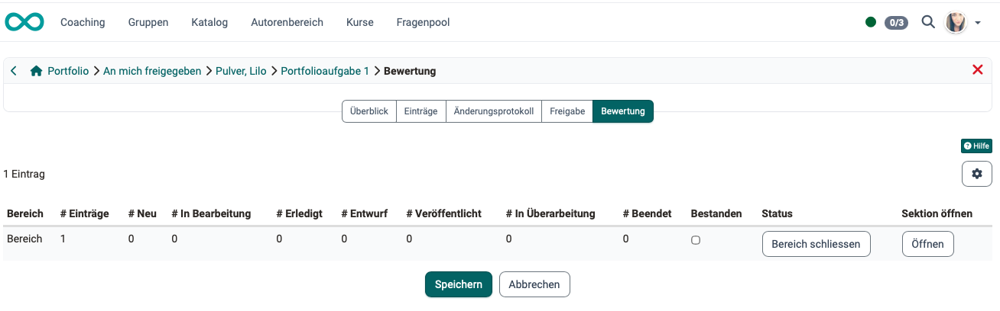
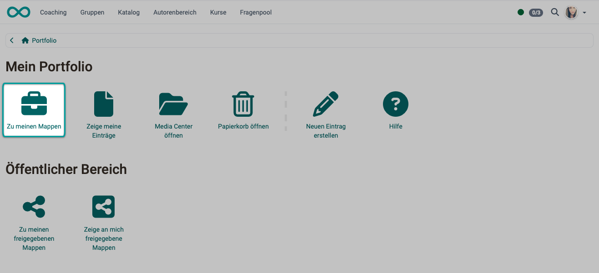
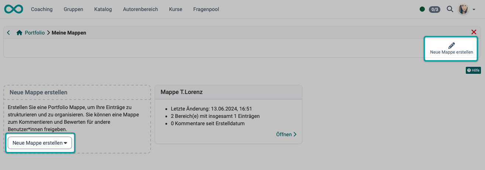
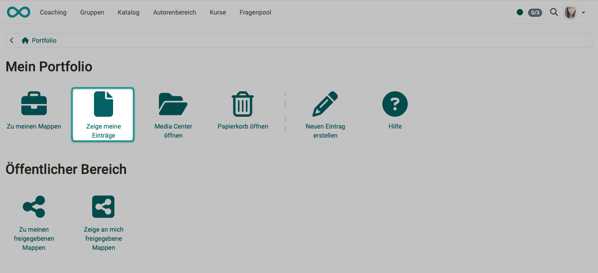
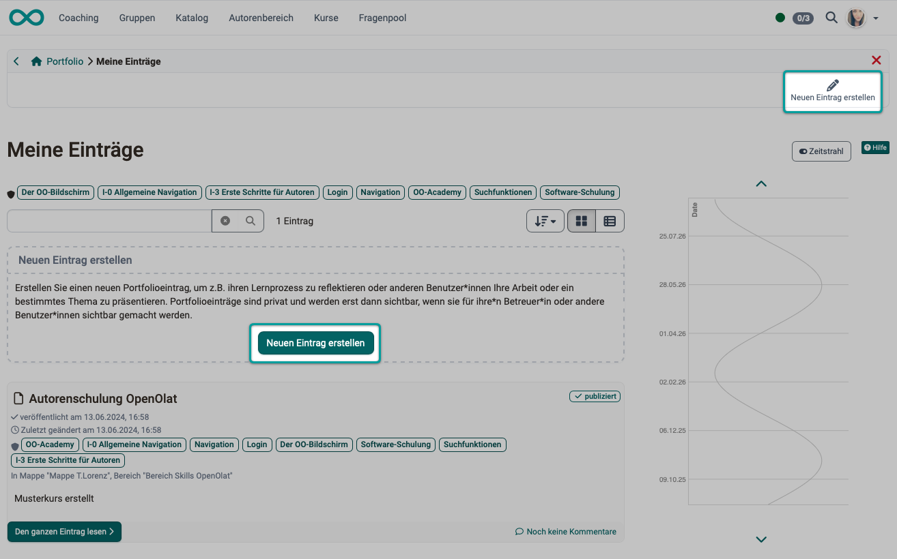

# Wie bereite ich die Erstellung persönlicher Portfolios durch Teilnehmer:innen vor? {: #portfolio}

??? abstract "Ziel und Inhalt dieser Anleitung"

    Planen Sie, dass Ihre Kursteilnehmer:innen individuelle Portfolios erstellen? Nachstehend erfahren Sie, welche Möglichkeiten OpenOlat Ihnen dazu bietet.

??? abstract "Zielgruppe"

    [x] Autor:innen [x] Betreuer:innen  [x] Teilnehmer:innen

    [x] Anfänger:innen [x] Fortgeschrittene  [] Experten/Expertinnen

??? abstract "Erwartete Vorkenntnisse"

    * ["Wie erstelle ich meinen ersten OpenOlat-Kurs?"](../my_first_course/my_first_course.de.md) 

??? abstract "Begriffe kurz erklärt"

    | Begriff | Englisch | Bedeutung |
    |---|---|---|
    | ePortfolio | ePortfolio | Das Modul für Portfolioarbeit |
    | Mappe | Binder | Die Sammlung, gegliedert in Bereiche |
    | Bereich | Section | Kapitel einer Mappe (nicht «Sektion») |
    | Eintrag | Entry | Eine Seite in einer Mappe |
    | Aufgabe | Assignment | Auftrag in einem Bereich (nicht der Kursbaustein) |
    | Einschätzung | Evaluation | Ausgefülltes Formular zu einer Aufgabe |
    | Bewertung | Assessment | Punkte und Bestanden je Bereich |
    | Freigabe | Sharing | Zugangsrechte an einer Mappe |
    | Portfoliovorlage | Portfolio template | Die Mappe (Vorlage), aus der Kopien entstehen. Sie liegt als Lernressource im Autorenbereich. |

---

## Was ist ein Portfolio? {: #definition}

Das **ePortfolio** ist das OpenOlat-Modul, mit dem Lernende ihre eigenen Lernprozesse dokumentieren, reflektieren und zur Rückmeldung freigeben. Jede Person sammelt ihre Arbeiten, Nachweise und Reflexionen in einer **Mappe**, gliedert sie in **Bereiche** und **Einträge** und entscheidet selbst, wer welche Teile sehen darf. Betreuende und eingeladene Personen können freigegebene Inhalte kommentieren und bewerten.

[Allgemeines zum Portfolio >](../../manual_user/area_modules/Portfolio_General_Information.de.md) 

[Zum Seitenanfang ^](#portfolio)

---

### Wozu dient ein Portfolio? {: #purpose}

Das Portfolio macht den Lern- und Kompetenzfortschritt einer Person über einen längeren Zeitraum sichtbar. Im Vordergrund steht nicht nur das Ergebnis, sondern der Weg dorthin: Die Lernenden dokumentieren, was sie können und wie sie es erreicht haben. Typische Einsatzszenarien sind Reflexionsaufgaben, Praktikums- und Kompetenznachweise, sowie die begleitende Dokumentation einer Ausbildung.

Das Modul wird von der Administration unter **e-Assessment** ein- oder ausgeschaltet.

Bevor Sie die Erstellung von Portfolios durch Teilnehmer:innen planen, sollten Sie eine klare Vorstellung davon entwickelt haben, wozu das Portfolio dienen soll. 

[Zum Seitenanfang ^](#portfolio)

---

### Was kann ein Portfolio enthalten? {: #content}

Die individuellen Portfolios können enthalten:

* selbst erstellte Mappen (unabhängig von einem bestimmten Kurs)
* selbst erstellte Mappen (im Zusammenhang mit einem bestimmten Kurs)
* Mappen anderer Personen, die diese für mich frei gegeben haben
* Einträge innerhalb der Mappen (Text mit eingefügten Links, Bildern, usw.)
* an Einträge angehängte Dateien

[Bestandteile des Portfolios >](../../manual_user/area_modules/Components_of_the_portfolio.de.md) 
[Der Portfolio Editor >](../../manual_user/area_modules/The_portfolio_editor_17_1.de.md) 

[Zum Seitenanfang ^](#portfolio)

---

### Wie ist ein Portfolio aufgebaut? {: #structure}

Ein Portfolio ist hierarchisch aufgebaut:

- **Mappe** – die oberste Sammlung, in der eine Person ihre Portfolioarbeit ordnet.
- **Bereich** – ein Kapitel der Mappe, mit Titel, Zusammenfassung sowie Beginn- und Enddatum. Unterbereiche gibt es nicht.
- **Eintrag** – eine Seite in einem Bereich, gebaut mit dem Content Editor aus Text, Bildern, Videos, Dokumenten und Formularen. Ein Eintrag beantwortet eine Aufgabe oder steht für sich.
- **Aufgabe** – ein Auftrag in einem Bereich, den eine Vorlage vorgibt. Die lernende Person beantwortet ihn mit einem Eintrag.

[Zum Seitenanfang ^](#portfolio)

---

### Wo erstellen Teilnehmer:innen ihr Portfolio? {: #create}

Portfolios können erstellt werden

* in Kursbausteinen vom Typ "Portfolio" innerhalb eines Kurses
* im persönlichen Menü im Abschnitt "Persönliche Werkzeuge", Menüpunkt "Portfolio"
* falls in den persönlichen Einstellungen angepasst: Via Symbol in der Kopfzeile statt in den persönlichen Werkzeugen

Die Erstellung findet jeweils im [Portfolio Editor](../../manual_user/area_modules/The_portfolio_editor_17_1.de.md) statt.

[Zum Seitenanfang ^](#portfolio)

---

## Wo können Portfolio-Inhalte eingesehen werden? {: #view}

### Wo können Teilnehmer:innen ihre eigenen Portfolio-Inhalte einsehen? {: #participants}

Alle Benutzer:innen von OpenOlat finden ihr eigenes Portfolio im **persönlichen Menü**. Wenn sie dort **Portfolio 2.0** öffnen, erreicht jede Person ihre eigenen Portfolio-Inhalte:

- **Meine Portfoliomappen** – die Liste aller eigenen Mappen. Hier entstehen neue Mappen: leer, aus einer Vorlage, aus einer Portfolioaufgabe eines Kurses oder aus bestehenden Einträgen.
- **Meine Einträge** – alle eigenen Einträge in zeitlicher Reihenfolge, unabhängig von der Mappe, ergänzt um den **Zeitstrahl**.
- **An mich freigegeben** – Mappen und Einträge, die andere Personen freigegeben haben. Betreuende finden hier die Mappen ihrer Lernenden.
- **Von mir freigegeben** – die eigenen Mappen, die man anderen geöffnet hat.
- **Papierkorb** – gelöschte Mappen und Einträge, die sich wiederherstellen oder endgültig löschen lassen.

[Mehr zum persönlichen Menü >](../../manual_user/personal_menu/index.de.md) 
[Zum Seitenanfang ^](#portfolio)

---

### Wie und wo können andere Personen die Portfolio-Inhalte einsehen? {: #others}

Über den Reiter **Freigabe** einer Mappe vergibt die besitzende Person Zugangsrechte. Sie wählt Kursmitglieder, Kursbetreuende oder Kursbesitzende aus oder lädt externe Personen per E-Mail ein und bestimmt die freigegebenen Bereiche und Einträge sowie die Stufe: **lesen**, **kommentieren** oder/und **bewerten**. Wer das Recht zur Bewertung bekommt, hat automatisch auch das Recht zum Kommentieren.

Freigegebene Mappen anderer Personen findet jeder ebenfalls in seinem persönlichen Menü unter Portfolio 2.0 > **"An mich freigegeben"**.

[Zum Seitenanfang ^](#portfolio)

---

### Wo können Betreuer:innen die Portfolio-Inhalte einsehen und bewerten? {: #coaches}

In einem **Kursbaustein** oder Kurs erstellte Portfolio-Inhalte werden auch auf den Kursbausteinen angezeigt. Als Betreuer:in wählen Sie den Kursbaustein und dann den Tab "Teilnehmer:innen. Nach Auswahl eines/einer Teilnehmer:in werden Ihnen alle zur Bewertung und zum Kommentieren freigegebenen Einträge und Mappen angezeigt.

Eine andere Zugangsmöglichkeit besteht über das **Bewertungswerkzeug**. Wählen Sie das Bewertungswerkzeug in der Kursadministration. Auch dort können Sie den betreffenden Kursbaustein wählen und anschliessend den/die Teilnehmer:in. Nach Wahl einer Person stehen die gleichen Bewertungs- und Kommentarmöglichkeiten zur Verfügung, wie bei Wahl eines Kursbausteins im Kursmenü.

Auch im **persönlichen Menü** finden Betreuer:innen unter "Portfolio 2.0" > "An mich freigegeben" die Mappen und Einträge, die zu bewerten sind. 
Wählen Sie als Betreuer:in im Tab "Mappen" die Mappe der gewünschten Person und bewerten Sie mit Punkten und Bestanden je **Bereich**. Einzelne Einträge werden nicht bewertet, nur kommentiert.

Das Ergebnis einer Bewertung fliesst über den Kursbaustein **Portfolioaufgabe** in das Bewertungswerkzeug des Kurses.

{ class="shadow lightbox" }

!!! warning "Wichtig"

    Ohne Freigabe sehen auch Kursbetreuende eine aus dem Kurs abgeholte Mappe nicht. Veröffentlichen und Freigeben sind zwei getrennte Schritte.

[Zum Seitenanfang ^](#portfolio)

---

## Wie und wo kann ein Portfolio vorbereitet werden? {: #prepare_a_portfolio}

Für die Vorbereitung persönlicher Portfolios, die Ihre Teilnehmer:innen dann selbst befüllen, gibt es in OpenOlat 3 Wege:

### Weg 1: Mit vorbereiteter Portfoliovorlage {: #create_with_template}

Der übliche „vorbereitete" Weg läuft über eine Portfoliovorlage:

1. Portfoliovorlage erstellen 
\- Neue Lernressource vom Typ Portfoliovorlage anlegen  &nbsp;(Autorenbereich → Erstellen → „Portfolio 2.0 Vorlage") 
\- Die Vorlage in Abschnitte (Sections) gliedern und darin Seiten vorbereiten 
\- Optional pro Abschnitt Aufgaben definieren. So bekommen die Teilnehmer:innen konkrete Arbeitsaufträge, zu denen sie jeweils eine Seite erstellen. 
\- Bei Bedarf Zeitfenster (Abgabetermine) und Bewertungskriterien hinterlegen

2. Vorlage an die Teilnehmer:innen ausgeben 
Damit alle Teilnehmer:innen ihre eigenen, persönlichen Kopien erhalten, binden Sie die Vorlage in einen Kurs ein: 
\- Kursbaustein Portfolioaufgabe hinzufügen 
\- in der Konfiguration die Portfoliovorlage auswählen 
\- Kurs veröffentlichen und Teilnehmer:innen zuweisen 

Beim ersten Öffnen des Bausteins wird für alle Teilnehmer:innen automatisch eine individuelle Sammelmappe aus der Vorlage erzeugt, die sie dann eigenständig ausfüllen, mit Einträgen ergänzen und abschliessen.

### Weg 2: Freies Portfolio ohne Vorlage
Teilnehmer:innen können auch in Eigeninitiative unter ihrem persönlichen Menü "Portfolio" eine leere Mappe anlegen und frei strukturieren. Hier bereiten Sie als Kursbesitzer:in keine Vorlage vor, Sie geben nur in einer Anleitung den Rahmen vor. Das eignet sich für offene, selbstgesteuerte Aufgaben.

### Weg 3: Freies Portfolio mit Vorlage
Alternativ können Teilnehmer:innen unter „Meine Mappen" auch eine „Mappe basierend auf Vorlage", „aus Kurs" oder „aus Einträgen" erstellen. Diese Möglichkeit können Administrator:innen einschränken.

[Mehr zum freien Portfolio >](../../manual_user/area_modules/My_portfolio_binders.de.md#individuelle-portfolio-mappen) 
[Zum Seitenanfang ^](#portfolio)

---

## Erstellung eines Portfolios {: #create_a_portfolio}

### Erstellen einer Vorlage {: #creating_a_template}

!!! info "Hinweis"

    Im Zusammenhang mit dem Portfolio gibt es zwei verschiedene Vorlagen, sie dürfen nicht verwechselt werden:

    - **Portfoliovorlage:** Die ganze Mappe, die Autorinnen und Autoren in der Lernressource **Portfolio 2.0 Vorlage** bauen (Bereiche mit Aufgaben, Daten, Einstellungen). Jede Person, die die Portfolioaufgabe abholt oder die Vorlage bucht, erhält eine eigene Kopie. Änderungen an der Vorlage werden in die Kopien synchronisiert.

    - **Vorlage:** Ein einzelnes Dokument oder ein Formular im **Vorlagenordner** einer Mappe, aus dem Nutzende einen neuen Eintrag erstellen.

1. **Lernressource „Portfolio 2.0 Vorlage" erstellen:** 
Autorenbereich → Erstellen → „Portfolio 2.0 Vorlage" → Titel vergeben → Erstellen.

2. **Vorlage mit „Bereichen" und „Aufgaben" ausgestalten** 
Die Gliederung erfolgt in Bereiche (nicht „Abschnitte"/„Sections"). Bereiche lassen sich nicht in Unterbereiche teilen.
Pro Bereich erstellt der/die Autor:in Aufgaben vom Typ Freitext oder Formular — bewusst „Aufgaben", nicht „Einträge" oder „Seiten" (das war in meiner ersten Antwort ungenau). 
[Mehr zu Portfoliovorlage erstellen >](../../manual_user/learningresources/Portfolio_template_Creation.de.md)

3. **Zentrale Vorbereitungs-Einstellungen:** 
Autorenbereich → Portfoliovorlage wählen → Administration → Einstellungen → Tab „Einstellungen" 
Hier entscheiden Sie, ob Teilnehmer:innen später 
\- neben den vorgegebenen Aufgaben eigene, unabhängige Einträge erstellen dürfen (per Default deaktiviert), 
\- ihre Mappe wieder löschen dürfen, 
\- einen Vorlagenordner hinzufügen dürfen, 
\- einen Vorlagenordner bereit gestellt bekommen und Einträge nur darauf basierend erstellt werden dürfen. 
[Mehr zu den Einstellmöglichkeiten von Portfoliovorlagen >](../../manual_user/learningresources/Portfolio_template_Administration_and_editing.de.md)

4. **Vorlage über den Kursbaustein „Portfolioaufgabe" ausgeben** 
\-  Kurseditor → Kursbaustein „Portfolioaufgabe" → Tab „Lerninhalt" → Vorlage zuordnen (oder direkt neu erstellen). 
\- Für Bewertung zusätzlich Tab „Bewertung" konfigurieren. 
\-  **Wichtig**: Sobald Teilnehmer:innen die Vorlage abgeholt haben, kann sie nicht mehr ausgewechselt werden. 
[Mehr zum Kursbaustein Portfolioaufgabe >](../../manual_user/learningresources/Course_Element_Portfolio_Task.de.md) 

5. **So kommen die Teilnehmerinnen zur eigenen Mappe** 
\- Die Teilnehmer:innen klicken im Kurs auf „Portfolioaufgabe abholen". 
\- Dadurch wird eine persönliche Kopie erzeugt, die im persönlichen Menü unter Portfolio 2.0 → „Meine Portfolio Mappen" erscheint (mit rotem Randstreifen und Kurshinweis).  
\- Dann befüllen sie die Aufgaben und publizieren die Einträge. 
[Mehr zum Kursbaustein Portfolioaufgabe >](../../manual_user/learningresources/Course_Element_Portfolio_Task.de.md)

[Zum Seitenanfang ^](#portfolio)

---

### Erstellen eines Kursbausteins "Portfolioaufgabe"

Fügen Sie einen neuen Kursbaustein "Portfolioaufgabe" wie gewohnt ein unter 
**Kursadministration > Kurseditor > Kursbausteine einfügen** 

Der Kursbaustein "Portfolioaufgabe" verteilt eine Portfoliovorlage an die Teilnehmenden. Mit dem Schritt **Portfolioaufgabe abholen** erzeugt jede teilnehmende Person daraus eine eigene Mappe, die unter *Zu meinen Mappen* mit dem Kursnamen erscheint. 

!!! warning "Hinweis"

    Sobald eine Person abgeholt hat, lässt sich die Vorlage im Kursbaustein nicht mehr austauschen.

[Zum Seitenanfang ^](#portfolio)

---

### Erstellen einer Mappe {: #creating_a_binder}

Eine Mappe kann auf 3 Arten erstellt werden:

- leer, aus einer **Portfoliovorlage**,
- aus bestehenden Einträgen, 
- oder durch das **Abholen einer Portfolioaufgabe** in einem Kurs. Aus einem Kurs abgeholte Mappen tragen einen roten Randstreifen und den Namen des Kurses.

- Öffnen Sie das persönliche Menü. 
- Klicken Sie dort den Menüpunkt "Portfolio 2.0".
- Klicken Sie auf das Icon "Zu meinen Mappen".

{ class="shadow lightbox" }

- Hier finden Sie die Buttons zum Erstellen einer neuen Mappe.

{ class="shadow lightbox" }

[Zum Seitenanfang ^](#portfolio)

---

### Erstellen eines Eintrags {: #creating_an_entry}

Die besitzende Person gliedert die Mappe in Bereiche, schreibt ihre Einträge zunächst als **Entwurf** und **veröffentlicht** sie anschliessend. Ein veröffentlichter Eintrag lässt sich nicht mehr bearbeiten – nur noch kommentieren –, bis Betreuende eine Überarbeitung anfordern.

Einträge lassen sich mit **Kategorien** (frei gewählten Schlagworten zum Filtern und Suchen) und mit **Kompetenzen** (Ebenen einer verknüpften Taxonomie) versehen.

- Öffnen Sie das persönliche Menü. 
- Klicken Sie dort den Menüpunkt "Portfolio 2.0".
- Klicken Sie auf das Icon "Meine Mappen".

{ class="shadow lightbox" }

- Hier finden Sie die Buttons zum Erstellen eines neuen Eintrags.

{ class="shadow lightbox" }

[Zum Seitenanfang ^](#portfolio)

---

### Kommentieren eines Eintrags

Ob die Möglichkeit zum Kommentieren und Bewerten eines Portfolios besteht, bestimmt der Ersteller der Portfoliomappe oder des Eintrags. Nur wenn die Mappe oder der Eintrag freigegeben wurde, können andere - auch Betreuer:innen darauf zugreifen.

Eine ausführliche Beschreibung zum Kommentieren und Bewerten finden Sie hier: 
[Portfolioaufgabe kommentieren und bewerten >](../../manual_user/learningresources/Portfolio_assignment_Grading.de.md)

[Zum Seitenanfang ^](#portfolio)

---

### Aufgaben und Einschätzung

Eine Aufgabe in einem Bereich kann sein:

- **Freitext** – wird direkt im Content Editor beantwortet.
- **Dokument** – wird heruntergeladen, bearbeitet und zurückgelegt.
- **Formular** – wird ausgefüllt und ergibt eine **Einschätzung**.

Bei Aufgaben vom Typ Formular schätzt sich die Person selbst ein (**Selbsteinschätzung**); je nach Einstellung geben freigegebene Personen eine **Fremdeinschätzung** ab, offen oder anonym. Die Auswertung stellt mehrere Einschätzungen einander gegenüber.

[Zum Seitenanfang ^](#portfolio)

---

## Checkliste {: #checklist}

Die Checkliste fasst die Vorbereitungsschritte dieser Anleitung zusammen.

1\. Vorüberlegungen

- [x] Ziel des Portfolios geklärt (Reflexion, Kompetenznachweis, Praktikums-/Ausbildungsdokumentation)
- [x] Entschieden, ob das Portfolio kursbezogen oder unabhängig entstehen soll
- [x] Sichergestellt, dass das Modul **ePortfolio** in der Administration (e-Assessment) aktiviert ist
- [x] Vorbereitungsweg gewählt:
    - [x] Weg 1 – mit vorbereiteter Portfoliovorlage
    - [x] Weg 2 – freies Portfolio ohne Vorlage
    - [x] Weg 3 – freies Portfolio mit Vorlage

2\. Portfoliovorlage erstellen (Weg 1)

- [x] Lernressource **«Portfolio 2.0 Vorlage»** angelegt (Autorenbereich → Erstellen → Titel vergeben)
- [x] Vorlage in **Bereiche** gegliedert (keine Unterbereiche möglich)
- [x] Pro Bereich **Aufgaben** definiert (Freitext, Dokument oder Formular)
- [x] Bei Bedarf Zeitfenster / Abgabetermine hinterlegt
- [x] Bei Bedarf Bewertungskriterien pro Bereich festgelegt

3\. Einstellungen der Vorlage (Administration → Einstellungen → Tab «Einstellungen»):

- [x] Festgelegt, ob Teilnehmer:innen eigene, unabhängige Einträge erstellen dürfen
- [x] Festgelegt, ob Teilnehmer:innen ihre Mappe löschen dürfen
- [x] Festgelegt, ob Teilnehmer:innen einen Vorlagenordner hinzufügen dürfen
- [x] Festgelegt, ob ein Vorlagenordner bereitgestellt wird und Einträge nur darauf basierend entstehen

4\. Vorlage über den Kurs ausgeben

- [x] Kursbaustein **«Portfolioaufgabe»** eingefügt (Kurseditor → Kursbausteine einfügen)
- [x] Portfoliovorlage im Tab «Lerninhalt» zugeordnet (oder neu erstellt)
- [x] Bei Bewertung: Tab «Bewertung» konfiguriert
- [x] Kurs veröffentlicht und Teilnehmer:innen zugewiesen
- [x] Beachtet: Nach dem ersten Abholen kann die Vorlage nicht mehr ausgewechselt werden

5\. Nutzung durch Teilnehmer:innen sicherstellen

- [x] Teilnehmer:innen wissen, wie sie die **Portfolioaufgabe abholen**
- [x] Persönliche Kopie erscheint im persönlichen Menü unter Portfolio 2.0 → «Meine Portfolio Mappen»
- [x] Teilnehmer:innen kennen den Ablauf: Aufgaben befüllen → Einträge als Entwurf schreiben → veröffentlichen

6\. Freigabe und Bewertung

- [x] Teilnehmer:innen wissen, dass sie Mappen/Bereiche über den Reiter **Freigabe** teilen müssen
- [x] Zugangsstufen geklärt: **lesen**, **kommentieren**, **bewerten**
- [x] Beachtet: Ohne Freigabe sehen auch Betreuende die Mappe nicht (Veröffentlichen ≠ Freigeben)
- [x] Betreuende wissen, wo bewertet wird (Kursbaustein, Bewertungswerkzeug oder persönliches Menü → «An mich freigegeben»)
- [x] Beachtet: Bewertung erfolgt pro **Bereich** (Punkte und Bestanden); einzelne Einträge werden nur kommentiert

[Zum Seitenanfang ^](#portfolio)

---

## Weiterführende Informationen  {: #further_information}

[Übersicht zum Portfolio >](../../manual_user/area_modules/Portfolio.de.md) 
[Allgemeines zum Portfolio >](../../manual_user/area_modules/Portfolio_General_Information.de.md) 
[Portfolio Editor >](../../manual_user/area_modules/The_portfolio_editor_17_1.de.md) 
[Bestandteile des Portfolios >](../../manual_user/area_modules/Components_of_the_portfolio.de.md) 
[Bestandteile des Portfolios: Meine Portfolio Mappen >](../../manual_user/area_modules/My_portfolio_binders.de.md) 
[Bestandteile des Portfolios: Meine Einträge >](../../manual_user/area_modules/My_entries.de.md) 
[Bestandteile des Portfolios: Von mir freigegeben >](../../manual_user/area_modules/Shared_by_me.de.md) 
[Bestandteile des Portfolios: An mich freigegeben >](../../manual_user/area_modules/Shared_with_me.de.md) 
[Bestandteile des Portfolios: Mehrfachverwendung von Einträgen >](../../manual_user/area_modules/Multiple_use_of_entries.de.md) 

**Für Besitzer:innen**: 
[Kurseinstellungen, Tab Bewertung >](../../manual_user/learningresources/Course_Settings_Assessment.de.md) 
[Bestandteile des Portfolios: Kompetenzen verschlagworten >](../../manual_user/area_modules/Competences_tags.de.md) 
[Portfoliovorlage erstellen >](../../manual_user/learningresources/Portfolio_template_Creation.de.md) 

**Für Betreuer:innen**: 
[Portfolioaufgabe kommentieren und bewerten >](../../manual_user/learningresources/Portfolio_assignment_Grading.de.md) 
[Bewertungswerkzeug >](../../manual_user/learningresources/Assessment_tool_overview.de.md) 

**Für Teilnehmer:innen**: 
[Persönliches Menü >](../../manual_user/personal_menu/index.de.md) 
[Mehr zum Kursbaustein Portfolioaufgabe >](../../manual_user/learningresources/Course_Element_Portfolio_Task.de.md)

[Zum Seitenanfang ^](#portfolio)

