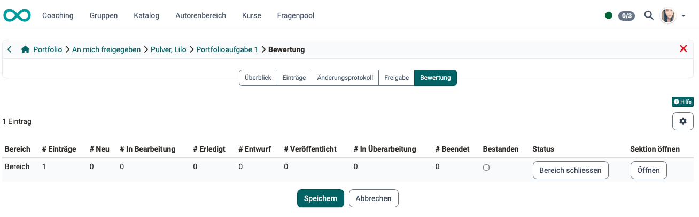
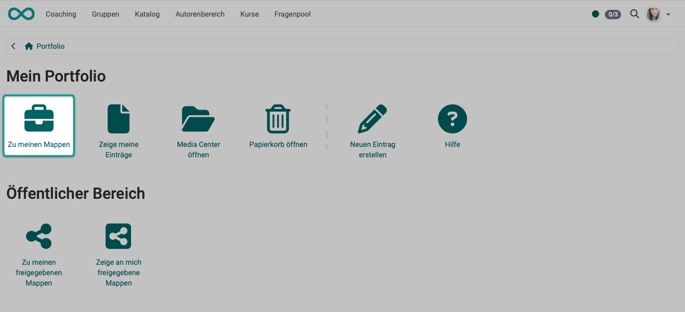
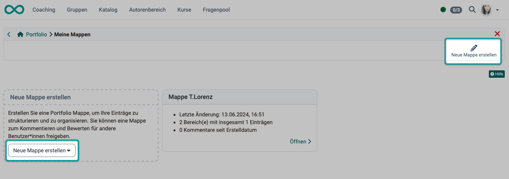
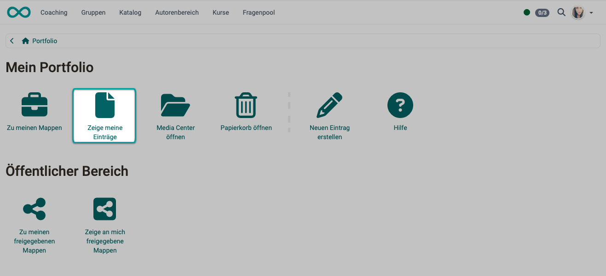
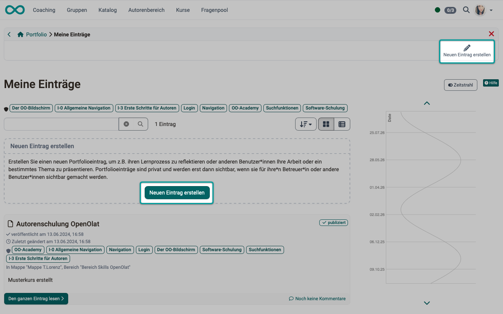

# How do I prepare the creation of personal portfolios by participants? {: #portfolio}

??? abstract "Goal and content of this guide"

    Are you planning for your course participants to create individual portfolios? Below you will learn which options OpenOlat offers you for this.

??? abstract "Target group"

    [x] Authors [x] Coaches  [x] Participants

    [x] Beginners [x] Advanced users  [ ] Experts

??? abstract "Expected prior knowledge"

    * ["How do I create my first OpenOlat course?"](../my_first_course/my_first_course.md) 

??? abstract "Terms briefly explained"

    | Term | German | Meaning |
    |---|---|---|
    | ePortfolio | ePortfolio | The module for portfolio work |
    | Binder | Mappe | The collection, divided into sections |
    | Section | Bereich | Chapter of a binder |
    | Entry | Eintrag | A page in a binder |
    | Assignment | Aufgabe | Task within a section (not the course element) |
    | Evaluation | Einschätzung | Completed form for an assignment |
    | Assessment | Bewertung | Points and pass/fail per section |
    | Sharing | Freigabe | Access rights to a binder |
    | Portfolio template | Portfoliovorlage | The binder (template) from which copies are created. It is stored as a learning resource in the author area. |

---

## What is a portfolio? {: #definition}

The **ePortfolio** is the OpenOlat module with which learners document their own learning processes, reflect on them and share them for feedback. Each person collects their work, evidence and reflections in a **binder**, structures it into **sections** and **entries**, and decides for themselves who may see which parts. Coaches and invited persons can comment on and assess shared content.

[General information about the portfolio >](../../manual_user/area_modules/Portfolio_General_Information.md) 

[Back to top ^](#portfolio)

---

### What is a portfolio used for? {: #purpose}

The portfolio makes a person's learning and competence progress visible over a longer period. The focus is not only on the result but on the path to it: learners document what they can do and how they achieved it. Typical usage scenarios are reflection tasks, internship and competence records, and the accompanying documentation of a course of education or training.

The system administration switches the module on or off under: 
`Administration > e-Assessment > ePortfolio`

Before you plan the creation of portfolios by participants, you should have developed a clear idea of what the portfolio is intended to achieve.

[Back to top ^](#portfolio)

---

### What can a portfolio contain? {: #content}

The individual portfolios can contain:

* self-created binders (independent of a specific course)
* self-created binders (in connection with a specific course)
* binders of other people that they have shared with me
* entries within the binders (text with inserted links, images, etc.)
* files attached to entries

[Components of the portfolio >](../../manual_user/area_modules/Components_of_the_portfolio.md) 
[The Portfolio Editor >](../../manual_user/area_modules/The_portfolio_editor_17_1.md) 

[Back to top ^](#portfolio)

---

### How is a portfolio structured? {: #structure}

A portfolio is structured hierarchically:

- **Binder**: the top-level collection in which a person organises their portfolio work.
- **Section**: a chapter of the binder, with title, summary and start and end date. There are no subsections.
- **Entry**: a page in a section, built with the Content Editor from text, images, videos, documents and forms. An entry answers an assignment or stands on its own.
- **Assignment**: a task in a section, specified by the portfolio template. The learner answers it with an entry.

[Back to top ^](#portfolio)

---

### Where do participants create their portfolio? {: #create}

Portfolios can be created

* in the "Portfolio task" course element within a course
* in the personal menu, in the section "User tools", menu item "Portfolio 2.0"
* if adjusted in the personal settings: via an icon in the main navigation instead of in the user tools

Creation always takes place in the [portfolio editor](../../manual_user/area_modules/The_portfolio_editor_17_1.md).

[Back to top ^](#portfolio)

---

## Where can portfolio content be viewed? {: #view}

### Where can participants view their own portfolio content? {: #participants}

All OpenOlat users find their own portfolio in the **personal menu**. When they open **Portfolio 2.0** there, each person reaches their own portfolio content:

- **My portfolio binders**: the list of all your own binders. New binders are created here: empty, from a template, from a portfolio task of a course or from existing entries.
- **My entries**: all your own entries in chronological order, independent of the binder, supplemented by the **timeline**.
- **Media Center**: the personal storage place for images, videos, documents and other media that can be embedded in entries.
- **Shared with me**: binders and entries that other people have shared. Coaches find the binders of their learners here.
- **Shared by me**: your own binders that you have opened up to others.
- **Trash**: deleted binders and entries that can be restored or permanently deleted.

[More about the personal menu >](../../manual_user/personal_menu/index.md) 
[Back to top ^](#portfolio)

---

### How and where can other people view the portfolio content? {: #others}

Via the **Sharing** tab of a binder, the owner grants access rights. They select course members, course coaches or course owners, or invite external people by email, and determine the shared sections and entries as well as the level: **read**, **comment** and/or **assess**. Whoever receives the right to assess automatically also has the right to comment.

Shared binders of other people can likewise be found by everyone in their personal menu under: 
`Portfolio 2.0 > Shared with me`

[Back to top ^](#portfolio)

---

### Where can coaches view and assess the portfolio content? {: #coaches}

Portfolio content created in a **course element** or course is also shown on the course elements. As a coach you select the course element and then the "Participants" tab. After selecting a participant, all entries and binders shared for assessment and commenting are displayed to you.

Another way to access it is via the **assessment tool**: `Course > Administration > Assessment tool`. There too you can choose the relevant course element and then the participant. After choosing a person, the same assessment and commenting options are available as when choosing a course element in the course menu.

In the **personal menu** too, coaches find the binders and entries to be assessed under `Portfolio 2.0 > Shared with me`. 
As a coach, select the binder of the desired person in the "Binders" tab and assess in the "Assessment" tab with points and pass/fail per **section**. Individual entries are not assessed, only commented on.

The result of an assessment flows into the course's assessment tool via the **Portfolio task** course element.

{ class="shadow lightbox" title="Assessment tab of a shared binder" }

!!! info "Important"

    Without sharing, even course coaches cannot see a binder collected from the course. Publishing and sharing are two separate steps.

[Back to top ^](#portfolio)

---

## How and where can a portfolio be prepared? {: #prepare_a_portfolio}

For preparing personal portfolios that your participants then fill in themselves, there are 3 ways in OpenOlat:

### Way 1: With a prepared portfolio template {: #create_with_template}

The usual "prepared" way runs via a portfolio template:

1. Create a portfolio template 
\- Create a new learning resource of type portfolio template: 
`Authoring > Create > Portfolio 2.0 template` 
\- Structure the template into sections 
\- Optionally define assignments per section. This gives participants concrete work assignments, for each of which they create an entry. 
\- If needed, set a start and an end date per section

2. Distribute the template to the participants 
To ensure all participants receive their own personal copies, embed the template in a course: 
\- Add the Portfolio task course element 
\- Select the portfolio template in the "Learning content" tab 
\- If needed, configure points and passed in the "Assessment" tab 
\- Publish the course and assign participants 

When a participant clicks **Collect portfolio task** in the course element, OpenOlat creates their personal binder from the template. They then fill it in independently and supplement it with entries.

### Way 2: Free portfolio without a template
Participants can also, on their own initiative, create an empty binder in their personal menu under "Portfolio 2.0" and structure it freely. Here, as a course owner, you do not prepare a template; you only set the framework in a set of instructions. This is suitable for open, self-directed tasks.

### Way 3: Free portfolio with a template
Alternatively, under "My portfolio binders", participants can also use **Create new binder** to create a binder based on a template, a binder for a portfolio task from a course or a binder from entries. Which kinds of binders participants may create themselves is defined by the system administration: `Administration > e-Assessment > ePortfolio`.

[More about the free portfolio >](../../manual_user/area_modules/My_portfolio_binders.md#individual-portfolio-binders) 
[Back to top ^](#portfolio)

---

## Creating a portfolio {: #create_a_portfolio}

### Creating a template {: #creating_a_template}

!!! info "Important"

    In the context of the portfolio there are two different templates that must not be confused:

    - **Portfolio template:** The entire binder that authors build in the **Portfolio 2.0 template** learning resource (sections with assignments, dates, settings). Everyone who collects the portfolio task or books the template receives their own copy. Changes to the template are synchronised into the copies.

    - **Template:** A single document or a form in the **template folder** of a binder, from which users create a new entry.

1. **Create the "Portfolio 2.0 template" learning resource:** 
`Authoring > Create > Portfolio 2.0 template`, assign a title and click **Create**.

2. **Design the template with "sections" and "assignments"** 
The structuring is done in sections. Sections cannot be divided into subsections.
Per section, the author creates assignments of type free text or form. 
[More about creating a portfolio template >](../../manual_user/learningresources/Portfolio_template_Creation.md)

3. **Central preparation settings:** 
`Authoring > "Title of the portfolio template" > Administration > Settings > Tab "Options"` 
Under **Portfolio template's options** you define what participants can later do in their binder: 
\- **Users are allowed to create new entries**: create their own, independent entries in addition to the predefined assignments (deactivated by default), 
\- **Users are allowed to delete binders**: delete their binder again, 
\- **Add template folder**: the binder receives a template folder with templates for new entries, 
\- **Templates mandatory for new entries**: only appears with a template folder; new entries are then created only from a template. 
[More about the setting options of portfolio templates >](../../manual_user/learningresources/Portfolio_template_Administration_and_editing.md)

4. **Distribute the template via the "Portfolio task" course element** 
\- `Course > Administration > Course editor > Course element "Portfolio task" > Tab "Learning content"`: assign a template or create a new one directly. 
\- For assessment, additionally configure the "Assessment" tab. 
\-  **Important**: Once participants have collected the template, it can no longer be exchanged. 
[More about the Portfolio task course element >](../../manual_user/learningresources/Course_Element_Portfolio_Task.md) 

5. **How participants get to their own binder** 
\- Participants click "Collect portfolio task" in the course. 
\- This creates a personal copy that appears in the personal menu under `Portfolio 2.0 > My portfolio binders` (with a red margin stripe and course note). 
\- Then they fill in the assignments and publish the entries. 
[More about the Portfolio task course element >](../../manual_user/learningresources/Course_Element_Portfolio_Task.md)

[Back to top ^](#portfolio)

---

### Creating a "Portfolio task" course element

Insert a new "Portfolio task" course element as usual under: 
`Course > Administration > Course editor > Insert course elements`

The "Portfolio task" course element distributes a portfolio template to the participants. With the **Collect portfolio task** step, each participant creates their own binder from it, which appears under **My portfolio binders** with the course name.

!!! info "Important"

    Once a person has collected it, the template can no longer be exchanged in the course element.

[Back to top ^](#portfolio)

---

### Creating a binder {: #creating_a_binder}

A binder can be created in these ways:

- empty,
- based on a **portfolio template**,
- for a portfolio task from a course,
- from existing entries,
- or by **collecting a portfolio task** directly in a course. Binders collected from a course carry a red margin stripe and the name of the course.

This is how you reach the buttons for creating:

- Open the personal menu.
- Click the menu item "Portfolio 2.0" there.
- Click the "Go to my binders" icon.

{ class="shadow lightbox" title="My portfolio start page" }

- Here you find the **Create new binder** button twice: at the top right and in the "Create new binder" box.

{ class="shadow lightbox" title="My binders page" }

[Back to top ^](#portfolio)

---

### Creating an entry {: #creating_an_entry}

The owner structures the binder into sections, first writes their entries as a **draft** and then **publishes** them. A published entry can no longer be edited, only commented on, until coaches request a revision.

Entries can be tagged with **categories** (freely chosen keywords for filtering and searching) and with **competences** (levels of a linked taxonomy).

- Open the personal menu.
- Click the menu item "Portfolio 2.0" there.
- Click the "Show my entries" icon.

{ class="shadow lightbox" title="My portfolio start page" }

- Here you find the **Create new entry** button twice: at the top right and in the "Create new entry" box.

{ class="shadow lightbox" title="My entries page" }

[Back to top ^](#portfolio)

---

### Commenting on an entry

Whether the option to comment on and assess a portfolio exists is determined by the person who owns the portfolio binder or entry. Only if the binder or entry has been shared can other people, including coaches, access it.

You find a detailed description of commenting and assessing here: 
[Commenting on and assessing a portfolio task >](../../manual_user/learningresources/Portfolio_assignment_Grading.md)

[Back to top ^](#portfolio)

---

### Assignments and evaluation

An assignment in a section is of one of these types:

- **Free text**: answered directly in the Content Editor.
- **Form**: filled in and produces an **evaluation**.

A **document** is not a type of assignment but a template in the template folder of the binder, from which users create a new entry.

For assignments of type form, the person assesses themselves (**self-evaluation**); depending on the setting, shared persons give an **external evaluation**, openly or anonymously. The analysis compares several evaluations with one another.

[Back to top ^](#portfolio)

---

## Checklist {: #checklist}

The checklist summarises the preparation steps of this guide.

1\. Preliminary considerations

- [x] Goal of the portfolio clarified (reflection, competence record, internship/training documentation)
- [x] Decided whether the portfolio should be created course-related or independently
- [x] Ensured that the **ePortfolio** module is activated in the system administration: `Administration > e-Assessment > ePortfolio`
- [x] Preparation way chosen:
    - [x] Way 1: with a prepared portfolio template
    - [x] Way 2: free portfolio without a template
    - [x] Way 3: free portfolio with a template

2\. Create a portfolio template (Way 1)

- [x] **«Portfolio 2.0 template»** learning resource created with a title: `Authoring > Create > Portfolio 2.0 template`
- [x] Template structured into **sections** (no subsections possible)
- [x] **Assignments** defined per section (free text or form)
- [x] Start and end date per section set if needed

3\. Settings of the template: `Portfolio template > Administration > Settings > Tab "Options"`

- [x] Defined whether participants may create their own, independent entries
- [x] Defined whether participants may delete their binder
- [x] Defined whether the binder receives a template folder
- [x] Defined whether new entries are created only from a template

4\. Distribute the template via the course

- [x] **«Portfolio task»** course element inserted: `Course > Administration > Course editor > Insert course elements`
- [x] Portfolio template assigned in the «Learning content» tab (or newly created)
- [x] For assessment: «Assessment» tab configured (points and passed)
- [x] Course published and participants assigned
- [x] Noted: after the first collection, the template can no longer be exchanged

5\. Ensure use by participants

- [x] Participants know how to **collect the portfolio task**
- [x] Personal copy appears in the personal menu under `Portfolio 2.0 > My portfolio binders`
- [x] Participants know the process: fill in assignments → write entries as a draft → publish

6\. Sharing and assessment

- [x] Participants know that they must share binders/sections via the **Sharing** tab
- [x] Access levels clarified: **read**, **comment**, **assess**
- [x] Noted: without sharing, even coaches cannot see the binder (publishing ≠ sharing)
- [x] Coaches know where assessment happens (course element, assessment tool or in the personal menu under `Portfolio 2.0 > Shared with me`)
- [x] Noted: assessment happens per **section** (points and pass/fail); individual entries are only commented on

[Back to top ^](#portfolio)

---

## Further information {: #further_information}

**Mentioned on this page** 
[How do I create my first OpenOlat course? >](../my_first_course/my_first_course.md) 
[Portfolio - General Information >](../../manual_user/area_modules/Portfolio_General_Information.md) 
[Components of the portfolio >](../../manual_user/area_modules/Components_of_the_portfolio.md) 
[The Portfolio Editor >](../../manual_user/area_modules/The_portfolio_editor_17_1.md) 
[Personal menu >](../../manual_user/personal_menu/index.md) 
[My portfolio binders >](../../manual_user/area_modules/My_portfolio_binders.md) 
[Portfolio template: Creation >](../../manual_user/learningresources/Portfolio_template_Creation.md) 
[Portfolio template: Administration and editing >](../../manual_user/learningresources/Portfolio_template_Administration_and_editing.md) 
[Course Element "Portfolio Task" >](../../manual_user/learningresources/Course_Element_Portfolio_Task.md) 
[Portfolio assignment: Grading >](../../manual_user/learningresources/Portfolio_assignment_Grading.md)

**Further reading** 
[Creating Portfolios >](../../manual_user/area_modules/Portfolio.md) 
[My entries >](../../manual_user/area_modules/My_entries.md) 
[Shared by me >](../../manual_user/area_modules/Shared_by_me.md) 
[Shared with me >](../../manual_user/area_modules/Shared_with_me.md) 
[Multiple use of entries >](../../manual_user/area_modules/Multiple_use_of_entries.md) 
[Competences tags >](../../manual_user/area_modules/Competences_tags.md) 
[Course Settings - Tab Assessment >](../../manual_user/learningresources/Course_Settings_Assessment.md) 
[Assessment tool - overview >](../../manual_user/learningresources/Assessment_tool_overview.md)

[Back to top ^](#portfolio)
