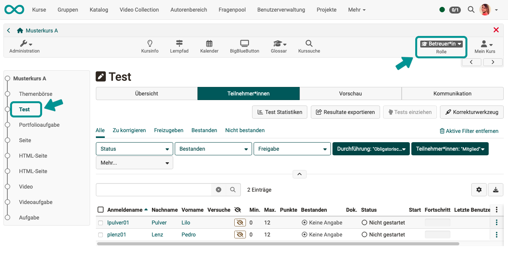
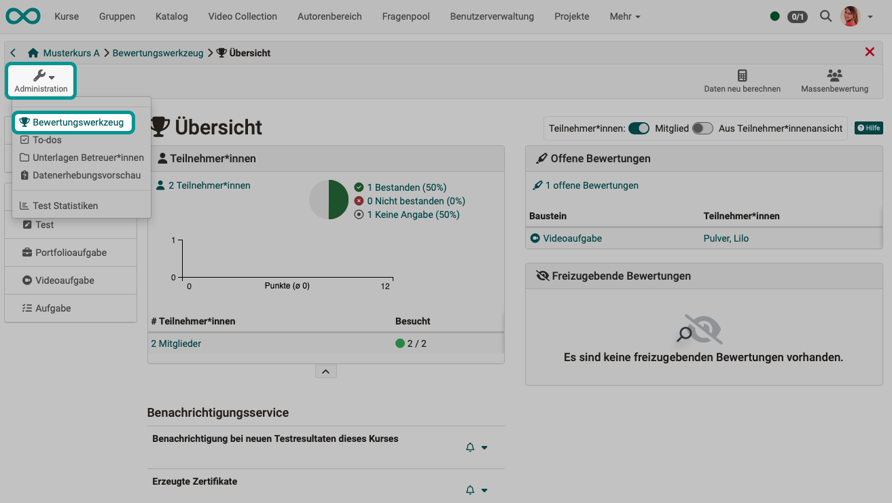
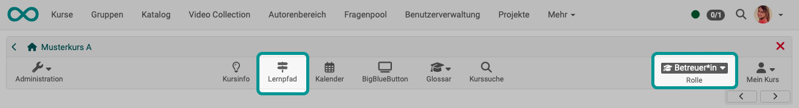
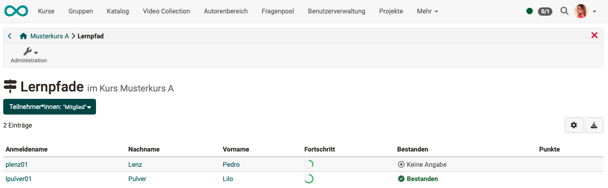
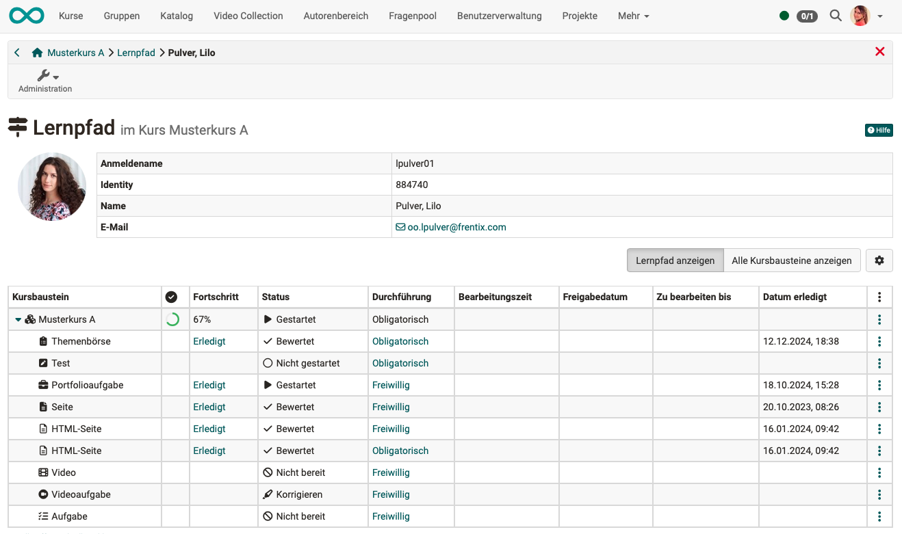
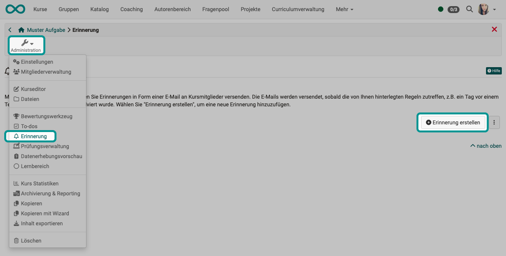
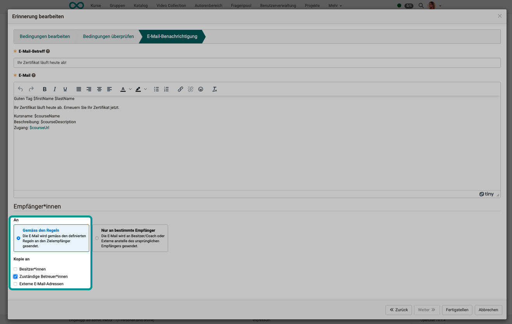
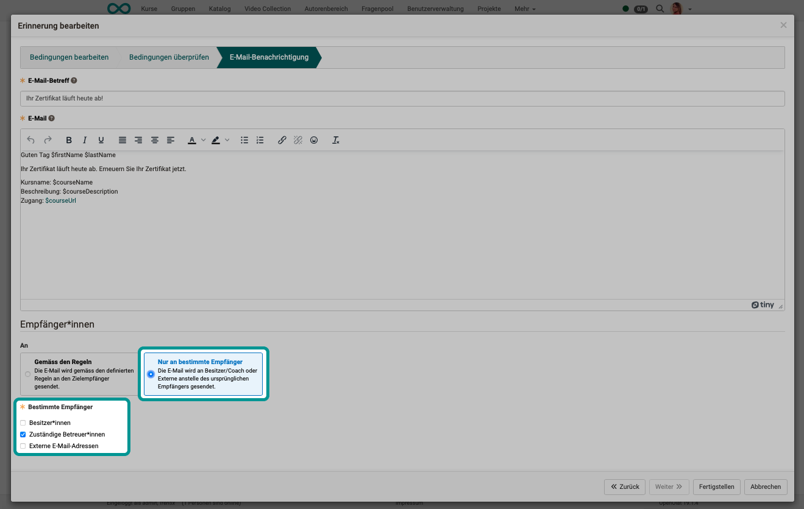

# Wie können Betreuer:innen über den Lernfortschritt der Kursteilnehmer:innen informiert werden? {: #progress_information}

??? abstract "Ziel und Inhalt dieser Anleitung"

    Die Anleitung zeigt Ihnen als Betreuer:in, an welchen Stellen Sie Informationen über den Lernfortschritt abrufen können, um die von Ihnen betreuten Personen optimal beraten und begleiten zu können. 

??? abstract "Zielgruppe"

    [ ] Autor:innen [x] Betreuer:innen  [ ] Teilnehmer:innen

    [x] Anfänger:innen [ ] Fortgeschrittene  [ ] Expert:innen

??? abstract "Erwartete Vorkenntnisse"

    * Grundkenntnisse über OpenOlat
    * (Zugang zu einem Kurs, in dem Sie Betreuer:in sind)

## A) Wahl eines Kursbausteins in der Betreuer:innen-Rolle {: #by_course_element}

Wenn Sie einen Kurs in der Rolle als Betreuer:in aufrufen, sehen Sie nach dem Anwählen eines bewertbaren Kursbausteins im Kursmenü eine andere Ansicht als die Teilnehmer:innen.

{ class="shadow lightbox" title="Kursbaustein Test in der Rolle Betreuer:in" }

Durch Klick auf den Namen eines/einer Teilnehmer:in (via Tab "Übersicht" oder Tab "Teilnehmer:innen") gelangen Sie direkt zu den Ergebnissen des/der Teilnehmer:in in diesem Kursbaustein.

[Zum Seitenanfang ^](#progress_information)

---

## B) Bewertungswerkzeug {: #by_assessment_tool}

Wenn Sie sich nicht nur für einen einzelnen Kursbaustein interessieren, sondern einen Überblick über die Leistungen im gesamten Kurs verschaffen möchten, ist das wichtigste Werkzeug der Betreuer:innen das [Bewertungswerkzeug](../../manual_user/learningresources/Assessment_tool_overview.de.md). Sie finden es unter: 
`Kurs > Administration > Bewertungswerkzeug`

{ class="shadow lightbox" title="Menü Administration des Kurses" }

[Zum Seitenanfang ^](#progress_information)

---

## C) Lernpfadwerkzeug {: #by_learning_path_tool}

!!! info "Wichtig"

    Das Icon "Lernpfad" wird in der Werkzeugleiste nur angezeigt, wenn Sie sich in einem [Lernpfadkurs](../../manual_user/learningresources/Learning_path_course.de.md) befinden.

Wenn ein/eine Teilnehmer:in das Lernpfadwerkzeug aufruft, werden nur die eigenen Ergebnisse sichtbar. Als Betreuer:in erhalten Sie Zugriff auf die Lernpfad-Informationen aller von Ihnen betreuten Teilnehmer:innen. 

{ class="shadow lightbox" title="Werkzeugleiste des Kurses" }

{ class="shadow lightbox" title="Seite Lernpfade nach Klick auf das Icon Lernpfad" }

Klicken Sie auf einen Namen, um den Lernpfad dieser Person anzuzeigen.

{ class="shadow lightbox" title="Lernpfad einer Person nach Klick auf ihren Namen" }

:octicons-device-camera-video-24: **Video-Einführung**: [Wie sehe ich den Lernfortschritt von mir betreuter Teilnehmer:innen?](<https://www.youtube.com/embed/VO7TyxN9EOA>){:target="_blank"}

[Zum Seitenanfang ^](#progress_information)

---

## D) Automatische Erinnerungen {: #by_reminders}

Die [Erinnerungsfunktion](../../manual_user/learningresources/Course_Reminders.de.md) wird meistens zum Versand von Mails an die Teilnehmer:innen verwendet. Sie kann aber auch zur Information der Betreuer:innen genutzt werden.

{ class="shadow lightbox" title="Seite Erinnerung des Kurses" }

**Beispiel 1: Automatische Mails an Kursteilnehmer:innen, cc an Betreuer:innen** 

Im letzten Schritt der Erstellung/Bearbeitung einer Erinnerung besteht die Möglichkeit, zusätzlich zum (durch Regeln definierten) Empfängerkreis die Betreuer:innen dazuzunehmen.

{ class="shadow lightbox" title="Schritt E-Mail-Benachrichtigung der Erinnerung" }

**Beispiel 2: Automatische Mail ausschliesslich an Betreuer:in** 

Eine Erinnerung, die gemäss definierter Regeln an bestimmte Empfänger geschickt würde, kann auch nur an Betreuer:innen zur Information geschickt werden. 

Z.B. könnte eine Erinnerung an diejenigen Teilnehmer:innen verschickt werden, die 2 Wochen nach Kursbeginn den Kurs noch nie aufgerufen haben. Für diese Erinnerung werden die Regeln so gewählt, dass der Empfängerkreis die etwas nachlässigen Teilnehmer:innen sind. Im letzten Schritt der Erinnerungserstellung wird dann aber "Nur an bestimmte Empfänger" ausgewählt und "Zuständige Betreuer:innen". Die Information über den noch nicht besuchten Kurs geht so dann nur an die Betreuer:innen.

{ class="shadow lightbox" title="Schritt E-Mail-Benachrichtigung der Erinnerung" }

!!! tip "Tipp"

    Im Text der Erinnerungsmails können auch Variablen verwendet werden. (Siehe [Variablen im E-Mail-Text von Erinnerungen](../../manual_user/learningresources/Course_Reminders.de.md#text).) Wenn die Erinnerung wie in Beispiel 2 nur an Betreuer:innen geht, nennen zwei Variablenpaare unterschiedliche Personen:

    * `$firstName` und `$lastName`: der Name der Betreuer:in, die die Mail erhält
    * `$firstNameAffectedUser` und `$lastNameAffectedUser`: der Name der Teilnehmer:in, für die die Bedingungen der Erinnerung erfüllt sind

[Zum Seitenanfang ^](#progress_information)

---

## Weiterführende Informationen {: #further_information}

[Bewertungswerkzeug - Übersicht >](../../manual_user/learningresources/Assessment_tool_overview.de.md) 
[Lernpfadkurs - Überblick >](../../manual_user/learningresources/Learning_path_course.de.md) 
[Erinnerungen >](../../manual_user/learningresources/Course_Reminders.de.md) 
[Lernende bewerten >](../../manual_user/learningresources/Assessment_of_learners.de.md) 
[Coaching - Übersicht >](../../manual_user/area_modules/Coaching.de.md)

**youtube** 
[Wie sehe ich den Lernfortschritt von mir betreuter Teilnehmer:innen?](<https://www.youtube.com/embed/VO7TyxN9EOA>)

[Zum Seitenanfang ^](#progress_information)
