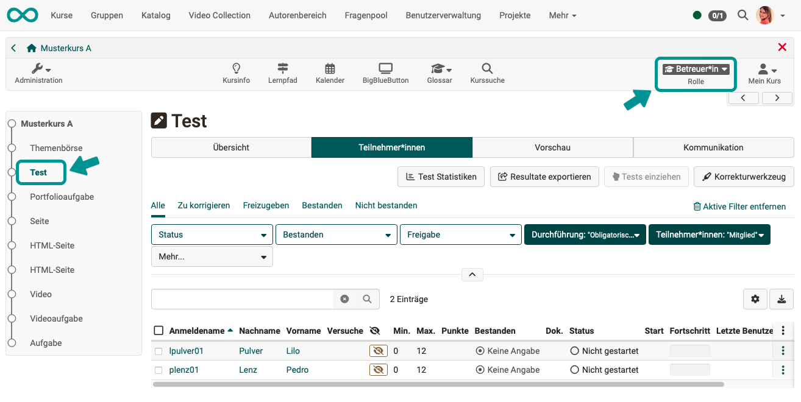
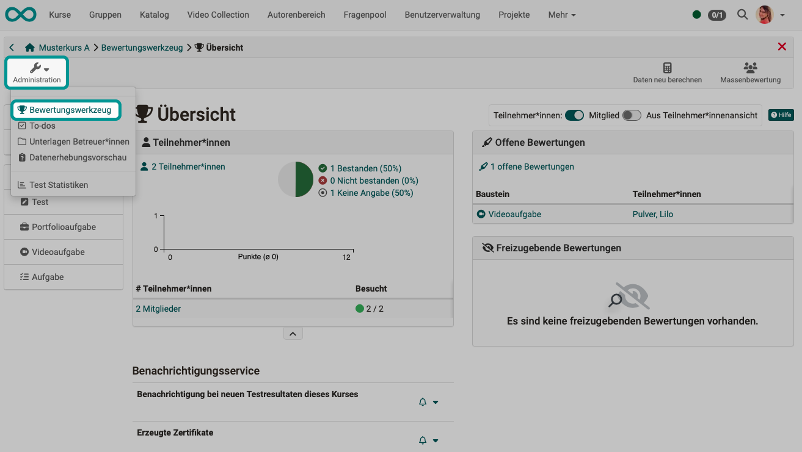
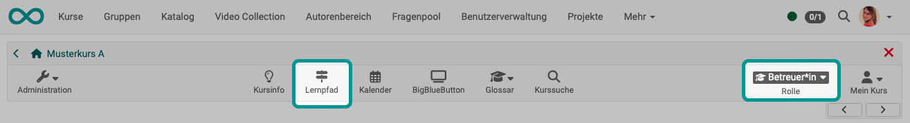
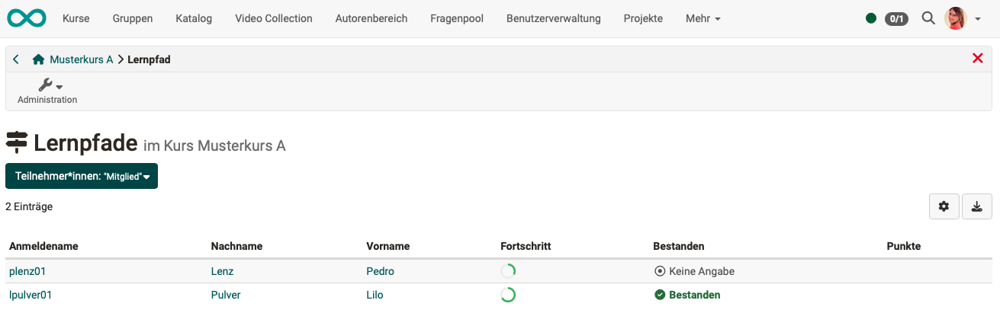
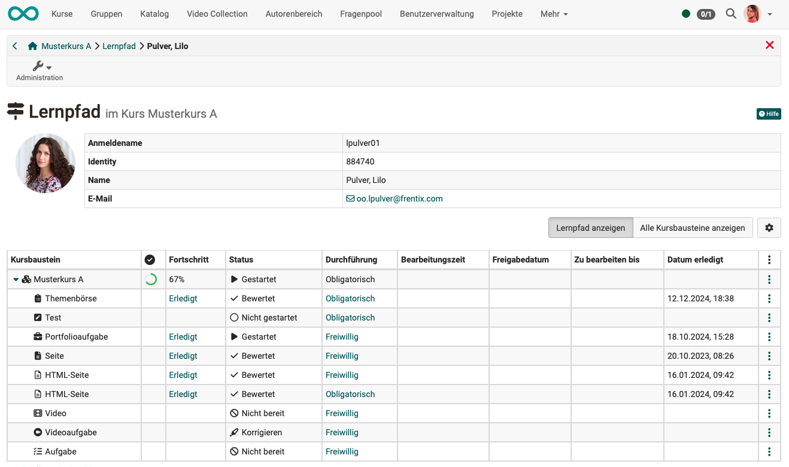
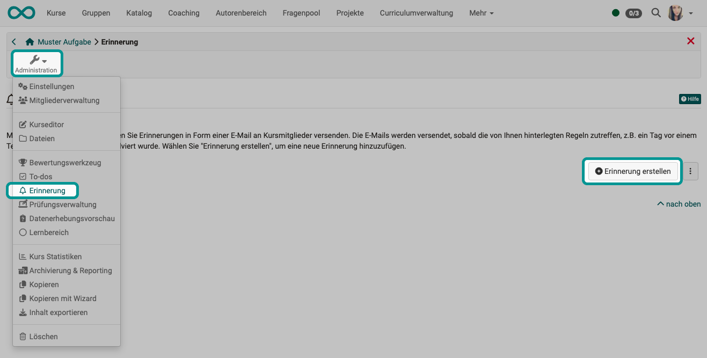
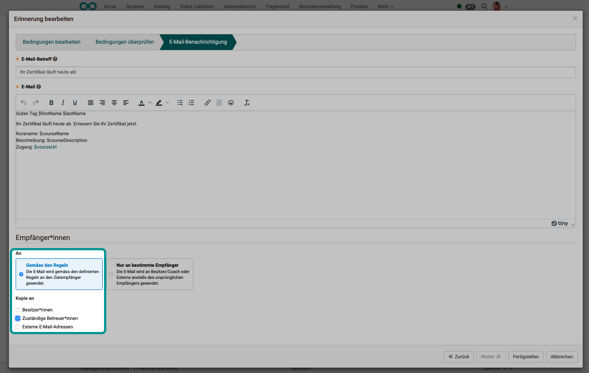
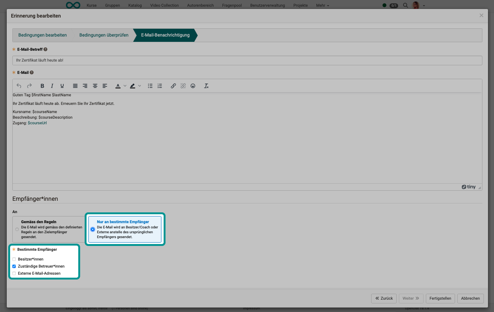

# How can coaches be informed about the learning progress of course participants? {: #progress_information}

??? abstract "Objectives and content of this instruction"

    The guide shows you as a coach where you can access information on learning progress in order to provide the best possible advice and support to the people you are looking after. 

??? abstract "Target group"

    [ ] Authors [x] Coaches  [ ] Participants

    [x] Beginners [ ] Amateurs  [ ] Experts

??? abstract "Expected previous knowledge"

    * Basic knowledge about OpenOlat
    * (Access to a course in which you are a coach)

## A) Selection of a course element as a coach {: #by_course_element}

If you call up a course in the role of coach, you will see a different view than the participants after selecting an assessable course element in the course menu.

{ class="shadow lightbox" }

By clicking on the name of a participant (via the "Overview" or "Participants" tab), you can go directly to the results of the participant in this course element.

[To the top of the page ^](#progress_information)

---

## B) Assessment tool {: #by_assessment_tool}

If you are not only interested in a single course element, but would like to get an overview of the performance of the entire course, the most important tool for coaches is the [Assessment tool ](../../manual_user/learningresources/Assessment_tool_overview.md). You can find it under Administration.

{ class="shadow lightbox" }

[To the top of the page ^](#progress_information)

---

## C) Learning path tool {: #by_learning_path_tool}

!!! info "Note"

    The "Learning path" icon is only displayed in the toolbar if you are in a [Learning path course](../../manual_user/learningresources/Learning_path_course.md).

When a participant accesses the learning path tool, only their own results are visible. As a coach, you have access to the learning path information of all the participants you coach. 

{ class="shadow lightbox" }

{ class="shadow lightbox" }

Click on a name to display the learning path of this person.

{ class="shadow lightbox" }

[To the top of the page ^](#progress_information)

---

## D) Automatic reminders {: #by_reminders}

The [reminder function](../../manual_user/learningresources/Course_Reminders.md) is mostly used to send e-mails to participants. However, it can also be used to inform coaches.

{ class="shadow lightbox" }

**Example 1: Automatic mails to course participants, cc to coaches** 

In the last step of creating/editing a reminder, it is possible to add coaches to the group of recipients (defined by rules).

{ class="shadow lightbox" }

**Example 2: Automatic mail only to coach** 

A reminder that would be sent to certain recipients according to defined rules can also only be sent to coaches for information. 

For example, a reminder could be sent to those participants who have never accessed the course 2 weeks after the start of the course. The rules for this reminder are chosen so that the recipients are the somewhat negligent participants. In the last step of the reminder creation, however, "Only to specific recipients" is selected and "Responsible coaches" is selected. The information about the course not yet attended is then only sent to the coaches.

{ class="shadow lightbox" }

!!! tip "Hint"

    Variables can also be used in the text of the reminder e-mails. (See [Variables in the e-mail text of reminders](../../manual_user/learningresources/Course_Reminders.md).) Various variables are available to distinguish between the recipients who were originally contacted and the (alternatively) informed coaches:

    $FirstName 
    $LastName 
    $recipientFirstName 
    $recipientLastName

[To the top of the page ^](#progress_information)

