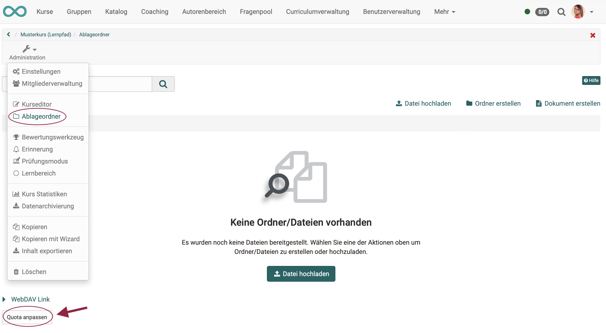
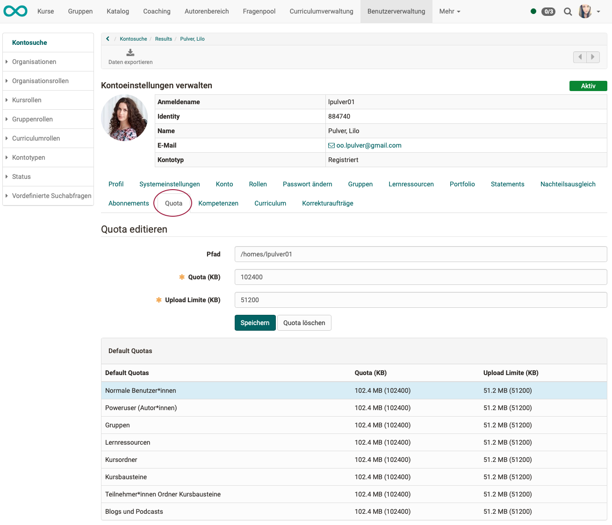
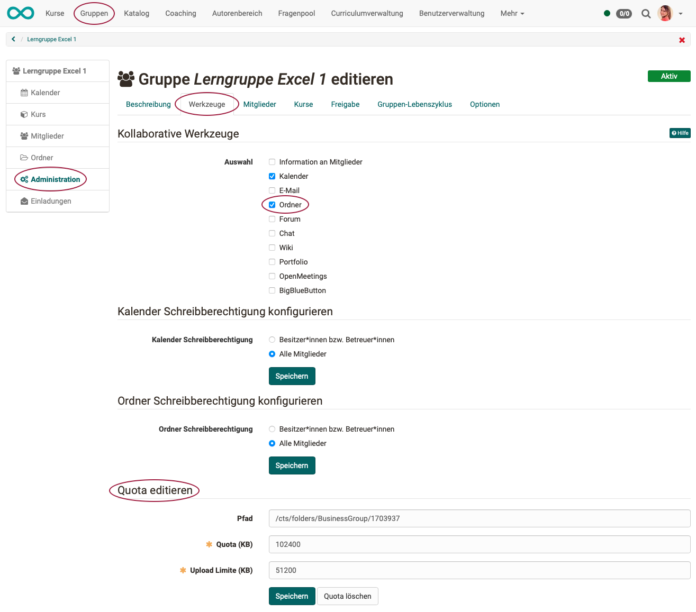
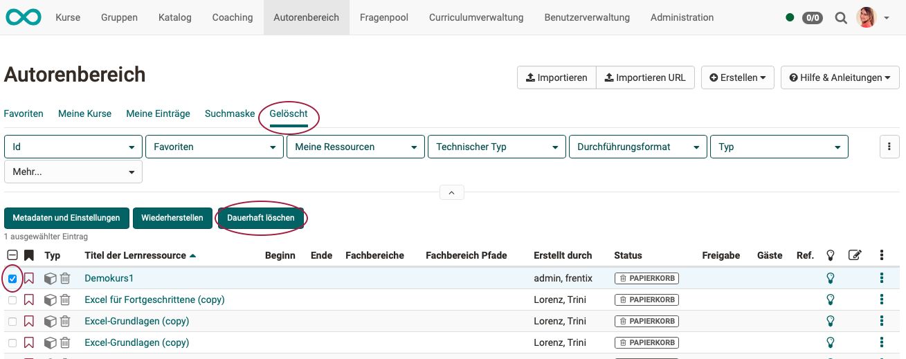
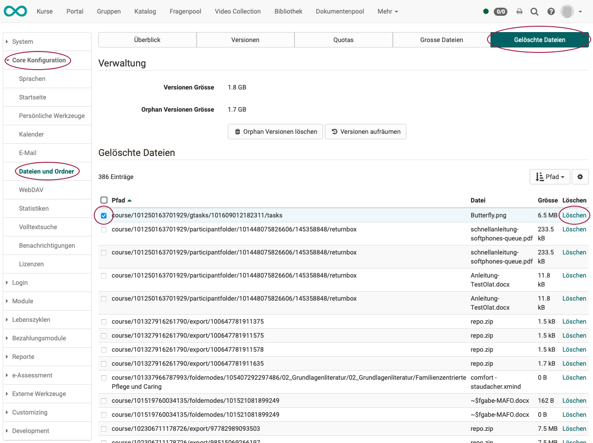
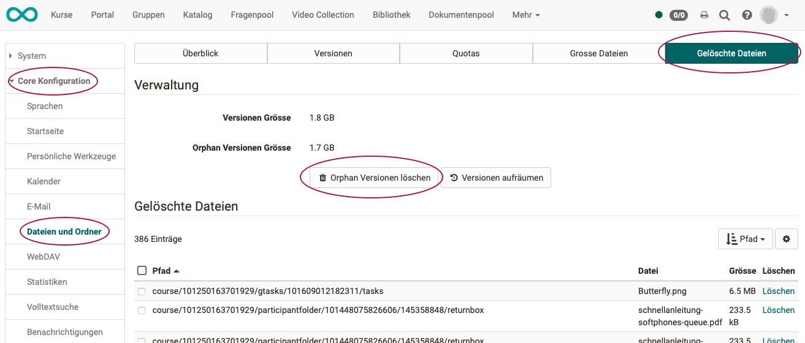
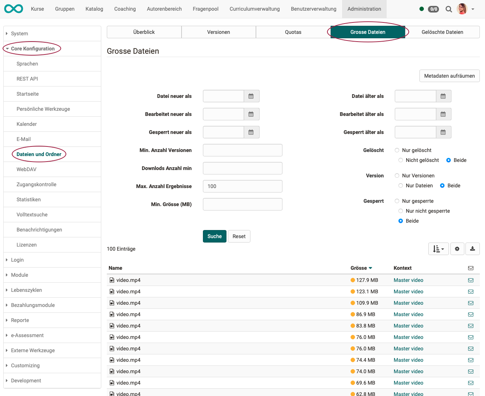

# Mit welchen Massnahmen kann ich den Speicherverbrauch reduzieren?

??? abstract "Ziel und Inhalt dieser Anleitung"

    Speicherplatz ist bei grossen Mengen ein Kostenfaktor. Ausserdem geht es darum, Ordnung zu halten. Unbegrenzter Speicherplatz verleitet zu unkontrolliertem Sammeln. Eine Begrenzung hilft dabei, Prioritäten zu setzen.

??? abstract "Zielgruppe"

    [ ] Autor:innen [ ] Betreuer:innen  [ ] Teilnehmer:innen  [x] Administrator:innen

    [ ] Anfänger:innen [x] Fortgeschrittene  [x] Experten/Expertinnen

??? abstract "Erwartete Vorkenntnisse"

    * Erfahrung als Administrator:in

### A) Speicherverbrauch bei der Entstehung einschränken
1) Quotas einrichten 
2) Versionierung einrichten 
3) Autoren betreuen 

### B) Unbenötigte Dateien löschen
4) Dateien endgültig löschen 
5) Orphans löschen 
6) grosse Dateien finden und löschen 
7) Lebenszyklen einrichten 

---

## Massnahme 1: Quotas einrichten

<h3>a) Was sind Quotas?</h3>

Durch Quotas kann die maximale Speichergröße und das Upload-Limit für bestimmte Pfade definiert und angepasst werden.

 

<h3> b) Wo und durch wen werden Quotas festgesetzt?</h3>

Grundsätzlich werden Quotas vom Administrator festgelegt. 
(**Administration > Core Konfiguration > Dateien und Ordner**) 
Im Einzelfall werden Quotas je nach betroffenem Bereich in den dortigen Werkzeugen eingestellt. 
Beispiel: Quota für Gruppenordner -> Administration der Gruppe 
Beispiel: Quota für bestimmte Benutzer -> Benutzerverwaltung

 

Einige Quotas können individuell von Benutzerinnen und Benutzern festgelegt werden.
Diese übersteuern den vom Administrator festgelegten Standardwert und gelten beispielsweise für

* den Kursbaustein "Ordner" in einem bestimmten Kurs einer bestimmten Autorin / eines bestimmten Autors. 
**Autorenbereich > Kurs wählen > Kurseditor > Kursbaustein vom Typ "Ordner" wählen > Tab "Ordnerkonfiguration" > Button "Ordner verwalten" > Button "Quota anpassen" am unteren Rand**
* den Ablageordner eines Kurses (Einstellung durch die Kursautorin / den Autor): 
**Autorenbereich > Kurs wählen > Administration > Ablageordner > Button "Quota anpassen" am unteren Rand**
{ class="shadow lightbox" }  

 

Die Quota für den persönlicher Ordner einer ganz bestimmten Benutzerin / eines Benutzers kann in der Benutzerverwaltung eingestellt werden (mit entsprechender Berechtigung als Benutzerverwalter): 
**Benutzerverwaltung > Benutzer wählen > Tab Quota**
{ class="shadow lightbox" }  

 

Die Quota für Gruppenordner wird in der Gruppenadministration eingestellt. Sie kann eingestellt werden, sobald ein Gruppenordner aktiviert wurde. 
**Gruppe > Administration > Tab "Werkzeuge" > Option "Ordner" > Bereich Quota wird eingeblendet**
{ class="shadow lightbox" }

 

Die meisten Quotas sowie die Standardwerte werden durch den Administrator eingerichtet unter 
**Administration > Core Konfiguration > Dateien und Ordner**

Mehr dazu finden Sie im Administrator-Handbuch unter 
["Dateien und Ordner"](../../manual_admin/administration/Files_and_Folders.de.md)

 

---

## Massnahme 2: Versionierung einrichten

<h3> a) Wie funktioniert die Versionierung?</h3>

OpenOlat kann zu allen Dokumenten (Word, Excel, HTML, Bilder, Videos, usw.) frühere Versionen aufbewahren.
Die maximale Anzahl der Versionen kann definiert werden.

Bei eingeschalteter Versionierung werden Dateien nicht überschrieben, sondern als neue Version (auch Revision genannt) angelegt. Ältere Versionen eines Dokumentes können heruntergeladen und bei Bedarf wiederhergestellt werden. Werden Dateien gelöscht, so erscheinen Sie in der Liste der gelöschten Dateien und können wiederhergestellt werden. Ist die Versionierungsfunktion eingeschaltet, so können Dateien auch gesperrt werden, z.B. wenn eine Person an einem Dokument arbeitet und verhindern möchte, dass eine andere Person zwischenzeitlich eine neue Version erstellt.

Die Versionierung ist in allen Ordnern des Systems vorhanden:

* persönliche Ordner
* Gruppenordner
* Kursordner
* Ressourcenordner 
* Kursbaustein "Ordner"

 

<h3> b) Wo und durch wen wird die Versionierung eingerichtet?</h3>

Die Versionierung wird vom Administrator eingestellt unter  
**Administration > Core Konfiguration > Dateien und Ordner**

 

<h3> c) Wie kann die Versionierung helfen, Speicherbedarf zu sparen?</h3>

Die Anzahl der gespeicherten Versionen kann angepasst werden. Wird jetzt beispielsweise von 5 Versionen auf 2 Versionen geändert, sind pro Dokument 3 Versionen überflüssig. Einmal gespeicherte Versionen werden jedoch nicht direkt gelöscht. Wenn Sie die Anzahl wieder auf 5 Versionen stellen, werden sie wieder sichtbar. Um jedoch diese Versionen ganz zu löschen, klicken Sie auf **Versionen aufräumen**. Anschliessend können die Versionen nicht mehr wiederhergestellt werden.

---

## Massnahme 3: Autoren betreuen

Wo mehrere Personen zusammenarbeiten, braucht es eine gewisse Organisation und Abstimmung der einzelnen Arbeiten. Das gilt auch für die Autorentätigkeit in OpenOlat.

**Beispiel:** 
OpenOlat bietet einen Fragenpool. Dort können Fragen gesammelt und mehrfach wiederverwendet werden. Das spart Arbeit, aber es braucht auch eine gewisse Koordination. In OpenOlat gibt es deshalb die Rolle des Poolverwalters. 
Es ist ratsam, dass er dafür sorgt, dass nicht nur neue Fragen erstellt werden, sondern auch die verschiedenen Entwürfe und Vorversionen (in Absprache mit den Autoren) wieder gelöscht werden.

**Beispiel:** 
Im Autorenbereich sammeln sich erfahrungsgemäss im Lauf der Zeit ebenfalls viele Entwurfs-Versionen von Kursen und Lernressourcen an, die eigentlich nicht mehr benötigt werden.
Gelegentliches Aufräumen sollte auch hier von einer verantwortlichen Person initiiert werden.

---

## Massnahme 4: Dateien endgültig löschen

Wenn Dateien in OpenOlat gelöscht werden, heisst das in vielen Fällen, dass sie zunächst in einen "Papierkorb" gelangen. Die Dateien können aus dem Papierkorb zurück geholt und wiederhergestellt werden. Erst wenn sie (nach nochmaliger Bestätigung) endgültig gelöscht werden, sind sie nicht mehr verfügbar.  

Der Speicherplatz wird bei Dateien "im Papierkorb" weiterhin benötigt. Erst das endgültige Löschen reduziert den benötigten Speicherplatz.

 

<h3> Löschen von Kursen/Lernressourcen</h3>

Werden im Autorenbereich Kurse oder Lernressourcen gelöscht, erscheinen sie nicht mehr unter "Meine Einträge", sondern im Tab "Gelöscht". (Dies entspricht dem Papierkorb und dem Schritt vor dem endgültigen Löschen.)
Sie sind dort nur noch für die jeweiligen Besitzer sichtbar und können nur durch sie wieder hergestellt werden.
Auch das endgültige Löschen kann in diesem Tab durch Markieren und Klick auf den **Button "Dauerhaft löschen"** vorgenommen werden.

{ class="shadow lightbox" }

 

<h3> Endgültiges Löschen durch den Administrator</h3>

Administratoren können das endgültige Löschen in bestimmten Pfaden vornehmen. Es muss also nicht der gesamte "Papierkorb" komplett endgültig gelöscht werden. 
**Administration > Core Konfiguration > Dateien und Ordner < Tab "Gelöschte Dateien" > Zeile selektieren > Option "Löschen" am Ende der Zeile** 
Ein Klick auf "Löschen" am Ende der Zeile meint hier also das endgültige Löschen der zum Löschen markierten Dateien (Dateien im "Papierkorb").

{ class="shadow lightbox" }

 

<h3> Löschen im persönlichen Ordner</h3>

Für das endgültige Löschen von Dateien im persönlichen Ordner ist jeder selbst verantwortlich. Es erscheint eine Abfrage zur Bestätigung. Darauf hin werden die Dateien endgültig gelöscht. (Ein Papierkorb ist hier im Moment noch nicht implementiert.)

---

## Massnahme 5: Orphan Versionen löschen

<h3> a) Was sind Orphans?</h3>
Der Begriff Orphans kommt aus dem Griechischen und bedeutet "Waisen". Im Zusammenhang mit OpenOlat sind damit "verwaiste" Dateien gemeint.

Alle Dokumente, welche manuell gelöscht werden oder für welche keine Versionierung mehr zur Verfügung steht, werden in eine Art Papierkorb gelegt. Von dort könnten sie wiederhergestellt werden, benötigen jedoch auch nach wie vor dieselbe Speichermenge. Mit "Orphan Versionen löschen" wird dieser Papierkorb gelöscht. Die Versionen können nicht mehr wiederhergestellt werden, benötigen aber auch keinen Speicher mehr.

 

<h3> b) Wo und durch wen werden Orphans gelöscht?</h3>

Das Löschen von Orphans wird vom Administrator vorgenommen unter  
**Administration > Core Konfiguration > Dateien und Ordner < Tab "Gelöschte Dateien" > Button "Orphan Versionen löschen"**

{ class="shadow lightbox" }

---

## Massnahme 6: Grosse Dateien

Manche Dateiformate (z.B. Videos) benötigen generell mehr Speicherplatz. Deshalb ist es hier besonders lohnend, wenn nicht mehr benötigte Versionen gelöscht werden. OpenOlat bietet ein Hilfsmittel dazu an:

Unter **Administration > Core Konfiguration > Dateien und Ordner > Tab "Grosse Dateien"** 
können Administratoren gezielt nach grossen Dateien suchen und sich weitere Details zu diesen Dateien anzeigen lassen. Dieser Überblick ist sehr hilfreich und hilft beim Aufräumen, bzw. beim Entscheiden, welche Dateien gelöscht werden sollten.

{ class="shadow lightbox" }

---

## Massnahme 7: Lebenszyklen

In OpenOlat kann ein Lebenszyklusmanagement aktiviert werden für

* **Gruppen-Lifecycle**
* **Kurs-Lifecycle**
* **Benutzer-Lifecycle**

OpenOlat überwacht, ob eine Gruppe bzw. ein Kurs länger nicht benutzt wurde oder ein Benutzer lange nicht aktiv war. Nach vorgegebenen Kriterien verschickt es eine Meldung, die erst eine Reaktion und dann z.B. manuelles Löschen ermöglicht. Oder OpenOlat löscht ggf. auch automatisch nach eingestellten Kriterien.

Ausführliche Informationen zum Lebenszyklusmanagement finden Sie unter 
["Wie manage ich Lebenszyklen von Gruppen, Kursen oder Benutzerkonten?"](../lifecycle/lifecycle.de.md)

---

## Checkliste

- [x] tbd