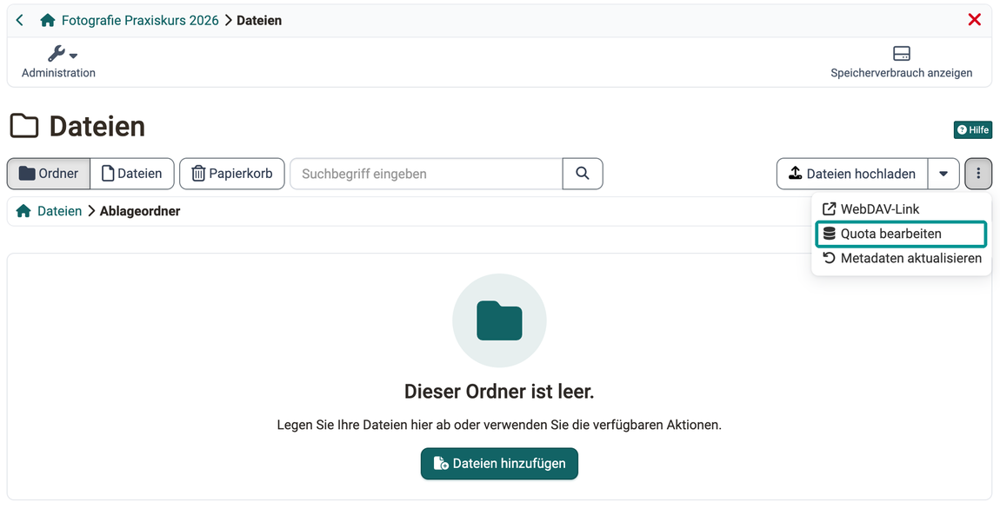
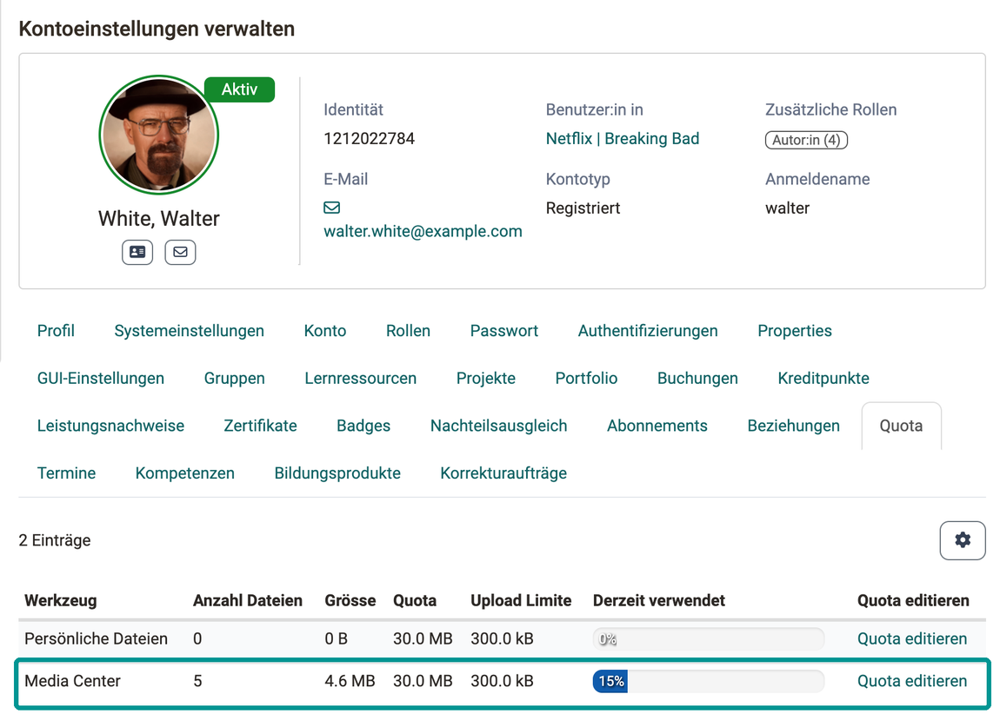
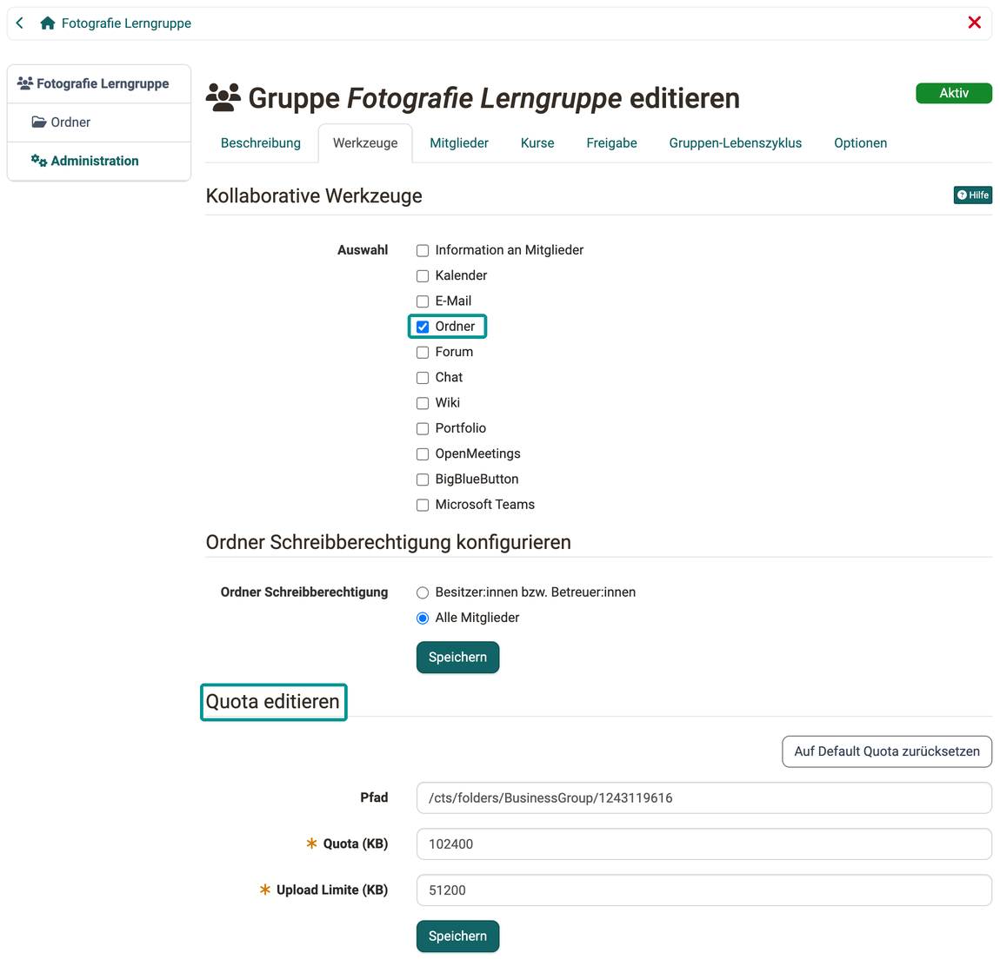
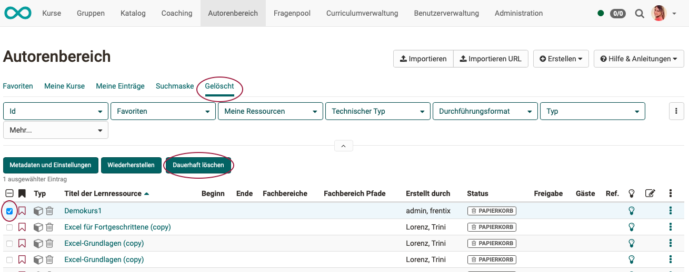
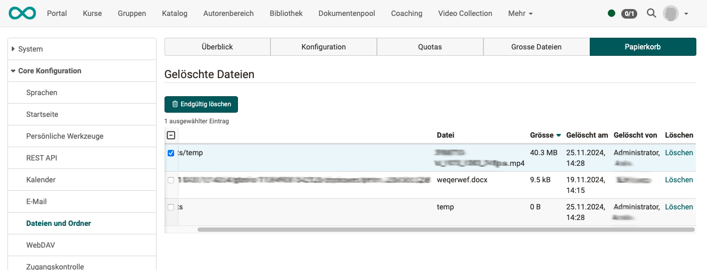
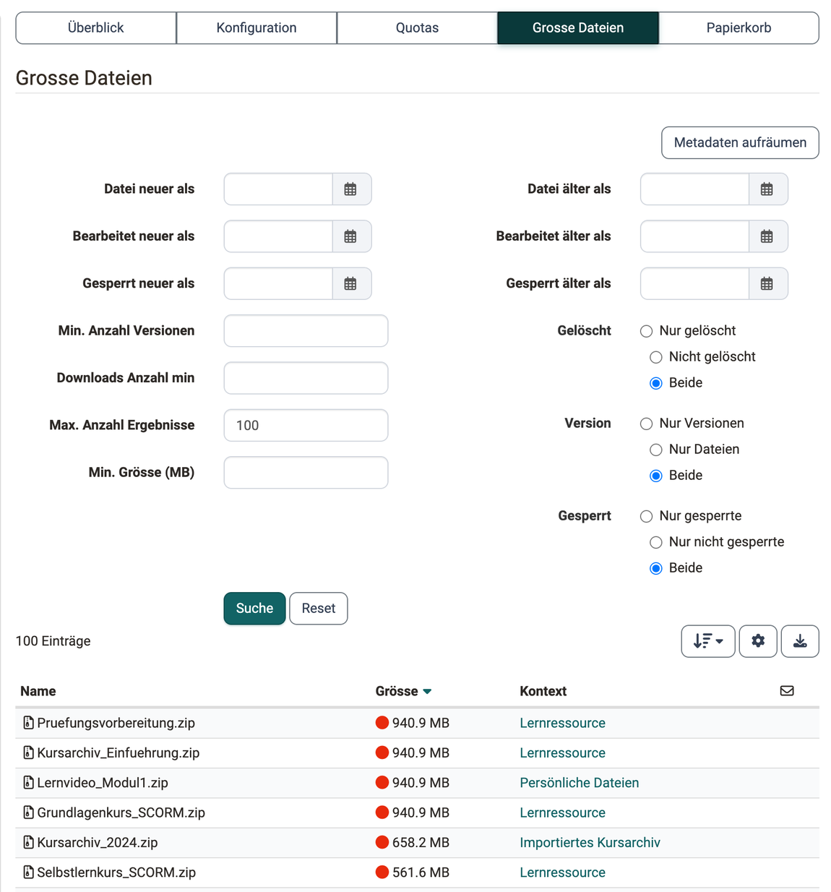

# Mit welchen Massnahmen kann ich den Speicherverbrauch reduzieren? {: #reduce_storage_consumption}

??? abstract "Ziel und Inhalt dieser Anleitung"

    Speicherplatz ist bei grossen Mengen ein Kostenfaktor. Ausserdem geht es darum, Ordnung zu halten. Unbegrenzter Speicherplatz verleitet zu unkontrolliertem Sammeln. Eine Begrenzung hilft dabei, Prioritäten zu setzen.

??? abstract "Zielgruppe"

    [ ] Autor:innen [ ] Betreuer:innen  [ ] Teilnehmer:innen  [x] Administrator:innen

    [ ] Anfänger:innen [x] Fortgeschrittene  [x] Experten/Expertinnen

??? abstract "Erwartete Vorkenntnisse"

    * Erfahrung als Administrator:in

### A) Speicherverbrauch bei der Entstehung einschränken
1) Quotas einrichten 
2) Versionierung einrichten 
3) Autor:innen betreuen 

### B) Unbenötigte Dateien löschen
4) Dateien endgültig löschen 
5) grosse Dateien finden und löschen 
6) Lebenszyklen einrichten 

---

## Massnahme 1: Quotas einrichten

<h3>a) Was sind Quotas?</h3>

Durch Quotas kann die maximale Speichergrösse und das Upload-Limit für bestimmte Pfade definiert und angepasst werden.

 

<h3> b) Wo und durch wen werden Quotas festgesetzt?</h3>

Grundsätzlich werden die Quotas in der System-Administration festgelegt, unter: 
`Administration > Core Konfiguration > Dateien und Ordner` 
Im Einzelfall werden Quotas je nach betroffenem Bereich in den dortigen Werkzeugen eingestellt. 
Beispiel: Quota für Gruppenordner -> Administration der Gruppe 
Beispiel: Quota für bestimmte Benutzer:innen -> Benutzerverwaltung

 

Eine Quota für einen einzelnen Ordner übersteuert den Standardwert der System-Administration. Ändern können sie nur Personen mit einer administrativen Rolle: Administrator:innen und Systemadministrator:innen, bei Kursen zusätzlich Lernressourcenverwalter:innen, bei Gruppenordnern Gruppenverwalter:innen, bei den persönlichen Dateien und dem Media Center einer Person Rollenverwalter:innen und Benutzerverwalter:innen. Kursbesitzer:innen ohne eine solche Rolle sehen die Quota in der Auswertung Speicherverbrauch, können sie aber nicht ändern.

Eine eigene Quota lässt sich beispielsweise an diesen Orten einstellen:

* für den Kursbaustein "Ordner", wenn als Ablageort "Automatisch generierter Ordner" gewählt ist: 
`Kurs > Administration > Kurseditor > Kursbaustein "Ordner" > Tab "Ordnerkonfiguration" > Button "Ordner verwalten" > Menü mit den drei Punkten > "Quota bearbeiten"`
* für den Ablageordner eines Kurses: 
`Kurs > Administration > Dateien > Ablageordner > Menü mit den drei Punkten > "Quota bearbeiten"`
{ class="shadow lightbox" }
* für alle Ordner eines Kurses mit eigener Quota in einer einzigen Übersicht, darunter auch den Kursbaustein "Teilnehmer:innen Ordner". Die Auswertung Speicherverbrauch zeigt, wie viel Speicher jeder Ordner belegt, und trägt in diesen Zeilen die Aktion "Quota anpassen": 
`Kurs > Administration > Dateien > Speicherverbrauch anzeigen > Aktion "Quota anpassen"`

 

Die Quotas für die persönlichen Dateien und das Media Center einer bestimmten Benutzer:in stellen Administrator:innen, Rollenverwalter:innen und Benutzerverwalter:innen in der Benutzerverwaltung ein. Der Tab "Quota" führt dafür zwei Zeilen, "Persönliche Dateien" und "Media Center", je mit der Aktion "Quota editieren": 
`Benutzerverwaltung > "Benutzername" > Tab "Quota" > Aktion "Quota editieren"`

{ class="shadow lightbox" }

Was die beiden Zeilen zeigen und wann eine eigene Quota den Standardwert übersteuert, beschreibt der Abschnitt [Quota](../../manual_admin/usermanagement/Configure_User.de.md#quota) im Administrationshandbuch.

 

Die Quota für Gruppenordner wird in der Gruppenadministration eingestellt. Sie kann eingestellt werden, sobald ein Gruppenordner aktiviert wurde. 
`Gruppe > Administration > Tab "Werkzeuge" > Option "Ordner" > Bereich "Quota editieren"`
{ class="shadow lightbox" }

 

Keine eigene Quota haben die Kursbausteine "Forum", "Dateidiskussion", "Aufgabe", "Gruppenaufgabe", "Seite" und "Themenbörse". Ihr Verbrauch erscheint in der Auswertung Speicherverbrauch unter dem Filter "Intern ohne Quota", eine Grenze lässt sich für sie nicht einstellen. Wie die Auswertung aufgebaut ist, beschreibt die Kurs-Administration im Abschnitt ["Speicherverbrauch"](../../manual_user/learningresources/Administration.de.md#storage_usage).

 

Die meisten Quotas richten Administrator:innen und Systemadministrator:innen ein, die Standardwerte nur Systemadministrator:innen. Beides geschieht in der System-Administration unter: 
`Administration > Core Konfiguration > Dateien und Ordner`

Mehr dazu finden Sie im Administrationshandbuch unter: 
["Dateien und Ordner"](../../manual_admin/administration/Files_and_Folders.de.md)

 

---

## Massnahme 2: Versionierung einrichten

<h3> a) Wie funktioniert die Versionierung?</h3>

OpenOlat kann zu allen Dokumenten (Word, Excel, HTML, Bilder, Videos, usw.) frühere Versionen aufbewahren.
Die maximale Anzahl der Versionen kann definiert werden.

Bei eingeschalteter Versionierung werden Dateien nicht überschrieben, sondern als neue Version (auch Revision genannt) angelegt. Ältere Versionen eines Dokumentes können heruntergeladen und bei Bedarf wiederhergestellt werden. Werden Dateien gelöscht, so erscheinen sie in der Liste der gelöschten Dateien und können wiederhergestellt werden. Ist die Versionierungsfunktion eingeschaltet, so können Dateien auch gesperrt werden, z.B. wenn eine Person an einem Dokument arbeitet und verhindern möchte, dass eine andere Person zwischenzeitlich eine neue Version erstellt.

Die Versionierung ist in allen Ordnern des Systems vorhanden:

* "Persönliche Dateien"
* Gruppenordner
* Kursordner
* Ressourcenordner 
* Kursbaustein "Ordner"

 

<h3> b) Wo und durch wen wird die Versionierung eingerichtet?</h3>

Die Versionierung stellen Administrator:innen in der System-Administration ein, unter: 
`Administration > Core Konfiguration > Dateien und Ordner`, Tab "Konfiguration"

 

<h3> c) Wie kann die Versionierung helfen, Speicherbedarf zu sparen?</h3>

Die Anzahl der gespeicherten Versionen kann angepasst werden. Wird jetzt beispielsweise von 5 Versionen auf 2 Versionen geändert, sind pro Dokument 3 Versionen überflüssig. Einmal gespeicherte Versionen werden jedoch nicht direkt gelöscht. Wenn Sie die Anzahl wieder auf 5 Versionen stellen, werden sie wieder sichtbar. Um jedoch diese Versionen ganz zu löschen, klicken Sie auf **Versionen aufräumen**. Anschliessend können die Versionen nicht mehr wiederhergestellt werden.

---

## Massnahme 3: Autor:innen betreuen

Wo mehrere Personen zusammenarbeiten, braucht es eine gewisse Organisation und Abstimmung der einzelnen Arbeiten. Das gilt auch für die Autorentätigkeit in OpenOlat.

**Beispiel:** 
OpenOlat bietet einen Fragenpool. Dort können Fragen gesammelt und mehrfach wiederverwendet werden. Das spart Arbeit, aber es braucht auch eine gewisse Koordination. In OpenOlat gibt es deshalb die Rolle Poolverwalter:in. Es ist ratsam, dass Poolverwalter:innen dafür sorgen, dass nicht nur neue Fragen erstellt werden, sondern auch die verschiedenen Entwürfe und Vorversionen (in Absprache mit den Autor:innen) wieder gelöscht werden.

**Beispiel:** 
Im Autorenbereich sammeln sich erfahrungsgemäss im Lauf der Zeit ebenfalls viele Entwurfs-Versionen von Kursen und Lernressourcen an, die eigentlich nicht mehr benötigt werden.
Gelegentliches Aufräumen sollte auch hier von einer verantwortlichen Person initiiert werden.

---

## Massnahme 4: Dateien endgültig löschen

Wenn Dateien in OpenOlat gelöscht werden, heisst das in vielen Fällen, dass sie zunächst in einen "Papierkorb" gelangen. Die Dateien können aus dem Papierkorb zurück geholt und wiederhergestellt werden. Erst wenn sie (nach nochmaliger Bestätigung) endgültig gelöscht werden, sind sie nicht mehr verfügbar.  

Der Speicherplatz wird bei Dateien "im Papierkorb" weiterhin benötigt. Erst das endgültige Löschen reduziert den benötigten Speicherplatz.

 

<h3> Löschen von Kursen/Lernressourcen</h3>

Werden im Autorenbereich Kurse oder Lernressourcen gelöscht, erscheinen sie nicht mehr unter "Meine Einträge", sondern im Tab "Gelöscht". (Dies entspricht dem Papierkorb und dem Schritt vor dem endgültigen Löschen.)
Sie sind dort nur noch für die jeweiligen Besitzer:innen sichtbar und können nur durch sie wieder hergestellt werden.
Auch das endgültige Löschen kann in diesem Tab durch Markieren und Klick auf den **Button "Dauerhaft löschen"** vorgenommen werden.

{ class="shadow lightbox" }

 

<h3> Endgültiges Löschen durch Administrator:innen</h3>

Administrator:innen können das endgültige Löschen in bestimmten Pfaden vornehmen. Es muss also nicht der gesamte "Papierkorb" komplett endgültig gelöscht werden. Sie finden die Dateien in der System-Administration unter: 
`Administration > Core Konfiguration > Dateien und Ordner > Tab "Papierkorb" > Zeile selektieren > Option "Löschen" am Ende der Zeile` 
Ein Klick auf "Löschen" am Ende der Zeile meint hier also das endgültige Löschen der zum Löschen markierten Dateien (Dateien im "Papierkorb").

{ class="shadow lightbox" }

 

<h3> Löschen in den persönlichen Dateien</h3>

Für das endgültige Löschen von Dateien in den "Persönlichen Dateien" im File Hub ist jede Person selbst verantwortlich. Es erscheint eine Abfrage zur Bestätigung. Darauf hin werden die Dateien endgültig gelöscht. 

---

## Massnahme 5: Grosse Dateien

Manche Dateiformate (z.B. Videos) benötigen generell mehr Speicherplatz. Deshalb ist es hier besonders lohnend, wenn nicht mehr benötigte Versionen gelöscht werden. OpenOlat bietet ein Hilfsmittel dazu an:

Administrator:innen können in der System-Administration gezielt nach grossen Dateien suchen und sich weitere Details zu diesen Dateien anzeigen lassen, unter: 
`Administration > Core Konfiguration > Dateien und Ordner > Tab "Grosse Dateien"`

Dieser Überblick ist sehr hilfreich und hilft beim Aufräumen, bzw. beim Entscheiden, welche Dateien gelöscht werden sollten.

{ class="shadow lightbox" }

---

## Massnahme 6: Lebenszyklen

Lebenszyklen richten Sie in der System-Administration ein, unter: 
`Administration > Lebenszyklen`

Dort gibt es je einen Eintrag für:

* **Gruppen**
* **Kurse**
* **Konto**

OpenOlat überwacht, ob eine Gruppe bzw. ein Kurs länger nicht benutzt wurde oder eine Benutzer:in lange nicht aktiv war. Nach vorgegebenen Kriterien verschickt es eine Meldung, die erst eine Reaktion und dann z.B. manuelles Löschen ermöglicht. Oder OpenOlat löscht ggf. auch automatisch nach eingestellten Kriterien.

Ausführliche Informationen zum Lebenszyklusmanagement finden Sie unter 
["Wie manage ich Lebenszyklen von Gruppen, Kursen oder Benutzerkonten?"](../lifecycle/lifecycle.de.md)

---

## Checkliste

- [x] Quotas eingerichtet?
- [x] Versionierung eingerichtet?
- [x] Autor:innen auf Quota hingewiesen?
- [x] Nach grossen Dateien gesucht und in Absprache mit den Besitzer:innen nicht mehr benötigte gelöscht? 
- [x] Alle Benutzer:innen zum Aufräumen ihrer persönlichen Dateien aufgefordert? 
- [x] Lebenszyklen eingerichtet?

---

## Weiterführende Informationen {: #further_information}

**Auf dieser Seite erwähnt** 
[Konto konfigurieren >](../../manual_admin/usermanagement/Configure_User.de.md) 
[Kurs-Administration: Übersicht >](../../manual_user/learningresources/Administration.de.md) 
[Dateien und Ordner >](../../manual_admin/administration/Files_and_Folders.de.md) 
["Wie manage ich Lebenszyklen von Gruppen, Kursen oder Benutzerkonten?" >](../lifecycle/lifecycle.de.md)

**Weiterführend** 
[Ablageordner >](../../manual_user/learningresources/Storage_folder.de.md) 
[Kursbaustein "Ordner" >](../../manual_user/learningresources/Course_Element_Folder.de.md) 
[Kursbaustein "Teilnehmer:innen Ordner" >](../../manual_user/learningresources/Course_Element_Participant_Folder.de.md) 
[Media Center: Konzept >](../../manual_user/basic_concepts/Media_Center_Concept.de.md)

[Zum Seitenanfang ^](#reduce_storage_consumption)
