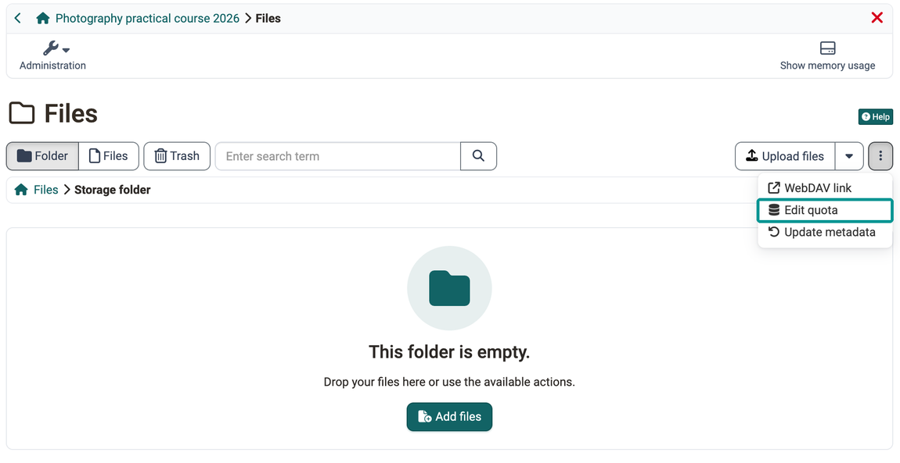
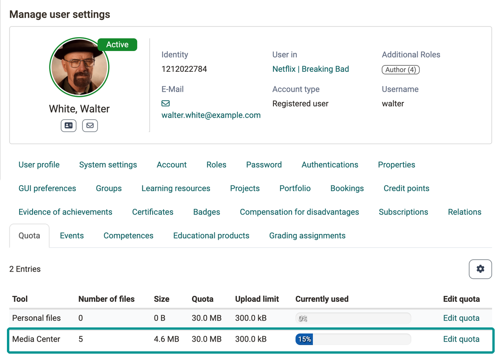
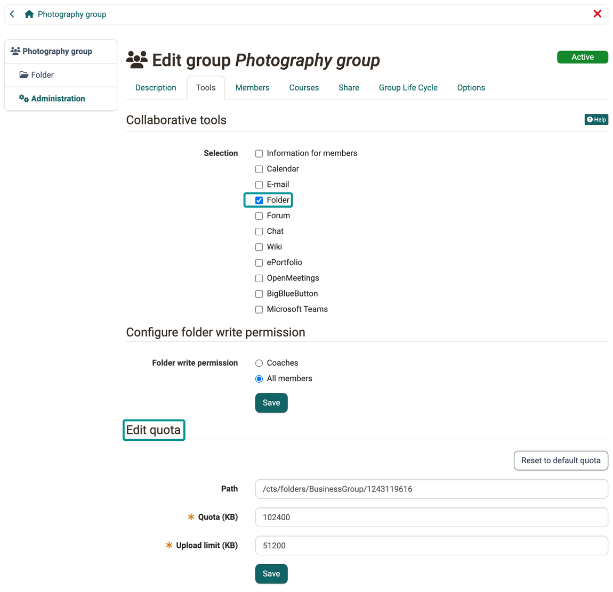
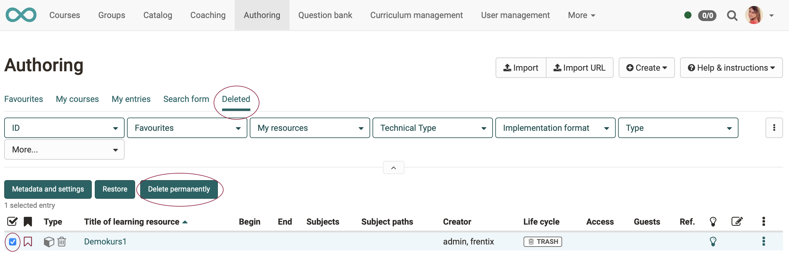
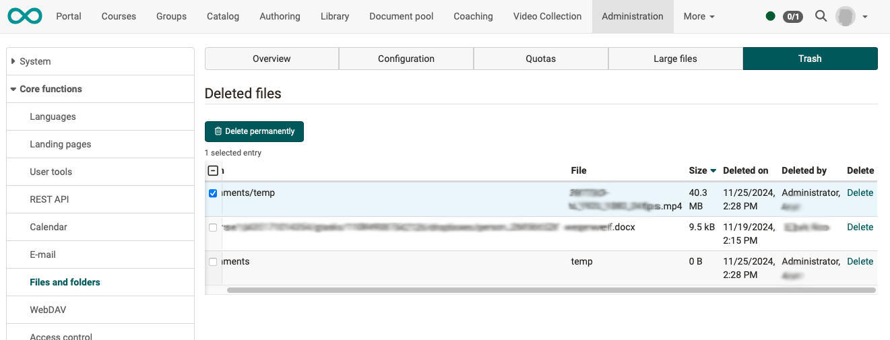
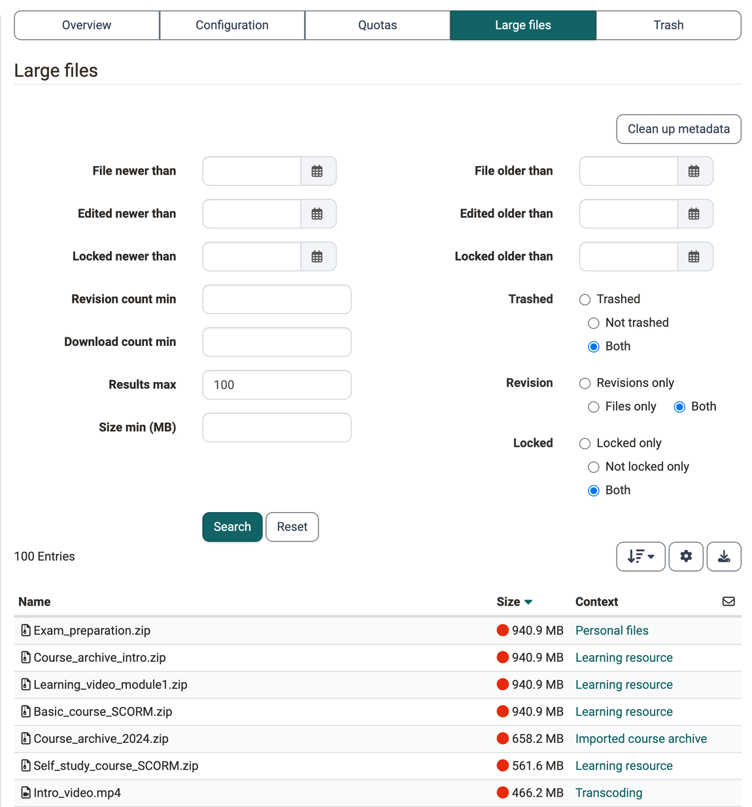

# What measures can I take to reduce storage space consumption? {: #reduce_storage_consumption}

??? abstract "Objectives and content of this instruction"

    Storage space is a cost factor for large volumes. It is also a matter of keeping things in order. Unlimited storage space encourages uncontrolled collecting. A limit helps to set priorities.

??? abstract "Target group"

    [ ] Authors [ ] Coaches  [ ] Participants  [x] Administrators

    [ ] Beginners [x] Advanced users  [x] Experts

??? abstract "Expected previous knowledge"

    * Experience as administrator

### A) Limit storage consumption at creation
1) Set up quotas 
2) Set up versioning 
3) Supervise authors 

### B) Delete unneeded files
4) Delete files permanently 
5) Find and delete large files 
6) Set up life cycles 

---

## Measure 1: Set up quotas

<h3> a) What are quotas?</h3>

Quotas can be used to define and adjust the maximum storage size and upload limit for specific paths.

 

<h3> b) Where and by whom are quotas set?</h3>

Basically, the quotas are set in the system administration, under: 
`Administration > Core functions > Files and folders` 
In individual cases, quotas are set in the tools available in the affected area. 
Example: Quota for group folders -> administration of the group 
Example: Quota for certain users -> user management

 

A quota for an individual folder overrides the default value of the system administration. Only persons with an administrative role can change it: administrators and system administrators, for courses also learning resource managers, for group folders group managers, for the personal files and the Media Center of a person roles managers and user managers. Course owners without such a role see the quota in the storage usage evaluation but cannot change it.

A quota of its own can be set, for example, in these places:

* for the course element "Folder", if "Automatically generated folder" is selected as file destination: 
`Course > Administration > Course editor > Course element "Folder" > Tab "Folder configuration" > Button "Open folder" > Menu with the three dots > "Edit quota"`
* for the storage folder of a course: 
`Course > Administration > Files > Storage folder > Menu with the three dots > "Edit quota"`
{ class="shadow lightbox" title="Storage folder under Files in the course administration" }
* for all folders of a course with their own quota in a single overview, including the course element "Participant folder". The storage usage evaluation shows how much storage each folder occupies and carries the "Edit quota" action in these rows: 
`Course > Administration > Files > Show memory usage > Action "Edit quota"`

 

Administrators, roles managers and user managers set the quotas for the personal files and the Media Center of a specific user in the user management. For this purpose, the "Quota" tab has two rows, "Personal files" and "Media Center", each with the "Edit quota" action: 
`User management > "User name" > Tab "Quota" > Action "Edit quota"`

{ class="shadow lightbox" title="Quota tab of an account in the user management" }

What the two rows show and when a quota of its own overrides the default value is described in the section [Quota](../../manual_admin/usermanagement/Configure_User.md#quota) in the administration manual.

 

The quota for group folders is set in the group administration. It can be set once a group folder has been activated. 
`Group > Administration > Tab "Tools" > Option "Folder" > Area "Edit quota"`
{ class="shadow lightbox" title="Tools tab of the group administration" }

 

The course elements "Forum", "File dialog", "Task", "Group task", "Page" and "Topic broker" have no quota of their own. Their usage appears in the storage usage evaluation under the "Internal without quota" filter; no limit can be set for them. The course administration describes the structure of the evaluation in the ["Storage usage"](../../manual_user/learningresources/Administration.md#storage_usage) section.

 

Most quotas are set up by administrators and system administrators, the default values only by system administrators. Both take place in the system administration under: 
`Administration > Core functions > Files and folders`

You can find more about this in the administration manual under: 
["Files and folders"](../../manual_admin/administration/Files_and_Folders.md)

 

---

## Measure 2: Set up versioning

<h3> a) How does versioning work?</h3>

OpenOlat can keep previous versions for all documents (Word, Excel, HTML, images, videos, etc.).
The maximum number of versions can be defined.

When versioning is turned on, files are not overwritten but created as a new version (also called revision). Older versions of a document can be downloaded and restored if necessary. If files are deleted, they appear in the list of deleted files and can be restored. If the versioning function is switched on, files can also be locked, e.g. if one person is working on a document and wants to prevent another person from creating a new version in the meantime.

Versioning is available in all folders of the system:

* "Personal files"
* group folder
* course folder
* resource folder
* course element "folder"

 

<h3> b) Where and by whom is the versioning set up?</h3>

Administrators set up versioning in the system administration, under: 
`Administration > Core functions > Files and folders`, tab "Configuration"

 

<h3> c) How can versioning help save storage space?</h3>

The number of stored versions can be adjusted. For example, if 5 versions are now changed to 2 versions, 3 versions are superfluous per document. However, once saved versions are not deleted directly. If you set the number back to 5 versions, they will become visible again. However, to delete these versions completely, click on **Cleanup limit exceeding versions**. Subsequently, the versions can no longer be restored.

---

## Measure 3: Supervise authors

Where several people work together, there needs to be a certain organization and coordination of the individual works. This also applies to authoring in OpenOlat.

**Example:** 
OpenOlat offers a question bank. Questions can be collected there and reused several times. This saves work, but it also requires a certain amount of coordination. In OpenOlat, there is therefore the role Question bank manager. It is advisable that question bank managers ensure that not only new questions are created, but also that the various drafts and previous versions are deleted again (in consultation with the authors).

**Example:** 
Experience has shown that the authoring area also accumulates many draft versions of courses and learning resources over time that are actually no longer needed.
Occasional cleaning up should also be initiated here by a responsible person.

---

## Measure 4: Delete files permanently

When files are deleted in OpenOlat, in many cases this means that they are first placed in a "trash". The files can be retrieved from the trash and restored. Only when they are permanently deleted (after another confirmation) are they no longer available.

The storage space is still required for files "in the trash". Only the permanent deletion reduces the required storage space.

 

<h3> Delete courses/learning resources</h3>

If courses or learning resources are deleted in the authoring area, they no longer appear under "My entries" but in the "Deleted" tab. (This corresponds to the trash and the step before permanent deletion.)
They are now only visible there to their respective owners and can only be restored by them.
The permanent deletion can also be done in this tab by selecting it and clicking on the **button "Delete permanently"**.

{ class="shadow lightbox" title="Deleted tab in the authoring area" }

 

<h3> Permanent deletion by administrators</h3>

Administrators can permanently delete individual files in the trash. This means that the whole "trash" does not have to be emptied at once. You find the files in the system administration under: 
`Administration > Core functions > Files and folders > Tab "Trash"` 
For a single file, click "Delete" at the end of the row. For several files, select the rows and click the button "Delete permanently". Both actions delete the files permanently.

{ class="shadow lightbox" title="Trash tab under Files and folders" }

So that the trash does not fill up unnoticed, OpenOlat automatically deletes files permanently from the trash after a set number of days. Administrators set this period in the field "Delete from trash after x days", under: 
`Administration > Core functions > Files and folders > Tab "Configuration"`

 

<h3> Delete in the personal files</h3>

Every person is responsible for the final deletion of files in the "Personal files" in the File Hub. A confirmation prompt will appear. The files will then be deleted permanently.

---

## Measure 5: Large files

Some file formats (e.g. videos) generally require more storage space. Therefore, it is particularly worthwhile here to delete versions that are no longer needed. OpenOlat offers a tool for this:

Administrators can search specifically for large files in the system administration and view further details about these files, under: 
`Administration > Core functions > Files and folders > Tab "Large files"`

This overview is very helpful and helps when cleaning up or deciding which files should be deleted.

{ class="shadow lightbox" title="Large files tab under Files and folders" }

---

## Measure 6: Life cycles

You set up life cycles in the system administration, under: 
`Administration > Life cycles`

There is one entry each for:

* **Groups**: the group life cycle
* **Courses**: the course life cycle
* **User**: the automatic user lifecycle

OpenOlat monitors whether a group has not been visited for a long time, whether the course end of a course has passed or whether nobody has logged in to an account for a long time. According to predefined criteria, it sends a message that first enables a reaction and then, for example, manual deletion. Or OpenOlat deletes if necessary also automatically according to set criteria.

Detailed information on the life cycles can be found at 
["How do I manage lifecycles of groups, courses or user accounts?"](../lifecycle/lifecycle.md)

---

## Checklist

- [x] Set up quotas?
- [x] Set up versioning?
- [x] Authors made aware of quota?
- [x] Searched for large files and deleted those no longer needed in consultation with the owners?
- [x] Asked all users to clean up their personal files?
- [x] Set up life cycles?

---

## Further information {: #further_information}

**Mentioned on this page** 
[Manage user settings >](../../manual_admin/usermanagement/Configure_User.md) 
[Course Administration: Overview >](../../manual_user/learningresources/Administration.md) 
[Files and Folders >](../../manual_admin/administration/Files_and_Folders.md) 
[How do I manage lifecycles of groups, courses or user accounts? >](../lifecycle/lifecycle.md)

**Further reading** 
[Storage folder >](../../manual_user/learningresources/Storage_folder.md) 
[Course Element "Folder" >](../../manual_user/learningresources/Course_Element_Folder.md) 
[Course Element "Participant folder" >](../../manual_user/learningresources/Course_Element_Participant_Folder.md) 
[Media Center Concept >](../../manual_user/basic_concepts/Media_Center_Concept.md)

[To the top of the page ^](#reduce_storage_consumption)
