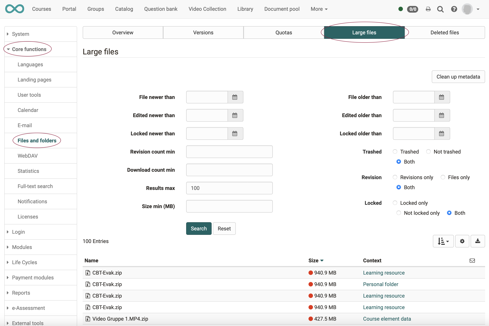

# What measures can I take to reduce storage space consumption?

??? abstract "Objectives and content of this instruction"

    Storage space is a cost factor for large volumes. It is also a matter of keeping things in order. Unlimited storage space encourages uncontrolled collecting. A limit helps to set priorities.

??? abstract "Target group"

    [ ] Authors [ ] Coaches  [ ] Participants  [x] Administrators

    [ ] Beginners [x] Experienced users  [x] Experts

??? abstract "Expected previous knowledge"

    * Experience as administrator

### A) Limit memory consumption during emergence
1) Set up quotas 
2) Set up versioning 
3) Supervise authors 

### B) Delete unneeded files
4) Delete files finally 
5) Delete Orphans 
6) Find and delete large files 
7) Set up life cycles 

---

## Measure 1: Set up quotas

<h3> a) What are quotas?</h3>

Quotas can be used to define and adjust the maximum storage size and upload limit for specific paths.

 

<h3> b) Where and by whom are quotas set?</h3>

Basically, quotas are set by the administrator. 
(**Administration > Core funtions > Files and folders**) 
In individual cases, quotas are set in the tools available in the affected area. 
Example: Quota for group folders -> administration of the group 
Example: Quota for certain users -> user management

 

Some quotas can be set individually by users.
These override the default value set by the administrator and apply, for example, to

* the course element "folder" in a certain course of a certain author. 
**Authoring > Select a course > Course editor > Select course element of type "folder" > Tab "Folder configuration" > Button "Open folder" > Button "Edit quota" at the bottom**
* the file folder of a course (setting by the course author): 
**Authoring > Select a course > Administration > Storage folder > Button "Edit quota" at the bottom**
{ class="shadow lightbox" }  

 

The quota for the personal folder of a specific user can be set in the user administration (with the appropriate authorization as user administrator): 
**User management > Select a user > Tab "Quota"**
{ class="shadow lightbox" }  

 

The quota for group folders is set in the group administration. It can be set once a group folder has been activated. 
**Groups > Administration > Tab "Tools" > Option "Folder" > Area "Edit quota" is displayed**
{ class="shadow lightbox" }

 

Most quotas as well as the default values are set up by the administrator under 
**Administration > Core functions > Files and folders**

You can find more about this in the administrator manual under
["Files and folders"](../../manual_admin/administration/Files_and_Folders.md)

 

---

## Measure 2: Set up versioning

<h3> a) How does versioning work?</h3>

OpenOlat can keep previous versions for all documents (Word, Excel, HTML, images, videos, etc.).
The maximum number of versions can be defined.

When versioning is turned on, files are not overwritten but created as a new version (also called revision). Older versions of a document can be downloaded and restored if necessary. If files are deleted, they appear in the list of deleted files and can be restored. If the versioning function is switched on, files can also be locked, e.g. if one person is working on a document and wants to prevent another person from creating a new version in the meantime.

Versioning is available in all folders of the system:

* personal folder
* group folder
* course folder
* resource folder
* course element "folder"

 

<h3> b) Where and by whom is the versioning set up?</h3>

The versioning is set by the administrator under  
**Administration > Core funtions > Files and Folders**

 

<h3> c) How can versioning help save storage space?</h3>

The number of stored versions can be adjusted. For example, if 5 versions are now changed to 2 versions, 3 versions are superfluous per document. However, once saved versions are not deleted directly. If you set the number back to 5 versions, they will become visible again. However, to delete these versions completely, click on **Clean up versions**. Subsequently, the versions can no longer be restored.

---

## Measure 3: Supervise authors

Where several people work together, there needs to be a certain organization and coordination of the individual works. This also applies to authoring in OpenOlat.

**Example:** 
OpenOlat offers a question pool. Questions can be collected there and reused several times. This saves work, but it also requires a certain amount of coordination. In OpenOlat, there is therefore the role of the pool administrator. 
It is advisable that he ensures that not only new questions are created, but also that the various drafts and previous versions are deleted again (in consultation with the authors).

**Example:** 
Experience has shown that the authoring area also accumulates many draft versions of courses and learning resources over time that are actually no longer needed.
Occasional cleaning up should also be initiated here by a responsible person.

---

## Measure 4: Delete files permanently

When files are deleted in OpenOlat, in many cases this means that they are first placed in a "recycle bin". The files can be retrieved from the recycle bin and restored. Only when they are finally deleted (after confirmation) are they no longer available.

The storage space is still required for files "in the recycle bin". Only the final deletion reduces the required storage space.

 

<h3> Delete courses/learning resources</h3>

If courses or learning resources are deleted in the authoring area, they no longer appear under "My entries" but in the "Deleted" tab. (This corresponds to the recycle bin and the step before final deletion).
They are now only visible there to their respective owners and can only be restored by them.
The final deletion can also be done in this tab by selecting it and clicking on the **"Delete permanently"** button.

{ class="shadow lightbox" }

 

<h3> Final delete by the administrator</h3>

Administrators can perform the final deletion in specific paths. This means that the "Recycle Bin" does not have to be permanently deleted at once. 
**Administration > Core functions > Files and Folders < tab "Deleted files" > select a line > option "Delete" at the end of the line** 
A click on "Delete" at the end of the line means here the final deletion of the files marked for deletion (files in the "Recycle Bin").

{ class="shadow lightbox" }

 

<h3> Delete from the personal folder</h3>

Everyone is responsible for the final deletion of files in the personal folder. A confirmation prompt will appear. The files will then be deleted permanently. (A recycle bin is not implemented here at the moment).

---

## Measure 5: Delete orphan versions

<h3> a) What are Orphans?</h3>

The term means in the context of OpenOlat "orphaned" files.

All documents that are deleted manually or for which versioning is no longer available are placed in a kind of recycle bin. From there they could be restored, but they still need the same amount of memory. With "Delete Orphan Versions" this recycle bin is deleted. The versions can no longer be restored, but also no longer require any memory.

 

<h3> b) Where and by whom are Orphans deleted?</h3>

The deletion of Orphans is done by the administrator under 
**Administration > Core functions > Files and folders < tab "Deleted files" > button "Delete all versions"**

{ class="shadow lightbox" }

---

## Measure 6: Large files

Some file formats (e.g. videos) generally require more storage space. Therefore, it is particularly worthwhile here to delete versions that are no longer needed. OpenOlat offers a tool for this:

Under **Administration > Core functions > Files and Folders > tab "Large Files"** 
administrators can search specifically for large files and view further details about these files. This overview is very helpful and helps when cleaning up or deciding which files should be deleted.

{ class="shadow lightbox" }

---

## Measure 7: Life cycles

In OpenOlat, lifecycle management can be enabled for.

* **course lifecycle**
* **group lifecycle**
* **user lifecycle**

OpenOlat monitors whether an object has not been used for a long time or a user has not been active for a long time. According to predefined criteria, it sends a message that first enables a reaction and then, for example, manual deletion. Or OpenOlat deletes if necessary also automatically according to set criteria.

Detailed information on life cycle management can be found at 
["How do I manage lifecycles of groups, courses or user accounts?"](../lifecycle/lifecycle.md)

---

## Checklist

- [x] tbd