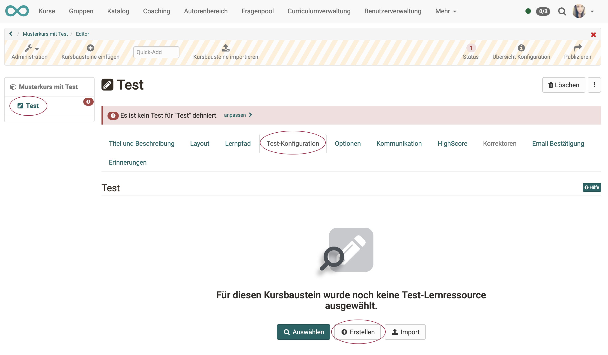

# Wie gehe ich vor, wenn ich einen Test erstelle?

??? abstract "Ziel und Inhalt dieser Anleitung"

    Für das Erstellen von Tests gibt es in OpenOlat verschiedene Wege. Hier werden Ihnen im Überblick die gängigen Wege aufgezeigt. Lernen Sie die Möglichkeiten kennen und wählen Sie dann das für Sie passende Vorgehen.

??? abstract "Zielgruppe"

    [x] Anfänger [x] Fortgeschrittene  [ ] Experten

??? abstract "Erwartete Vorkenntnisse"

    * [„Wie erstelle ich meinen ersten OpenOlat-Kurs?"](../my_first_course/my_first_course.de.md)

---

## Das Zusammenwirken der Bestandteile

{ class="lightbox" } 

**Kurs:** Er wird im Kurseditor aus Kursbausteinen zusammengesetzt. 

**Kursbaustein:**  Die meisten Kursbausteine sind Behälter, in die eine Lernressource eingefügt wird. Z.B. wird in den Kursbaustein "Test" eine Lernressource "Test" eingefügt. Bitte diese beiden "Tests" unterscheiden!

**Fragen:**  Eine Test-Lernressource besteht aus mehreren einzelnen Fragen, z.B. Single Choice, Multiple Choice usw. 

**Fragenpool:**  Die Einzelfragen können in einem Fragenpool gesammelt werden. Beim Erstellen verschiedener Test-Lernressourcen kann dann auf den Fragenpool zugegriffen werden. Bereits vorhande Fragen des Fragenpools können übernommen (von dort kopiert) werden und evtl. zusätzliche weitere Fragen neu erstellt werden.  
Fragen können im Fragenpool oder der Lernressource erstellt werden. In der Lernressource erstellte Fragen sind nur in dieser Test-Lernressource vorhanden, solange sie nicht zur Mehrfachnutzung in den Fragenpool übergeben werden.

 

Zu jedem der Elemente können Einstellungen (Konfigurationen) vorgenommen werden. Die Konfigurationen können also auf unterschiedlichen Ebenen vorgenommen werden.

{ width=450px class="lightbox" }

**Konfiguration des Kurses:** 
Autorenbereich > Kurs wählen > Administration > Einstellungen

**Konfiguration des Kursbausteins:** 
Autorenbereich > Kurs wählen > Admninistration > Kurseditor > Kursbaustein wählen > Einstellungen in den Tabs

**Konfiguration der Lernressource:** 
Autorenbereich > Formular-Lernressource auswählen > Administration > Einstellungen 

**Konfiguration einer Frage:** 
Frage im Frageneditor öffnen > mit Klick auf ein Element Wechsel in den Editiermodus > zugehörige Optionen erscheinen 

 

:octicons-device-camera-video-24: **Video-Einführung**: [Funktionsprinzipien](<https://www.youtube.com/embed/M-JkSAFN298>){:target="_blank”}

:octicons-device-camera-video-24: **Video-Einführung**: [Kurse erstellen und bearbeiten](<https://www.youtube.com/embed/SfOSyDG0qvE>){:target="_blank”}

:octicons-device-camera-video-24: **Video-Einführung**: [Überblick Testing](<https://www.youtube.com/embed/fkqH41-8CaI>){:target="_blank”}

:octicons-device-camera-video-24: **Video-Einführung**: [Wie funktionieren Tests in OpenOlat?](<https://www.youtube.com/embed/M0p3UKaEOlg>){:target="_blank”}

 

---

## Vorgehen Möglichkeit 1

Wenn Sie völlig von vorne mit der Erstellung eines Kurses beginnen, liegt folgendes Vorgehen nahe. 

 

{ class="lightbox" } 

 

> <h3>Kurs erstellen</h3>

 
!!! tip "Hinweis"

    Sollten Sie noch keine Erfahrung in der Kurserstellung haben, finden Sie im Kapitel [„Wie erstelle ich meinen ersten OpenOlat-Kurs"](../my_first_course/my_first_course.de.md) eine Anleitung.

1\. Gehen Sie in den Autorenbereich und erstellen Sie dort einen neuen Kurs. 

{ class="lightbox" } 
 
2\. Vergeben Sie einen Titel und nehmen Sie erste Einstellungen zum Kurs vor. Entscheiden Sie sich für ein Design.

{ class="lightbox" } 

3\. Wenn Sie für den weiteren Prozess der Kurserstellung einen Wizard (Kursassistent:in) verwenden wollen, werden Sie gefragt, ob Sie einen Prüfungskurs erstellen wollen.
Ein Prüfungskurs ist ein normaler Kurs (egal ob Lernpfadkurs oder herkömmlicher Kurs), der bereits eine bestimmte Konfiguration enthält. Diese Option bietet also eine spätere Arbeitserleichterung.

{ class="lightbox" } 

4\. Der erste Screen nach Klick auf den Button "Erstellen" ist die Übersicht der Einstellungen (Konfiguration des Kurses).

!!! tip "Hinweis"

    Abgesehen vom Kursdesign, können Sie die übrigen Angaben auch später unter **Administration > Einstellungen** wieder aufrufen und anpassen.

{ class="lightbox" } 

 

> <h3>Kursbaustein "Test" einfügen</h3>

 

5\. Öffnen Sie über die "Administration" den **Kurseditor**. Wählen Sie "Kursbausteine einfügen" und klicken Sie dort auf den gewünschten Kursbaustein-Typ "Test" oder "Selbsttest". Dadurch wird ein Kursbaustein dieses Typs eingefügt.

{ class="lightbox" } 

 

> <h3>im Kursbaustein Test-Lernressource erstellen</h3>

 

6\. Wählen Sie links im Kursmenü den Test-Kursbaustein an.

7\. In den zugehörigen Tabs auf der rechten Seite befindet sich unter "Test-Konfiguration" der Button "Erstellen". Erstellen Sie mit ihm eine neue Test-Lernressource.

{ class="lightbox" } 

8\. Vergeben Sie auch für die Test-Lernressource einen Namen.

{ class="lightbox" } 

 

> <h3>Lernressource editieren und Fragen erstellen</h3>

 

9\. Nach dem Erstellen der neuen Test-Lernressource haben Sie die Möglichkeit, die Lernressource zu bearbeiten, also Fragen zu ergänzen.

{ class="lightbox" } 

10\. Standardmässig ist bereits eine Single Choice Frage vorhanden. Sie können diese als Muster verwenden, löschen oder entsprechend Ihren Bedürfnissen abändern. 

{ class="lightbox" } 

11\. In der "Administration" der Test-Lernressource wählen Sie nun "Inhalt editieren" und Sie gelangen in den Editor der Lernressource (nicht den Editor des Kurses).

{ class="lightbox" } 
  
12\. Wählen Sie "Elemente hinzufügen" und den passenden Fragetyp, z.B. Multiple Choice.

{ class="lightbox" } 

13\. Geben Sie im Tab "Auswahl" den Titel der Frage, die Fragestellung und die möglichen Antworten ein. Weitere Antwortmöglichkeiten werden über das Pluszeichen ergänzt.

14\. Im Tab "Punkte" definieren Sie die Art und die Summe der Punkte.

15\. Bei Bedarf definieren Sie ein Feedback zur Frage. Über "Vorschau" können Sie sich die Frage ansehen.
  
Nach dem gleichen Prinzip fügen Sie weitere Fragen hinzu. Dabei können die Details der Einstellungen je nach Fragetyp variieren. Sie können Ihren Test auch mit Sektionen oder Test-Parts weiter strukturieren.

!!! warning "Achtung"

    Überlegen Sie sich unbedingt im Vorfeld, welcher Fragetyp für Ihre jeweilige Zwecke am geeignetsten ist, da der Fragetyp im Nachhinein nicht mehr geändert werden kann.

!!! tip "Tipp"

    Das Kopieren von Fragen empfiehlt sich dann, wenn Sie mehrere Fragen mit denselben Antwortmöglichkeiten haben, z.B. mehrere Fragen mit einem Wert aus einer Skala von 1-5.

 

---

## Vorgehen Möglichkeit 2

Haben Sie bereits etwas Erfahrung als Autor und besteht bereits ein Kurs, können Sie mit der Lernressource "Test" beginnen.

 

{ class="lightbox" } 

 

> <h3>Test-Lernressource erstellen</h3>

 

1\. Im Autorenbereich den Link "Erstellen" wählen und die Lernressource "Test" wählen.
   
{ class="shadow lightbox"}
  
2\. Titel des Tests eintragen

{ class="shadow lightbox"}
  
3\. Es erscheint ein Menü. Hier können Sie in den unterschiedlichen Tabs bei Bedarf weitere Einstellungen vornehmen.

Das Menü entspricht den Einstellungen im Bereich Administration und kann auch später noch bearbeitet werden.

{ class="shadow lightbox"}

:octicons-device-camera-video-24: **Video-Einführung**: [Test-Lernressource erstellen](<https://www.youtube.com/embed/WUs-upCf2tQ>){:target="_blank”}

 

> <h3>Lernressource editieren und Fragen erstellen</h3>

 

4\. In der "Administration" der Lernressource Test → "Inhalt editieren" wählen und Sie gelangen in den Testeditor.

{ class="shadow lightbox"}
  
5\. "Elemente hinzufügen" wählen und den passenden Fragetyp auswählen, z.B. Multiple Choice.

6\. Im Tab "Auswahl" den Titel der Frage, die Fragestellung und die möglichen Antworten eingeben. Weitere Antwortmöglichkeiten werden über das Pluszeichen ergänzt.

7\. Im Tab "Punkte" die Art und die Summe der Punkte definieren.

8\. Bei Bedarf ein Feedback zur Frage definieren und sich die Frage über die Vorschau anschauen.
  
Nach dem gleichen Prinzip fügen Sie weitere Fragen hinzu. Dabei können die Details der Einstellungen je nach Fragetyp variieren. Sie können Ihren Test auch mit Sektionen oder Test-Parts weiter strukturieren.

:octicons-device-camera-video-24: **Video-Einführung**: [Fragen erstellen](<https://www.youtube.com/embed/2ZrINPQ6tYw>){:target="_blank”}

!!! info "Hinweis"

    Standardmäßig ist bereits eine Single Choice Frage angelegt, die Sie nutzen und bearbeiten oder löschen sollten.

!!! warning "Achtung"

    Überlegen Sie sich unbedingt im Vorfeld, welcher Fragetyp für Ihre jeweilige Zwecke am geeignetsten ist, da der Fragetyp im Nachhinein nicht mehr geändert werden kann.

!!! tip "Tipp"

    Das Kopieren von Fragen empfiehlt sich dann, wenn Sie mehrere Fragen mit denselben Antwortmöglichkeiten haben, z.B. mehrere Fragen mit einem Wert aus einer Skala von 1-5.

 

> <h3>Test-Lernressource konfigurieren</h3>

 

9\. Wählen Sie das oberste Element der Test-Lernressource und bearbeiten Sie die zugehörigen Tabs nach Bedarf.

{ class="shadow lightbox" }

10\. **Test Konfiguration:** Definieren Sie ab wieviel Punkten der Test
bestanden ist und ob bzw. welche Zeitbeschränkung es gibt.

Definieren Sie, falls gewünscht, ein **generelles Feedback:** für den Fall, dass der Test bestanden wurde bzw. nicht bestanden wurde (gilt für automatisches Bestehen).

11\. **Expert:** Weitere Details des Testablaufs konfigurieren, z.B. Art der Navigation oder die Anzeige von Lösungen.

12\. Abschließend den Testeditor schließen, indem man in der Krümelnavigation auf den Titel des Tests klickt.

{ class="shadow lightbox" }

:octicons-device-camera-video-24: **Video-Einführung**: [Kursbausteine konfigurieren](<https://www.youtube.com/embed/SAkzzoOQEoQ>){:target="_blank”}

!!! info "Hinweis"

    Sie können sowohl ein Feedback für einzelne Fragen als auch für den gesamten Test erstellen.

 

> <h3>Kursbaustein "Test" in den vorhandenen Kurs einfügen</h3>

 

13\. Gehen Sie in den Autorenbereich. Im Bereich "Meine Einträge" finden Sie Ihre Kurse. Öffnen Sie den Kurs in dem der Test eingebunden werden soll.

14\. Öffnen Sie über die "Administration" den "Kurseditor". Wählen Sie "Kursbausteine einfügen" und klicken Sie auf den gewünschten Kursbaustein-Typ "Test" oder "Selbsttest".

 

> <h3>Test-Lernressource in den Test-Kursbaustein einfügen</h3>

 

15\. Gehen Sie in den Tab "Test-Konfiguration" und klicken Sie den Button "Datei wählen, erstellen oder importieren" 
Es erscheint eine Liste mit Ihren Test-Lernressourcen. Wählen Sie den vorbereiteten Test aus, indem Sie auf den Auswahlhaken klicken.

{ class="shadow lightbox" }

16\. Bei Bedarf können Sie sich im Tab "Test-Konfiguration" unter "Gewählte Datei" den eingebundenen Test in der Vorschau anzeigen lassen und auch noch editieren, solange er nicht von Teilnehmern bearbeitet wurde.

{ class="shadow lightbox" }

17\. Bei Bedarf können noch die weiteren Tabs des Kursbausteins konfiguriert werden. Sie können teilweise die Einstellungen der Test-Lernressource mit den Einstellungen des Kursbausteins übersteuern. Das macht Sinn, wenn die gleiche Test-Lernressource in verschiedenen Kursen verwendet wird.

18\. Damit der Test von den Lernenden bearbeiten werden kann, muss der Kurs noch publiziert werden. Dafür einfach den Kurseditor z.B. durch Klick auf den Namen des Kurses in der Krümelnavigation schließen und bei der erscheinenden Auswahl das Publizieren durch die Auswahl "Ja" manuell oder automatisch" erlauben.

Alternativ kann auch der "Publizieren"-Button im Editor rechts in der Toolleiste oder das kleine rote Kreuz rechts oben verwendet werden.  

19\. Damit die Lernenden den Test bearbeiten können, muss der Status des Kurses noch auf "Veröffentlicht" umgestellt werden. 
Welche Lernende Zugriff erhalten, bestimmen Sie in der Mitgliederverwaltung des Kurses.   

20\. Sobald Testergebnisse vorhanden sind, können Betreuende im Betreuungswerkzeug Bewertungen vornehmen. (Gilt nicht bei Selbsttests.) 
Weitere Infos dazu finden Sie im Kapitel "[Tests bewerten](../course_operation/Assessing_tests.de.md)".

 

---

## Vorgehen Möglichkeit 3

Besteht Arbeitsteilung und Sie sollen als Fachexperte die Fragen erstellen, die verschiedene Kollegen in ihren Tests verwenden können?
Dann können Sie auch mit dem Erstellen der einzelnen Fragen im Fragenpool beginnen. 

 

{ class= "lightbox" } 

 

> <h3>Fragen im Fragenpool erstellen</h3>

 

1\. Wenn Sie Autorenrechte besitzen, wird im Menü Ihrer Kopfzeile ausser dem Autorenbereich auch der Fragenpool angezeigt. Gehen Sie in den Fragenpool.

{ class="lightbox" } 

2\. Wählen Sie "Frage erstellen" und den passenden Fragetyp, z.B. Multiple Choice.

{ class="lightbox" } 

3\. Geben Sie im Tab "Auswahl" den Titel der Frage, die Fragestellung und die möglichen Antworten ein. Weitere Antwortmöglichkeiten werden über das Pluszeichen ergänzt.

{ class="lightbox" } 

4\. Im Tab "Punkte" definieren Sie die Art und die Summe der Punkte.

5\. Bei Bedarf definieren Sie ein Feedback zur Frage. Über "Vorschau" können Sie sich die Frage ansehen.
  
Nach dem gleichen Prinzip fügen Sie weitere Fragen hinzu. Dabei können die Details der Einstellungen je nach Fragetyp variieren. Sie können Ihren Test auch mit Sektionen oder Test-Parts weiter strukturieren.

!!! warning "Achtung"

    Überlegen Sie sich unbedingt im Vorfeld, welcher Fragetyp für Ihre jeweilige Zwecke am geeignetsten ist, da der Fragetyp im Nachhinein nicht mehr geändert werden kann.

!!! tip "Tipp"

    Das Kopieren von Fragen empfiehlt sich dann, wenn Sie mehrere Fragen mit denselben Antwortmöglichkeiten haben, z.B. mehrere Fragen mit einem Wert aus einer Skala von 1-5.

 

> <h3>Test-Lernressource erstellen und editieren</h3>

 

6\. Wechseln Sie in den Autorenbereich und erstellen Sie einen Test (Test-Lernressource).

{ class="lightbox" } 

!!! hint "Tipp"

    Die neue Test-Lernressource wird im Autorenbereich nicht unter dem Tab "Meine Kurse" aufgelistet, sondern unter "Meine Einträge". Erkennbar am Symbol für Test-Lernressourcen.
	{ class="lightbox" } 

7\. Öffnen Sie den Editor durch Klick auf **Administration** und dann **"Inhalt editieren"**.

{ class="lightbox" } 

8\. Im Editiermodus (erkennbar an der schraffierten Kopzeile) können Sie nun unter **"Elemente hinzufügen"** neue Fragen hinzufügen.

{ class="lightbox" } 

 

> <h3>Fragen aus Fragenpool importieren</h3>

 

9\. Alternativ zur Erstellung neuer Fragen, können Sie unter dem gleichen Menüpunkt bereits vorhandene Fragen **"aus dem Fragenpool importieren"**.

{ class="lightbox" } 

10\. Klicken Sie auf den Titel einer einzelnen Frage, wird sie direkt eingefügt. Um mehrere Fragen zu importieren, markieren Sie die Fragen und bestätigen mit Klick auf den Button "Auswählen".

{ class="lightbox" } 

11\. Sind alle Fragen in der Test-Lernressource erfasst, verlassen Sie den Editor der Lernressource.

 

> <h3>Test-Lernressource in den Test-Kursbaustein einfügen</h3>

 

12\. Gehen Sie in den Autorenbereich. Im Bereich "Meine Einträge" finden Sie Ihre Kurse. Öffnen Sie den Kurs in dem die Test-Lernressource eingebunden werden soll.

13\. Öffnen Sie über die "Administration" den "Kurseditor". Wählen Sie "Kursbausteine einfügen" und klicken Sie auf den gewünschten Kursbaustein-Typ "Test" oder "Selbsttest".

14\. Gehen Sie in den Tab "Test-Konfiguration" und klicken Sie den Button "Datei wählen, erstellen oder importieren".
Es erscheint eine Liste mit Ihren Test-Lernressourcen. Wählen Sie den vorbereiteten Test aus, indem Sie auf den Auswahlhaken klicken.

15\. Bei Bedarf können Sie sich im Tab "Test-Konfiguration" unter "Gewählte Datei" den eingebundenen Test in der Vorschau anzeigen lassen und auch noch editieren, solange er nicht von Teilnehmern bearbeitet wurde.

16\. Je nach Bedarf können noch die weiteren Tabs des Kursbausteins konfiguriert werden. Sie können teilweise die Einstellungen der Test-Lernressource mit den Einstellungen des Kursbausteins übersteuern. Das macht Sinn, wenn die gleiche Test-Lernressource in verschiedenen Kursen verwendet wird.

17\. Damit der Test von den Lernenden bearbeiten werden kann muss der Kurs noch publiziert werden. Dafür einfach den Kurseditor z.B. durch Klick auf den Namen des Kurses in der Krümelnavigation schließen und bei der erscheinenden Auswahl das Publizieren durch die Auswahl "Ja" manuell oder automatisch" erlauben.

Alternativ kann auch der "Publizieren"-Button im Editor rechts in der Toolleiste oder das kleine rote Kreuz rechts oben verwendet werden.

18\. Damit die Lernenden den Test bearbeiten können, muss der Status des Kurses noch auf "Veröffentlicht" umgestellt werden.
Welche Lernende Zugriff erhalten, bestimmen Sie in der Mitgliederverwaltung des Kurses.

19\. Sobald Testergebnisse vorhanden sind, können Betreuende im Betreuungswerkzeug Bewertungen vornehmen. (Gilt nicht bei Selbsttests.)
Weitere Infos dazu finden Sie im Kapitel "Tests bewerten".

 

---

## Links

:octicons-device-camera-video-24: **Video-Einführung**: [Funktionsprinzipien](<https://www.youtube.com/embed/M-JkSAFN298>){:target="_blank”}

:octicons-device-camera-video-24: **Video-Einführung**: [Kurse erstellen und bearbeiten](<https://www.youtube.com/embed/SfOSyDG0qvE>){:target="_blank”}

:octicons-device-camera-video-24: **Video-Einführung**: [Überblick Testing](<https://www.youtube.com/embed/fkqH41-8CaI>){:target="_blank”}

:octicons-device-camera-video-24: **Video-Einführung**: [Wie funktionieren Tests in OpenOlat?](<https://www.youtube.com/embed/M0p3UKaEOlg>){:target="_blank”}

:octicons-device-camera-video-24: **Video-Einführung**: [Test-Lernressource erstellen](<https://www.youtube.com/embed/WUs-upCf2tQ>){:target="_blank”}

:octicons-device-camera-video-24: **Video-Einführung**: [Fragen erstellen](<https://www.youtube.com/embed/2ZrINPQ6tYw>){:target="_blank”}

:octicons-device-camera-video-24: **Video-Einführung**: [Tests erstellen/bearbeiten](<https://www.youtube.com/embed/eNNdDdQDlfs>){:target="_blank”}

:octicons-device-camera-video-24: **Video-Einführung**: [Kursbausteine konfigurieren](<https://www.youtube.com/embed/SAkzzoOQEoQ>){:target="_blank”}

 

---

## Checkliste

- [x] Kurs vorhanden?

- [x] Kursbaustein "Test" oder "Selbsttest" vorhanden?

- [x] Lernressource "Test" erstellt?

- [x] im Fragenpool vorhandene Fragen in Lernressource übernommen? 

- [x] zusätzliche Fragen innerhalb der Lernressource erstellt?

- [x] Test-Lernressource konfiguriert?

- [x] Test-Kursbaustein konfiguriert? 