# How do I proceed when I create a test? {: #test_creation_procedure}

??? abstract "Objectives and content of this instruction"

    There are various ways to create tests in OpenOlat. Here you will find an overview of the most common ways. Get to know the possibilities and then choose the procedure that suits you best.

    All three ways require the role Author. With this role, the main navigation shows Authoring and the question bank.

??? abstract "Target group"

    [x] Beginners [x] Advanced users  [ ] Experts

??? abstract "Expected previous knowledge"

    * ["How do I create my first OpenOlat course?"](../my_first_course/my_first_course.md)

---

## The interaction of the components

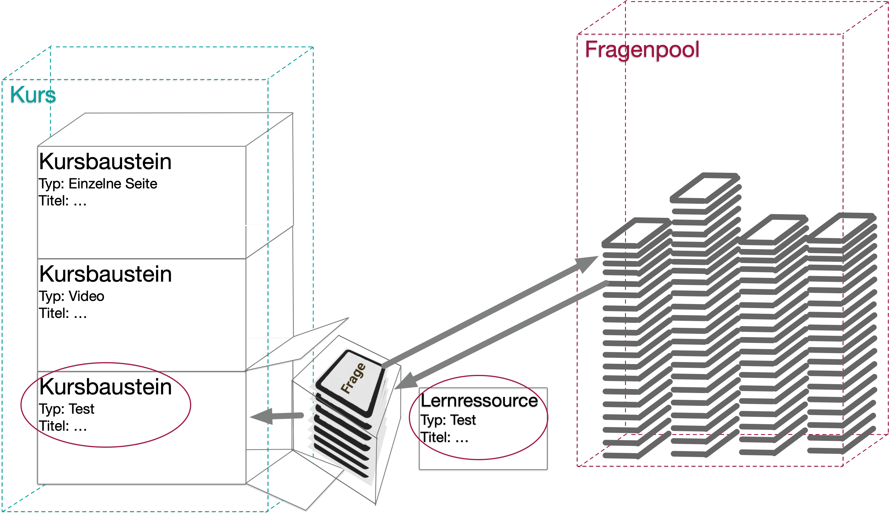{ class="lightbox" title="Course, course element, learning resource and question bank" }

**Course:**  It is assembled from course elements in the course editor.

**Course element:**  Most course elements are containers into which a learning resource is inserted. E.g. a learning resource "Test" is inserted into the course element "Test". Please distinguish between these two "Tests"!

**Questions:**  A test learning resource consists of several individual questions, e.g., single choice, multiple choice, etc.

**Question bank:**  The individual questions can be collected in a question bank. When creating different test learning resources, the question bank can then be accessed. Existing questions from the question bank can be adopted (copied from there) and additional new questions can be created.  
Questions can be created in the question bank or the learning resource. Questions created in the learning resource are only available in this test learning resource as long as they are not transferred to the question bank for multiple use.

 

Settings (configurations) can be made for each of the elements. The configurations can therefore be made at different levels.

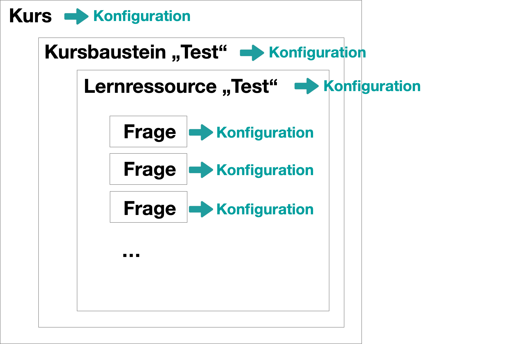{ width=450px class="lightbox" title="Configuration levels of a test" }

**Configuration of the course:** 
`Authoring > Select the course > Administration > Settings`

**Configuration of the course element:** 
`Authoring > Select the course > Administration > Course editor > Select the course element > Settings in the tabs`

**Configuration of the learning resource:** 
`Authoring > Select the test learning resource > Administration > Settings`

**Configuration of a question:** 
`Authoring > Select test learning resource > Administration > Test editor > Select question in the tree structure > Settings in the tabs`

 

:octicons-device-camera-video-24: **Video introduction (German)**: [Funktionsprinzipien](<https://www.youtube.com/embed/M-JkSAFN298>){:target="_blank"}

:octicons-device-camera-video-24: **Video introduction (German)**: [Kurse erstellen und bearbeiten](<https://www.youtube.com/embed/SfOSyDG0qvE>){:target="_blank"}

:octicons-device-camera-video-24: **Video introduction (German)**: [Überblick Testing](<https://www.youtube.com/embed/fkqH41-8CaI>){:target="_blank"}

:octicons-device-camera-video-24: **Video introduction (German)**: [Wie funktionieren Tests in OpenOlat?](<https://www.youtube.com/embed/M0p3UKaEOlg>){:target="_blank"}

 

---

## Procedure Option 1

If you are starting from scratch with the creation of a course, the following procedure is obvious. 

 

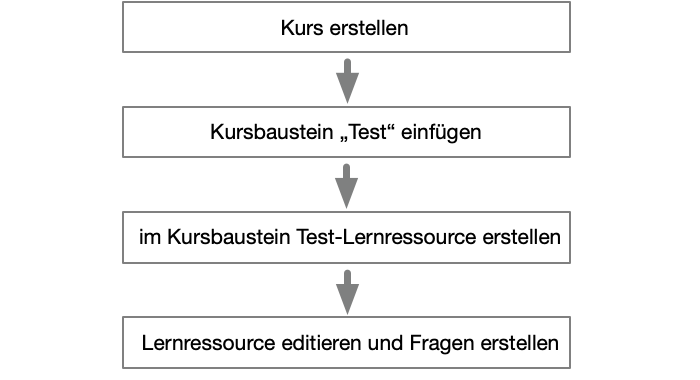{ class="lightbox" title="Procedure option 1" }

 

> <h3>Create a course</h3>

 

!!! note "Note"

    If you do not have any experience in course creation, you will find instructions in the chapter ["How do I create my first OpenOlat course?"](../my_first_course/my_first_course.md).

1\. Go to Authoring and create a new course there.

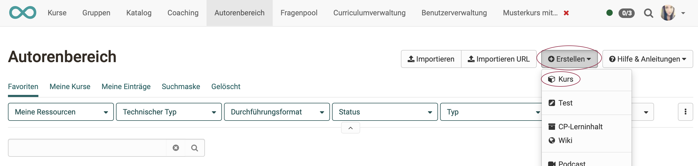{ class="lightbox" title="Authoring" }

2\. Assign a title and make initial settings for the course. Decide on a design.

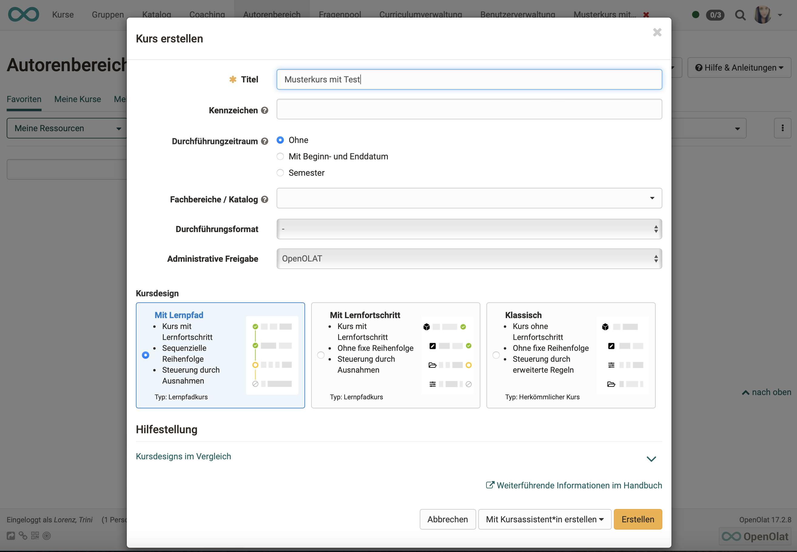{ class="lightbox" title="Dialog Create course" }

3\. If you want to use a wizard (course wizard) for the further process of course creation, you will be asked if you want to create an exam course. 
An exam course is a normal course (no matter if learning path course or conventional course) that already contains a certain configuration. So this option provides a later work relief.

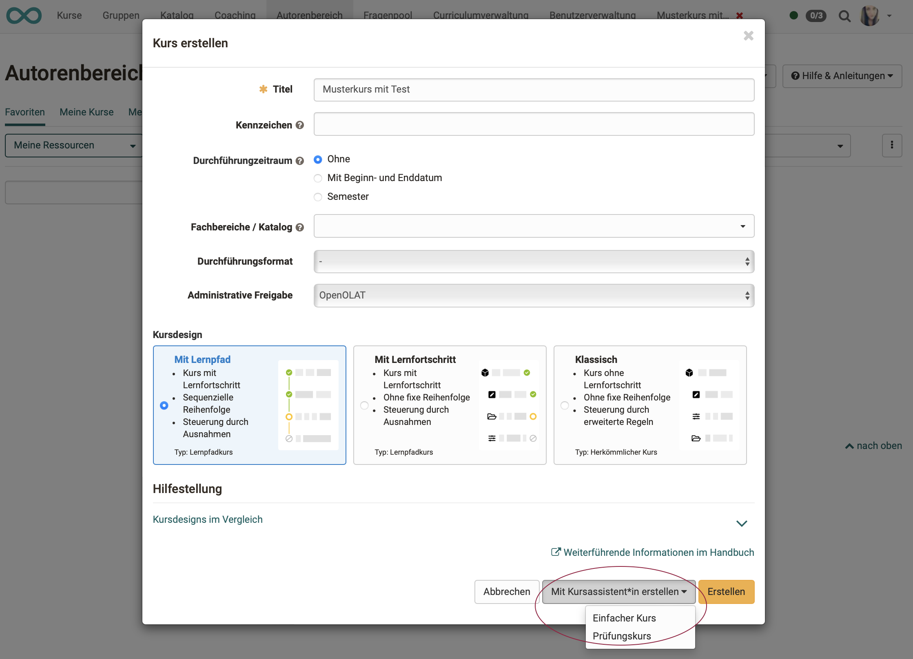{ class="lightbox" title="Dialog Create course with course wizard" }

4\. The first screen after clicking the "Create" button is the settings overview (configuration of the course).

!!! tip "Tip"

    Apart from the course design, you can also access and adjust the other details later under `Course > Administration > Settings`.

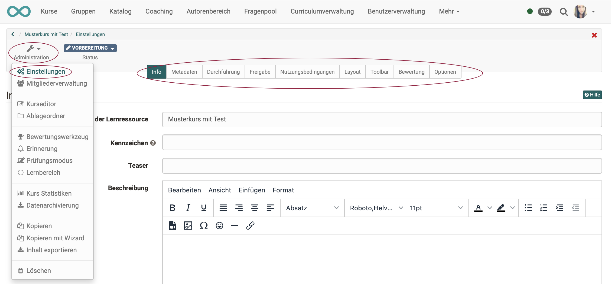{ class="lightbox" title="Settings of the course" }

 

> <h3>Insert course element "Test"</h3>

 

5\. Open the **Course editor** via the "Administration". Select "Insert course elements" and click on the desired course element type "Test" or "Self-test" there. This will insert a course element of this type.

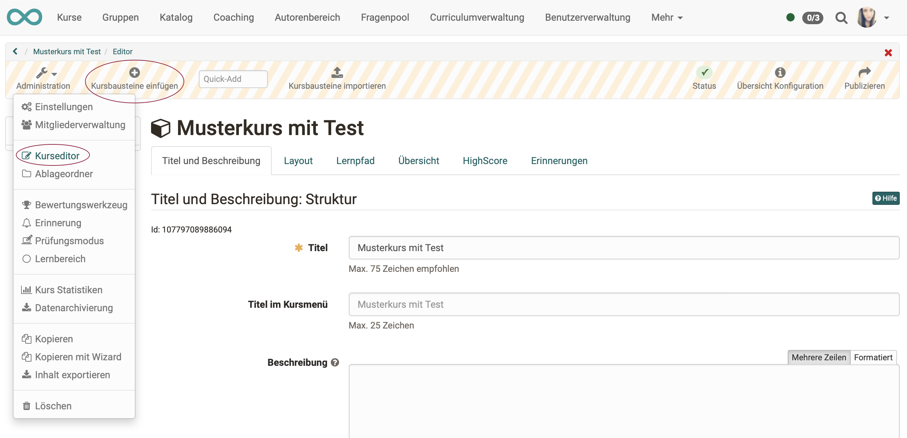{ class="lightbox" title="Course editor" }

 

> <h3>Create a test learning resource within the course element</h3>

 

6\. Select the test course element in the course menu on the left.

7\. In the related tabs on the right side, under "Test configuration" you will find the "Create" button. Use it to create a new test learning resource.

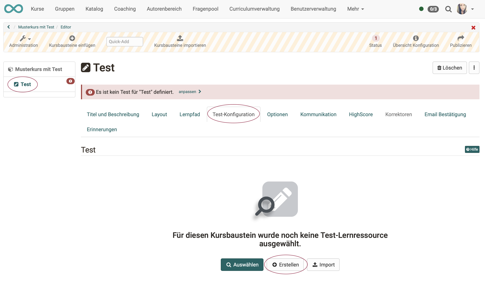{ class="lightbox" title="Course element Test in the course editor" }

8\. Enter a name for the test learning resource as well.

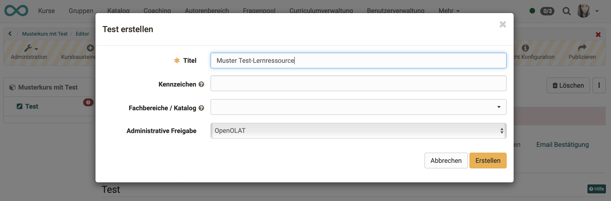{ class="lightbox" title="Dialog Create test" }

 

> <h3>Edit learning resource and create questions</h3>

 

9\. After creating the new test learning resource, you have the possibility to edit it, i.e. add questions.

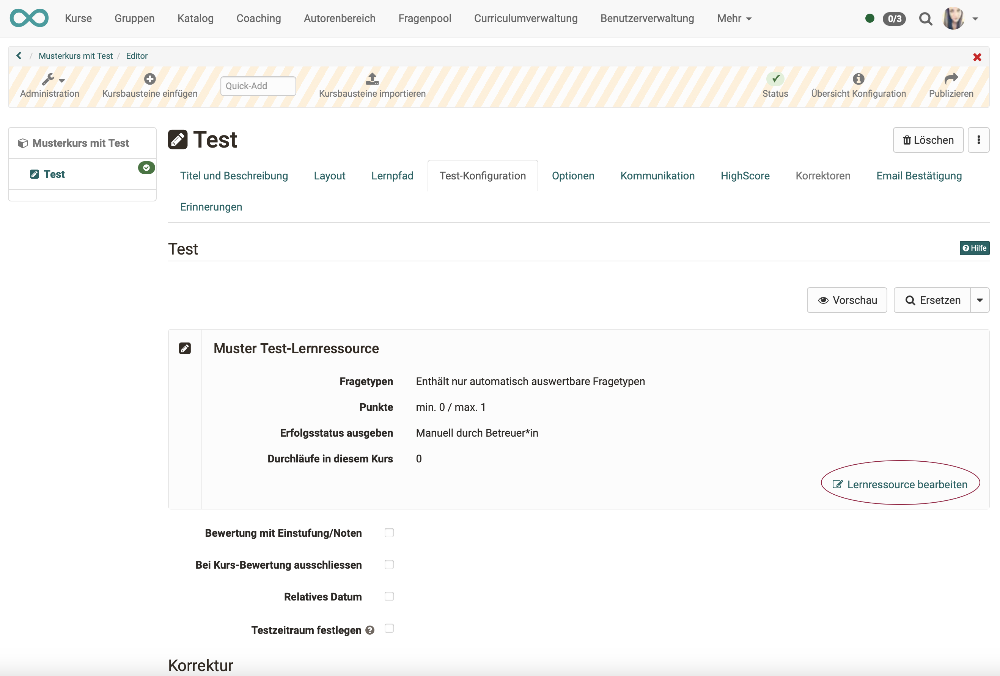{ class="lightbox" title="Tab Test configuration in the course element Test" }

10\. By default, a single choice question is already available. You can use this as a sample, delete it or modify it according to your needs.

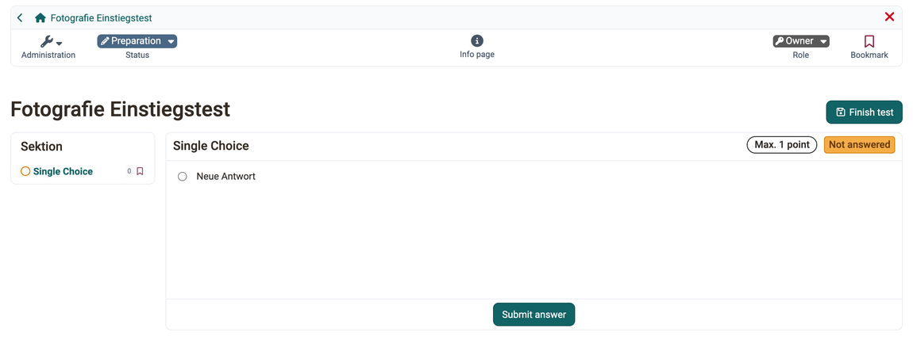{ class="lightbox" title="Test learning resource · 2026.09.28" }

11\. In the "Administration" of the test learning resource, now select the entry "Test editor". You will get to the test editor of the learning resource, not to the course editor.

{ class="lightbox" title="Administration menu of a test learning resource · 2026.09.28" }

12\. Select "Add elements" and the appropriate question type, e.g. Multiple Choice.

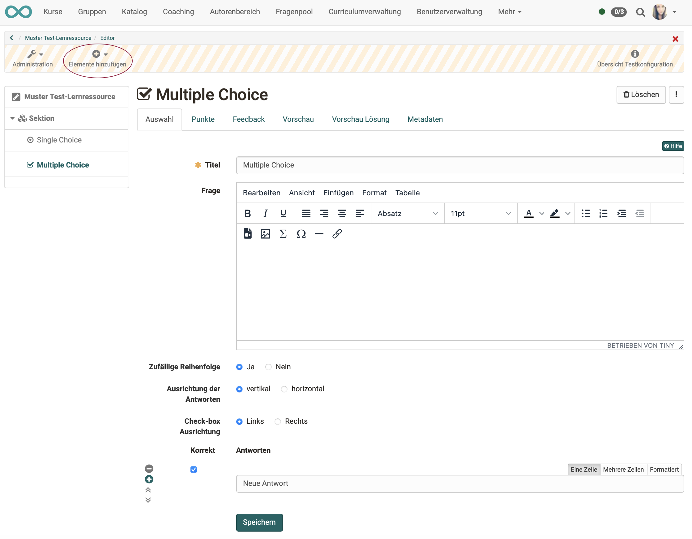{ class="lightbox" title="Test editor" }

13\. In the "Choice" tab, enter the title of the question, the question wording and the possible answers. Additional answer options are added via the plus sign.

14\. In the "Points" tab you define the type and the sum of the points.

15\. If necessary, you define a feedback to the question. You can view the question via "Preview".

You add more questions according to the same principle. The details of the settings can vary depending on the question type. You can also further structure your test with sections or test parts.

!!! warning "Attention"

    Be sure to consider in advance which question type is most appropriate for your particular purposes, as the question type cannot be changed after the fact.

!!! tip "Tip"

    Copying questions is recommended when you have several questions with the same answer options, e.g. several questions with a value from a scale of 1-5.

 

---

## Procedure Option 2

If you already have some experience as an author and a course already exists, you can start with the learning resource "Test".

 

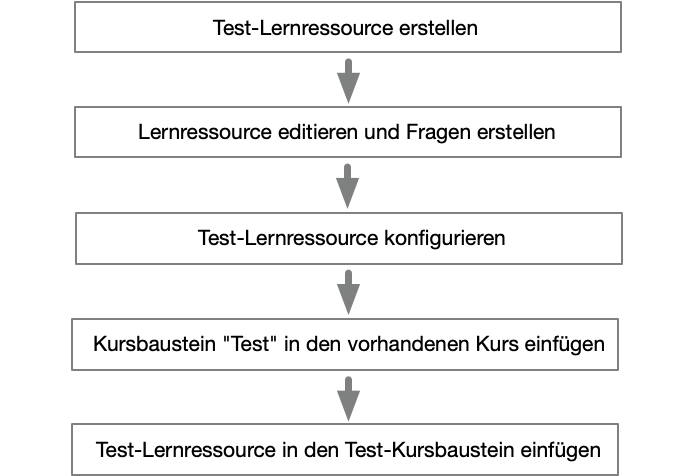{ class="lightbox" title="Procedure option 2" }

 

> <h3>Create a test learning resource</h3>

 

1\. In Authoring, select the link "Create" and select the learning resource "Test".

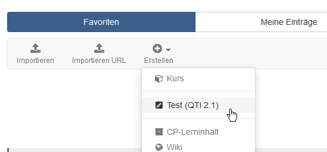{ class="shadow lightbox" title="Authoring" }

2\. Enter a title for the test

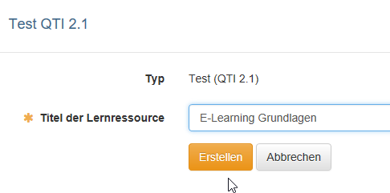{ class="shadow lightbox" title="Dialog for creating a test" }

3\. A menu appears. Here you can make further settings in the different tabs if required.

The menu corresponds to the settings in the Administration section and can also be edited later.

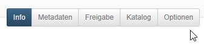{ class="shadow lightbox" title="Settings of the test learning resource" }

:octicons-device-camera-video-24: **Video introduction (German)**: [Test-Lernressource erstellen](<https://www.youtube.com/embed/WUs-upCf2tQ>){:target="_blank"}

 

> <h3>Edit learning resource and create questions</h3>

 

4\. In the "Administration" of the learning resource "Test", select the entry "Test editor". You will get to the test editor.

{ class="shadow lightbox" title="Administration menu of a test learning resource · 2026.09.28" }

5\. Select "Add elements" and select the appropriate question type, e.g. multiple choice.

6\. In the "Choice" tab, enter the title of the question, the question wording and the possible answers. Additional answer options are added via the plus sign.

7\. In the "Points" tab, define the type and the sum of the points.

8\. If needed, define a feedback to the question and preview it.

Add more questions according to the same principle. The details of the settings can vary depending on the question type. You can also further structure your test with sections or test parts.

:octicons-device-camera-video-24: **Video introduction (German)**: [Fragen erstellen](<https://www.youtube.com/embed/2ZrINPQ6tYw>){:target="_blank"}

!!! info "Important"

    By default, a single choice question is already created, which you should use and edit or delete.

!!! warning "Attention"

    Be sure to consider in advance which question type is most appropriate for your particular purposes, as the question type cannot be changed after the fact.

!!! tip "Tip"

    Copying questions is recommended when you have several questions with the same answer options, e.g. several questions with a value from a scale of 1-5.

 

> <h3>Configure learning resource "Test"</h3>

 

9\. Select the top item of the test learning resource and edit the associated tabs as needed.

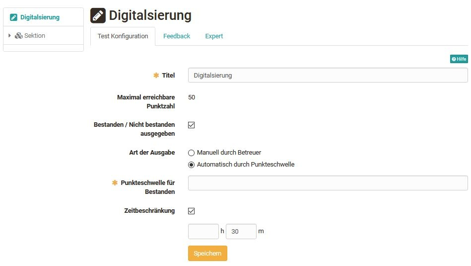{ class="shadow lightbox" title="Tab Test configuration in the test editor" }

10\. **Test configuration:** Define from how many points the test is passed and whether or what time limit there is.

Define, if desired, a **general feedback:** in case of pass/fail (applies to automatic pass).

11\. **Expert:** Configure further details of the test procedure, e.g. type of navigation or display of solutions.

12\. Finally, close the test editor by clicking on the title of the test in the breadcrumb navigation.

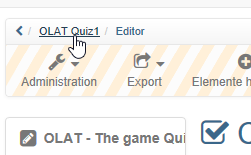{ class="shadow lightbox" title="Breadcrumb navigation in the test editor" }

:octicons-device-camera-video-24: **Video introduction (German)**: [Kursbausteine konfigurieren](<https://www.youtube.com/embed/SAkzzoOQEoQ>){:target="_blank"}

!!! tip "Tip"

    You can create feedback for individual questions as well as for the entire test.

 

> <h3>Insert course element "Test" into the existing course</h3>

 

13\. Go to Authoring. In the "My entries" area you will find your courses. Open the course in which you want to include the test.

14\. Open the "Course editor" via "Administration". Select "Insert course elements" and click on the desired course element type "Test" or "Self-test".

 

> <h3>Insert learning resource "Test" into the course element "Test"</h3>

 

15\. Go to the "Test configuration" tab and click the "Select, create or import file" button. 
A list with your test learning resources appears. Select the prepared test by clicking on the selection hook.

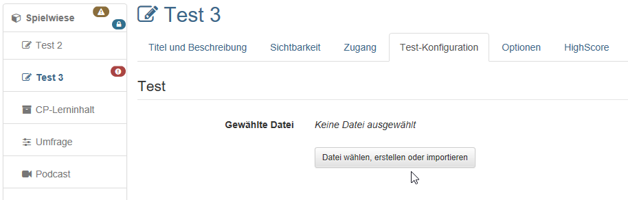{ class="shadow lightbox" title="Tab Test configuration in the course element Test" }

16\. If required, you can preview the included test in the "Test configuration" tab under "Selected file" and also edit it as long as it has not been used by participants.

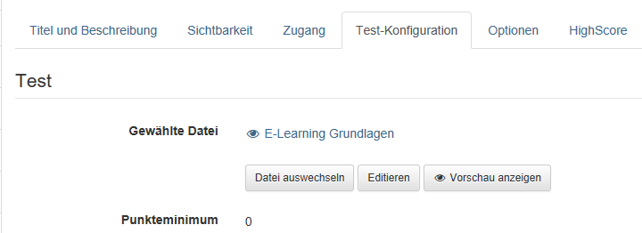{ class="shadow lightbox" title="Tab Test configuration with selected test" }

17\. If required, the other tabs of the course element can still be configured. You can partially override the settings of the test learning resource with the settings of the course element. This makes sense if the same test learning resource is used in different courses.

18\. In order for learners to be able to work on the test, the course must still be published. To do this, simply close the course editor, e.g. by clicking on the name of the course in the breadcrumb navigation, and select "Publish manually" or "Publish automatically" in the dialog that appears.

Alternatively, you can also use the "Publish" button in the editor on the right side of the toolbar or the small red cross in the upper right corner.

19\. In order for learners to work on the test, the status of the course still needs to be changed to "Published". 
In the members management of the course you decide which learners get access.

20\. Once test results are available, coaches can make assessments in the assessment tool. (Does not apply to self-tests.) 
Further information can be found in the chapter "[Assessing tests](../../manual_user/learningresources/Assessing_tests.md)".

 

---

## Procedure Option 3

Is there a division of work and you, as the subject matter expert, are to create the questions that various colleagues can use in their tests? 
Then you can also start creating the individual questions in the question bank.

 

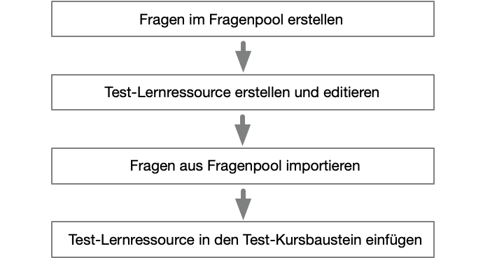{ class="lightbox" title="Procedure option 3" }

 

> <h3>Create questions in the question bank</h3>

 

1\. If you have author rights, the question bank is displayed in the main navigation in addition to Authoring. Go to the question bank.

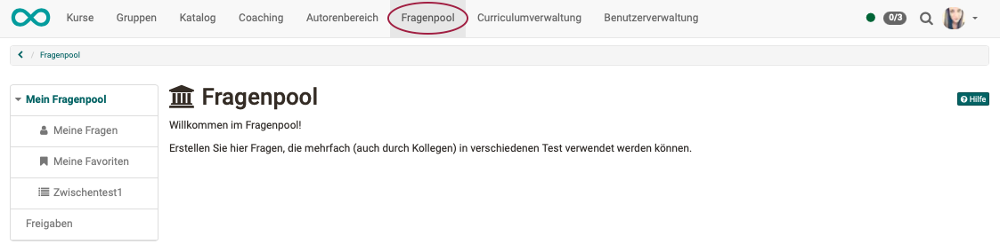{ class="lightbox" title="Question bank in the main navigation" }

2\. Select "Create question" and the appropriate question type, e.g. Multiple Choice.

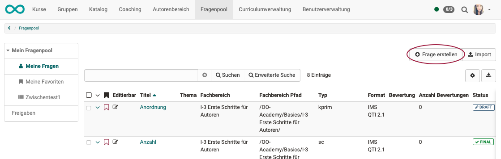{ class="lightbox" title="Question bank" }

3\. In the "Choice" tab, enter the title of the question, the question wording and the possible answers. Additional answer options are added via the plus sign.

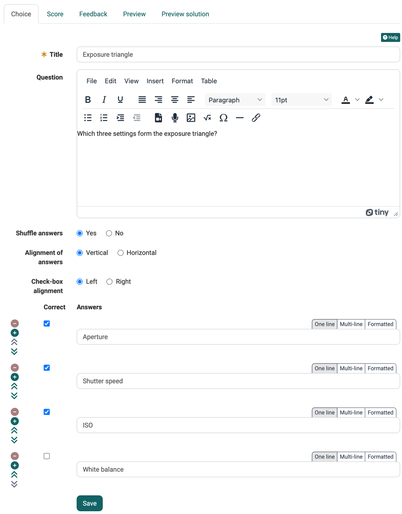{ class="lightbox" title="Question in the question bank · 2026.09.28" }

4\. In the "Points" tab you define the type and the sum of the points.

5\. If necessary, you define a feedback to the question. You can view the question via "Preview".

Add more questions according to the same principle. The details of the settings can vary depending on the question type. You can also further structure your test with sections or test parts.

!!! warning "Attention"

    Be sure to consider in advance which question type is most appropriate for your particular purposes, as the question type cannot be changed after the fact.

!!! tip "Tip"

    Copying questions is recommended when you have several questions with the same answer options, e.g. several questions with a value from a scale of 1-5.

 

> <h3>Create and edit test learning resource</h3>

 

6\. Switch to Authoring and create a test (test learning resource).

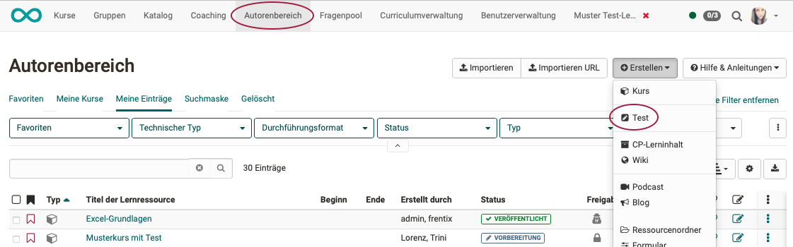{ class="lightbox" title="Authoring" }

!!! note "Note"

    The new test learning resource is not listed under the "My courses" tab in Authoring, but under "My entries". It is recognizable by the icon for test learning resources.
    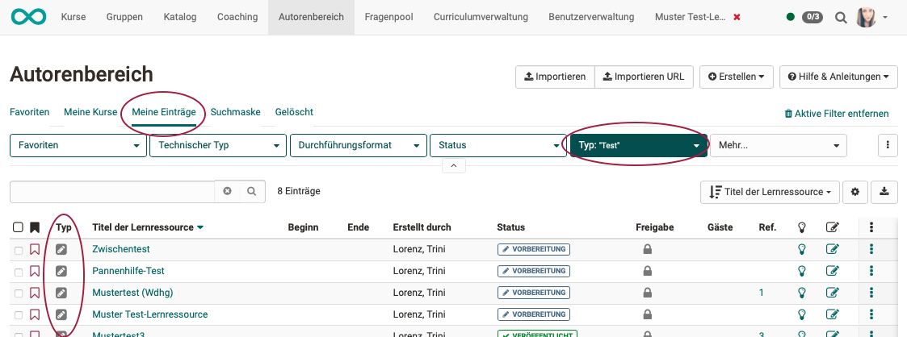{ class="lightbox" title="Tab My entries in Authoring" }

7\. Open the editor by clicking **Administration** and then **"Test editor"**.

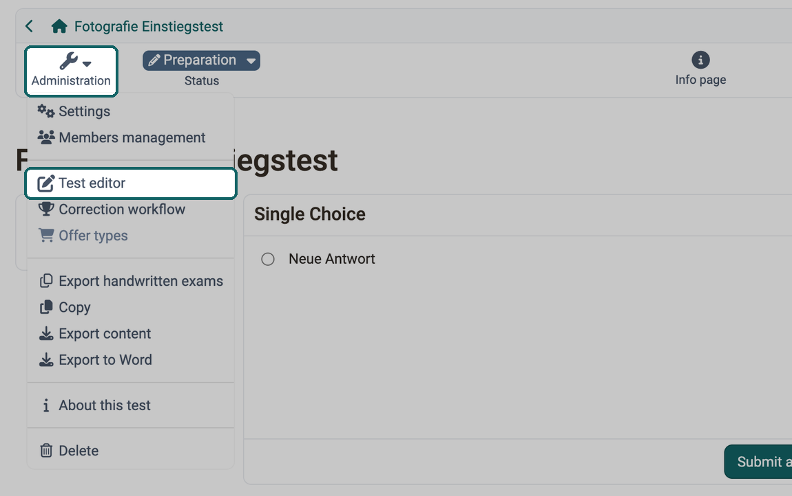{ class="lightbox" title="Administration menu of a test learning resource · 2026.09.28" }

8\. In the test editor (recognizable by the shaded header) you can now add new questions under **"Add elements"**.

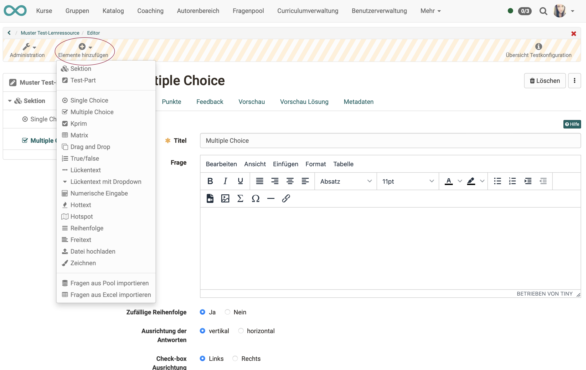{ class="lightbox" title="Test editor" }

 

> <h3>Import questions from the question bank</h3>

 

9\. As an alternative to creating new questions, you can add existing questions under the same menu item with **"Import questions from pool"**.

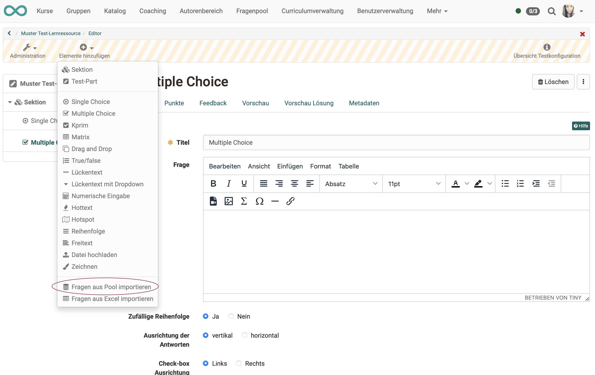{ class="lightbox" title="Menu Add elements in the test editor" }

10\. If you click on the title of a single question, it will be inserted directly. To import several questions, select the questions and confirm by clicking the "Select" button.

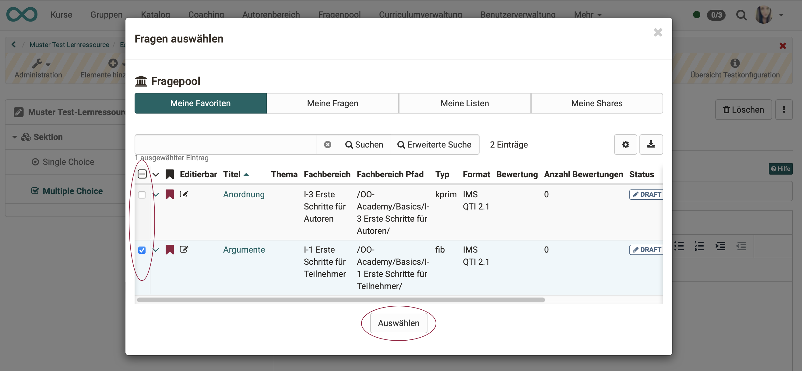{ class="lightbox" title="Dialog Choose questions" }

11\. Once all the questions are recorded in the test learning resource, exit the learning resource editor.

 

> <h3>Insert test learning resource into the test course element</h3>

 

12\. Go to Authoring. In "My entries" you will find your courses. Open the course in which you want to include the test learning resource.

13\. Open the "Course editor" via "Administration". Select "Insert course elements" and click on the desired course element type "Test" or "Self-test".

14\. Go to the "Test configuration" tab and click the "Select, create or import file" button. 
A list with your test learning resources will appear. Select the prepared test by clicking the selection hook.

15\. If required, you can preview the included test in the "Test configuration" tab under "Selected file" and also edit it as long as it has not been used by participants.

16\. The other tabs of the course element can be configured as required. You can partly override the settings of the test learning resource with the settings of the course element. This makes sense if the same test learning resource is used in different courses.

17\. In order for learners to be able to work on the test, the course must still be published. To do this, simply close the course editor, e.g. by clicking on the name of the course in the breadcrumb navigation, and select "Publish manually" or "Publish automatically" in the dialog that appears.

Alternatively, you can also use the "Publish" button in the editor on the right side of the toolbar or the small red cross in the upper right corner.

18\. In order for learners to work on the test, the status of the course still has to be changed to "Published". 
In the members management of the course you decide which learners get access.

19\. Once test results are available, coaches can make assessments in the assessment tool. (Does not apply to self-tests.) 
Further information can be found in the chapter "[Assessing tests](../../manual_user/learningresources/Assessing_tests.md)".

 

---

## Checklist {: #checklist}

- [x] Course available?

- [x] Course element "Test" or "Self-test" available?

- [x] Learning resource "Test" created?

- [x] Already existing questions from the question bank transferred into the learning resource?

- [x] Additional questions created within the learning resource?

- [x] Learning resource "Test" configured?

- [x] Course element "Test" configured?

---

## Further information {: #further_information}

[How do I create my first OpenOlat course? >](../my_first_course/my_first_course.md) 
[Assessing tests >](../../manual_user/learningresources/Assessing_tests.md) 
[Test editor >](../../manual_user/learningresources/Test_editor_QTI_2.1.md) 
[Course Element "Test" >](../../manual_user/learningresources/Course_Element_Test.md) 
[Question Bank: Overview >](../../manual_user/area_modules/Question_Bank.md) 
[How do I exchange a test? >](../exchange_tests/exchange_tests.md)

**youtube** 
[Funktionsprinzipien](<https://www.youtube.com/embed/M-JkSAFN298>) 
[Kurse erstellen und bearbeiten](<https://www.youtube.com/embed/SfOSyDG0qvE>) 
[Überblick Testing](<https://www.youtube.com/embed/fkqH41-8CaI>) 
[Wie funktionieren Tests in OpenOlat?](<https://www.youtube.com/embed/M0p3UKaEOlg>) 
[Test-Lernressource erstellen](<https://www.youtube.com/embed/WUs-upCf2tQ>) 
[Fragen erstellen](<https://www.youtube.com/embed/2ZrINPQ6tYw>) 
[Kursbausteine konfigurieren](<https://www.youtube.com/embed/SAkzzoOQEoQ>) 
[Tests erstellen/bearbeiten](<https://www.youtube.com/embed/eNNdDdQDlfs>)

[To the top of the page ^](#test_creation_procedure)
