# How do I proceed when I create a test?

!!! info ""

    **Objectives and content of this instruction**

    There are various ways to create tests in OpenOlat. Here you will find an overview of the most common ways. Get to know the possibilities and then choose the procedure that suits you best.

!!! info ""

    **Target group**
    
    [x] Beginners [x] Advanced Users [ ] Experts

!!! info ""

    **Expected previous knowledge**

    * [„How do I create my first OpenOlat course?"](../my_first_course/my_first_course.md)

 

---

## The interaction of the components

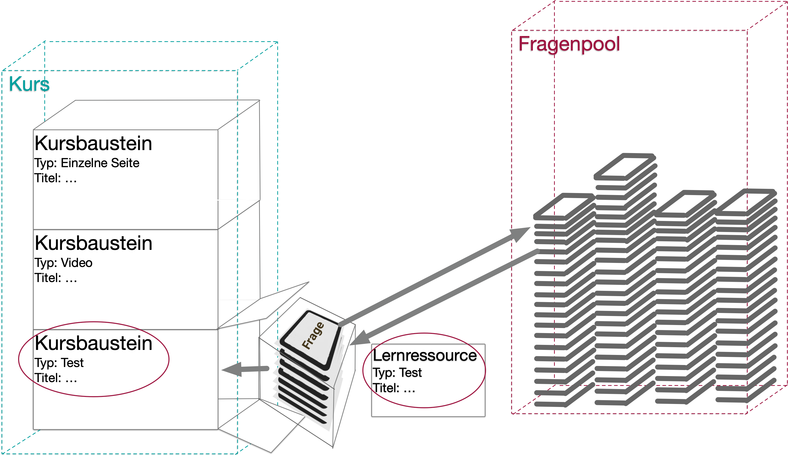{ class="lightbox" } 

**Course:** It is assembled from course elements in the course editor. 

**Course element:**  Most course elements are containers into which a learning resource is inserted. E.g. a learning resource "Test" is inserted into the course element "Test". Please distinguish between these two "Tests"!

**Questions:**  A test learning resource consists of several individual questions, e.g., single choice, multiple choice, etc. 

**Question pool:**  The individual questions can be collected in a question pool. When creating different test learning resources, the question pool can then be accessed. Existing questions from the question pool can be adopted (copied from there) and additional new questions can be created.  
Questions can be created in the question pool or the learning resource. Questions created in the learning resource are only available in this test learning resource as long as they are not transferred to the question pool for multiple use.

 

Settings (configurations) can be made for each of the elements. The configurations can therefore be made at different levels.

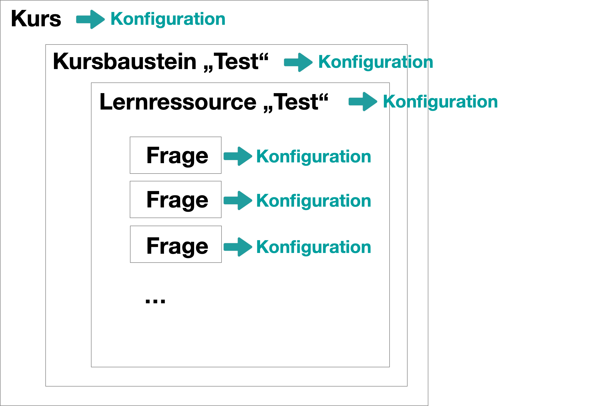{ width=450px class="lightbox" }

**Configuration of the course:** 
Authoring > select the course > Administration > Settings

**Configuration of the course element:** 
Authoring > select the course > Administration > Course editor > select the course element > settings in the tabs

**Configuration of the learning resource:** 
Authoring > select the form learning resource > Administration > Settings 

**Configuration of a question:** 
Open the question in the question editor > switch with a click on an element into the edit mode > related options appear 

 

:octicons-device-camera-video-24: **Video introduction (German)**: [Funktionsprinzipien](<https://www.youtube.com/embed/M-JkSAFN298>){:target="_blank”}

:octicons-device-camera-video-24: **Video introduction (German)**: [Kurse erstellen und bearbeiten](<https://www.youtube.com/embed/SfOSyDG0qvE>){:target="_blank”}

:octicons-device-camera-video-24: **Video introduction (German)**: [Überblick Testing](<https://www.youtube.com/embed/fkqH41-8CaI>){:target="_blank”}

:octicons-device-camera-video-24: **Video introduction (German)**: [Wie funktionieren Tests in OpenOlat?](<https://www.youtube.com/embed/M0p3UKaEOlg>){:target="_blank”}

 

---

## Procedure Option 1

If you are starting from scratch with the creation of a course, the following procedure is obvious. 

 

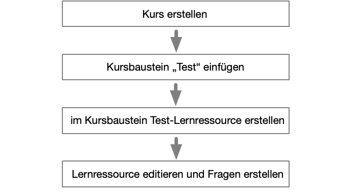{ class="lightbox" } 

 

> <h3>Create a course</h3>

 
!!! tip "Note"

    If you do not have any experience in course creation, you will find in chapter [„How do I create my first OpenOlat course?"](../my_first_course/my_first_course.de.md) an instruction.

1\. Go to the authoring area and create there a new course.

{ class="lightbox" } 
 
2\. Assign a title and make initial settings for the course. Decide on a design.

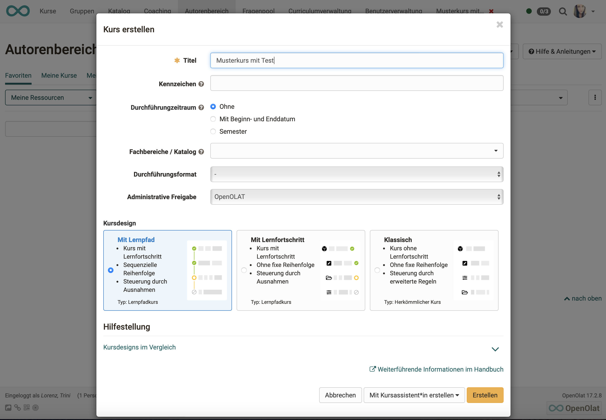{ class="lightbox" } 

3\. If you want to use a wizard (course wizard) for the further process of course creation, you will be asked if you want to create an exam course.
An exam course is a normal course (no matter if learning path course or conventional course) that already contains a certain configuration. So this option provides a later work relief.

{ class="lightbox" } 

4\. The first screen after clicking the "Create" button is the settings overview (configuration of the course).

!!! tip "Note"

    Apart from the course design, you can also access and adjust the other details later under **Administration > Settings**.

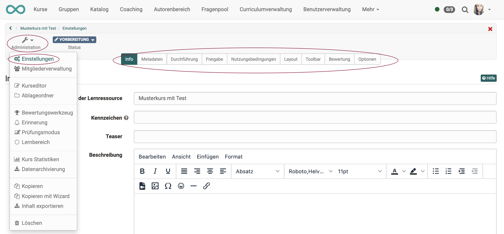{ class="lightbox" } 

 

> <h3>Insert course element "Test"</h3>

 

5\. Open the **Course Editor** via the "Administration". Select "Insert course elements" and click on the desired course element type "Test" or "Self test" there. This will insert a course element of this type.

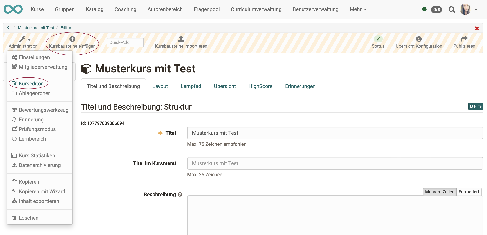{ class="lightbox" } 

 

> <h3>Create a test learning resource within the course element</h3>

 

6\. Select the test course element in the course menu on the left.

7\. In den zugehörigen Tabs auf der rechten Seite befindet sich unter "Test-Konfiguration" der Button "Erstellen". Erstellen Sie mit ihm eine neue Test-Lernressource.
In the related tabs on the right side, under "Test configuration" you will find the "Create" button. Use it to create a new test learning resource.

{ class="lightbox" } 

8\. Enter a name for the test learning resource as well.

{ class="lightbox" } 

 

> <h3>Edit learning resource and create questions</h3>

 

9\. After creating the new test learning resource, you have the possibility to edit it, i.e. add questions.

{ class="lightbox" } 

10\. By default, a single choice question is already available. You can use this as a sample, delete it or modify it according to your needs.

{ class="lightbox" } 

11\. In the "Administration" of the test learning resource, now select "Edit content" and you will get to the editor of the learning resource (not the editor of the course).

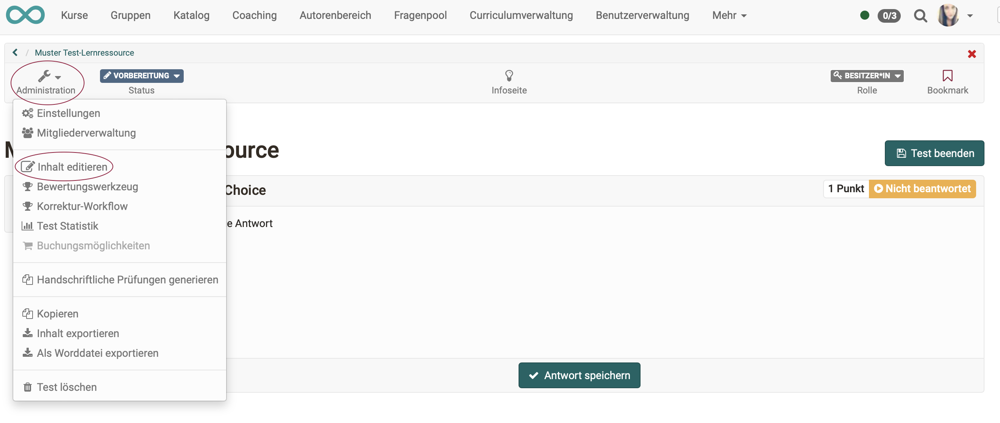{ class="lightbox" } 
  
12\. Select "Add items" and the appropriate question type, e.g. Multiple Choice.

{ class="lightbox" } 

13\. In the "Selection" tab, enter the title of the question, the question wording and the possible answers. Additional answer options are added via the plus sign.

14\. In the "Points" tab you define the type and the sum of the points.

15\. If necessary, you define a feedback to the question. You can view the question via "Preview".
  
You add more questions according to the same principle. The details of the settings can vary depending on the question type. You can also further structure your test with sections or test parts.

!!! warning "Attention"

    Be sure to consider in advance which question type is most appropriate for your particular purposes, as the question type cannot be changed after the fact.

!!! tip "Hint"

    Copying questions is recommended when you have several questions with the same answer options, e.g. several questions with a value from a scale of 1-5.

 

---

## Procedure Option 2

If you already have some experience as an author and a course already exists, you can start with the learning resource "Test".

 

{ class="lightbox" } 

 

> <h3>Create a test learning resource</h3>

 

1\. In the authoring area, select the link "Create" and select the learning resource "Test".
   
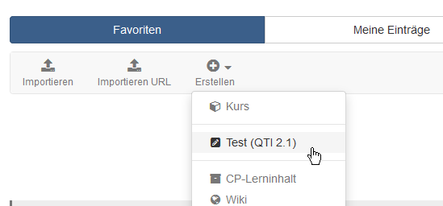{ class="shadow lightbox"}
  
2\. Enter a title for the test

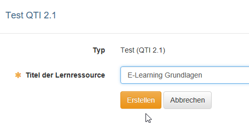{ class="shadow lightbox"}
  
3\. A menu appears. Here you can make further settings in the different tabs if required.

The menu corresponds to the settings in the Administration section and can also be edited later.

{ class="shadow lightbox"}

:octicons-device-camera-video-24: **Video introduction (German)**: [Test-Lernressource erstellen](<https://www.youtube.com/embed/WUs-upCf2tQ>){:target="_blank”}

 

> <h3>Edit learning resource and create questions</h3>

 

4\. In the "Administration" of the learning resource "Test" select "Edit content" and you will get to the test editor.

{ class="shadow lightbox"}
  
5\. Select "Add elements" and select the appropriate question type, e.g. multiple choice.

6\. In the "Selection" tab, enter the title of the question, the question wording and the possible answers. Additional answer options are added via the plus sign.

7\. In the "Points" tab, define the type and the sum of the points.

8\. If needed, define a feedback to the question and preview it.
  
Add more questions according to the same principle. The details of the settings can vary depending on the question type. You can also further structure your test with sections or test parts.

:octicons-device-camera-video-24: **Video introduction (German)**: [Fragen erstellen](<https://www.youtube.com/embed/2ZrINPQ6tYw>){:target="_blank”}

!!! info "Note"

    By default, a single choice question is already created, which you can use and edit or delete.

!!! warning "Attention"

    Be sure to consider in advance which question type is most appropriate for your particular purposes, as the question type cannot be changed after the fact.

!!! tip "Hint"

    Copying questions is recommended when you have several questions with the same answer options, e.g. several questions with a value from a scale of 1-5.

 

> <h3> Configure learning resource "Test"</h3>

 

9\. Select the top item of the test learning resource and edit the associated tabs as needed.

{ class="shadow lightbox" }

10\. **Test configuration:** Define from how many points the test is passed and whether or what time limit there is.

Define, if desired, a **general feedback:** in case of pass/fail (applies to automatic pass).

11\. **Expert:** Configure further details of the test procedure, e.g. type of navigation or display of solutions.

12\. Finally, close the test editor by clicking on the title of the test in the breadcrumb navigation.

{ class="shadow lightbox" }

:octicons-device-camera-video-24: **Video introduction (German)**: [Kursbausteine konfigurieren](<https://www.youtube.com/embed/SAkzzoOQEoQ>){:target="_blank”}

!!! info "Note"

    You can create feedback for individual questions as well as for the entire test.

 

> <h3>Insert course element "Test" into the existing course</h3>

 

13\. Go to the authoring area. In the "My entries" area you will find your courses. Open the course in which you want to include the test.

14\. Open the course editor via "Administration". Select "Insert course elements" and click on the desired course element type "Test" or "Self-test".

 

> <h3>Insert learning resource "Test" into the course element "Test"</h3>

 

15\. Go to the "Test configuration" tab and click the "Select, create or import file" button. 
A list with your test learning resources appears. Select the prepared test by clicking on the selection hook.

{ class="shadow lightbox" }

16\. If required, you can preview the included test in the "Test configuration" tab under "Selected file" and also edit it as long as it has not been used by participants.

{ class="shadow lightbox" }

17\. If required, the other tabs of the course element can still be configured. You can partially override the settings of the test learning resource with the settings of the course element. This makes sense if the same test learning resource is used in different courses.

18\. In order for learners to be able to work on the test, the course must still be published. To do this, simply close the course editor, e.g. by clicking on the name of the course in the breadcrumb navigation, and allow publishing by selecting "Yes, manually" or "Yes, automatically" in the selection that appears.

Alternatively, you can also use the "Publish" button in the editor on the right side of the toolbar or the small red cross in the upper right corner.

19\. In order for learners to work on the test, the status of the course still needs to be changed to "Published". 
In the member management of the course you decide which learners get access.

20\. Once test results are available, coaches can make assessments in the coaching tool. (Does not apply to self-tests). 
Further information can be found in chapter "[Evaluate Tests](../course_operation/Assessing_tests.md)".

 

---

## Procedure Option 3

Is there a division of work and you, as the subject matter expert, are to create the questions that various colleagues can use in their tests?
Then you can also start creating the individual questions in the question pool.

 

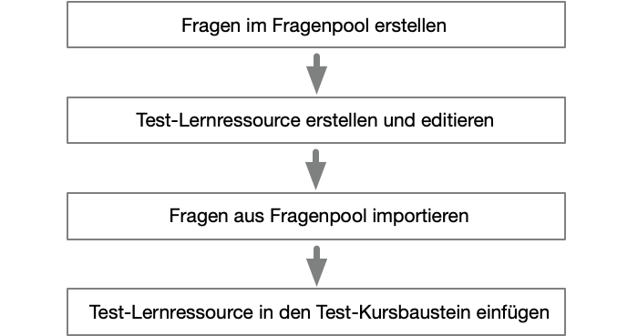{ class= "lightbox" } 

 

> <h3>Create questions in the question pool</h3>

 

1\. If you have author rights, the question pool is displayed in the menu of your header in addition to  "Authoring". Go to the question pool.

{ class="lightbox" } 

2\. Select "Create question" and the appropriate question type, e.g. Multiple Choice.

{ class="lightbox" } 

3\. In the "Selection" tab, enter the title of the question, the question wording and the possible answers. Additional answer options are added via the plus sign.

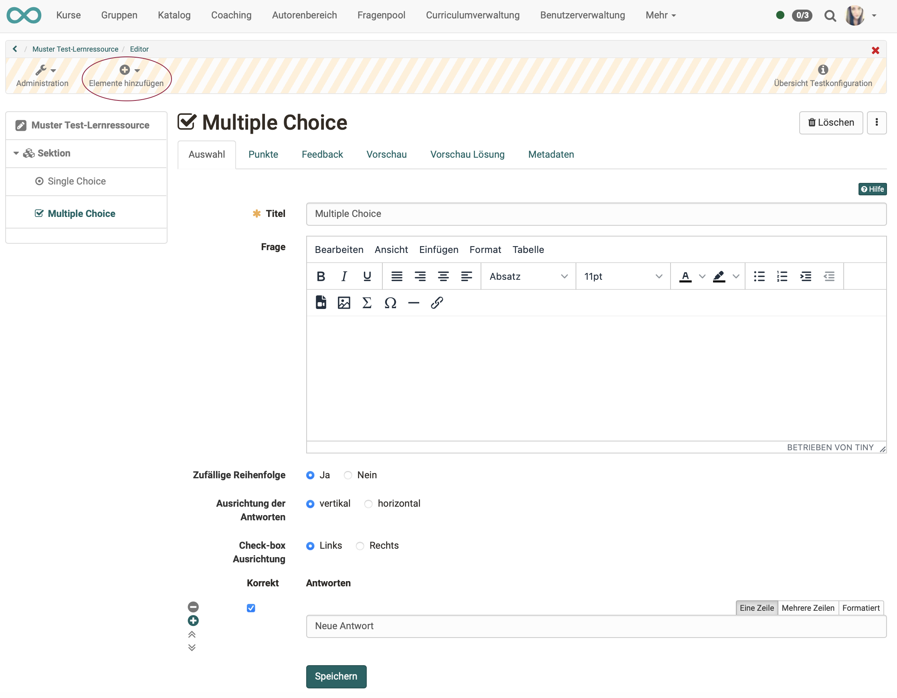{ class="lightbox" } 

4\. In the "Points" tab you define the type and the sum of the points.

5\. If necessary, you define a feedback to the question. You can view the question via "Preview".
  
Add more questions according to the same principle. The details of the settings can vary depending on the question type. You can also further structure your test with sections or test parts.

!!! warning "Attention"

    Be sure to consider in advance which question type is most appropriate for your particular purposes, as the question type cannot be changed after the fact.

!!! tip "Hint"

    Copying questions is recommended when you have several questions with the same answer options, e.g. several questions with a value from a scale of 1-5.

 

> <h3>Create and edit test learning resource</h3>

 

6\. Switch to the authoring area and create a test (test learning resource).

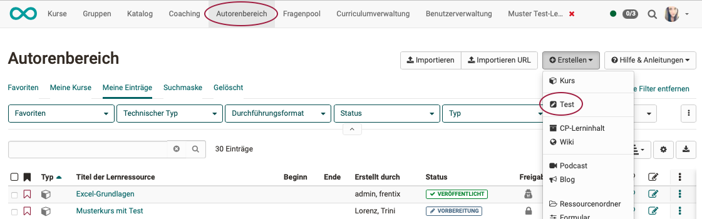{ class="lightbox" } 

!!! hint "Hint"

    The new test learning resource is not listed under the "My courses" tab in the authoring, but under "My entries". recognizable by the icon for test learning resources.
	{ class="lightbox" } 

7\. Open the editor by clicking **Administration** and then **"Edit content"**.

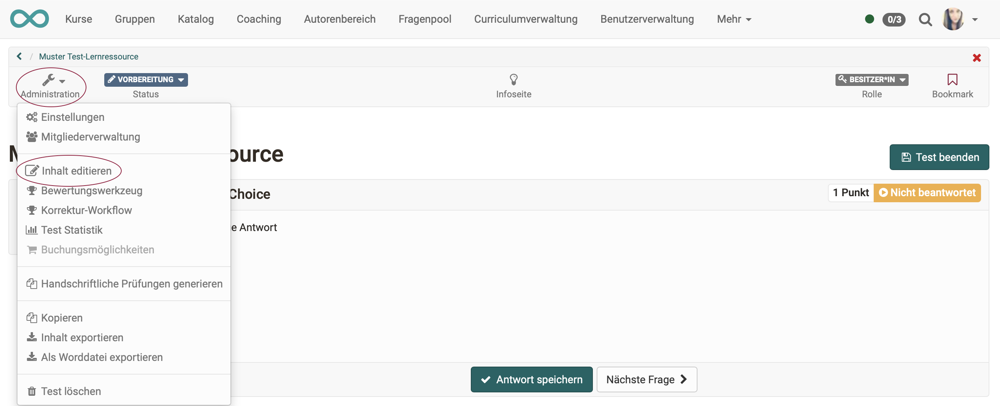{ class="lightbox" } 

8\. In edit mode (recognizable by the shaded header) you can now add new questions under **"Add elements "**.

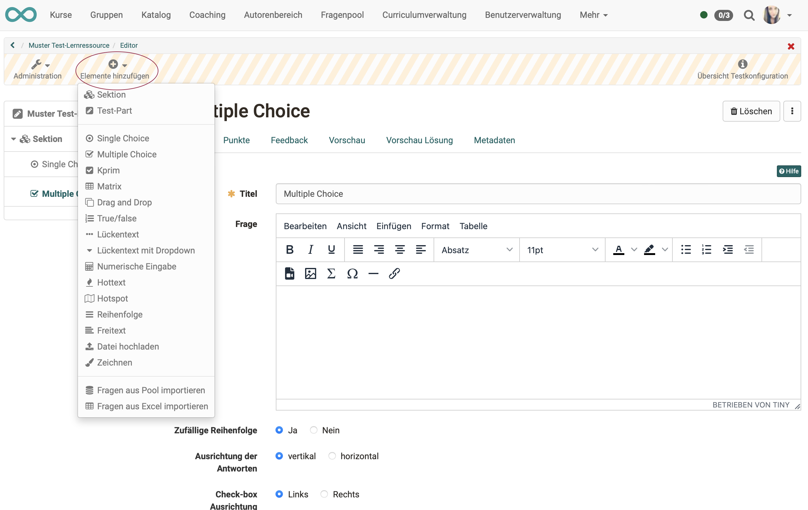{ class="lightbox" } 

 

> <h3>Import questions from the question pool</h3>

 

9\. Alternativ zur Erstellung neuer Fragen, können Sie unter dem gleichen Menüpunkt bereits vorhandene Fragen **"aus dem Fragenpool importieren"**.
As an alternative to creating new questions, you can **import existing questions from the question pool** under the same menu item.

{ class="lightbox" } 

10\. If you click on the title of a single question, it will be inserted directly. To import several questions, select the questions and confirm by clicking the "Select" button.

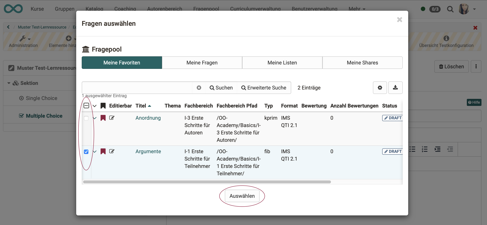{ class="lightbox" } 

11\. Once all the questions are recorded in the test learning resource, exit the learning resource editor.

 

> <h3>Insert test learning resource into the test course element</h3>

 

12\. Go to the authoring area. In "My entries" you will find your courses. Open the course in which you want to include the test learning resource.

13\. Open the "Course editor" via "Administration". Select "Insert course elements" and click on the desired course element type "Test" or "Self-test".

14\. Go to the "Test Configuration" tab and click the "Select, Create or Import File" button.
A list with your test learning resources will appear. Select the prepared test by clicking the selection hook.

15\. If required, you can preview the included test in the "Test configuration" tab under "Selected file" and also edit it as long as it has not been used by participants.

16\. The other tabs of the course element can be configured as required. You can partly override the settings of the test learning resource with the settings of the course element. This makes sense if the same test learning resource is used in different courses.

17\. In order for learners to be able to use the test, the course must still be published. To do this, simply close the course editor, e.g. by clicking on the name of the course in the breadcrumb navigation, and allow publishing by selecting "Yes, manually" or "Yes, automatically" in the selection that appears.

Alternatively, you can also use the "Publish" button in the editor on the right side of the toolbar or the small red cross in the upper right corner.

18\. In order for learners to be able to take the test, the status of the course still has to be changed to "Published".
You determine which learners get access in the member administration of the course.

19\. Once test results are available, coaches can make assessments in the coaching tool. (Does not apply to self-tests).
For more information, see chapter "Assingning tests".

 

---

## Links

:octicons-device-camera-video-24: **Video introduction (German)**: [Funktionsprinzipien](<https://www.youtube.com/embed/M-JkSAFN298>){:target="_blank”}

:octicons-device-camera-video-24: **Video introduction (German)**: [Kurse erstellen und bearbeiten](<https://www.youtube.com/embed/SfOSyDG0qvE>){:target="_blank”}

:octicons-device-camera-video-24: **Video introduction (German)**: [Überblick Testing](<https://www.youtube.com/embed/fkqH41-8CaI>){:target="_blank”}

:octicons-device-camera-video-24: **Video introduction (German)**: [Wie funktionieren Tests in OpenOlat?](<https://www.youtube.com/embed/M0p3UKaEOlg>){:target="_blank”}

:octicons-device-camera-video-24: **Video introduction (German)**: [Test-Lernressource erstellen](<https://www.youtube.com/embed/WUs-upCf2tQ>){:target="_blank”}

:octicons-device-camera-video-24: **Video introduction (German)**: [Fragen erstellen](<https://www.youtube.com/embed/2ZrINPQ6tYw>){:target="_blank”}

:octicons-device-camera-video-24: **Video introduction (German)**: [Tests erstellen/bearbeiten](<https://www.youtube.com/embed/eNNdDdQDlfs>){:target="_blank”}

:octicons-device-camera-video-24: **Video introduction (German)**: [Kursbausteine konfigurieren](<https://www.youtube.com/embed/SAkzzoOQEoQ>){:target="_blank”}

 

---

## Checklist

- [x] Course available?

- [x] Course element "Test" or "Self test" available?

- [x] Learning resource "Test" created?

- [x] Already existing questions from the question pool transfered into the learning resource? 

- [x] Additional questions created within the learning resource?

- [x] Learning resource "Test" configured?

- [x] Course element "Test" configured?? 
