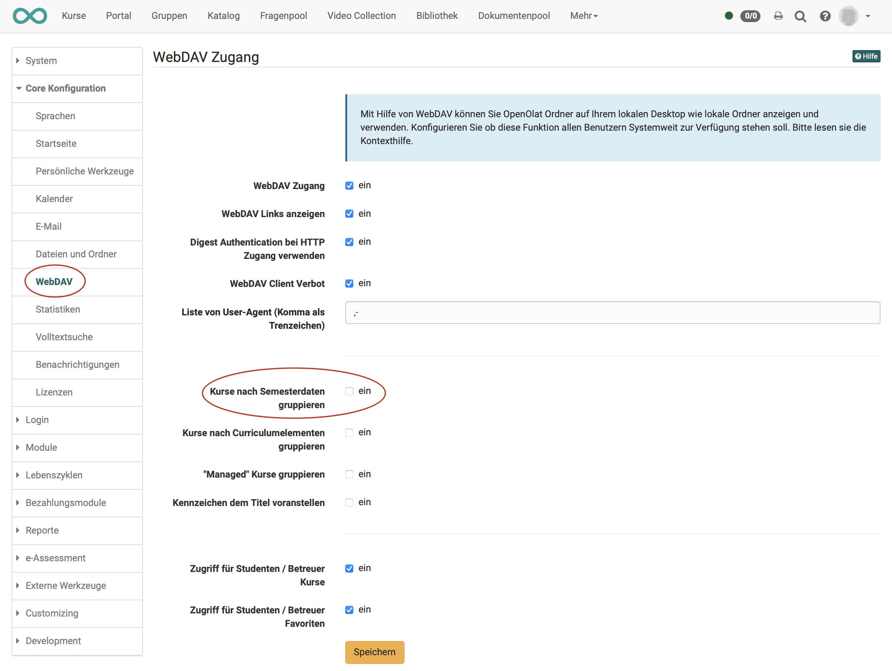

# Wie kann ich mittels WebDAV Dateien übertragen?

## Was ist WebDAV?

WebDAV steht für „Web-based Distributed Authoring and Versioning“ und ist ein
offener Standard zur Übermittlung von Dateien im Internet. OpenOlat
unterstützt dieses Protokoll und ermöglicht so einen einfachen Dateitransfer
von Ihrem Rechner zu OpenOlat-Ordnern.

!!! info "Vorteile von WebDAV"

    Ohne WebDAV können Dateien nur über herkömmliche Upload-Formulare in OpenOlat hochgeladen werden. Dabei wählen Sie entweder jede Datei einzeln oder mehrere gezippte Dateien aus. 
    
    Mit WebDAV hingegen können Sie von Ihrem Rechner bequem mehrere Dateien oder komplette Ordnerstrukturen in OpenOlat-Ordner, z.B. in den Ablageordner eines Kurses kopieren.

## Auf welche OpenOlat-Ordner kann mit WebDAV zugegriffen werden?

Mit WebDAV kann selbstverständlich nicht auf alle Ordner und Dateien einer OpenOlat-Installation von aussen zugegriffen werden. Nur die nachstehend aufgeführten Ordner sind WebDAV-fähige Ordner.

Sobald die Elemente über OpenOlat angelegt wurden, wird die Struktur automatisch erstellt. Sie können auf folgende OpenOlat-Ordner zugreifen: 

  * [Persönlicher Ordner](../../manual_user/personal/Personal_folders.de.md) (jeder)
  * [Ordner von Gruppen](../../manual_user/groups/Using_Group_Tools.de.md) (Gruppenmitglieder)
  * [Ablageordner von Kursen](../../manual_user/course_operation/Storage_folder.de.md) (nur Kursbesitzer)
  * [Kursbaustein Ordner](../../manual_user/course_elements/Course_Element_Folder.de.md) (Kursmitglieder)
  * [Ressourcenordner](../../manual_user/course_create/Course_Settings.de.md#ressourcenordner-einbinden) (nur Lernressourcenbesitzer)

Wer in den jeweiligen Ordnern Dateien per WebDAV hochladen darf, ist abhängig von der jeweiligen Konfiguration.

## Welche Voraussetzungen muss ich schaffen?

Microsoft Windows, Mac OSX, iOS, Android und Linux unterstützen WebDAV für
Drag&Drop Dateiübermittlung standardmässig. Inzwischen bieten auch diverse
Anwenderprogramme (z.B. Microsoft Office) WebDAV-Funktionalität an.

Um einen Ordner auf OpenOlat über WebDAV zu erreichen, benötigen Sie:

  * Einen WebDAV-Link: Diesen Link findet man im persönlichen Menu rechts oben im Bereich
"Konfiguration" unter "Einstellungen" → "WebDAV" bzw. unterhalb von WebDAV-
fähigen Ordnern
  * Ihren OpenOlat-Benutzernamen, alternativ die hinterlegte E-Mail Adresse
  * Ihr OpenOlat-/WebDAV-Passwort.

!!! info "Hinweis zu Shibboleth und Cloud Login"

    Falls Sie mit Shibboleth oder einem Cloud Login auf OpenOlat zugreifen, können Sie sich Ihr WebDAV- Passwort in den Einstellungen im persönlichen Menu einrichten. 
    Wählen Sie hierzu den Link „Einstellungen“ und klicken Sie anschliessend im Tab „WebDAV“ auf die Schaltfläche „Passwort einrichten“. Wenn Sie bereits über ein OpenOlat-Passwort verfügen, verwenden Sie dieses für den WebDAV Zugang. 
  

## Die WebDAV-Verbindung einrichten

??? abstract "Windows 10 (sowie 7 + 8)"

    1. Starten Sie den Windows Explorer
    2. Klicken Sie mit der rechten Maus auf „Dieser PC“
    3. Wählen Sie „Netzlaufwerk verbinden“
    4. Wählen Sie einen Buchstaben für das Laufwerk.
    5. Wählen Sie ganz unten den Punkt „Verbindung mit einer Webseite herstellen auf der Sie Dokumente und Bilder speichern können“ aus.
    6. Klicken Sie auf „Weiter“.
    7. Markieren Sie „Eine benutzerdefinierte Webadresse auswählen“.
    8. Klicken Sie auf „Weiter“.
    9. Geben Sie den WebDAV-Link ein.
    10. Klicken Sie auf „Weiter“.
    11. Geben Sie nun Ihren OpenOlat-Benutzernamen bzw. die hinterlegte E-Mail Adresse und Ihr Passwort ein.
    12. Klicken Sie auf „Fertigstellen“.

??? abstract "Windows Vista"

    1. Klicken Sie im Startmenü auf „Computer“.
    2. Klicken Sie im folgenden Fenster in der Menüleiste oben auf „Netzlaufwerk zuordnen“ (unter „Weitere Befehle“).
    3. Wählen Sie ganz unten den Punkt „Verbindung mit einer Webseite herstellen“ aus.
    4. Klicken Sie auf „Weiter“.
    5. Markieren Sie „Eine benutzerdefinierte Netzwerkressource auswählen“.
    6. Klicken Sie auf „Weiter“.
    7. Geben Sie bei der Internet- oder Netzwerkadresse den WebDAV-Link ein.
    8. Klicken Sie auf „Weiter“.
    9. Geben Sie nun Ihren OpenOlat-Benutzernamen bzw. die hinterlegte E-Mail Adresse und Ihr Passwort ein.
    10. Sie können einen Namen für die WebDAV-Verbindung eingeben.
    11. Klicken Sie auf „Fertigstellen“.

??? abstract "Mac"

    1. Öffnen Sie im Finder das Menu „Gehe zu“ und dann „Mit Server verbinden.“ und geben dort den WebDAV-Link ein.
    2. Geben Sie nun Ihren OpenOlat-Benutzernamen bzw. die hinterlegte E-Mail Adresse und Ihr Passwort ein.
    3. Klicken Sie auf "OK"

??? abstract "Linux"

    Für Linux-Benutzer gibt es drei Möglichkeiten:

    1. KDE Plasma: im Dolphin in der Pfadleiste webdavs:// + WebDAV-Link eingeben. Es wird nach Benutzername und Kennwort gefragt. Sollte die Pfadleiste nicht angezeigt werden, so kann sie jederzeit mit der Taste F6 aktiviert werden. Beispiel: <webdavs://www.olat.uzh.ch/olat/webdav/>.

    2. Gnome: `davs:// + benutzername oder emailadresse + @` \+ WebDAV-Link eingeben. Beispiel: `davs://pmuster@www.olat.uzh.ch/olat/webdav/`.
    3. FUSE: WebDAV-Verzeichnisse können direkt ins Filesystem gemountet werden (geht auch unter OSX, mehr dazu auf der [FUSE-Website](http://fuse.sourceforge.net "FUSE-Website").

??? abstract "Alternative"

    Neben den beschriebenen Verfahren unter "Einrichten der WebDAV-Verbindung"
    kann alternativ ein WebDAV Client eingesetzt werden. Je nach Setting, vor
    allem bei Windows in Verbindung mit Citrix, kann ein solcher Client stabiler
    funktionieren als die direkte WebDAV-Verbindung. Folgend einige Beispiele für
    WebDAV Clients:

    * Windows: Cyberduck, WinSCP
    * Mac: Cyberduck, Commander One

## Auf diese Ordner haben Sie nun Zugriff

Wenn Sie die Verbindung erfolgreich eingerichtet haben, öffnet sich auf Ihrem Rechner ein Verzeichnis, das die folgenden Unterverzeichnisse enthält:

  *  **coursefolders** : Ablageordner und Ordnerelement aller Kurse, die Sie besitzen bzw. deren Mitglied sie sind. Ablageordner sehen in der Regel nur Benutzer mit Autorenrechten. Alle anderen Benutzer finden hier Kursordner. 

    * _other_: Dieser Ordner erscheint nur, wenn in der Administration die Semesterdaten aktiviert sind. In diesem Ordner befinden sich alle Kurse, welche keinem Semester zugeordnet sind.

    * _beendet_: Dieser Ordner erscheint nur, wenn in der Administration die Semesterdaten nicht aktiviert sind. In diesem Ordner befinden sich alle Kurse, welche im Kurslebenszyklus auf beendet gesetzt worden sind. Das sind diejenigen Kurse, welche im Menu Kurse im Tab "Beendet" erscheinen.  

    { class="shadow lightbox" }

  *  **groupfolders** : Hier finden Sie alle Gruppen in denen Sie eingetragen sind und auf deren Ordner Sie Zugriff haben.
  *  **home** : Ihre beiden persönlichen Ordner (mit den Unterordnern „private“ und „public“).
  *  **sharedfolders** : Alle Ressourcenordner, die Sie besitzen, oder auf die Sie aufgrund von Teilnehmerrechten zugreifen dürfen. Besitzer und Betreuer erhalten Lese- und Schreibrechte, Teilnehmer nur Leserechte

!!! warning "Zu beachten"

    * Je nach Betriebssystem (vor allem Windows) können Dokumente grösser als 50 MB nicht über WebDAV geöffnet werden
    * Das Speichervolumen des WebDAV-Ordners ist begrenzt
    * Dateinamen sind auf 100 Zeichen begrenzt
    * Dateinamen dürfen nicht mehrere Leerschläge hinter einander beinhalten
    * Bei Fehlermeldungen die oben genannten Punkte "Zu beachten" durchgehen und überprüfen, ob die Quota überschritten worden ist (vor allem wenn mehrere Dateien zusammen hochgeladen wurden)
