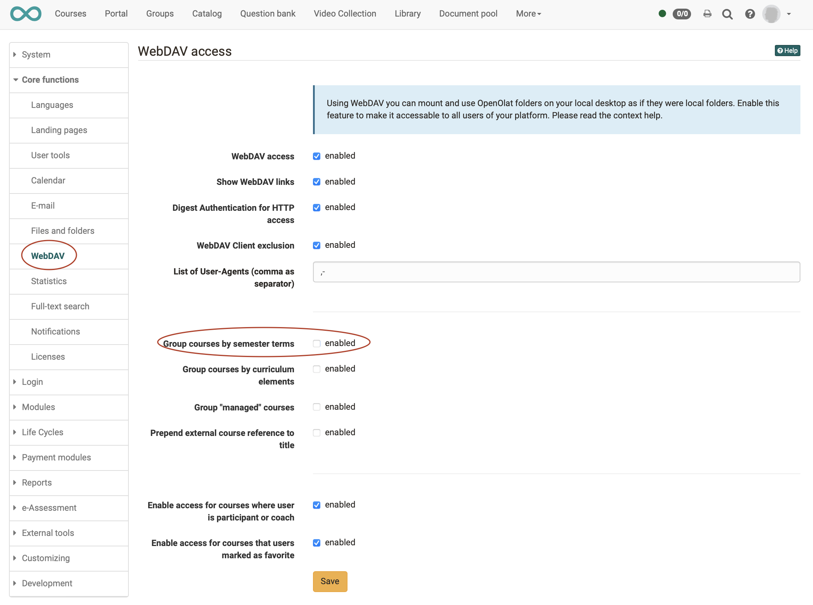

# How can I transfer files using WebDAV?

## What is WebDAV?

WebDAV means "Web-based Distributed Authoring and Versioning;" it is an open
standard to transfer files online. OpenOlat supports this protocol and thus
helps you to easily transfer files from your computer to OpenOlat folders.

!!! info "Advantages of WebDAV"

    Without WebDAV it is only possible to upload files in OpenOlat by means of
    ordinary upload forms. You can either select each single file separately or
    several zipped files at once. 
    
    With WebDAV you can use "Drag&Drop" on your computer (e.g. via the Windows Explorer) to copy single files as well as entire directories into OpenOlat folders.

## Which OpenOlat folders can be accessed with WebDAV?

Of course not all folders and files of an OpenOlat installation can be accessed from outside with WebDAV. Only the folders listed below are WebDAV-compatible folders.

Once the items have been created via OpenOlat, the structure is automatically created. You can access the following OpenOlat folders:

  * [Personal folder](../../../manual_user/personal/Personal_folders.md) (every user)  
  * [Folders of groups](../../../manual_user/groups/Using_Group_Tools.md)
  * [Storage folders](../../../manual_user/course_operation/Storage_folder.md) of courses (course owners only)
  * [Folder - course element ](../../../manual_user/course_elements/Course_Element_Folder.md)
  * [Resource folders](../../../manual_user/authoring/Various_Types_of_Learning_Resources.md) (only Learning Resource Owner)

Who is allowed to upload files via WebDAV in the respective folders depends on
the respective configuration.

## What conditions do I have to create?

Microsoft Windows, Mac OSX, iOS, Android and Linux usually support WebDAV for
drag&drop file transfer. In addition, several software packages have WebDAV
implemented directly into the software (e.g. Microsoft Office).

In order to get access to a folder in OpenOlat via WebDAV you need:

  * WebDAV link: WebDAV address of OpenOlat server as indicated below WebDAV compatible folders, or in your personal menu under Settings / WebDAV
  * Your OpenOlat username,
  * Your OpenOlat/WebDAV password.

!!! info "Note to Shibboleth and Cloud Login"

    If you access OpenOlat via Shibboleth or another Cloud Login you can set your WebDAV password on your homepage, section "Settings." Just select the link "Settings" before clicking on the button "Set password" in the tab "WebDAV." If you already have an OpenOlat password you can use this one to access WebDAV.

## WebDAV Connection Setup

??? abstract "Windows 10 (also 7, 8, 8.1)"

    1. Click on "Computer" in the start menu.
    2. In the new window click on "Connect to network drive" in the upper menu bar. Click on the double arrow in the menu bar if "Connect to network drive" is not visible, then click on it.
    3. Choose a drive letter for the connection.
    4. At the bottom select the option "Establish connection with a website."
    5. Click on "Next."
    6. Choose the option "Select user-defined network resource."
    7. Click on "Next."
    8. Indicate your WebDAV link as Internet or network address.
    9. Click on "Next."
    10. Now provide your OpenOlat username or the stored email address and password.
    11. Click on "Finish."

??? abstract "Windows Vista"

    1. Click on "Computer" in the start menu.
    2. Click on "Assign network drive" in the menu bar (via "Further commands").
    3. Select at the bottom the option "Connecting to website."
    4. Click on "Next."
    5. Check the option "Select user defined network source."
    6. Click on "Next."
    7. Indicate your WebDAV link as internet or network address.
    8. Click on "Next."
    9. Indicate your OpenOlat username or the stored email address and password.
    10. You can then insert a name for your WebDAV connection.
    11. Click on "Finish."

??? abstract "Mac"

    1. Open the menu "Go to" in the Finder and then "Connecting to server..." Indicate your WebDAV link.
    2. Provide your OpenOlat username or the stored email address and password.
    3. Click on "OK."

??? abstract "Linux"

    There are three possibilities for Linux users:

    1. KDE Plasma: in Dolphin insert in the path webdavs:// + WebDAV-link. You will be asked for username and password. If the path is not shown, it can be activated with F6 any time. Example: <webdavs://www.olat.uzh.ch/olat/webdav/>.
    2. Gnome: `davs:// + username or email address + @` \+ WebDAV link. Example: `davs://jdoe@www.olat.uzh.ch/olat/webdav/`.
    3. FUSE: WebDAV directories can be mounted directly into the file system (also compatible to OSX; for more information please go to the [FUSE website](http://fuse.sourceforge.net "FUSE website").

??? abstract "Alternative"

    Beside the described methods in "WebDAV Connection Setup" a WebDAV client can
    be used alternatively. Depending on the setting, especially for Windows in
    connection to Citrix, such a client can be work more stable than the direct
    WebDAV connection. In the following some examples for WebDAV clients:

      * Windows: Cyberduck, WinSCP
      * Mac: Cyberduck, Commander One

## Now you have access to these folders

If you have setup the connection successfully a directory will be opened on
your computer containing the following sub-directories:

  *  **coursefolders** : storage folder and folder course elements of all courses you own, or you are a member of. The storage folder is most and for all only visible to users holding author rights. All other users will find here course folders.
    * _other_: This folder only appears if in the administration semester terms are activated. In this folder all courses which are added to a term can be found.
    * _finished_: This folder only appears if in the administration semester terms are not activated. In this folder all courses can be found, which have been set to finished in the course life-cycle. These are the courses which appear in the menu Courses in the tab "Finished".

    { class="shadow" }

  *  **groupfolders** : all groups you are enrolled in and have access to corresponding folders.
  *  **home** : both of your personal folders (along with the sub-folders "private" and "public").
  *  **sharedfolders** : All resource folders you own or have otherwise access to due to membership rights. Owners and coaches may read and write, and participants may read but not write.

!!! warning "To consider"

    * Depending on the operation system (especially Windows) documents bigger than 50 MB cannot be opened with WebDAV
    * The storage volume of WebDAV-Folders is limited.
    * File names are limited to 100 characters
    * File names may not include several spaces after each other
    * If an error message appears anyway, go through the points "To consider". Check as well if the quota does not have been exceeded (especially if several files have been uploaded together)
