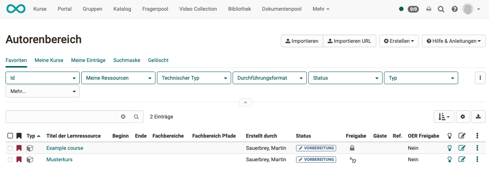
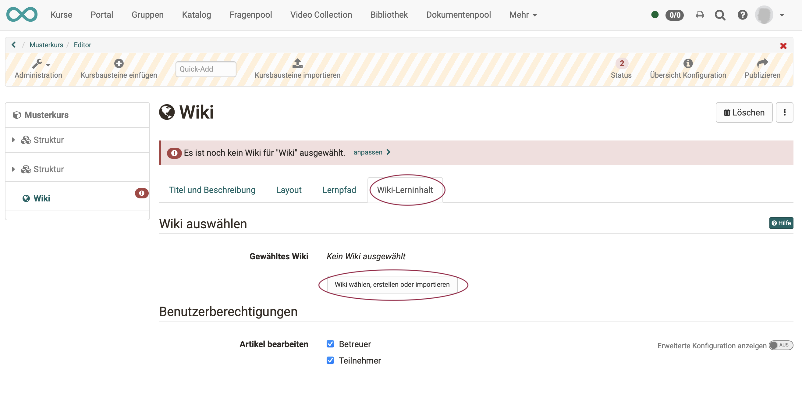
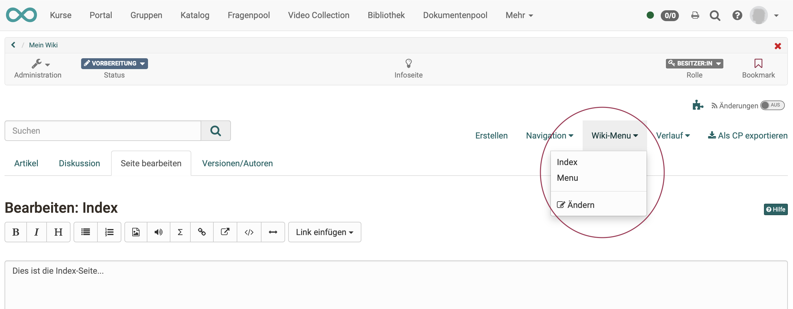
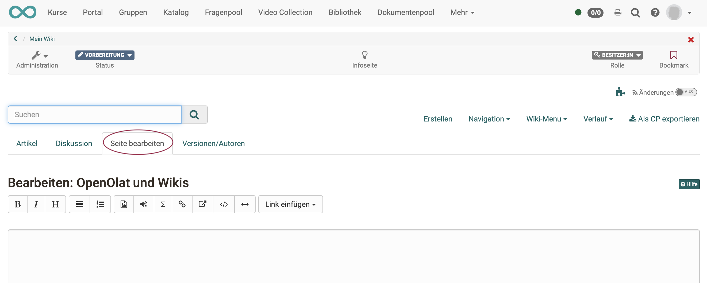
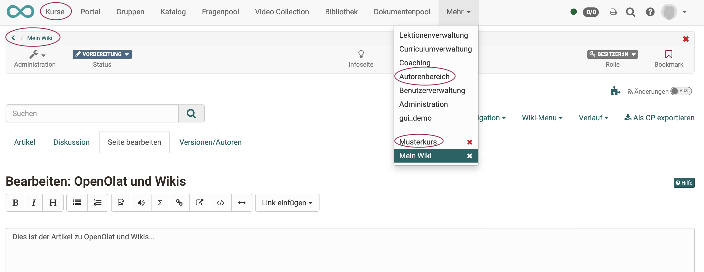

# How do I create a wiki?

With these instructions, you will have created a wiki in your course in a short time and customized it according to your needs.

##  Requirements

The wiki is included within an OpenOlat course. If you have not yet created a course, the chapter ["How do I create my first OpenOlat course"](../my_first_course/my_first_course.md) tells you how to proceed before creating your wiki using the following instructions.

---

## Step 1: Open course editor and insert wiki course element 

a) Go to the **Authoring** area and search there for the course in which the wiki should be inserted.

  
   
b) Open the desired course in the **course editor** located in the Administration menu.

c) Select the position in the course menu where the course element is to be added. Course elements are always inserted below the currently selected course element.

d) Click **"Insert course element "** in the editor header or use the Quick-Add function and select "Wiki" in the pop-up with the selection list.

This means that the course element has already been added to the course.

e) Now enter a suitable **title** in the tab "Title and description" and save the course element.

!!! tip "Note"

    If you close the course editor already now, no wiki will be displayed in the menu because the course element is still incomplete. The learning resource is still missing.

---

## Step 2: Create a wiki (learning resource) 
  
a) Go to the <b>Tab "Wiki learning content"</b> and click on "Select, create or import wiki".

  

b) Here you can now

* create a **new** wiki,
* ein Wiki **hochladen**, das Ihnen als Datei vorliegt (z.B. durch einen Export),
* **upload** a wiki that is available to you as a file (e.g. through an export),
* or specify a **URL** for the wiki import.

In the following, we assume that you want to start a **new** wiki.
  
c) Click the **"Create" button**.

d) Enter a **title** for your wiki learning resource and confirm with <b>"Create"</b>.

Done. With this, a new wiki learning resource is created and further settings as well as the concrete design can be made.

!!! tip "Hint"

    Alternatively, an OpenOlat wiki (like all other learning resources) can also be created in the authoring area and then integrated into the desired course in the course editor in the tab "Wiki learning content". 
    
    This procedure makes it clear that learning resources are cross-course elements and that embedding them in the selected course is only one of the possible uses. 
    
    The same wiki can be included in multiple OpenOlat courses and can also be used independently of the course.

---

## Step 3: Define user rights 

a) The **"Wiki learning content"** tab is used to define who can create wiki articles and comment them. 
More sophisticated settings are also possible via the advanced configuration.

  

b) Finally, the course must be **published** and the course editor closed so that the changes are visible.

---

## Step 4: Fill wiki with content (articles) 

### a) Edit learning resource

Open the course editor again and click "Edit" in the "Wiki learning content" tab.

 

!!! info "Note on wiki syntax"

    Wikis are widely used and therefore a separate standard has been developed for them. OpenOlat adheres to this standard. 
    
    This includes that the content of a wiki is designed according to its own syntax. In the editor of OpenOlat you notice little of this directly. However, if you want to import a wiki and create it in another editor, you might come into contact with it.
    
    Explanations of the wiki syntax can be found under the question mark icon.

      

### b) Editing a new wiki learning resource for the first time

The **first edit** will take you to the start page (index) first. Customize your start page and write a text for the start page.
Finish by clicking the "Save" button at the bottom of the editor.

### c) Index and menu

To edit the index and menu, you can return to either page at any time in the editors wiki menu.

To check this, exit the course editor. You will then see that a wiki course element in OpenOlat complements the menu structure of the course. The wiki articles appear directly as menu items in the OpenOlat course menu.

### d) Create wiki pages (articles)

Click on "Create" in the Wiki Editor menu. A box appears in which you can enter the title of your new wiki article.

As soon as you finish entering the title by clicking the "Create" button, the page of the article will appear with a notice that the page does not exist yet (is empty).

Click on the red link with the page title.

Now you are in the "Edit Page" tab of the newly created article and you can insert your text, images, etc. there.

### e) Customize wiki menu

For changes to the menu, click "Modify" in the "Wiki Menu" drop-down selection to customize the wiki menu with the wiki pages according to your wishes.

### f) Finish editing the wiki learning resource

In the OpenOlat breadcrumb, you will see that you have just edited the learning resource, not the course. Finish editing the wiki learning resource and now return to the course.

Möglichkeit 1: Klicken Sie auf den Zurück-Pfeil in der Breadcrumb.

Möglichkeit 2: Klicken Sie im Menü der Kopfzeile auf "Kurse" und öffnen Sie wieder Ihren Kurs mit dem Wiki-Kursbaustein.

Möglichkeit 3: Klicken Sie im Menü der Kopfzeile auf die 3 Punkte ("mehr") und öffnen Sie dort wieder Ihren Kurs mit dem Wiki-Kursbaustein.

Möglichkeit 4: Klicken Sie im Menü der Kopfzeile auf "Autorenbereich" und öffnen Sie dort wieder Ihren Kurs mit dem Wiki-Kursbaustein.

---

## Schritt 5: Kurs publizieren und Status auf "Veröffentlicht" ändern  
  
Gehen Sie dazu vor, wie in [„Wie erstelle ich meinen ersten OpenOlat-Kurs"](../my_first_course/my_first_course.de.md) beschrieben.

Das Wiki ist nun eingebunden und Kursteilnehmende können die Artikel lesen. Bzw. bei entsprechender Berechtigung auch bestehende Seiten bearbeiten und neue Seiten erstellen.
