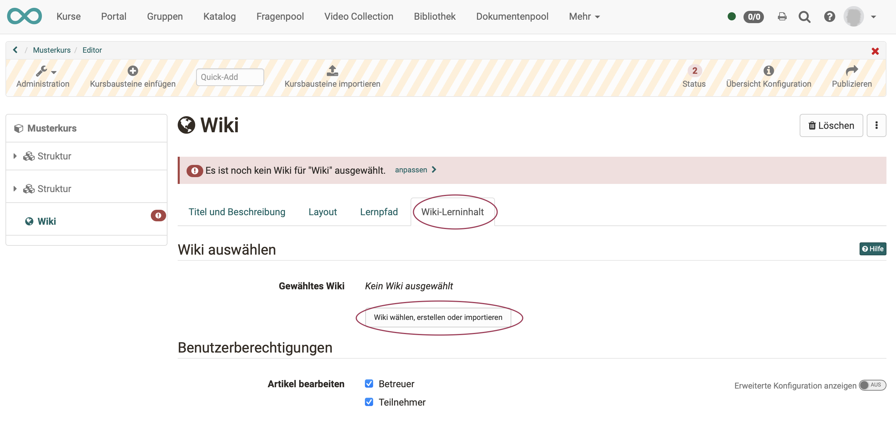
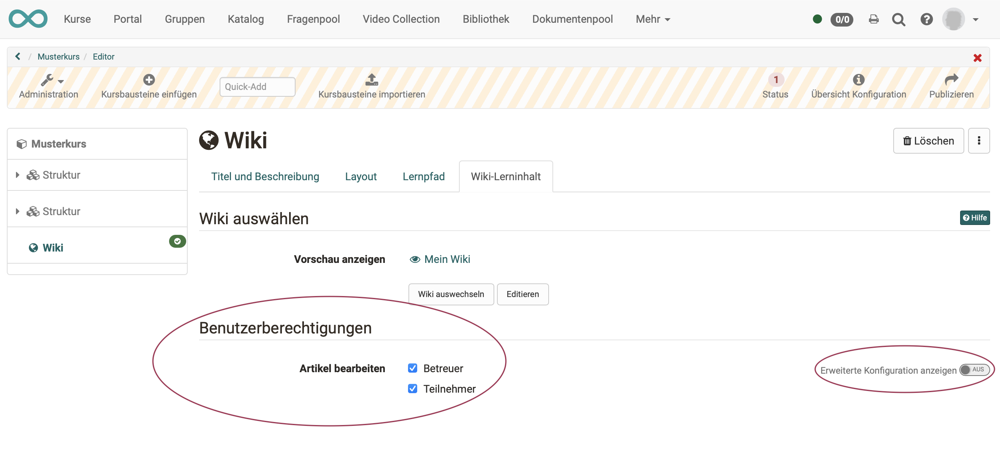
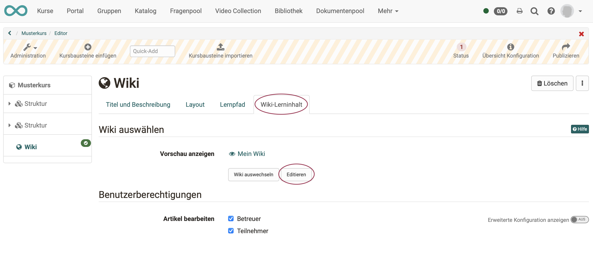
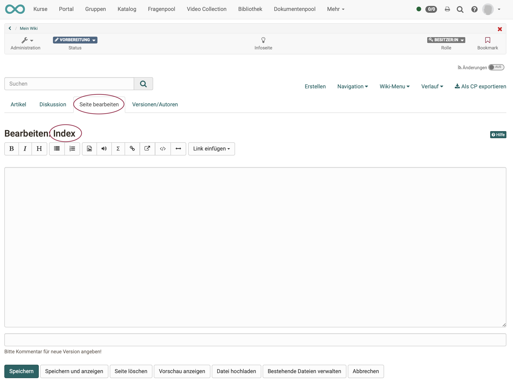
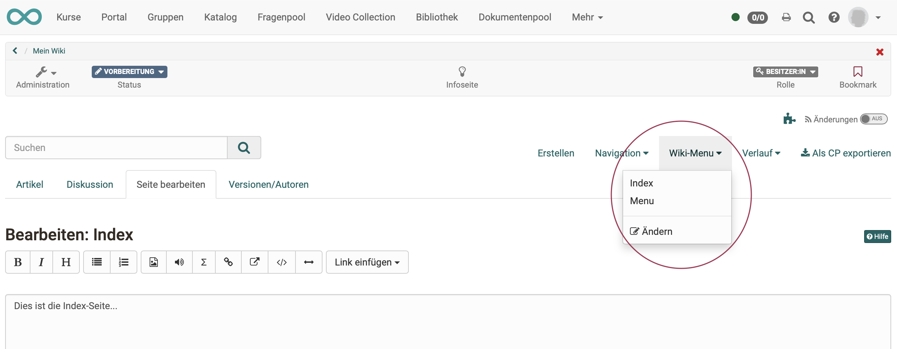
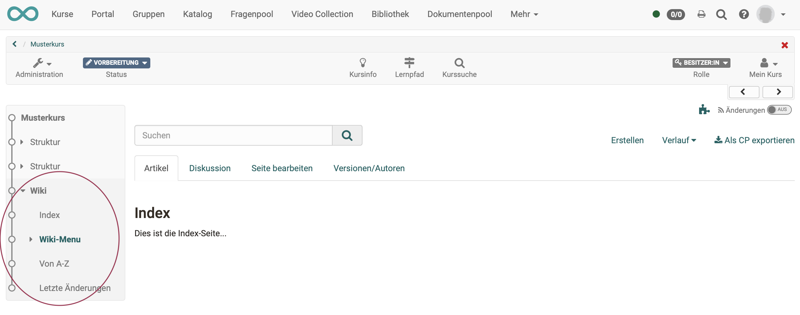

# Wie erstelle ich ein Wiki?

Mit dieser Anleitung haben Sie in kurzer Zeit in Ihrem Kurs ein Wiki erstellt
und es Ihren Wünschen entsprechend angepasst.

##  Voraussetzung

Das Wiki wird innerhalb eines OpenOlat-Kurses eingebunden. Wenn Sie noch keinen Kurs erstellt haben, steht im Kapitel [„Wie erstelle ich meinen ersten OpenOlat-Kurs"](../my_first_course/my_first_course.de.md), wie Sie vorgehen müssen, bevor Sie mit Hilfe der folgenden Anleitung Ihr Wiki erstellen.

---

## Schritt 1: Kurseditor öffnen und Wiki-Kursbaustein einfügen  

a) Gehen Sie in den **Autorenbereich** und suchen Sie dort den Kurs, in den das Wiki eingefügt werden soll.

  
   
b) Öffnen Sie den gewünschten Kurs im **Kurseditor**, der sich im Menü "Administration befindet.

c) Wählen Sie die Stelle im Kursmenü, an der der Baustein hinzugefügt werden soll. Kursbausteine werden immer unterhalb des aktuell ausgewählten Kursbausteins eingefügt. 

d) Klicken Sie in der Kopfzeile des Editors auf **"Kursbaustein einfügen"** oder nutzen Sie die Quick-Add Funktion und wählen Sie im Popup mit der Auswahlliste "Wiki".

Damit ist der Kursbaustein schon dem Kurs hinzugefügt.

e) Vergeben Sie nun noch einen passenden **Titel** im Tab „Titel und Beschreibung“ und speichern Sie den Kursbaustein.  

!!! tip "Hinweis"

    Wenn Sie den Kurseditor bereits jetzt schliessen, wird im Menü kein Wiki angezeigt, denn der Kursbaustein ist noch unvollständig. Es fehlt noch die Lernressource.

---

## Schritt 2: Wiki (Lernressource) erstellen  
  
a) Gehen Sie in den <b>Tab „Wiki-Lerninhalt“</b> und klicken Sie auf „Wiki wählen, erstellen oder importieren“.

  

b) Hier können Sie nun 

* ein **neues** Wiki erstellen, 
* ein Wiki **hochladen**, das Ihnen als Datei vorliegt (z.B. durch einen Export), 
* oder eine **URL** für den Wiki-Import angeben.

Wir gehen im Folgenden davon aus, dass Sie ein **neues** Wiki beginnen möchten. 
  
c) Klicken Sie auf den **Button „Erstellen“**. 

d) Geben Sie einen **Titel** für Ihre Wiki-Lernressource ein und bestätigen Sie mit <b>"Erstellen"</b>. 

Fertig. Damit ist eine neue Wiki-Lernressource angelegt und weitere Einstellungen sowie die konkrete Ausgestaltung können vorgenommen werden.

!!! tip "Tipp"

    Alternativ kann ein OpenOlat-Wiki (so wie alle anderen Lernressourcen) auch im Autorenbereich erstellt und anschliessend im Kurseditor im Tab "Wiki-Lerninhalt" in den gewünschten Kurs eingebunden werden. 
    
    Bei diesem Vorgehen wird deutlich, dass Lernressourcen kursübergreifende Elemente sind und die Einbindung im gewählten Kurs nur eine der Verwendungsmöglichkeiten darstellt. 
    
    Das selbe Wiki kann in mehreren OpenOlat-Kursen eingebunden und auch kursunabhängig verwendet werden.

---

## Schritt 3: Benutzerberechtigungen definieren 

a) Im Tab **"Wiki-Lerninhalt"** wird festgelegt, wer Wikiartikel bearbeiten darf. 
Differenziertere Einstellungen sind auch über die erweiterte Konfiguration möglich. 

  

b) Abschließend muss der Kurs **publiziert** und der Kurseditor geschlossen werden, damit die Änderungen sichtbar werden. 

---
xxx
  
3. Wiki-Seite erstellen: Auf "Erstellen“ klicken und in der Box den Titel für
die neue Wiki-Seite eingeben. Auf „Erstellen“ klicken. Auf den roten Link mit
dem Seitentitel klicken, um die Seite zu erstellen und zu editieren.|

  
  
4. Wiki-Menu anpassen: Im Dropdown-Menü „Wiki-Menu“ auf „Ändern“ klicken, um
das Wiki-Menu mit den Wiki-Seiten Ihrer Wünsche anzupassen oder mit externen
Links zu ergänzen. Speichern.

  
  
5. Wiki-Tab schliessen und auf Kurs-Tab klicken.  

## Schritt 4: Wiki mit Inhalt (Artikeln) füllen  

a) Öffnen Sie den Kurseditor erneut und klicken Sie im Tab "Wiki-Lerninhalt" auf „Editieren“.

 

!!! info "Hinweis zur Wiki-Syntax"

    Wikis sind weit verbreitet und es wurde deshalb ein eigener Standard dafür entwickelt. OpenOlat hält sich an diesen Standard. 
    
    Dazu gehört, dass die Inhalte eines Wikis nach einer eigenen Syntax gestaltet werden. Im Editor von OpenOlat merken Sie davon nichts direkt. Wenn Sie ein Wiki jedoch importieren und in einem anderen Editor erstellen wollen, könnten Sie damit in Berührung kommen. 
    
    Erklärungen zur Wiki-Syntax finden Sie unter dem Fragezeichen-Icon.

      

b) Beim **ersten Editieren** gelangen Sie zunächst zur Startseite (Index). Passen Sie Ihre Startseite an und verfassen Sie einen Text für die Startseite.
Beenden Sie mit Klick auf den Button "Speichern" am unteren Rand des Editors. 

c) Index und Menü

Zur Bearbeitung von Index und Menü können Sie jederzeit im Menü des Wiki-Editors die beiden Seiten wieder aufrufen.

Zur Kontrolle verlassen Sie den Kurseditor. Sie sehen dann, dass ein Wiki-Kursbaustein in OpenOlat die Menüstruktur des Kurses ergänzt. Die Wiki-Artikel erscheinen direkt als Menüpunkte im OpenOlat-Kursmenü.

d) Wiki-Seite (Artikel) erstellen

Auf "Erstellen“ klicken und in der Box den Titel für
die neue Wiki-Seite eingeben. Auf „Erstellen“ klicken. Auf den roten Link mit
dem Seitentitel klicken, um die Seite zu erstellen und zu editieren.|

xxx

Klicken Sie auf "Episoden selbst erstellen" um die **Initial-Episode** des Podcasts zu erstellen. Dieser Schritt ist notwendig, damit Podcastepisoden von der definierten Zielgruppe anschließend ebenfalls eingestellt werden können.

c) Fügen Sie nun den eigentlichen Inhalt Ihrer Podcast-Episode ein.

* Vergeben Sie einen Titel.
* Einen (optionalen) Text fügen Sie unter "Beschreibung" ein.
* Die Audio- oder Videodatei wird am einfachsten durch Ziehen (drag & drop) auf die Zielfläche eingefügt.

d) Wenn Sie alle gewünschten Felder ausgefüllt haben, veröffentlichen Sie die Episode durch Klick auf den Button "Veröffentlichen" am unteren Rand des Fensters.
 
  
!!! info ""

    Weitere Episoden können später mit demselben Vorgehen oder direkt in der Kursansicht hinzugefügt werden.

!!! warning "Achtung"

    Schritt 4 (Initial-Episode) ist auch erforderlich, wenn die Lernenden Podcasts hochladen sollen. Es muss auf jeden Fall zunächst vom Lehrenden die erste Episode, also das erste Video hochgeladen werden, bevor die Lernenden selbst Videos hochladen können.

---

## Schritt 5: Kurs publizieren und freischalten  
  
1. Oben in der Toolbar „Publizieren“ wählen.|

  
  
2. Kursbaustein überprüfen und „Weiter“ klicken.  
3. Unter „Änderung des Kurszugriffs“ „veröffentlicht“ auswählen und bei Bedarf
noch den "Zugang für Teilnehmer der Organisation" einrichten.  
4. „Fertigstellen“ klicken.  
  
Das Wiki ist nun eingebunden und Kursteilnehmende können Wiki-Inhalte lesen,
bestehende Seiten bearbeiten und neue Seiten erstellen.

## Schritt 5: Kurs publizieren und Status auf "Veröffentlicht" ändern  
  
Gehen Sie dazu vor, wie in [„Wie erstelle ich meinen ersten OpenOlat-Kurs"](../my_first_course/my_first_course.de.md) beschrieben.

Das Wiki ist nun eingebunden und Kursteilnehmende können die Artikel lesen. Bzw. bei entsprechender Berechtigung auch bestehende Seiten bearbeiten und neue Seiten erstellen.
