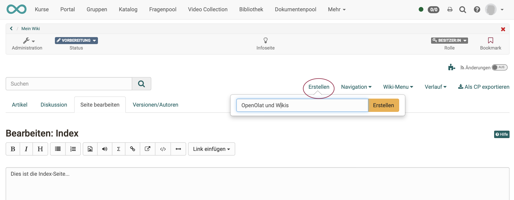
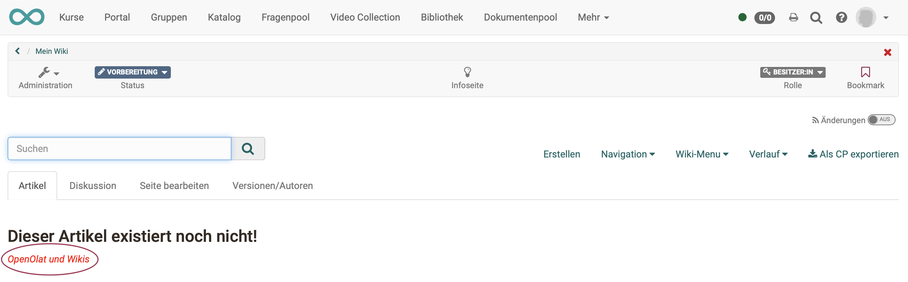
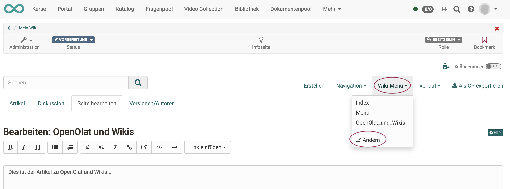

# Wie erstelle ich ein Wiki?

Mit dieser Anleitung haben Sie in kurzer Zeit in Ihrem Kurs ein Wiki erstellt
und es Ihren Wünschen entsprechend angepasst.

##  Voraussetzung

Das Wiki wird innerhalb eines OpenOlat-Kurses eingebunden. Wenn Sie noch keinen Kurs erstellt haben, steht im Kapitel [„Wie erstelle ich meinen ersten OpenOlat-Kurs"](../my_first_course/my_first_course.de.md), wie Sie vorgehen müssen, bevor Sie mit Hilfe der folgenden Anleitung Ihr Wiki erstellen.

---

## Schritt 1: Kurseditor öffnen und Wiki-Kursbaustein einfügen  

a) Gehen Sie in den **Autorenbereich** und suchen Sie dort den Kurs, in den das Wiki eingefügt werden soll.

  
   
b) Öffnen Sie den gewünschten Kurs im **Kurseditor**, der sich im Menü "Administration befindet.

c) Wählen Sie die Stelle im Kursmenü, an der der Baustein hinzugefügt werden soll. Kursbausteine werden immer unterhalb des aktuell ausgewählten Kursbausteins eingefügt. 

d) Klicken Sie in der Kopfzeile des Editors auf **"Kursbaustein einfügen"** oder nutzen Sie die Quick-Add Funktion und wählen Sie im Popup mit der Auswahlliste "Wiki".

Damit ist der Kursbaustein schon dem Kurs hinzugefügt.

e) Vergeben Sie nun noch einen passenden **Titel** im Tab „Titel und Beschreibung“ und speichern Sie den Kursbaustein.  

!!! tip "Hinweis"

    Wenn Sie den Kurseditor bereits jetzt schliessen, wird im Menü kein Wiki angezeigt, denn der Kursbaustein ist noch unvollständig. Es fehlt noch die Lernressource.

---

## Schritt 2: Wiki (Lernressource) erstellen  
  
a) Gehen Sie in den <b>Tab „Wiki-Lerninhalt“</b> und klicken Sie auf „Wiki wählen, erstellen oder importieren“.

  

b) Hier können Sie nun 

* ein **neues** Wiki erstellen, 
* ein Wiki **hochladen**, das Ihnen als Datei vorliegt (z.B. durch einen Export), 
* oder eine **URL** für den Wiki-Import angeben.

Wir gehen im Folgenden davon aus, dass Sie ein **neues** Wiki beginnen möchten. 
  
c) Klicken Sie auf den **Button „Erstellen“**. 

d) Geben Sie einen **Titel** für Ihre Wiki-Lernressource ein und bestätigen Sie mit <b>"Erstellen"</b>. 

Fertig. Damit ist eine neue Wiki-Lernressource angelegt und weitere Einstellungen sowie die konkrete Ausgestaltung können vorgenommen werden.

!!! tip "Tipp"

    Alternativ kann ein OpenOlat-Wiki (so wie alle anderen Lernressourcen) auch im Autorenbereich erstellt und anschliessend im Kurseditor im Tab "Wiki-Lerninhalt" in den gewünschten Kurs eingebunden werden. 
    
    Bei diesem Vorgehen wird deutlich, dass Lernressourcen kursübergreifende Elemente sind und die Einbindung im gewählten Kurs nur eine der Verwendungsmöglichkeiten darstellt. 
    
    Das selbe Wiki kann in mehreren OpenOlat-Kursen eingebunden und auch kursunabhängig verwendet werden.

---

## Schritt 3: Benutzerberechtigungen definieren 

a) Im Tab **"Wiki-Lerninhalt"** wird festgelegt, wer Wikiartikel bearbeiten darf. 
Differenziertere Einstellungen sind auch über die erweiterte Konfiguration möglich. 

  

b) Abschließend muss der Kurs **publiziert** und der Kurseditor geschlossen werden, damit die Änderungen sichtbar werden. 

---

## Schritt 4: Wiki mit Inhalt (Artikeln) füllen  

### a) Lernressource editieren

Öffnen Sie den Kurseditor erneut und klicken Sie im Tab "Wiki-Lerninhalt" auf „Editieren“.

 

!!! info "Hinweis zur Wiki-Syntax"

    Wikis sind weit verbreitet und es wurde deshalb ein eigener Standard dafür entwickelt. OpenOlat hält sich an diesen Standard. 
    
    Dazu gehört, dass die Inhalte eines Wikis nach einer eigenen Syntax gestaltet werden. Im Editor von OpenOlat merken Sie davon wenig direkt. Wenn Sie ein Wiki jedoch importieren und in einem anderen Editor erstellen wollen, könnten Sie damit in Berührung kommen. 
    
    Erklärungen zur Wiki-Syntax finden Sie unter dem Fragezeichen-Icon.

      

### b) Erstmaliges Editieren einer neuen Wiki-Lernressource

Beim **ersten Editieren** gelangen Sie zunächst zur Startseite (Index). Passen Sie Ihre Startseite an und verfassen Sie einen Text für die Startseite.
Beenden Sie mit Klick auf den Button "Speichern" am unteren Rand des Editors. 

### c) Index und Menü

Zur Bearbeitung von Index und Menü können Sie jederzeit im Menü des Wiki-Editors die beiden Seiten wieder aufrufen.

Zur Kontrolle verlassen Sie den Kurseditor. Sie sehen dann, dass ein Wiki-Kursbaustein in OpenOlat die Menüstruktur des Kurses ergänzt. Die Wiki-Artikel erscheinen direkt als Menüpunkte im OpenOlat-Kursmenü.

### d) Wiki-Seite (Artikel) erstellen

Klicken Sie im Menü des Wiki-Editors auf "Erstellen". Es erscheint eine Box, in der Sie den Titel Ihres neuen Wiki-Artikels eintragen können.

Sobald Sie die Titeleingabe mit Klick auf den Button "Erstellen" abgeschlossen haben, erscheint die Seite des Artikels mit dem Hinweis, dass die Seite noch nicht existiert (leer ist).

Klicken Sie auf den roten Link mit dem Seitentitel.

Nun befinden Sie sich im Tab "Seite bearbeiten" des neu erstellten Artikels und können dort Ihren Text, Bilder usw. einfügen.

### e) Wiki-Menü anpassen

Für Änderungen des Menüs klicken Sie im Dropdown-Menü „Wiki-Menu“ auf „Ändern“, um das Wiki-Menu mit den Wiki-Seiten nach Ihren Wünsche anzupassen oder mit externen
Links zu ergänzen. Speichern.

### f) Editieren der Wiki-Lernressource beenden

In der Breadcrumb von OpenOlat sehen Sie, dass Sie gerade die Lernressource bearbeitet haben, nicht den Kurs. Beenden Sie das Editieren der Wiki-Lernressource und kehren Sie nun zum Kurs zurück.

Möglichkeit 1: Klicken Sie auf den Zurück-Pfeil in der Breadcrumb.

Möglichkeit 2: Klicken Sie im Menü der Kopfzeile auf "Kurse" und öffnen Sie wieder Ihren Kurs mit dem Wiki-Kursbaustein.

Möglichkeit 3: Klicken Sie im Menü der Kopfzeile auf die 3 Punkte ("mehr") und öffnen Sie dort wieder Ihren Kurs mit dem Wiki-Kursbaustein.

Möglichkeit 4: Klicken Sie im Menü der Kopfzeile auf "Autorenbereich" und öffnen Sie dort wieder Ihren Kurs mit dem Wiki-Kursbaustein.

---

## Schritt 5: Kurs publizieren und Status auf "Veröffentlicht" ändern  
  
Gehen Sie dazu vor, wie in [„Wie erstelle ich meinen ersten OpenOlat-Kurs"](../my_first_course/my_first_course.de.md) beschrieben.

Das Wiki ist nun eingebunden und Kursteilnehmende können die Artikel lesen. Bzw. bei entsprechender Berechtigung auch bestehende Seiten bearbeiten und neue Seiten erstellen.
