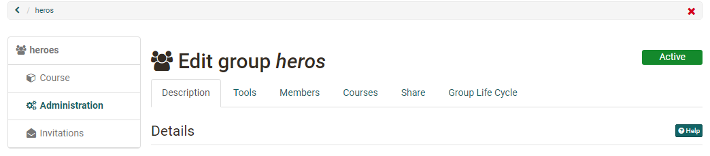

# Group Administration

Configuration options for group coaches.

If you create a new group you are automatically coach of this group. Coaches of a group get the link "Administration" in the menu in the group. You can
manage the group, but also announce users to coaches, delete groups and
configure some [more settings](Group_Management.md).

{ class="shadow lightbox"}

Über die Menüs im Bereich Administration können Sie:

  * der Gruppe Tools hinzufügen,
  * Mitglieder verwalten,
  * die Gruppe Kursen zuordnen,
  * den Zugang zur Gruppe konfigurieren und
  * die Gruppe inaktiv setzen.

Im Folgenden werden die einzelnen Tabs der Administration von Gruppen erläutert.  

## Tab Description

Under the tab "Description" you can change the group name, add a description,
read out the link to the group, limit the number of group participants and
activate a waiting list, if required. 
Diese Einstellungen
haben Sie bereits bei der Erstellung vorgenommen.

## Tab Tools (of Groups)

In the tab Tools the group can be provided by collaborative tools. 
Once a tool is activated, its
corresponding icon will be visible in the group menu on the left.
!!! Info  

    In order for the tools to be available in groups, they must be activated by
    the OpenOlat administrator. This is especially true for BigBlueButton, MS Teams
    OpenMeetings, Wiki, Calendar. If certain tools are not available to you as a
    group owner, they have been deactivated by the OpenOlat administrator.

The following tools are available for group use. 

Tool | | Description
---|---|---
:fontawesome-solid-circle-info: | Information to members| If the tool "Information" is activated, you can define if only group maintainers or also group members can create messages. Own messages can always be edited. As a group owner, all messages can be edited and deleted.  
:fontawesome-regular-envelope:| E-Mail| If the "E-Mail" tool is enabled, non-members can access the e-mail functionality and send messages to group members (maintainers, participants or all members).  
:fontawesome-solid-calendar-days: | Calendar| You can provide the group with a calendar where you can enter common dates. Once the calendar is activated and saved, you can configure the write permissions for it, i.e. specify who can enter appointments. For more general information about calendar functions, see [Calendar](../personal/Calendar.md).  
:fontawesome-regular-folder: | Folder| With a folder you enable the exchange of files between the members of your group. Joint editing of office documents is also possible, depending on the configuration by the OpenOlat administrator. The available storage space is 10 MB. Once the folder is activated and saved, you can configure the write permissions for it, i.e. define who can upload and create files.   
:fontawesome-brands-rocketchat:| Forum| Here you provide your group with a forum for discussions. As the group's administrator, you have the right to edit and delete posts as well as create new ones.  
:fontawesome-solid-comment-sms: | Chat| You can provide a chat room for the group. You can see which other members are in the group chat.  
:fontawesome-solid-globe: | Wiki| You can provide a wiki for the group to create content together.   
:octicons-briefcase-24: | Portfolio| You can provide a [portfolio](../portfolio/Creating_Portfolio_Tasks.md)2.0 to the group. Es handelt sich dabei aber nicht um ein Assessment-Portfolio.  
:material-monitor: | OpenMeetings| When OpenMeetings is enabled and saved, a virtual meeting room or classroom is available to the group.  
:material-monitor: | BigBlueButton| By selecting BigBlueButton, multiple BigBlueButton rooms can be made available to a group. The functionality is similar to the corresponding [course element BigBlueButton](../course_elements/Course_element_BigBlueButton.md). In the group, only the BigBlueButton templates generally activated for groups are available. These may differ from the room templates in courses. If a group member is a supervisor, course owner, author or administrator in the OpenOlat system, additional BigBlueButton room templates may be available to him.  
:material-monitor: | Microsoft Teams| By choosing Microsoft Teams, multiple BigBlueButton rooms can be made available to a group. 
  
Each tool can only be used once in a group. It is therefore not possible to
e.g. provide your members with more than one folder. If you want to work with
more than one forum or Wiki or if you want to provide documents in more than
one folder it is better to use an OpenOlat course
instead. Link one or more courses to the group, and configure the courses or
the course elements to be only visible or accessible to the respective group.

## Tab Members  {: #members}

Managing Members of Groups:
In diesem Tab können Personen der Gruppe hinzugefügt und die Mitglieder verwaltet werden.

Das manuelle Hinzufügen von Mitgliedern durch den Gruppen-Betreuer macht beispielsweise
dann Sinn, wenn Sie ganz gezielt einzelne Personen Ihrer Gruppe hinzufügen möchten. 

**Wer sieht was?**

Wird die Einstellung "Mitglieder sehen Betreuer" oder "Mitglieder sehen Teilnehmer" aktiviert erscheint in der linken Navigation das Menü "Mitglieder". Je nach aktiviertem Haken sehen dann die Mitglieder die entsprechenden Personen. 

With the option "All users can see coaches" and
"All users can see participants" the list of group members can be activated for all system users in on the visiting card, visible public. If the waiting
list is activated, it can be defined if it should be visible for members or
all users.

The option "Users can download the list of members" additionally allows
participants to download the list of members as excel file and to print it.

If you enable the option "Members can leave the group" in the **Membership
configuration** , group participants are allowed to leave the group on their
own volition. If not checked, you will be notified via mail if a member wishes
to leave the group. The participant must then be removed manually from the
group.

**Mitglieder hinzufügen, löschen und anzeigen**

Im Tab "Mitglieder" können Personen der Gruppe sowohl als Gruppenteilnehmer als auch als Gruppenbesitzer hinzugefügt werden. Auch externe Mitglieder, also Personen ohne OpenOlat Account, können eingeladen werden. 

Wie unterscheiden sich Gruppen-Betreuer von den Gruppen-Teilnehmenden?
  *  **Coach:** Has access to the group administration settings. Here it is possible to add or remove participants and provide collaborative tools to the group. Group coaches can also delete a group. If the group is linked to a course a coach has additional access to the assessment tool as well as the test statistics of the own group.
  *  **Participant:**  Uses the collaborative tools of a group.

Über "Mitglied hinzufügen" können Sie nach einzelnen Personen suchen oder auch mehrere Personen direkt der Gruppe hinzufügen, wenn Sie  deren Anmeldenamen, E-Mail oder Institutionsnummer kennen. 

When clicking on the icon "Download table" (below the button "Add users") an
excel file containing all owners or participants of a group will be generated.

## Tab Courses {: #courses}

Dieser Tab ist nur verfügbar, wenn die Gruppe mit einem oder mehreren Kursen verbunden ist oder der Gruppenbesitzer über Autorenrechte verfügt.

Wählt man "Kurs hinzufügen" erscheint eine Übersicht aller Ihnen als Gruppen-Betreuer zur Verfügung stehenden Kursen. Es können nur Kurse verbunden werden bei denen Sie als Besitzer eingetragen sind. 

Clicking on "Add course" allows you to link as many courses you are owner of with the group. Just click on the course name or the checkmark under " _Select_ " to the right of the course name. A click on the :octicons-info-16: icon provides you with further information on the course, such as author, language or the description. Use the button " **Add course** " at the end of the table in order to embed several courses at once.  

OpenOlat Autoren können in diesem Bereich auch neue zu verknüpfende Kurse erstellen oder importieren. 

A group can be linked to several courses, and a a course may have several
embedded groups. OpenOlat does not restrict the number of embedded courses.

Groups are often used in courses for controlled enrollment, for the assignment
of papers or to register for field trips.

Groups and courses can be linked in two ways: In the group, under the tab "Courses" in the group administration.    oder ausgehend vom Kurs über die "[Mitgliederverwaltung](../course_operation/Members_management.md)" → "Gruppen"
 

### Tab Share {: #booking}

Neben dem manuellen Hinzufügen von Personen durch den Gruppen Betreuer kann für Gruppen auch eine Gruppenbuchung (Angebot) erstellt werden. So können sich Interessierte selbst in die Gruppe eintragen.

The following options are available under "Add booking method":

  * :material-key-variant: **Access code**: Select the access code booking methods if the booking shall be restricted to people in possession of the access code. An access code is manually set by the coach of the group, who then passes the code on to authorized users. Only users who can provide this access code will be able to book the resource. In order to open the group, this code must be entered when opening the group for the first time.
  * :material-gift: **Freely available:** Select the free booking method if no other restrictions shall apply. All users can book the resource. Using this booking method adds users as participants to the group.
  * :fontawesome-brands-cc-paypal: **PayPal and Credit card** (only available if unlocked by an administrator): Selecting the PayPal/Credit card payment method requires a financial payment to access the resource. When using this booking method you can define an amount of money required to be payed in the currency defined in the system configuration. This amount can then be payed by either a PayPal account or by using a credit card (Visa/Mastercard). The waiting list cannot be combined with this booking method. The options "waiting list" respectively "PayPal and Credit Card" will not appear in the group administration if the respective other is selected.

Once a booking method is configured, the group will be listed in the
**"Published groups"** and can thus be searched and booked by users. If no booking
method is configured the group is only available for registered users, which
has been added to the group by a coach under the tab "members".

You can also configure multiple booking methods. These methods serve as different options the users can choose from. 
Beispielweise könnte man den Zugang für 2 Tage "frei verfügbar" einrichten und danach nur noch mit Passwort oder Bezahloption. Wenn sich die konfigurierten Angebote überlappen, können sich Interessierte die Option auswählen. Unter "Editieren" können Sie die Konfiguration der Angebote jederzeit wieder ändern. 

The start and end date is only valid for the booking process. Once a resource has been booked by a user he will be added to the resource members list. From
that moment the members list grants access to the user. When a booking method is no longer valid or has been deleted users on the members list will still
have access to the resource. 

As an owner of the resource you can add or remove
users to/from the resource members list at any time. In the latter case the user can register again for the resource as a participant by booking again.

!!! info "Tipp"

    Löschen Sie nicht mehr benötigte Angebote wieder oder konfigurieren Sie diese mit einer Deadline. Die bereits getätigten Buchungen bleiben bestehen und sind davon nicht weiter tangiert.

Öffentliche Gruppen mit verschiedenen Zugangsmöglichkeiten eignen sich vor
allem wenn:
* Projekte oder kursunabhängige Schulungen angeboten werden. 
* Sie die Gruppe zur Sammlung von Personen verwenden, die Sie später einem Kurs zuordnen wollen
*die Teilnehmerzahl begrenzt und die Organisation der Teilnehmenden über diese Gruppe erfolgen soll (auch mit automatischem Nachrücken)

### Tab Group Life Cycle

Hier werden der Status der Gruppe sowie weitere Informationen angezeigt. Ferner kann der Status geändert werden, z.B. eine aktive Gruppe inaktiv gesetzt oder
eine inaktive Gruppe gelöscht oder reaktiviert werden. Auch kann die Gruppe vom automatischen Gruppen-Lebenszyklus ausgenommen werden, z.B. wenn es sich um eine wichtige Gruppe handelt, die permanent vorhanden bleiben muss. 

{ class="shadow lightbox" }

Weitere Informationen finden Sie im separaten Kapitel "Automatischer Gruppen-Lebenszyklus" im Administrationshandbuch

  

