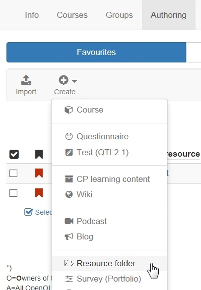
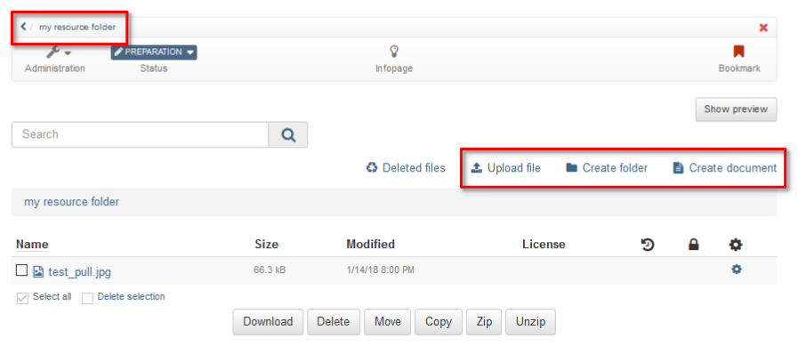
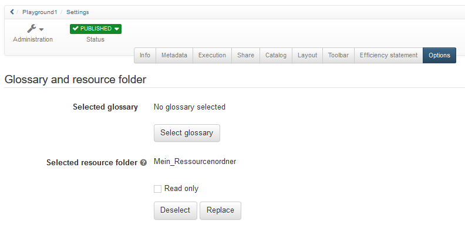
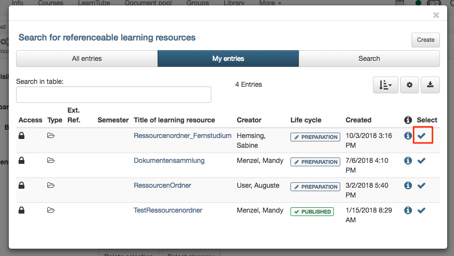
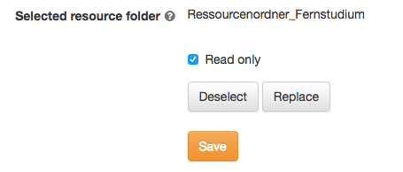

# ... use the same files in several courses

If you want to implement a teaching scenario with several courses, e.g. a
course of studies, and many files are to be used in all courses, it is
advisable to store these files centrally in the learning resource "resource
folder" and then integrate it in the desired courses. This has the advantage
that you only have to make changes to the files once and they are
automatically visible in all linked courses. Typical examples for such files
are basic framework conditions, general terms and conditions, organisational
information, information on general support and contact persons, etc.

### What you need

* Author rights
* Learning Resource "Resource Folder"
* Multiple learning resources "Course
* Comprehensive files

## Method

1. **Create a Ressource Folder:** Go to the [Authoring Area](../authoring/index.md) and select "Create" -> "Resource folder".

  
  
2. **Rename Ressourcefolder:** Enter a suitable name for the learning resource and complete the general description form as required. Since the resource folder is used more for internal organization, it is not necessary to enter information here. The description of the learning resource serves more for your own organization.  
  
3. **Open Ressource Folder:** Click on the name of your resource folder in the bread-crumb navigation to make further settings and upload your files. Alternatively, you can also create HTML files directly here.

Use [**WebDAV**](../supported_tech/Using_WebDAV.md)if you want to upload many files.  
  
### Include Resource Folders in Courses  

1. Open the desired course and select the "Options" tab in the "Administration"
submenu of the "Settings" submenu.
  z 
  
2. Choose "Replace" under "Selected resource folder".

    
  
3. Here you can select your previously created resource folder and link it to the course. If you have selected a resource folder, its name appears as well as the button "Deselect", with which you can deselect it again.  

  
  
4. By default, the files in the resource folder are write-protected withi courses. This makes sense because you want to change and update the files centrally. However, if it is necessary to overwrite (single) central files
again in the course and only for the respective course, you can remove the
write protection in the "Options" menu of the course.

    
  
Repeat the procedure for all relevant courses.

| Organize access to the files  
---|---  
1.|

To access the resource folder files within the course, go to the storage
folder. Here you will find the automatically created subfolder
"_sharedfolder".

  
  
2.|

You can now add these files like all other files in the folder using the
course element "[Single page](../course_elements/Knowledge_Transfer.md)" in the course editor.  
  
You can only include _one_ resource folder per course. You should therefore
carefully consider in advance which files you want to organize using a cross-
course resource folder instead of the course-specific folder.
