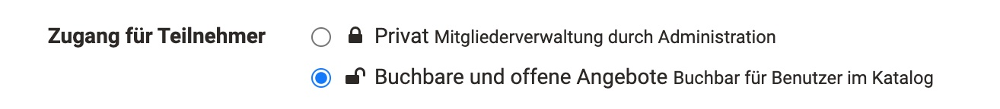
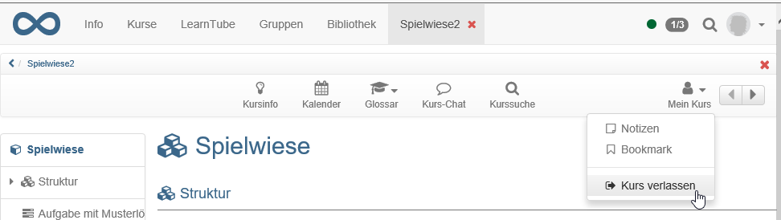
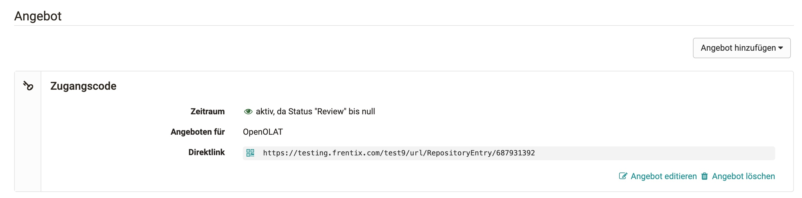
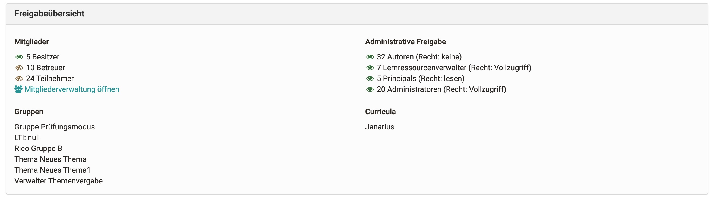

# Zugangskonfiguration / Freigabe {: #access-configuration}

Damit ein Kurs für die Lernenden sichtbar wird, muss er zunächst
veröffentlicht werden. 
Generell werden folgende Varianten der Publikation unterschieden, die unter
"Status" in der Toolleiste eines Kurses sichtbar sind:

## Status der Veröffentlichung

Ein Kurs oder eine andere neu erstellte Lernressource ist zunächst nur für die jeweiligen Besitzer zugänglich und hat den Publikationsstatus "Vorbereitung". Unter
"Status" kann der Zustand verändert und die Lernressource für weitere Personen bzw. Rollen zugänglich gemacht werden:

{ class="thumbnail"}

Publikationsstatus| Zugriff|
---|---|  
Vorbereitung | Nur Besitzer dieser Lernressource haben Zugriff.|
Review | Nur Besitzer dieser Lernressource haben Zugriff. Alle Vorbereitungen zu dieser Lernressource sind abgeschlossen und die Inhalte sind zur weiteren Überprüfung freigegeben.  
Freigabe Betreuer | Besitzer und Betreuer dieser Lernressource haben Zugriff.  
Veröffentlicht | Der Kurs ist nun auch im Bereich der aktiven "Kurse" auffindbar. Alle Mitglieder der Lernressource haben Zugriff.  
Beendet | Alle Mitglieder haben weiter Zugriff auf den Kurs, können aber nur noch lesen.  
  
!!! info "Hinweis"

    Hat ein Kurs den Status "Review", "Freigabe für Betreuer" oder "Vorbereitung" erscheint der Kurs im Menü Kurse im Tab "in Vorbereitung". Ein Zugang zum Kurs mit allen integrierten Kursbausteinen ist aber nicht möglich. Auch ein Zugriff auf die Toolbar ist (noch) nicht möglich.

   
Die konkrete Variante des Kurszugangs, bzw. generell des Zugangs zu einer Lernressource, wird im Tab "Freigabe" der Kurs Administration" eingerichtet. Im Folgenden erfahren Sie welche Optionen Ihnen zur Verfügung stehen.  

 

## Tab Freigabe

### Buchungsmethoden konfigurieren und Angebote erstellen ab Release :octicons-tag-24: 17.0

Der Zugang zu einem Kurs wird in der "Administration" → "Einstellungen" im Tab "Freigabe" konfiguriert.
Es stehen zwei grundsätzliche Varianten zur Verfügung:

Bei der  Wahl **"Privat"** werden die Teilnehmenden durch die Besitzer bzw. Personen, die über das Recht der Mitgliederverwaltung verfügen, eingetragen.

Bei der Wahl der Option **"Buchbare und offene Angebote"** können die Lernenden einen Kurs/Lernressource selbst buchen, müssen aber eventuell (je nach Einstellung) ein Passwort
eingeben.

### Lernressource verlassen

Im Tab "Freigabe" kann auch definiert werden (sofern vom Administrator erlaubt), ob bzw. wann die Benutzer einen Kurs bzw. eine Lernressource verlassen können. Folgende Optionen stehen zur Wahl:

* Jederzeit (Standard): Benutzer können beliebig aus dem Kurs austreten
* Nach Enddatum: Wurde ein Durchführungszeitraum festgelegt, ist es Teilnehmern nach Ablauf dieses Zeitraums gestattet den Kurs zu verlassen. Wurde diese Option gewählt ohne zuvor in der Beschreibung einen Durchführungszeitraum zu wählen, wird es den Teilnehmern zu keinem Zeitpunkt gestattet sein den Kurs zu verlassen.
* Nie: Teilnehmende dürfen den Kurs zu keinem Zeitpunkt verlassen. Teilnehmende müssen wenn notwendig vom Kursbesitzer explizit ausgetragen werden. 

Wenn Teilnehmer den Kurs verlassen dürfen, können sie dazu im Menü "Mein Kurs"
den Eintrag "Kurs verlassen" wählen.

Standardmässig können Benutzer einen Kurs bzw. eine Lernressource zu jeder Zeit verlassen.

### Administrative Freigabe

Hier kann festgelegt werden, für welche Organisation / Unterorganisation (wenn eingerichtet) der Kurs für die Administrativen Rollen freigegeben ist. Diese umfassen: Andere Autoren (je nach Recht), Lernressourcenverwalter, Principals, Administratoren.

Des Weiteren kann im Tab "Freigabe" festgelegt werden, welche zusätzlichen
Rechte andere OpenOlat Autoren an der Lernressource bzw. dem Kurs haben. Dabei
gelten die Rechte generell für alle OpenOlat Autoren der Instanz!

Autoren können | Erklärung  
:-----|:------------------
referenzieren | Lernressourcen wie zum Beispiel Glossar, Formular oder Test können in Kursen anderer Autoren eingebunden werden kann.   
kopieren | Die Lernressource kann von allen anderen Autoren kopiert und so weitergenutzt und in der kopierten Variante auch verändert werden. 
exportieren | Die Lernressource ist für alle andere Autoren zum Download freigegeben und kann auch wieder in OpenOlat importiert werden. 
  
!!! warning "Achtung"

    Die Optionen "referenzieren" und "kopieren " machen z.B. Sinn, wenn Sie eine Lernressource als Vorlage oder gutes Beispiel für andere OpenOlat Autoren nutzbar machen möchten. Ein Referenzierung macht allerdings *bei Kursen* wenig Sinn und sollte hier eher vermieden werden.
    
    Überlegen Sie genau, ob Sie die jeweiligen Freigaben wirklich für alle anderen Autoren der OpenOlat Instanz machen möchten. 

## Angebot / Angebote erstellen {: #offer}

Haben Sie zuvor die Option "Buchbare und offene Angebote...." (ab :octicons-tag-24: Release 17.0) gewählt können Sie anschliessend Angebote erstellen.

!!! note "Unterschiede zu Buchungsmethoden vor 17.0"

    * Angebote können unabhängig zum Publikationsstatus des Kurses veröffentlicht werden. Dazu wählt man ein in der Angebotserstellung "zeitbeschränkt" aus und definiert einen zukünftigen Zeitraum. Das Angebot ist dann im Katalog für diesen definierten Zeitraum verfügbar.
    * Angebote können auf verschiedene Teilbereiche von Organisationen (Unterorganisationen) beschränkt werden.
  

In einem "Angebot" wird definiert wer sich unter welchen Umständen in die gewählte Lernressource bzw. den Kurs eintragen bzw. diese buchen kann. Buchen kann dabei als Synonym für belegen, einschreiben, einkaufen verstanden werden. Die Details werden im Folgenden beschrieben. 

Wählen Sie die Schaltfläche "Angebot hinzufügen", um  Buchungsmethoden (Angebote) hinzuzufügen.

!!! info  "Achtung"

    Die Konfiguration eines Zugangs für OpenOlat Gäste (Personen ohne OpenOlat Account) ist nur in **herkömmlichen Kursen** möglich.

### Angebotsoptionen

{ class="size24" }  **Zugangscode**

Wählen Sie Zugangscode um die Buchung auf einen bestimmten Personenkreis einzuschränken. Nur Personen die über diesen Zugangscode verfügen können die Ressource buchen. Vor dem ersten Öffnen des Kurses muss dieser Code, der beispielsweise im Vorfeld per vom Kursbesitzer per Mail verschickt oder bei Blended-Learning Veranstaltungen an die Tafel geschrieben wurde, vom Benutzer eingegeben werden. Der Code braucht nur einmal eingetragen zu werden.

{ class="size24" } **Frei verfügbar**

Wählen Sie diese Option, wenn keine weiteren Einschränkungen gelten. Alle OpenOlat Benutzer können die Lernressource öffnen und benutzen. Ein Benutzer wird dadurch als Teilnehmer der Lernressource hinzugefügt. Wird die Funktion  _"Automatisches Buchen"_  eingeschaltet, werden Benutzer automatisch auf die Kursansicht geleitet, ohne die Lernressource mit Hilfe des Buchungsdialogs noch ausdrücklich buchen zu müssen. Der Vorteil bzw. der Unterschied gegenüber der Option "ohne Buchung" ist, dass der Besitzer sieht, wer seinen Kurs bzw. Lernressource gebucht hat.

{ class="size24" }   **PayPal und Kreditkarte**
  
Diese Option ist nur verfügbar wenn sie vom [Administrator freigeschaltet](../../manual_admin/administration/PayPal_Configuration.de.md) wurde. Wählen Sie PayPal/Kreditkarten um eine Buchung gegen eine finanzielle Vergütung zu ermöglichen. Dabei können Sie einen Betrag definieren, der mit einem PayPal Konto oder mit einer Kreditkarte (Visa/Mastercard) bezahlt werden muss. (Diese Funktion steht nur Benutzern mit Autorenrechten zur Verfügung)

{ class="size24" }  **Ohne Buchung**
Ab :octicons-tag-24: 17.0 verfügbar.

Mit diesem Angebot können sie einen Kurs veröffentlichen auf den alle OpenOlat Benutzer zugreifen können, ohne dass diese in der Mitgliederverwaltung auftauchen.

!!! info "Hinweis"

    "Ohne Buchung" entspricht der "Offen für alle" Option in den OpenOlat Releases bis Version 16.

{ class="size24" }  **Gastzugang**

Im herkömmlichen Kurs kann auch ein Angebot nur für Gäste erstellt werden. Dieses ist dann nur für Gäste verfügbar und kann nicht für verschiedene Unterorganisationen eingeschränkt werden. Auf diesen Weg können Lernressourcen auch Personen komplett ohne OpenOlat Account freigegeben werden. 

### Details zur Angebotskonfiguration

Optional kann einer Buchungskonfiguration/Angebotskonfiguration auch ein Start- und Enddatum beigefügt werden. Diese Konfiguration ist dann nur zwischen dem konfigurierten Datum gültig. Sie können auch nur ein Start- oder nur ein Enddatum angeben. Möchten sie keine zeitliche Einschränkung vorgeben so lassen Sie dieses Feld leer. Angebote können jederzeit nachträglich angepasst werden.

Sie können auch mehrere Angebote konfigurieren. Diese gelten als verschiedene Optionen, aus denen der Benutzer wählen kann. Achten Sie in diesem Fall auf sinnvolle Beschreibungen. So können z.B. Kurscodes für Personen aus unterschiedlichen Kontexten kombiniert oder ein Kurs bis zu einem bestimmten Termin frei und danach nur noch mit Passwort zugänglich konfiguriert werden.

!!! warning "Achtung"

    Ein angegebenes Start- oder Enddatum bezieht sich ausschliesslich auf den **Buchungsprozess** nicht auf den Durchführungszeitraum der Lernressource. Hat ein Benutzer eine Lernressource gebucht, so wird die Person in der Teilnehmerliste dieser Ressource eingetragen. Von dem Zeitpunkt an entscheidet das System einzig über die Teilnehmerliste ob eine Person Zugang zu einer Ressource hat. 
    
    Abgelaufene Buchungskonfigurationen haben daher keinen Einfluss auf eine Teilnehmerschaft. Als Besitzer der Ressource können Sie auch jederzeit eine Person zu der Teilnehmerliste hinzufügen bzw. entfernen. In dem zweiten Fall kann der Benutzer durch erneutes Buchen sich wieder in die Ressource als Teilnehmer eintragen.

Sie können die konfigurierten Buchungsmethoden/Angebote jederzeit problemlos löschen.
Die bereits getätigten Buchungen bleiben bestehen und sind davon nicht weiter tangiert.

## Freigabeübersicht

  

Ist die Freigabe nach den Wünschen eingestellt, sieht man am Ende der Seite kompakt, wer auf diesen Kurs Zugriff hat und welche Gruppen oder Curricula mit diesem Kurs verknüpft sind.  

## Kurszyklus: Beenden und löschen

Wurde ein Kurs durchgeführt und ist abgelaufen kann er beendet und/oder
gelöscht werden.

Wenn ein Kurs **beendet** wird, befindet er sich anschliessend im Lesemodus. Alle Benutzerdaten bleiben bestehen und alle Kursmitglieder haben nach wie vor Zugriff auf den Kurs. Der Kurs befindet sich jedoch nicht mehr im Tab „Meine Kurse“, sondern im Tab „Beendet“ gleich nebenan.

  
Im Autorenbereich wird der beendete Kurs mit einem neuen Symbol und durchgestrichen angezeigt.

Falls der Kurs wieder geöffnet werden soll, rufen Sie erneut den Lebenszyklus des Kurses auf und klicken Sie auf "Erneut öffnen".

### Kurs löschen

Im Menü "Administration" → "Löschen" bzw. über das 3-Punkte Menü im Autorenbereich kann eine Lernressource gelöscht werden. In diesem Fall wird die Lernressource in den Tab "Gelöscht" verschoben und liegt sozusagen im
Papierkorb.
