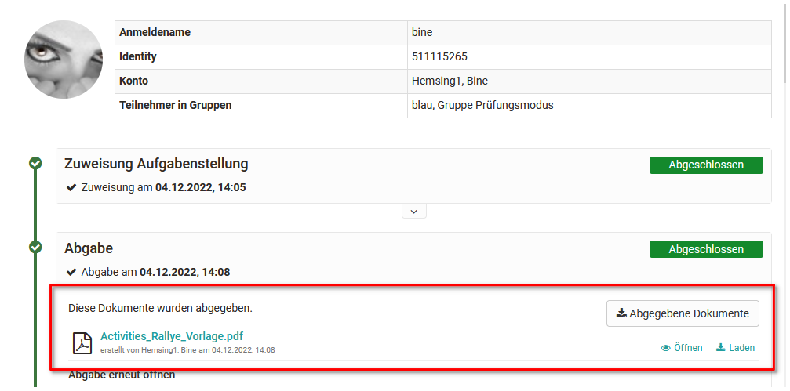

# Aufgaben und Gruppenaufgaben bewerten

Hier erfahren Sie wie man Bewertungen für Aufgaben und Gruppenaufgaben mit Hilfe des OpenOlat „Bewertungswerkzeugs“ vornimmt.

Gehen Sie in das Bewertungswerkzeug und wählen Sie in der linken Übersicht den Assessmentbaustein aus, den Sie bewerten möchten. Hier finden Sie zwei Tabs: Übersicht und Teilnehmer. 

Im Tab Übersicht erhalten Sie eine Übersicht zur Bewertung dieses Kursbausteins, z.B. wie viele Personen diesen Kursbaustein schon bestanden haben. 
Im Tab Teilnehmer werden die Kursteilnehmenden angezeigt und die eigentliche Bewertung von Teilnehmenden kann gestartet werden.  

## Tab Teilnehmer

**Generelle Aktionsmöglichkeiten**

{ class="shadow lightbox" }

Kursbetreuer und Kursbesitzer haben über die entsprechenden Buttons verschiedene Aktionsmöglichkeiten: 

* Alle abgegebenen Dokumente oder Dokumente von bestimmten Teilnehmenden auf einmal herunterladen
* Eine neue Massenbewertung starten und damit alle Teilnehmenden auf einmal zu bewerten.
* Die Aufgabe für alle oder mehrere ausgewählte Teilnehmenden auf den Status „abgeschlossen“ zu setzen und damit die Bewertung final zu beenden. 
* Die Bewertungen der Aufgabe für alle oder mehrere ausgewählte Teilnehmenden auf einen Schlag sichtbar bzw. unsichtbar zu setzen, also freizugeben oder die Freigabe zurückzuziehen.
* Eine E-Mail an alle oder bestimmte Teilnehmende verschicken.
* Die Abgabe für bestimmte oder alle Personen zu verlängern.

Direkt auswählbar sind die Optionen alle abgegebenen Dokumente herunterzuladen sowie eine Massenbewertung vorzunehmen. 
Wie man eine Massenbewertung für Aufgaben genau erstellt erfahren Sie [hier](../how-to/create_a_bulk_assessment_for_submission_tasks.de.md).

Für weitere Aktionen, die sich nur auf bestimmte Teilnehmende beziehen müssen die gewünschten Teilnehmenden zunächst ausgewählt werden bevor die Optionen angezeigt werden.

{ class="shadow lightbox" }

## Einreichung ansehen

Bevor eine Aufgabe bewertet werden kann müssen sich die Betreuer oder Kursbesitzer die Einreichungen bzw. abgegebenen Dokumente ansehen. Dies kann entweder einzeln für jeden Teilnehmer bzw. Teilnehmerin oder in Form der Massenbewertung bzw. dem Herunterladen der abgegebenen Dokumente von mehreren Personen erfolgen. 

### Einreichungen einzelner User

Sobald von einem Lernenden eine Datei über den Button „endgültige Abgabe“ eingereicht wurde, kann sie vom Lehrenden geöffnet und angeschaut werden.

Um sich die Einreichung _einer einzelnen Person_ anzeigen zu lassen wählen Sie diese Person aus klicken auf die abgegebene Datei. 

{ class="shadow lightbox" }

Wie Sie die Assessmentbausteine einzelner Personen generell bewerten erfahren Sie  in einer [Schritt für Schritt Anleitung](Assessment_of_learners.de.md).

### Einreichungen aller oder mehrerer User

Wenn viele Lösungsversuche hochgeladen wurden, oder Sie viele Lernende bewerten müssen, empfiehlt es sich, über die Schaltfläche "Alle abgegebenen Dokumente herunterladen" alle Lösungsversuche auf einmal herunterzuladen. Im heruntergeladenen Ordner finden Sie ebenfalls alle Aufgabenzuweisungen. 

Alternativ können Sie die gewünschten Personen auswählen und dann die Option "Alle abgegebene Dokumente herunterladen" wählen. 

Anschliessend können Sie das [Bewertungsformular](The_assessment_form.de.md) ausfüllen. Es erscheint bei der Bewertung eines Kursbausteins unter "Bewertung".

## Bewertungsmöglichkeiten  Kursbaustein „Aufgabe“

Welche Schritte im Bewertungsflow genau zur Verfügung stehen, ist abhängig von der konkreten Konfiguration des Aufgaben Bausteins. Die Details werden in der Konfiguration des Kursbausteins „[Aufgabe](../task/Task_-_Further_Configurations.de.md)“ bzw. "Gruppenaufgabe" festgelegt. Im Bewertungswerkzeug können die Bewertungsoptionen nicht mehr geändert werden.

Falls gewünscht und entsprechend konfiguriert, kann ein Rückgabe-Dokument hochgeladen werden. Dabei könnte es sich zum Beispiel um eine ausführliche Bewertungstabelle oder eine überarbeitete Version der Einreichung handeln. Auch ist es möglich eine Einreichung über den Button „Benötigt Überarbeitung“ noch einmal an den Lernenden zurückzuspielen und eine Überarbeitungsschleife auszulösen.

Sobald ein Benutzer eine Aufgabe definitiv abgegeben hat, ist eine erneute Abgabe oder ein Austauschen für ihn nicht mehr möglich. Falls eine Aufgabe versehentlich abgegeben oder das falsche Dokument hochgeladen wurde, kann der Betreuer aber die "Abgabe erneut öffnen" und so dem Lernenden ermöglichen eine weitere Abgabe einzureichen.

Wie weit der Bewertungsflow schon fortgeschritten ist, erkennen sowohl die Lernenden als auch die Lehrenden an den grünen Haken an den einzelnen Bewertungsschritten.

Sobald eine Einreichung akzeptiert wurde und der User keine Einreichungen bzw. Überarbeitungen mehr vornehmen soll, sollte der Button "Abgabe akzeptieren" betätigt werden. Dadurch sind die Bearbeitung und die Bewertung einer Aufgabe definitiv abgeschlossen. Eine entsprechende Meldung erfolgt an den Benutzer.

Die weiteren Bewertungsaktionen für die Aufgabe erfolgen im unteren Teil im Bereich "Bewertung", im eigentlichen Bewertungsformular. Hier können Punkte, Feedbacks usw. hinterlegt werden. Eine Beschreibung der Möglichkeiten finden sie auch [hier](The_assessment_form.de.md).

## Bewertungsflow für Gruppenaufgaben

Die Bewertung von Einreichungen über den Kursbaustein "Gruppenaufgabe" erfolgt ähnlich wie beim Kursbaustein "Aufgabe".

 * Gehen Sie zur gewünschten Gruppenaufgabe.
 * Wählen Sie im Tab "Übersicht" die gewünschte Gruppe oder filtern Sie im Tab "Teilnehmer" die gewünschte Gruppe. 
 * Sofern ein Gruppenmitglied eine Einreichung für die Gruppe vorgenommen hat, gilt diese für die gesamte Gruppe und kann nun auch für die gesamte Gruppe bewertet werden.
 * Klicken Sie auf ein Gruppenmitglied oder wählen Sie im 3-Punkte Bereich die Option "Details anzeigen / bewerten" und Sie gelangen in den Bewertungsflow für die Gruppe. 
 * Nehmen Sie die Bewertung analog zur Bewertung des Kursbausteins Aufgabe vor. 

Im Bereich "Bewertung", also dem eigentlichen Bewertungsformular, klicken Sie auf den Button "Bewerten". 

{ class="shadow lightbox" }

Der Vorteil einer Gruppenaufgabe ist, dass eine Bewertung für alle
Gruppenmitglieder über den Button „Bewerten“ auf einen Schlag vorgenommen werden kann, gleichzeitig aber auch Anpassungen für einzelne Gruppenmitglieder möglich sind.

Wenn nicht die gesamte Gruppe bestanden hat oder nicht alle dieselbe Punktzahl erhalten sollen, darf "Für die ganze Gruppe" _nicht_ ausgewählt sein. Dadurch wird eine individuelle Bewertung pro Benutzer möglich.

{ class="shadow lightbox" }

!!! info "Info"

    Sollen andere bewertbare Kursbausteine anstatt einer „Gruppenaufgabe“ für eine Gruppe bewertet werden, müssen die Bewertungen für jedes Gruppenmitglied separat vorgenommen werden.

!!! info "Info"

    Im Kursrun ist die Bewertung der einzelnen Gruppen ähnlich wie generell beim Kursbaustein Aufgabe, ebenfalls möglich.
