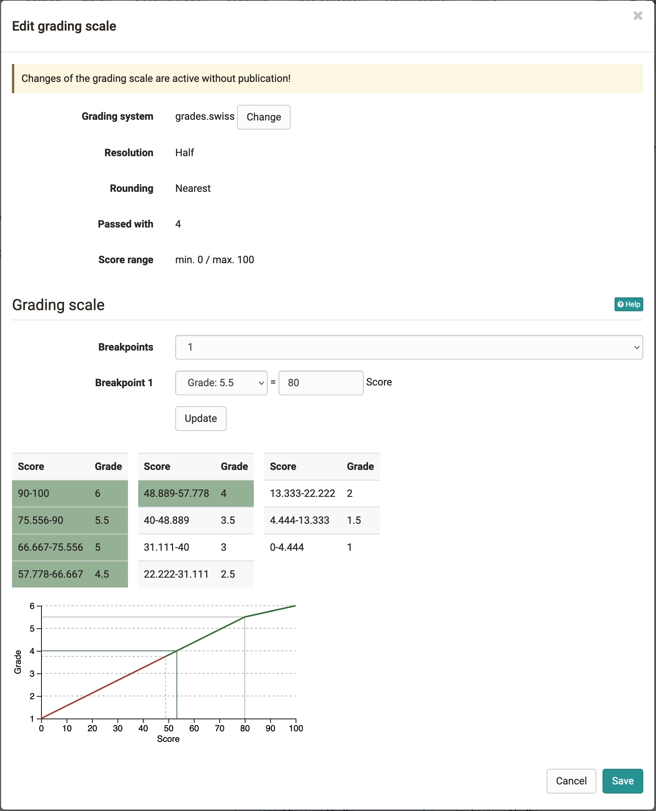

# Translate points into rating or grades

:octicons-tag-24: Release 16.2

Sofern ein Assessment Kursbaustein wie beispielsweise ein Test, eine Aufgabe usw. mit Punkten versehen werden können die Punkte auch in Noten übersetzt werden. 

Kursbesitzer können die Funktion im Kurseditor aktivieren und dort konfigurieren. 

!!! info "Voraussetzung"

    Das Modul Einstufung/Noten wurde von den OpenOlat Administratoren aktiviert und es wurde mindestens ein Bewertungssystem angelegt.

## Configuring a course element for rating

!!! Prerequisites

    Module Levels/Grading activated on your system.
    One or more staffs have been created. 

1. **Switch on Levels/Grading**
Gehen Sie in den Kurseditor und wählen Sie den Kursbaustein für den die Einstufung aktiviert werden soll. Im Tab "Bewertung" können Sie die Einzelheiten einrichten. 
(bei Tests im Tab "Testkonfiguration"). Achten Sie darauf, dass auch Punkte vergeben aktiviert ist und setzen Sie den Haken bei "Bewertung mit Einstufung/Noten. 
2. **Select Assignment** Sie können zwischen manueller und automatischer Zuweisung wählen. Bei der manueller Zuweisung muss der Betreuer die Zuordnung manuell auslösen und für den User sichtbar machen. 

3. **Chosse and edit grading scale** Under Edit grading scale, open the settings window, select a grading system and define the minimum, maximum and threshold number of points.

    {class=shadow}

4. **Save**

## Points and grading in the grading tool
Die Einstufungs- und Notenskala spiegelt sich auch im Bewertungswerkzeug wider. 

* **Tab Overview of a course element**: 
Rating have been added to the key figures for grading. You can see the normal distribution and important settings.

* **Tab Participants of a course element:** In the evaluation tool, the rating are now shown in a separate column behind the score. If set to manual, you can also take over rating manually here.

To adjust the grading scale later or to assign new rating, click on the button at the top. 
