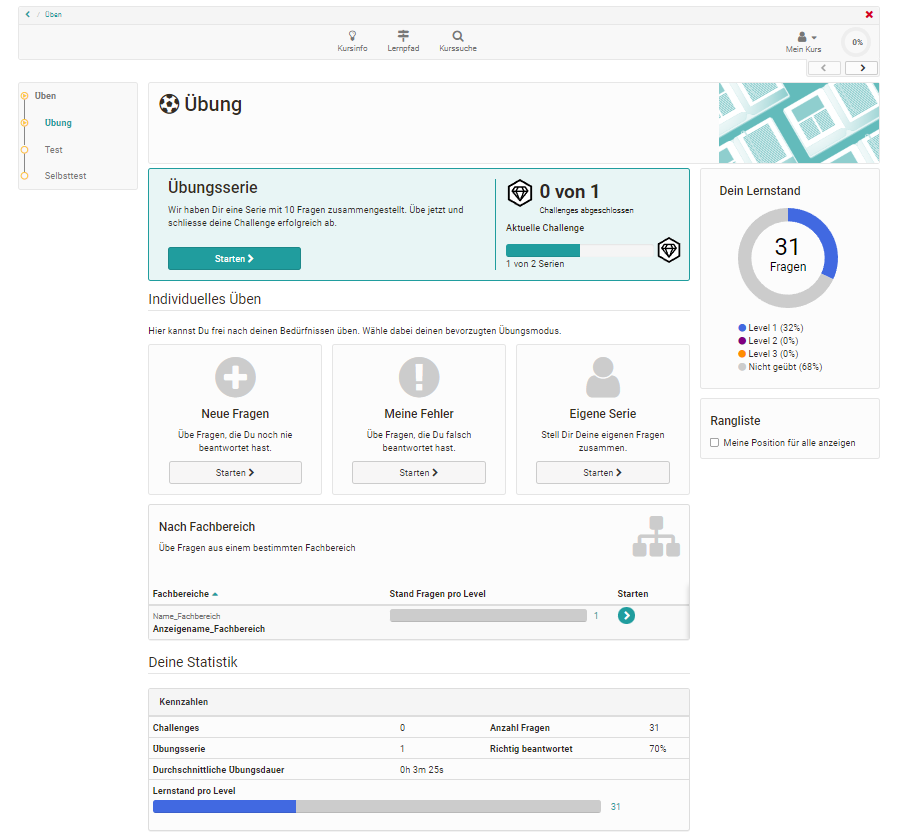

# Kursbaustein "Übung" {: #course_element_uebung}

:octicons-device-camera-video-24: **Video-Einführung**: [Der Kursbaustein Übung](<https://www.youtube.com/embed/ljbqzYLn0Zs>){:target="_blank”} 

Der Kursbaustein mit Lernkarten-Logik dient der individuellen Selbstüberprüfung der Kursteilnehmenden. Dafür kombiniert die Lehrperson mehrere OpenOlat Tests oder Fragen-Sets aus dem Fragenpool, die die Lernenden selbständig in Serien und Challenges bearbeiten können. Die Anzahl der Fragen pro Übungsserie kann genau wie die Anzahl der Gesamt-Challenges festgelegt werden. Umfasst eine Serie beispielsweise 10 Fragen, werden dem Lernenden 10 Fragen eingeblendet. Danach kann er entscheiden, ob er falsch beantwortete Fragen noch mal beantworten oder diese überspringen will. Die Anzahl der Level spiegelt die Intensität der Übung wider und gibt an wie häufig eine Frage wiederholt korrekt beantwortet werden muss. 

Neben den von der Lehrperson konfigurierten Übungssettings können Kursteilnehmende auch bestimmte Fragen wie neue Fragen oder Fragen eines bestimmten Levels filtern und bearbeiten. Auch eigene Serien können zusammengestellt werden.

Nach Abschluss einer Challenge sind neben der Einordnung in Ranglisten detaillierte Statistiken zum Lernstand sowie eine zusammenfassende Übersicht verfügbar.

!!! info "Info"

    Für diesen Kursbaustein können nur automatisch auswertbare Testfragen verwendet werden. 
