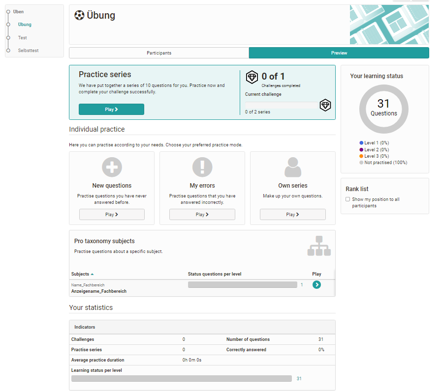

# Course Element "Practice" {: #course_element_uebung}

The course element with flashcard logic is used for individual self-testing of course participants. For this purpose, the teacher combines several OpenOlat tests or question sets from the question pool, which the learners can work on independently in series and challenges. The number of questions per exercise series can be defined, as can the number of total challenges. For example, if a series comprises 10 questions, the learner is shown 10 questions. Afterwards, he can decide whether he wants to answer incorrectly answered questions again or skip them. The number of levels reflects the intensity of the exercise and indicates how often a question has to be answered correctly repeatedly. 

In addition to the practice settings configured by the teacher, course participants can also filter and edit specific questions such as new questions or questions of a certain level. Custom series can also be created.

After completion of a challenge, detailed statistics on the learning status as well as a summary overview are available in addition to the classification in ranking lists.

!!! info "Info"

    Only automatically evaluable test questions can be used for this course element. 