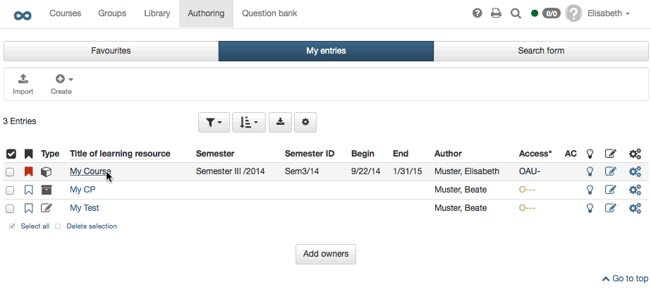
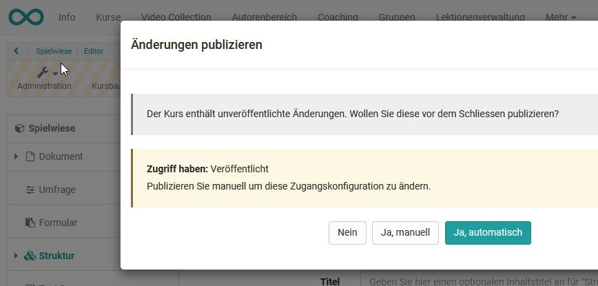

# Four Steps to Your Podcast

With the aid of this guideline you will be able to add a podcast to your
course in no time and create your first episode.

##  Requirements

Produce an audio or video file for your podcast episode by means of
appropriate recording software (e.g.
[GarageBand](http://www.apple.com/ilife/garageband/ "GarageBand")) before
saving it in MP3, MP4, M4V, M4A or AAC.

In case you have not created a course yet you will get further information in
the chapter ["Creating Courses"](../course_create/index.md) on how to proceed
before generating a podcast by means of the following instruction.

##  Create Podcast

  

### Step 1: Open course editor and insert podcast course element  
---  
1. Search for your course in "Authoring", section "My entries," and open it.

  
  
2. Click "Course Editor" at the top of the Administration drop-down menu.  
  
3. Select position at which your Podcast course element should be inserted by
clicking on it.  

4. Select "Podcast" in the pop-up "Insert course elements" in the toolbar. 

5. Indicate a short title for your course element in the tab "Title and
description" and save your settings.  
  
### Step 2: Create a Podcast  
---  
1. Click on "Select, create or import podcast" in the tab "Podcast learning
content."

  
  
  
2. Click on "Create."  
3. Indicate the title of your podcast. This information will appear in the
header of your podcast. Click on "Create"  
  
### Step 3: Fill podcast with content  
---  
1|

In the course editor click on "Edit" in the tab "Podcast Learning Content".

  
  
2. Click on "Create episodes".

!!! info ""

    If you already have an external podcast, you can also include it.  
  
3. Enter a title, select an audio or video file from your computer and click
"Publish". Add a description if necessary.

  
  
!!! info ""

    Additional episodes can be added later on following the same pattern or directly within the course view.
 

!!! warning "Attention"

    Step 3 is also required if learners are to upload podcasts. In any case, the first episode, i.e. the first video, must be uploaded by the teacher before the learners can upload videos themselves.

### Step 4: Publish and activate course  
---  
1. The easiest way to publish a course is to close the course editor and switch
directly to the normal course view.

    Simply click on the course title in the bread crumb bar and a query will
appear asking you how you want to publish the course.

    Select "**Yes, automatically**" if you want to publish all changes made. Select
"**Yes, manually**" if you only want to select some changes for publication.

  
  

!!! tip "Tip"

    You can also publish your podcast through the link in the toolbar in the course editor. 

Your podcast is now embedded and course participants can download the first
episode.

As with all OpenOlat learning resources, the learning resource (here Podcast)
can be created first and then the created learning resource can be integrated
into the desired course.

