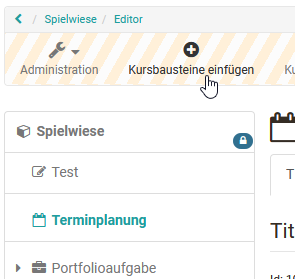
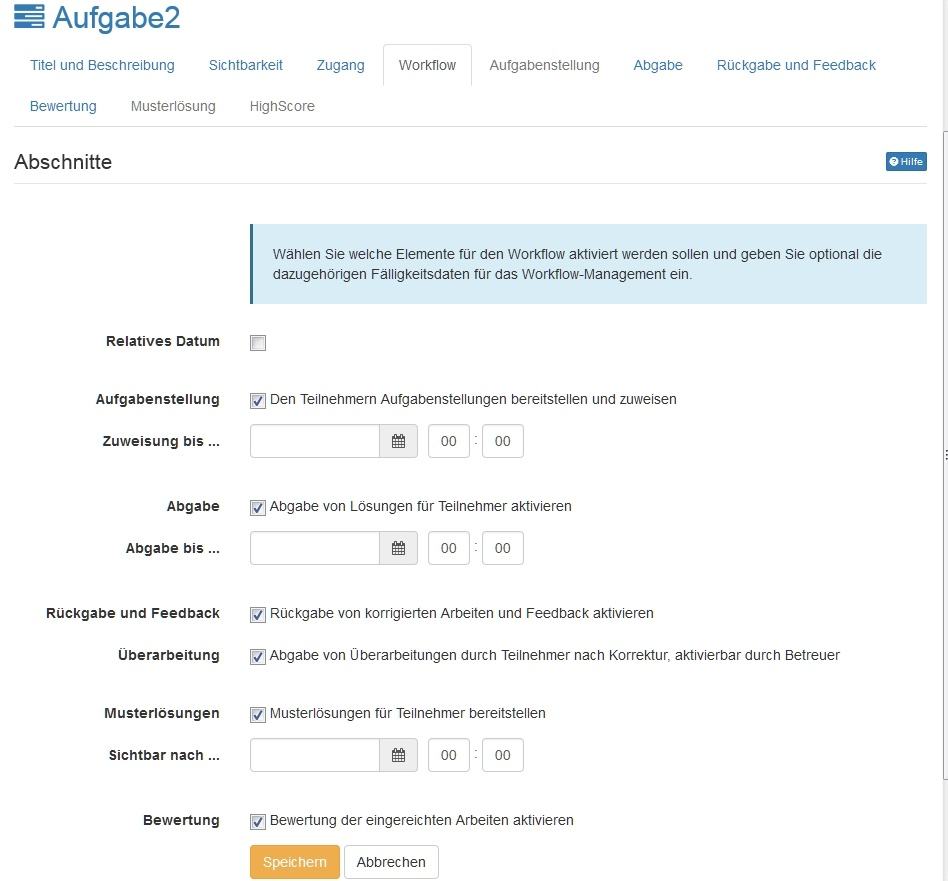
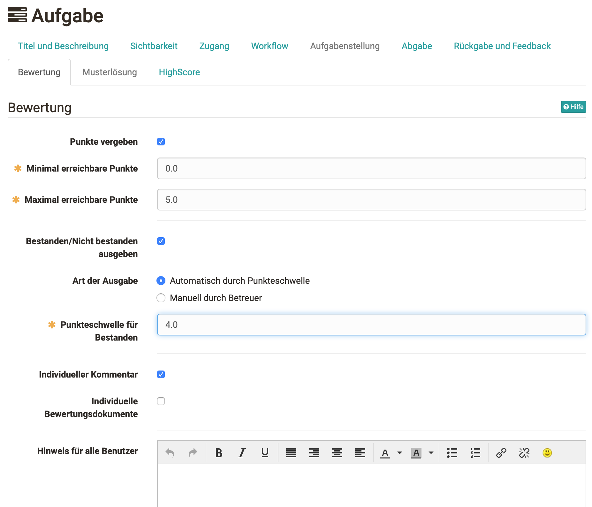

# Drei Schritte zu Ihrer Aufgabe

##  Voraussetzungen

Vor dem Hinzufügen der Aufgabe sollten die Aufgabendateien und optional eine
Musterlösung in einem gängigen Dateiformat vorliegen (beispielsweise als PDF-
Dokumente). Sie können jedoch die Aufgabe und die Musterlösung auch direkt in
OpenOlat erstellen.

Wenn Sie noch keinen Kurs erstellt haben, steht im Kapitel ["Kurs erstellen"](../course_create/index.de.md),
wie Sie vorgehen müssen, bevor Sie mit Hilfe der folgenden Anleitung Ihre Aufgabe erstellen.

##  Aufgabe erstellen

### Schritt 1: Kurseditor öffnen und Aufgabenbaustein einfügen

1. Im Autorenbereich unter "Meine Einträge“ Kurs suchen und öffnen.

2. Oben im Dropdown-Menü "Administration“ auf "Kurseditor“ klicken.

     { class="shadow" }

3. Kurselement, unter dem der Aufgabe-Kursbaustein eingefügt werden soll,
   durch Klicken auswählen.

4. Oben im Pop-Up "Kursbausteine einfügen“ "Aufgabe“ oder "Gruppenaufgabe"
   wählen.

    { class="shadow" }

5. Im Tab "Titel und Beschreibung“ Titel des Kursbausteins eingeben und
   speichern.

### Schritt 2: Aufgabe konfigurieren  {: #configuration}

1. Im Tab "Workflow“ gewünschte Teilbausteine auswählen. Nur gewählte
    Teilbausteine können in den weiteren Tabs konfiguriert werden.
    In der Gruppenaufgabe legen Sie hier zusätzlich noch fest für welche Gruppen
    diese Aufgabe gültig ist. Speichern.

    { class="shadow" }

2. Im Tab "Aufgabenstellung“ entweder die zuvor erstellte(n)
    Aufgabendatei(en) hochladen oder direkt erstellen.

    Über "Video-Aufgabe erstellen" können Sie direkt mit Ihrer Webcam Aufgaben 
    als Video aufnehmen und bereitstellen.

    { class="shadow" }
     
    Sie können festlegen, ob auch Kurs-Betreuer Aufgaben hochladen dürfen, ob
    Aufgaben automatisch zugewiesen oder vom Lerner manuell gewählt werden, ob
    eine Aufgabe nur einem Benutzer/einer Gruppe oder dieselbe Aufgabe allen
    Lernenden/Gruppen zugewiesen wird.

    Ferner kann eine Mitteilung für die Benutzer hinterlegt werden.
    Bei Gruppenaufgaben müssen hier Gruppen oder Lernbereiche ausgewählt oder
    erstellt werden, für die diese Aufgabe zugänglich ist.  

3. Im Tab "Abgabe" festlegen ob Dateien hochgeladen und/oder mit dem
    internen Editor erstellt werden können. Die Anzahl Dokumente kann dabei
    eingeschränkt werden. Optional Bestätigungstext anpassen und E-Mailversand
    konfigurieren. Speichern.  

4. Im Tab "Rückgabe und Feedback" können Sie einstellen, wie viele Dateien
    eingereicht werden können. 

5. Im Tab "Bewertung“ Bewertungsoptionen wählen. Möglich sind: "Punkte
    vergeben“ (mit Minimal- und Maximalpunktzahl), "Bestanden/Nicht bestanden
    ausgeben“ mit Option für "Art der Ausgabe“ (automatisch oder manuell),
    "Individueller Kommentar“ sowie "individuelle Dokumente".

    Bei Lernpfad Kursen kann hier auch eingestellt werden ob die Aufgabe bei der
    Kursbewertung unberücksichtigt bleibt.

    Speichern.

    { class="shadow" }

6. Im Tab "Musterlösung“ entweder die zuvor erstellten(n)
    Musterlösung(en) hochladen oder direkt erstellen. 

7. Sofern bei der "Bewertung" Punkte vergeben wurden, steht auch der Tab
    "[Highscore](../course_elements/Assessment.de.md#highscore)" zur Verfügung.

    Bestimmen Sie hier, ob ein "Gratulationstitel", ein "Siegertreppchen", ein
    "Histogramm" und/oder die Ranking-Liste angezeigt werden soll. Die Darstellung
    kann mit Namen oder anonym erfolgen.  

### Schritt 3: Kurs publizieren

Den Kurseditor schliessen und den Kurs publizieren.

{ class="shadow" }
  
Die Aufgabe ist nun im Kurs eingebunden. Je nach Konfiguration des
(Gruppen-)Aufgabenbausteins können Kursteilnehmende eine Aufgabe ziehen bzw.
zugewiesen bekommen und ihre Bearbeitungen abgeben. Kursautoren und -betreuer
können die abgegebenen Aufgaben der Kursteilnehmer einsehen und die
korrigierten Dateien wieder zurückgeben. Wenn die Überarbeitung aktiviert
wurde, kann der Betreuer zusätzlich noch Revisionen von den Kursteilnehmern
verlangen.

Die Bewertung der Einreichungen kann entweder direkt im Kursrun bei
geschlossenem Editor oder über das
[Bewertungswerkzeug](../course_operation/Assessment_tool_-_overview.de.md) erfolgen.

Abonnieren Sie sich in der Kursansicht das Kurselement. Wenn ein
Kursteilnehmer etwas abgegeben hat, erfahren Sie das per E-Mail oder im
persönlichen Menü unter „Abonnements“. Die Benachrichtigung wird erst dann
ausgelöst, wenn eine Aktion abgeschlossen ist. Alternativ können Sie auch die
Einreichungen für alle bewertbaren Kursbausteine im [Bewertungswerkzeug
](../course_operation/Assessment_tool_-_overview.de.md)abonnieren.

:octicons-device-camera-video-24: **Video-Einführung**: [Abonnements](<https://www.youtube.com/embed/h9gOqt7TR7Q>){:target="_blank”}
