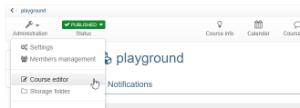
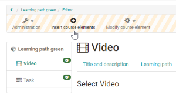
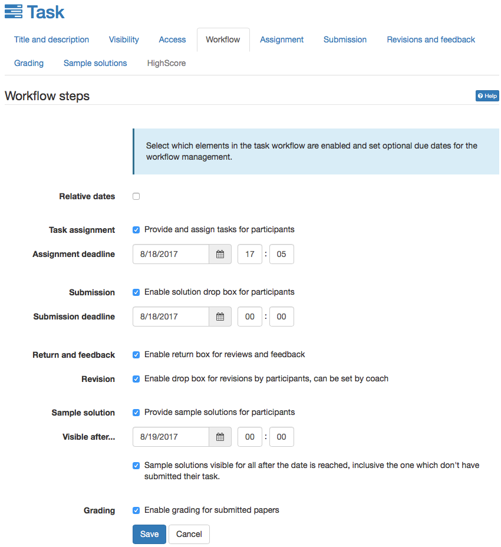
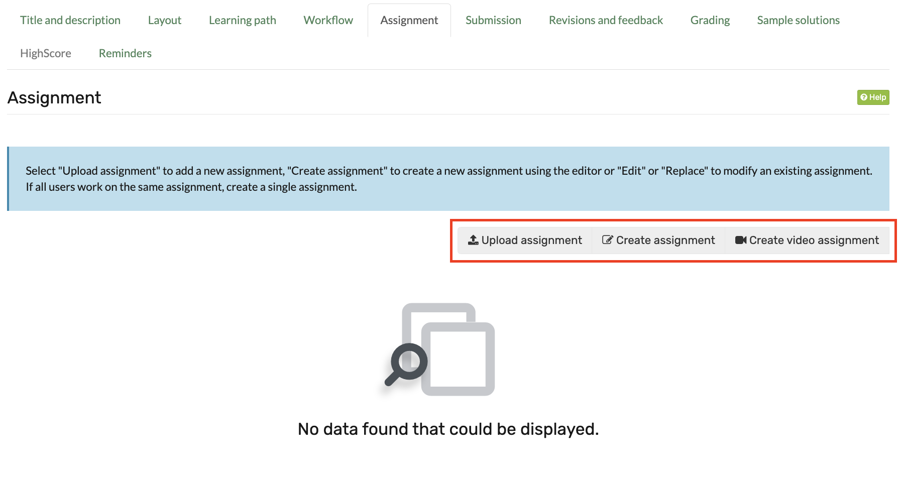
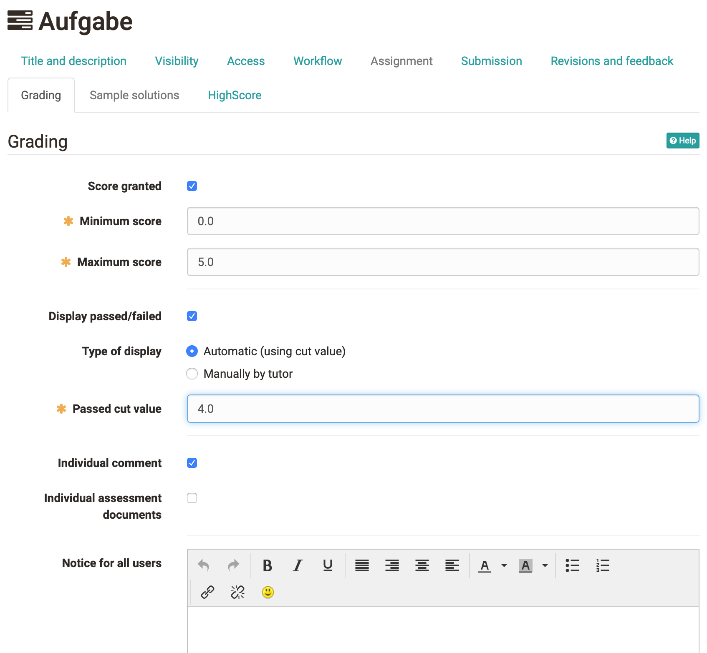
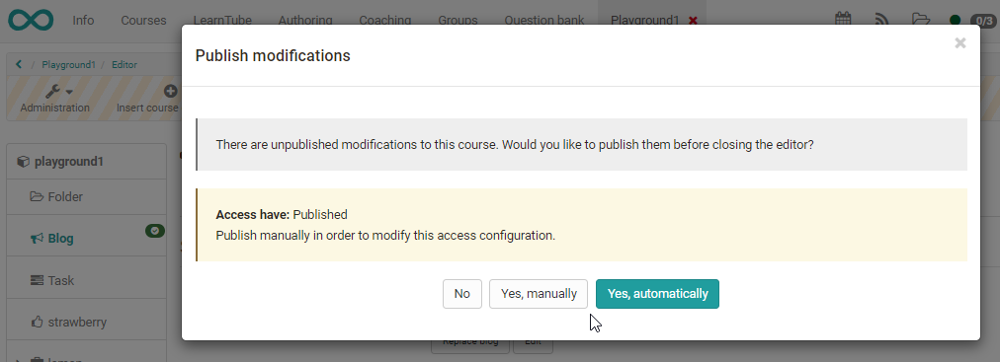

# Three Steps to Your Task

##  Requirements

Before adding a task all task files and sample solutions (optionally) should
be available in an established file format (e.g. PDF documents). It is
possible though to create both the tasks and the sample solutions directly in
OpenOlat.

In case you have not created a course yet the chapter ["Creating
Courses"](../course_create/index.md) will help you to do so before creating your
tasks by means of the following instruction.

##  Create Task

### Step 1: Open course editor and insert task course element   
1. Search for your course in "Authoring", section "My entries", and open it.

2. Click on "Course editor" in the drop-down menu "Administration" in the
   toolbar. 

     { class="shadow" }

3. Select position at which your task course element should be inserted by
   clicking on it.

4. Select "Task" or "Grouptask" in the pop-up "Insert course elements" in the
   toolbar.  

     { class="shadow" }

5. Indicate a title for your course element in the tab "Title and
   description" and save your settings.  
  
### Step 2: Configure task  {: #configuration}
 
1. Select your favored sub-elements in the tab "Workflow". Only sub-elements
    selected can be configured in the following tabs. In the group task this is
    also where you select the associated groups. Save your settings.

    { class="shadow" }

2. Upload your previously created task file(s) or create them directly in the
    "Assignment" tab.

    Use "Create video assignment" to record your tasks as a video directly with your webcam.

    { class="shadow" }

    You can decide if course coaches are allowed to upload assignments by
    themselves, if assignments are assigned automatically or chosen by the
    participant manually and if an assignment is assigned only to one user/group
    or if the same assignment is assignment to all users/groups.

    Optionally write a message for users in the section "Assign task" and
    configure your allocation according to your needs.

    In group tasks you have to select groups or learning areas for which the
    task will be available.  
  
3. Determine in the "Submission" tab whether solutions should be uploaded
    and/or created directly within OpenOlat. Restrict the number of submitted
    documents if so desired. Optionally adapt the confirmation text and configure
    e-mail settings. Save your settings.  
  
4. In the tab "Revisions and feedback" you can define, how many files can
    be uploaded at maximum.

5. Select assessment options in the "Grading" tab. Available are: "Score
    granted" (incl. minimum/maximum score), "Display passed/failed" incl. option
    "Type of display" (manually or automatically), "Individual comment" and
    "individual assessment documents". Save your settings.

    In the case of learning path courses, you can also set here whether the task
    is to be disregarded in the course evaluation.

    { class="shadow" }

6. Upload your previously created sample solution(s) or create them directly
    in the tab "Sample solution".  

7. If "Score granted" is activated in the tab "Grading" the tab
    "[Highscore](../course_elements/Assessment.md#highscore)" is available as well.

    Determine here whether a "Congratulations title", a "Podium", a "Histogram"
    and/or the ranking list should be displayed. The display can be with name or
    anonymous.  
  
### Step 3: Publish and activate your course   
  
Close the course editor and publish the course.

{ class="shadow" }
  
Your task is now embedded in your course. Depending on the configuration of
your (group) task element course participants will be able to select a task
and submit their solution. Course authors and coaches can then view and return
all submitted and corrected files. With an enabled revision phase, coaches can
even place revision requests for their participants. Assessment can be carried
out either directly in the course element or by means of the [assessment
tool](../course_operation/Using_Course_Tools.md#UsingCourseTools-_bewertungswerkzeug).

Subscribe to the course element in the course view. Whenever a course
participant submits a file you will receive a corresponding e-mail or a
notification in your personal menu, section "Subscriptions." The notifications
is only sent if the action is finished. Alternatively you can subscribe for
all uploads and changes of assessible course elements in the [assessment
tool](../course_operation/Using_Course_Tools.md#UsingCourseTools-_bewertungswerkzeug).