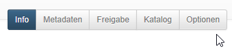
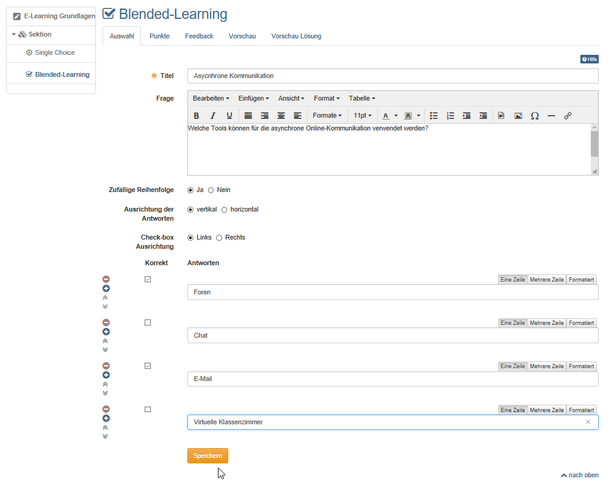
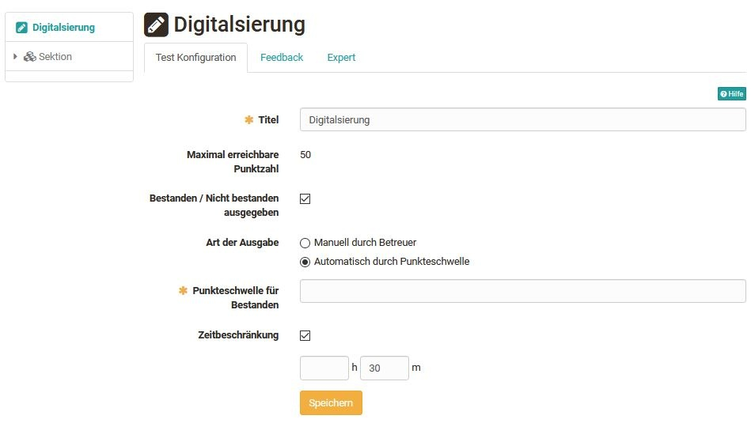
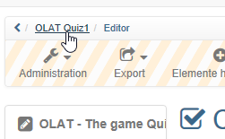
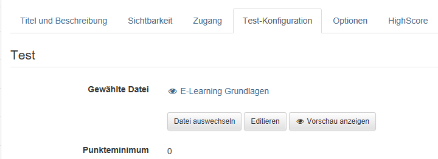

# Vier Schritte zu Ihrem Test oder Selbsttest

Mit dieser Anleitung haben Sie in kurzer Zeit einen einfachen Test oder Selbsttest in Ihren Kurs eingebunden und den Kurs für Ihre Lernenden freigeschaltet.

## Schritt 1: Lernressource Test erstellen

1. Im Autorenbereich den Link "Erstellen" wählen und die Lernressource "Test (QTI 2.1)" wählen.
   
    { class="shadow" }
  
2. Titel des Tests eintragen|

    { class="shadow" }
  
3. Es erscheint ein Menü. Hier können Sie in den unterschiedlichen Tabs bei Bedarf weitere Einstellungen vornehmen.

    Das Menü entspricht den "[Einstellungen](../course_create/Course_Settings.de.md)" im Bereich `Administration` und kann auch später noch bearbeitet werden.

    { class="shadow" }
  
## Schritt 2: Testfragen erstellen am Beispiel Multiple Choice

1. In der "Administration" der Lernressource Test → "Inhalt editieren" wählen und sie gelangen in den Testeditor.|

    { class="shadow lightbox" }
  
2. "Elemente hinzufügen" wählen und den passenden Fragetyp auswählen, z.B. Multiple Choice.
3. Im Tab "Auswahl" den Titel der Frage, die Fragestellung und die möglichen Antworten eingeben. Weitere Antwortmöglichkeiten werden über das Pluszeichen ergänzt.
4. Im Tab "Punkte" die Art und die Summe der Punkte definieren.
5. Bei Bedarf ein Feedback zur Frage definieren und sich die Frage über die Vorschau anschauen  
  
Nach dem gleichen Prinzip fügen Sie weitere Fragen hinzu. Dabei können die Details der Einstellungen je nach Fragetyp variieren. Sie können Ihren Test auch mit [Sektionen oder Test-Parts](Configure_tests.de.md) weiter strukturieren.

!!! info "Hinweis"

    Standardmäßig ist bereits eine Single Choice Frage angelegt, die Sie nutzen und bearbeiten oder löschen sollten.

!!! warning "Achtung"

    Überlegen Sie sich unbedingt im Vorfeld, welcher Fragetyp für Ihre jeweilige Zwecke am geeignetsten ist, da der Fragetyp im Nachhinein nicht mehr geändert werden kann.

!!! tip "Tipp"

    Das Kopieren von Fragen empfiehlt sich dann, wenn Sie mehrere Fragen mit denselben Antwortmöglichkeiten haben, z.B. mehrere Fragen mit einem Wert aus einer Skala von 1-5.

## Schritt 3: Test konfigurieren

1. Wählen Sie das oberste Element des Tests und bearbeiten Sie die bei Bedarf die zugehörigen Tabs.

    { class="shadow lightbox" }

    { class="shadow" }
  
2. **Test Konfiguration:** Definieren Sie ab wieviel Punkten der Test
bestanden ist und ob bzw. welche Zeitbeschränkung es gibt.

    **Feedback:** Definieren Sie, falls gewünscht, ein generelles Feedback für den Fall, dass der Test bestanden wurde bzw. nicht bestanden wurde (gilt für automatisches Bestehen).

3. **Expert:** Weitere Details des Testablaufs konfigurieren, z.B. Art der Navigation oder die Anzeige von Lösungen.
4. Abschließend den Testeditor schließen indem man in der Krümelnavigation auf den Titel des Tests klickt.
  
!!! info "Hinweis"

    Sie können sowohl ein Feedback für einzelne Fragen als auch für den gesamten Test erstellen.

## Schritt 4: Test im Kurs einbinden und finalisieren

1. Gehen Sie in den Autorenbereich. Im Bereich "Meine Einträge" finden Sie Ihre Kurse. Öffnen Sie den Kurs in dem der Test eingebunden werden soll.

    { class="shadow lightbox" }

    { class="shadow lightbox" }

    { class="shadow lightbox" }

2. Öffnen Sie über die "Administration" den "Kurseditor". Wählen sie "Kursbausteine einfügen" und klicken auf den gewünschten Kursbaustein Test oder Selbsttest.
3. Gehen Sie in den Tab "Test-Konfiguration" → "Datei wählen, erstellen oder importieren"
4. Es erscheint eine Liste mit Ihren Lernressourcen Test. Wählen Sie den vorbereiteten Test aus indem Sie auf den Auswahlhaken klicken.
5. Bei Bedarf können Sie sich im Tab "Test-Konfiguration" unter "Gewählte
Datei" den eingebundenen Test in der Vorschau anzeigen lassen und Solange er nicht bearbeitet wurde auch editieren.
6. Bei Bedarf können noch die weiteren Tabs des Kursbausteins konfiguriert werden. Nun ist der Test in Ihrem Kurs eingebunden.
7. Damit der Test von den Lernenden bearbeiten werden kann muss der Kurs noch publiziert werden. Dafür einfach den Kurseditor durch Klick auf den Namen des Kurses in der Krümelleiste schließen und bei der erscheinenden Auswahl daS Publizieren durch die Auswahl "Ja" manuell oder automatisch erlauben.

    Alternativ kann auch der "Publizieren" Button im Editor rechts in der Toolleiste verwendet werden.  

Der Test bzw. Selbsttest ist nun im Kurs eingebunden und für die User sichtbar und bearbeitbar. Von den Lernenden bearbeitete Tests (nicht Selbsttests) können anschließend vom Lehrenden im Kursrun oder im Bewertungswerkzeug bewertet werden. Weitere Infos dazu finden Sie im Kapitel "[Tests bewerten](../course_operation/Assessing_tests.de.md)".

!!! note "Voraussetzung"

    Voraussetzung dafür, dass die Lernenden den Test bearbeiten können, ist dass der Kurs auch veröffentlicht wurde und die jeweiligen Personen [Zugang](../course_create/Access_configuration.de.md) zum Kurs haben.
