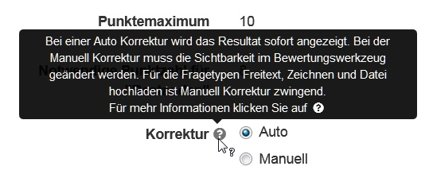

# Über dieses Handbuch

Dieses Handbuch macht Sie mit OpenOlat vertraut und erklärt Ihnen dessen Funktionalitäten von Grund auf.

Das OpenOlat-Handbuch ist für Personen geschrieben, die aus verschiedensten Gründen Interesse an E-Learning und dem Einsatz von OpenOlat haben. Wenn Sie noch nie mit OpenOlat (ehemals OLAT) gearbeitet haben, wird Ihnen hier erklärt, wie Sie schrittweise in die Nutzung der Lernplattform einsteigen können. Dazu zählt die Recherche nach gewünschten Lerninhalten, deren Bearbeitung sowie der Einsatz kollaborativer Werkzeuge.

Möglicherweise kennen Sie OLAT als Benutzer und möchten nun selbst Lerninhalte in OpenOlat zur Verfügung stellen. Dann können die Kapitel zu Lernressourcen, Kurserstellung, Kursbausteinen und Kurseditor, Testerstellung sowie Kursbetrieb ihre Arbeit unterstützen.

Falls Sie schon OLAT-Experte sind, dient Ihnen dieses Handbuch als Nachschlagewerk. Orientieren Sie sich am Inhaltsverzeichnis, um möglichst schnell an die gewünschte Stelle zu gelangen.

In diesem Handbuch wird die weibliche Form der männlichen nicht beigestellt. Der Grund dafür ist allein die bessere Lesbarkeit. Wo sinnvoll, ist selbstverständlich immer auch die weibliche Form gemeint.

## Weitere Informationsquellen

### Hilfe in OpenOlat

#### Handbuch Link

Rechts oben in der der Hauptmenüleiste besteht jederzeit Zugang zum OpenOlat
Handbuch (hier befinden Sie sich aktuell) und eventuell zu weiteren
Hilfeseiten, je nach Konfiguration durch den System Administrator.  Klicken
Sie einfach auf das Fragezeichen! :fontawesome-solid-circle-question:.

!!! info
	Falls der Link nicht erscheint wurde er bei den Benutzerwerkzeugen in den
	persönlichen [Einstellungen ](../personal/Configuration.de.md)ausgeblendet.

#### Kontextsensitive Hilfe

{ height=24px }

Bei Ihrer täglichen Arbeit mit OpenOlat steht Ihnen dieses OpenOlat-Handbuch
zur Seite, sowie an wichtigen Stellen im System die  kontextsensitive Hilfe.
Diese Hilfe führt Sie direkt zur relevanten Stelle in OpenOlat Manual und
erklärt Ihnen die Konfigurationsmöglichkeiten für den Ort an dem Sie sich
gerade befinden. Sie erkennen diese Hilfestellung am Fragezeichen-Icon.
Klicken Sie darauf und das Manual öffnet sich in einem neuen Fenster.

#### Hilfe in Formularen

Des weiteren finden Sie vor allem in Formularen drei weitere Hilfestellungen,
die Ihnen kurz und knapp benötigte oder weiterführende Informationen zu z.B.
einzelnen Formularfeldern. Wenn Sie dieses Icon
{ class=size16 }
neben einer Feldbeschriftung sehen, fahren Sie mit der Maus darüber um eine
kurze Information zu erhalten. Hier ein Beispiel aus der Konfiguration eines
Tests im Kurseditor:

{ class="shadow" width=400px }

#### Hellgrauer Text innerhalb von Feldern...

{ class="shadow" width=150px }

...gibt Hilfestellung **wie** die Felder ausgefüllt werden sollen,

#### Hellgrauer Text unterhalb von Feldern 

{ class="shadow" width=420px }

stellt direkt benötigte Informationen **über** den Feldinhalt zur Verfügung.

### Community, Kursvorlagen und Demokurse

Auf dem [Community Server](https://community.openolat.org) sowie auf dem [Demoserver](https://learn.olat.com "Demoserver") gibt es Demokurse,
die Sie betrachten können.

### Support

Bitte wenden Sie sich an die jeweilige Supportstelle(n) Ihrer OpenOlat
Instanz. Die Supportadresse ist normalerweise im Hilfemenü im Kopfbereich der Seite zu finden oder im Impressum im Kopfbereich oder im Fussbereich der Seite. 

## Copyright

Dieses Handbuch basiert auf einer adaptierten Version des "OLAT 7.1 Handbuch" und wird unter einer 
**Creative Commons Attribution-NonCommercial-ShareAlike license** Lizenz veröffentlicht.

Seit 2015 wird das Handbuch von der Firma [frentix GmbH](https://www.frentix.com/) finanziert und gepflegt, dies
ist die Firma die auch hinter der [https://www.openolat.org](Entwicklung des Open Source LMS OpenOlat) steht.  

In der langen Zeit der Entwicklung des Handbuches waren viele Personen involviert. Bitte respektieren Sie 
das geistige Eigentum und die Lizenz, under der das Handbuch veröffentlicht wird. 

!!! info ""
	Some rights reserved! This document is copyright protected by the owners and companies listed below under the Attribution-NonCommercial-ShareAlike Creative Commons license. For more information check:
	<http://creativecommons.org/licenses/by-nc-sa/3.0/ch/>

##### Verantwortliche Personen (sortiert nach Vorname):

| Name | Beitrag | Sponsoring durch |
| ---- | ------------ | ----------- |
| Benjamin Glock | Inhalt | frentix |
| Christian Franck | Inhalt | frentix |
| Christian Meier | Inhalt | TU Dresden |
| Florian Gnägi | Inhalt, Migration | frentix |
| Joël Fisler | Spezielles | Universität Zürich, MELS |
| Kirsten Scherer Auberson | Inhalt | frentix |
| Kristina Isacson | Inhalt | Universität Zürich, MELS  |
| Lukas Witschi | Inhalt | frentix |
| Mandy Menzel | Inhalt | frentix |
| Michael Enz | Migration | frentix |
| Oliver Kant | Technik | frentix |
| Renata Sevcikova | Inhalt | Universität Zürich, MELS |
| Rico Eberle | Inhalt | frentix |
| Sabine Hemsing | Inhalt | VCRP |
| Sabrina Scheiwiler | Inhalt | frentix |
| Sandra Arnold | Inhalt | Universität Zürich, MELS |
| Sandra Hübner | Inhalt | Hochschule Furtwangen |
| Tina Frenzel | Inhalt | frentix |

