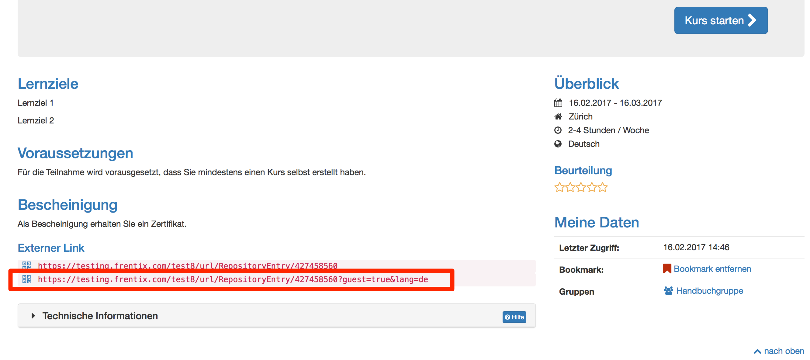

# Gastzugang

{ class="shadow lightbox aside-right-lg" }

Neben registrierten Benutzern können auch Personen ohne OpenOlat Account als
Gäste Zugang zum System erhalten. Gäste sind anonyme, nicht registrierte
Benutzer, welche in der [Benutzerverwaltung](../../manual_admin/usermanagement/index.de.md) nicht
verwaltet werden können.

Damit Gäste Zugang erhalten, muss der Gastlogin vom Administator der OLAT
Instanz aktiviert werden. Auch kann konfiguriert werden auf welche OpenOlat
Bereiche Gäste Zugriff haben und auf welche nicht. Diese Basis-Einstellungen
sind nur durch den Systemadministrator möglich.

!!! warning "Hinweis"

    Der Gastzugang ist nur bei herkömmlichen Kursen, nicht bei Lernpfad Kursen
    aktivierbar.

## Kursbereich  

In einem Kurs kann der Kursbesitzer die Zugangskonfiguration in den
"Einstellungen"→ Tab "Freigabe" so einrichten, dass auch Gäste Zugriff auf den
Kurs erhalten.

Folgende Kursbausteine kann ein Gast sehen:

  * **Lesen**: CP Lerninhalt, Blog, Wiki, Mitteilung, Kalender, Einzelseite, externe Seite, Dateidiskussion, Linkliste
  * **Forum**: Der Kursitzer kann im Kurseditor einstellen, ob auch Gäste Forenbeiträge erstellen dürfen
  * **Podcast und Video** schauen
  * **Ordner**: Dateien herunterladen
  * **Teilnehmer Ordner**: gleich wie normaler Benutzer (hochladen etc)
  * **SCORM**: durchführen
  * **Test**: je nach Konfiguration durchführen
  * **Selbsttest**: durchführen (auch wenn Option nicht angewählt)

Wenn Sie einem Gast einen direkten Zugriff zu einem Kurs geben, können Sie ihm
den Externen Link zum  Kurs schicken. Wichtig ist, dass der Kurs in der
Zugangskonfiguration für Gäste freigeschalten ist (siehe oben). Den externen
Link finden Sie auf der Infoseite des Kurses.

!!! info "Info"
    
    Administrative Einstellungen werden von OLAT Administratoren im Bereich Login
    → ["Gast und Einladung](../../manual_admin/administration/Guest_and_invitation.de.md)" und unter
    "[Customizing](../../manual_admin/administration/Customizing.de.md)" → "Sites" vorgenommen.