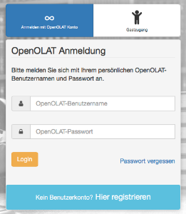
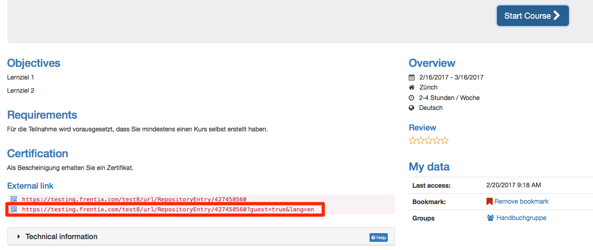

# Guest access

{ class="shadow lightbox aside-right-lg" }

Beside system users a guest access can be enabled. Guests are anonymous, not
registered users, which cannot be managed in the [user management](../../manual_admin/usermanagement/index.md).

In order to grant guests access the guest login has to be activated by the
administrator of the OpenOlat instance. It is also possible to configure which
OpenOlat areas guests have access to and which not. These basic settings can
only be made by the system administrator.

Grundsätzlich können diverse Lernressourcen z.B.  Wikis, Blogs, Glossare, Tests, Videos oder Glossare für Gäste freigeschaltet werden.  

## Course level

!!! warning "Hinweis"

    Guest access can only be activated for conventional courses, not for learning path courses.

In a course, the course owner can set up the access configuration in the
"Settings"→ "Access" tab so that guests can also access the course. Als Einstellung muss dabei die Buchungsmethode aktiviert und in einem zweiten Schritt der Gastzugang ausgewählt werden.

The following course elements can be seen by guests:

  * **Read only**: CP learning content, blog, wiki, forum, notifications, calendar, single page, external page, file dialog, link list
  * **Forum**: In the course editor it can be defined by the course owner, if guests should be allowed to create forum entries
  * **Watch podcast and video**
  * **Participant folder**: same as normal user
  * **SCORM**: do
  * **Test**: do it depending on configuration
  * **Self-test**: do it (even if option is not selected)
  * An **BigBlueButton**, **OpenMeetings** u.ä. Meetings teilnehmen
  * **Umfragen** bearbeiten

If you want to give a guest a direct access to a course, you can send him the
external link for the course. 

  
!!! info "Info"  

    Administrative settings are made by OpenOlat administrators in the section
    Login → ["Guest and Invitation"](../../manual_admin/administration/Guest_and_invitation.md) and under ["Customizing"](../../manual_admin/administration/Customizing.de.md) → "Sites".

