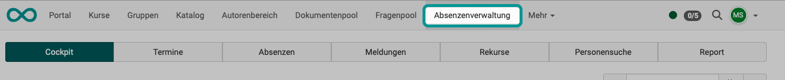
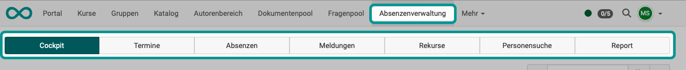
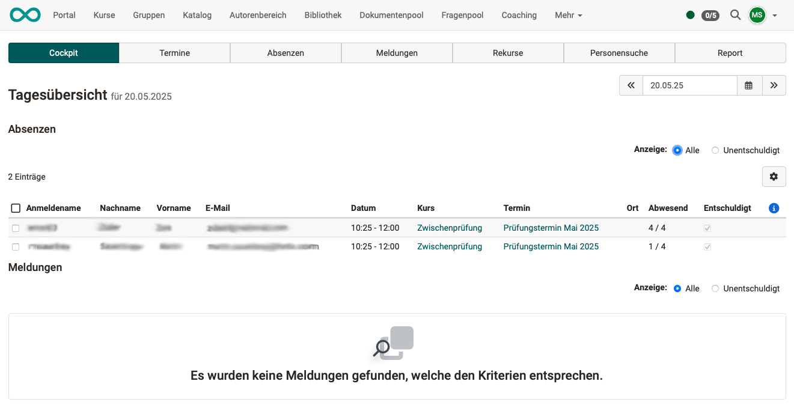
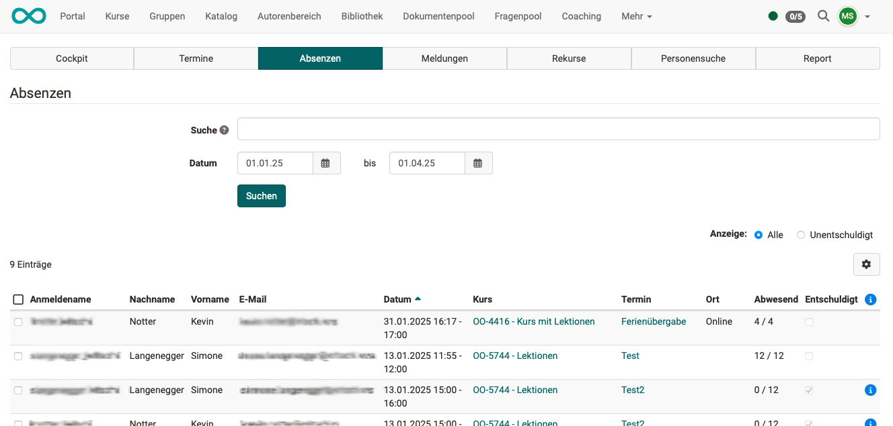
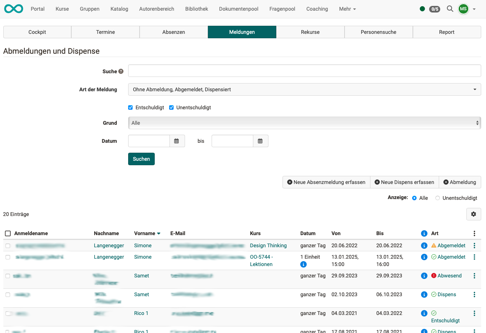
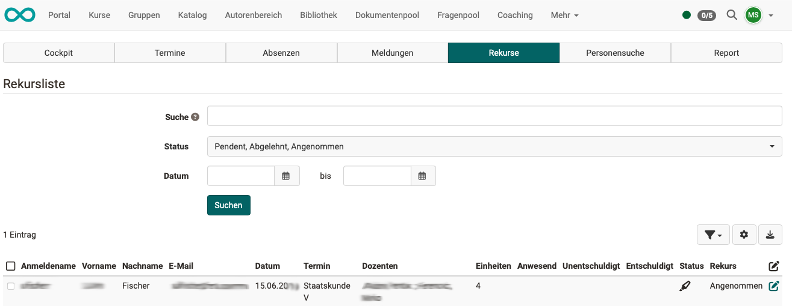
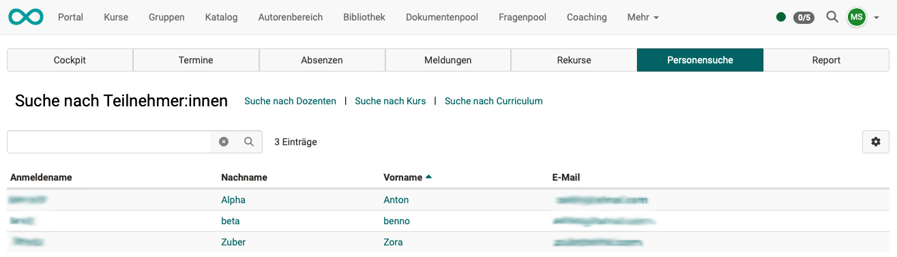
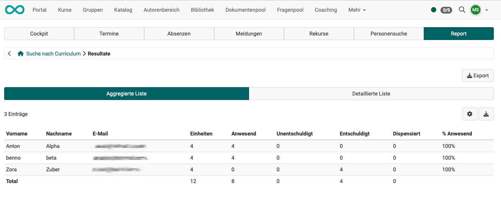
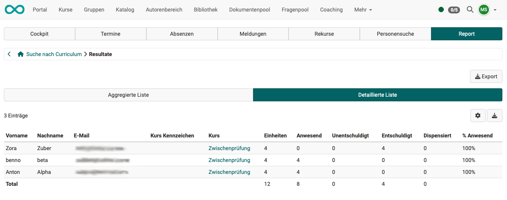

# Absenzenverwaltung {: #absence_management}

## Was ermöglicht die Absenzenverwaltung?  {: #purpose}

Die im Hauptmenü angezeigte Absenzenverwaltung bezieht sich auf die **kursübergreifende Absenzenverwaltung** durch Berechtigte mit der **Rolle Absenzenverwalter:in**.

Berechtigte mit dieser Rolle bearbeiten z.B. Dispensen und Rekurse. Diese Verwaltungsaufgabe geht über die einfache Erfassung hinaus, die in einem bestimmten Kurs stattfindet und ist deshalb einer gesonderten Rolle zugeordnet.

Daneben können Absenzen auch an anderen Stellen abgefragt oder erfasst werden. 
Links zu Erklärungen der übrigen Punkte finden Sie unter den [weiterführenden Informationen](#further_information), bzw. in den [Basiskonzepten]((../basic_concepts/Events_and_Absences.de.md)) erklärt.

[Zum Seitenanfang ^](#absence_management)

---

## Wo finde ich die Absenzenverwaltung?  {: #access}

Berechtigte finden die kursübergreifenden Absenzenverwaltung im **Menü der Kopfzeile:**

{ class="shadow lightbox" }

!!! hint "Hinweis"

    Der Menü-Eintrag kann auch an einer anderen Stelle in der Kopfzeile stehen. Wenn viele Einträge in der Kopfzeile angezeigt werden, kann "Absenzenverwaltung" unter "Mehr" ganz rechts enthalten sein.

[Zum Seitenanfang ^](#absence_management)

---

## Wer kann die Absenzenverwaltung benutzen? {: #users}

Ob die Absenzenverwaltung in einem bestimmten Kurs **verwendet** wird, entscheiden die Kursbesitzer:innen. 

Das **Erfassen** der einzelnen Absenzen obliegt dann in der Regel den Betreuer:innen. Deshalb finden diese die Werkzeuge zum Erfassen in den Kursen oder im Coachingtool. 
Die Teilnehmer:innen erfassen ihre eigenen Absenzen/Abmeldungen/Rekurse im [persönlichen Menü >](../personal_menu/Absences.de.md). 

Die im Hauptmenü angezeigte und nachstehend beschriebene Absenzenverwaltung kann dagegen **Absenzenverwalter:innen** und administrativen Rollen zur Verfügung gestellt werden. In der kursübergreifenden Absenzenverwaltung kann auf alle Absenzen in der Gesamtschau zugegriffen werden und die berechtigten Personen können alle Absenzen umfassend **verwalten**.

[Zum Seitenanfang ^](#absence_management)

---

## Aktivierung des Moduls "Absenzenverwaltung" {: #activation}

Wie bei allen Modulen, erfolgt die [generelle Aktivierung](../../manual_admin/administration/Modules_Events_and_Absences.de.md) durch Administrator:innen.

Damit die Absenzenverwaltung im Hauptmenü verfügbar ist, muss das Modul "Termine und Absenzen" von einem/einer Administrator:in aktiviert worden sein. Weitere Informationen dazu finden Sie [hier](../../manual_admin/administration/Modules_Events_and_Absences.de.md).

Die Aktivierung und Konfiguration der Termin- und Absenzenverwaltung für einen bestimmten Kurs erfolgt anschliessend in der Kursadministration: 
**Administration > Einstellungen > Tab "Durchführung" > Abschnitt "Konfiguration Termin- und Absenzenverwaltung im Kurs"** 
Mehr dazu finden Sie [hier](../learningresources/Events_and_absences.de.md).

[Zum Seitenanfang ^](#absence_management)

---

## Welche Hauptfunktionen/Bestandteile hat die Absenzenverwaltung? {: #features}

Nach dem Aufruf der Absenzenverwaltung werden Ihnen die Hauptfunktionen als Tabs angezeigt:

- [Cockpit](#tab_cockpit)
- [Termine](#tab_events)
- [Absenzen](#tab_absences)
- [Meldungen](#tab_notices)
- [Rekurse](#tab_appeals)
- [Personensuche](#tab_user_search)
- [Report](#tab_report)

{ class="shadow lightbox" }

[Zum Seitenanfang ^](#absence_management)

---

## Tab Cockpit {: #tab_cockpit}

Im Cockpit werden in zwei untereinanderliegenden Abschnitten die **Absenzen** und die **Meldungen** eines Tages angezeigt. Standardmässig wird der aktuelle Tag angezeigt, es kann jedoch rechts oben ein beliebiger anderer Tag gewählt werden.

{ class=" shadow lightbox" }

[Zum Seitenanfang ^](#absence_management)

---

## Tab Termine {: #tab_events}

{ class=" shadow lightbox" }

[Zum Seitenanfang ^](#absence_management)

---

## Tab Absenzen {: #tab_absences}

{ class=" shadow lightbox" }

Mit dem Suchfeld können Sie nach Benutzer:innen, Dozent:innen, Kurstiteln und Terminen suchen.

[Zum Seitenanfang ^](#absence_management)

---

## Tab Meldungen {: #tab_notices}

{ class=" shadow lightbox" }

Mit dem Suchfeld können Sie nach Benutzer:innen, Dozent:innen, Kurstiteln und Terminen suchen.

[Zum Seitenanfang ^](#absence_management)

---

## Tab Rekurse {: #tab_appeals}

{ class=" shadow lightbox" }

Ein Rekurs muss innerhalb der vorgegeben **Rekursfrist** erfolgen. (Die Rekursfrist wird systemweit von Ihrem/Ihrer Administrator:in eingestellt.)

Mit dem Suchfeld können Sie nach Benutzer:innen, Dozent:innen, Kurstiteln und Terminen suchen.

[Zum Seitenanfang ^](#absence_management)

---

## Tab Personensuche {: #user_search}

{ class=" shadow lightbox" }

[Zum Seitenanfang ^](#absence_management)

---

## Tab Report {: #tab_report}

{ class=" shadow lightbox" }

{ class=" shadow lightbox" }

[Zum Seitenanfang ^](#absence_management)

---

## Weiterführende Informationen {: #further_information}

[Basiskonzept Termine und Absenzen >](../basic_concepts/Events_and_Absences.de.md) 
[Aktivierung und Konfiguration des Absenzenmanagements durch Administrator:innen >](../../manual_admin/administration/Modules_Events_and_Absences.de.md) 
[Konfiguration der Absenzenverwaltung in einem Kurs >](../learningresources/Course_Settings_Execution.de.md#config_event_and_absence_management) 
[Erfassung und Verwaltung der Absenzen in einem Kurs durch Kursbesitzer:innen >](../learningresources/Events_and_absences.de.md) 
[Erfassung und Verwaltung der Absenzen in einem Kurs durch Betreuer:innen >](../learningresources/Toolbar_Events.de.md) 
[Persönliche Absenzen >](../personal_menu/Absences.de.md) 
[Kursübergreifende Absenzenerfassungung im Coachingtool >](../area_modules/Coaching.de.md) 

[Zum Seitenanfang ^](#absence_management)

