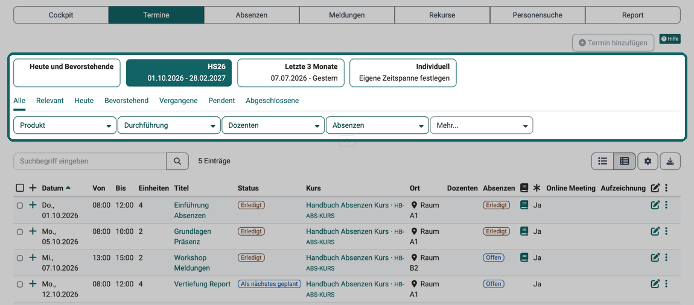
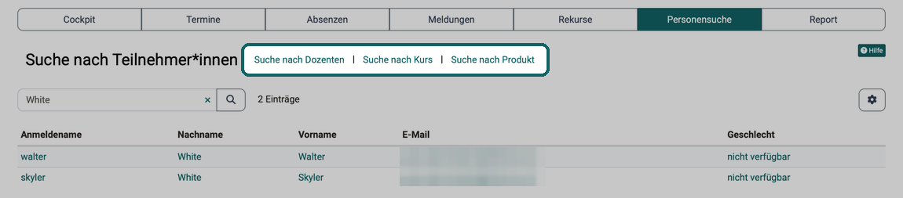
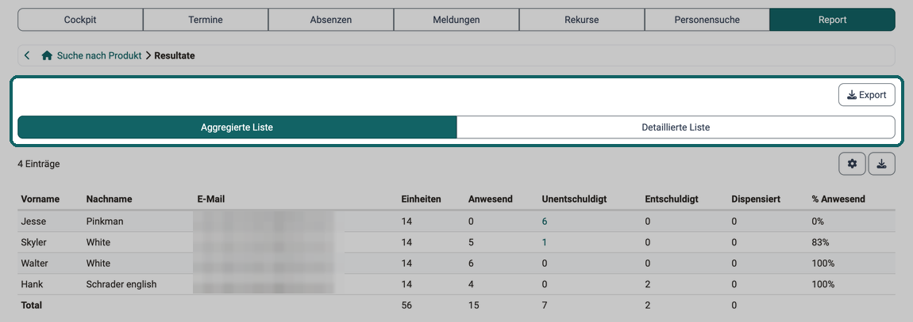
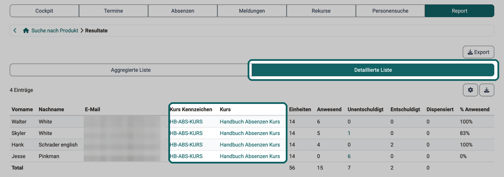

# Absenzenverwaltung {: #absence_management}

## Steckbrief

Name | Absenzenverwaltung
---------|----------
Verfügbar seit | Release 14.1 (OO-4214)

## Was ermöglicht die Absenzenverwaltung?  {: #purpose}

Die in der Hauptnavigation angezeigte Absenzenverwaltung bezieht sich auf die **kursübergreifende Absenzenverwaltung** durch Berechtigte mit der **Rolle Absenzenverwalter:in**.

Berechtigte mit dieser Rolle bearbeiten z. B. Dispensen und Rekurse. Diese Verwaltungsaufgabe geht über die einfache Erfassung hinaus, die in einem bestimmten Kurs stattfindet, und ist deshalb einer gesonderten Rolle zugeordnet.

Daneben können Absenzen auch an anderen Stellen abgefragt oder erfasst werden. 
Links zu Erklärungen der übrigen Punkte finden Sie unter den [weiterführenden Informationen](#further_information) und in den [Lernressourcen](../learningresources/Events_and_absences.de.md).

[Zum Seitenanfang ^](#absence_management)

---

## Wo finde ich die Absenzenverwaltung?  {: #access}

Berechtigte finden die kursübergreifende Absenzenverwaltung in der **Hauptnavigation**:

{ class="shadow lightbox" title="Hauptnavigation mit geöffneter Absenzenverwaltung" }

!!! note "Hinweis"

    Der Menü-Eintrag kann auch an einer anderen Stelle in der Hauptnavigation stehen. Wenn viele Einträge in der Hauptnavigation angezeigt werden, kann "Absenzenverwaltung" unter "Mehr" ganz rechts enthalten sein.

[Zum Seitenanfang ^](#absence_management)

---

## Wer kann die Absenzenverwaltung benutzen? {: #users}

Ob die Absenzenverwaltung in einem bestimmten Kurs **verwendet** wird, entscheiden die Kursbesitzer:innen.

Das **Erfassen** der einzelnen Absenzen obliegt dann in der Regel den Betreuer:innen. Deshalb finden diese die Werkzeuge zum Erfassen in den Kursen oder im Bereich Coaching. 
Die Teilnehmer:innen erfassen ihre eigenen Absenzen/Abmeldungen/Rekurse im [persönlichen Menü >](../personal_menu/Absences.de.md).

Die in der Hauptnavigation angezeigte und nachstehend beschriebene Absenzenverwaltung steht dagegen **Absenzenverwalter:innen**, Principals und Administrator:innen zur Verfügung. In der kursübergreifenden Absenzenverwaltung kann auf alle Absenzen in der Gesamtschau zugegriffen werden und die berechtigten Personen können alle Absenzen umfassend **verwalten**.

[Zum Seitenanfang ^](#absence_management)

---

## Aktivierung des Moduls "Termine und Absenzen" {: #activation}

Wie bei allen Modulen erfolgt die generelle Aktivierung durch Administrator:innen. Damit die Absenzenverwaltung in der Hauptnavigation verfügbar ist, muss das Modul "Termine und Absenzen" in der System-Administration eingeschaltet sein: 
`Administration > Module > Termine / Absenzen` 
Mehr dazu finden Sie unter [Modul Termine und Absenzen](../../manual_admin/administration/Modules_Events_and_Absences.de.md).

In einem bestimmten Kurs schaltet OpenOlat die Termin- und Absenzenverwaltung selbst ein, sobald für den Kurs ein Termin mit "Termin hinzufügen" erstellt wird, zum Beispiel im Course Planner. Von Hand ein- und ausschalten und für den Kurs konfigurieren können Kursbesitzer:innen sie in der Kurs-Administration: 
`Kurs > Administration > Einstellungen > Tab "Durchführung" > Abschnitt "Konfiguration Termin- und Absenzenverwaltung im Kurs"` 
Mehr dazu, auch zu den Fällen, in denen OpenOlat die Funktion nicht selbst einschaltet, finden Sie unter [Kurseinstellungen - Tab Durchführung](../learningresources/Course_Settings_Execution.de.md#lecture_enabled). [:octicons-tag-16:{ title="ab Release 21.1.0 (OO-9711)" }](https://track.frentix.com/issue/OO-9711){:target="_blank"}

[Zum Seitenanfang ^](#absence_management)

---

## Welche Hauptfunktionen/Bestandteile hat die Absenzenverwaltung? {: #features}

Nach dem Aufruf der Absenzenverwaltung werden Ihnen die Hauptfunktionen als Tabs angezeigt:

- [Cockpit](#tab_cockpit)
- [Termine](#tab_events)
- [Absenzen](#tab_absences)
- [Meldungen](#tab_notices)
- [Rekurse](#appeals)
- [Personensuche](#user_search)
- [Report](#report)

[Zum Seitenanfang ^](#absence_management)

---

## Tab Cockpit {: #tab_cockpit}

Im Cockpit werden in zwei untereinanderliegenden Abschnitten die **Absenzen** und die **Meldungen** eines Tages angezeigt. Standardmässig wird der aktuelle Tag angezeigt, es kann jedoch rechts oben ein beliebiger anderer Tag gewählt werden.

In beiden Abschnitten wählen Sie unter **Anzeige**, ob die Liste alle Einträge zeigt (**Alle**) oder nur die unentschuldigten (**Unentschuldigt**). Diesen Umschalter gibt es, wenn in der System-Administration die Option [Entschuldigte Absenzen](../../manual_admin/administration/Modules_Events_and_Absences.de.md#authorized_absences) eingeschaltet ist: `Administration > Module > Termine / Absenzen`, Tab "Konfiguration". Das gilt auch für die Tabs Absenzen und Meldungen.

{ class="shadow lightbox" title="Tab Cockpit der Absenzenverwaltung" }

[Zum Seitenanfang ^](#absence_management)

---

## Tab Termine {: #tab_events}

Der Tab Termine listet die Termine kursübergreifend auf. Mit den Zeitraum-Schaltflächen, den Schnellfiltern und den Filtern grenzen Sie die Liste ein. Den Filter "Produkt" sehen Sie nur, wenn Sie mindestens ein Produkt verwalten.

Rechts oben steht für Absenzenverwalter:innen und Administrator:innen der Button "Termin hinzufügen". Er ist hier ausgegraut, weil weder eine Durchführung noch ein Produkt gewählt ist. Termine erstellen Sie im Course Planner, mehr dazu unter [Course Planner: Termine](Course_Planner_Events.de.md#create_events).

{ class="shadow lightbox" title="Tab Termine der Absenzenverwaltung · 2026.10.07" }

[Zum Seitenanfang ^](#absence_management)

---

## Tab Absenzen {: #tab_absences}

{ class="shadow lightbox" title="Tab Absenzen der Absenzenverwaltung" }

Mit dem Suchfeld können Sie nach Benutzer:innen, Dozent:innen, Kurstiteln und Terminen suchen. Den Zeitraum grenzen Sie mit dem Datumsbereich ein. Unter **Anzeige** wählen Sie, ob die Liste alle Absenzen zeigt (**Alle**) oder nur die unentschuldigten (**Unentschuldigt**).

[Zum Seitenanfang ^](#absence_management)

---

## Tab Meldungen {: #tab_notices}

Der Tab Meldungen listet die Abmeldungen und Dispense auf. Mit den Schaltflächen **Neue Absenzmeldung erfassen**, **Neue Dispens erfassen** und **Abmeldung** erfassen Sie eine Meldung für eine Person.

{ class="shadow lightbox" title="Tab Meldungen der Absenzenverwaltung" }

Mit dem Suchfeld können Sie nach Benutzer:innen, Dozent:innen, Kurstiteln und Terminen suchen. Die Filter **Art der Meldung**, **Grund** und **Datum** grenzen die Liste weiter ein. Sind entschuldigte Absenzen eingeschaltet, legen Sie mit den Kontrollkästchen **Entschuldigt** und **Unentschuldigt** fest, welche Meldungen die Suche findet. Unter **Anzeige** wählen Sie zwischen **Alle** und **Unentschuldigt**.

[Zum Seitenanfang ^](#absence_management)

---

## Tab Rekurse {: #appeals}

{ class="shadow lightbox" title="Tab Rekurse der Absenzenverwaltung" }

Ein Rekurs muss innerhalb der vorgegebenen **Rekursfrist** erfolgen. Die Rekursfrist legen Administrator:innen systemweit in der System-Administration fest: `Administration > Module > Termine / Absenzen`, Tab "Konfiguration".

Mit dem Suchfeld können Sie nach Benutzer:innen, Dozent:innen und Terminen suchen. Der Filter **Status** zeigt die Rekurse nach ihrem Stand: pendent, abgelehnt oder angenommen. Mit **Datum** grenzen Sie den Zeitraum ein.

[Zum Seitenanfang ^](#absence_management)

---

## Tab Personensuche {: #user_search}

Die Personensuche findet Teilnehmer:innen. Über die Links neben dem Titel wechseln Sie zur Suche nach Dozenten, nach Kurs oder nach Produkt.

{ class="shadow lightbox" title="Tab Personensuche der Absenzenverwaltung · 2026.10.07" }

[Zum Seitenanfang ^](#absence_management)

---

## Tab Report {: #report}

Der Report fasst die Anwesenheiten je Person zusammen: als **Aggregierte Liste** über alle Kurse oder als **Detaillierte Liste** je Kurs. Der Tab öffnet zuerst ein Suchformular; die Listen erscheinen nach der Suche. Mit **Export** laden Sie das Ergebnis herunter. Der Report berücksichtigt nur Kurse mit dem Status "Veröffentlicht" oder "Beendet".

{ class="shadow lightbox" title="Aggregierte Liste im Tab Report · 2026.10.07" }

{ class="shadow lightbox" title="Detaillierte Liste im Tab Report · 2026.10.07" }

[Zum Seitenanfang ^](#absence_management)

---

## Weiterführende Informationen {: #further_information}

**Auf dieser Seite erwähnt** 
[Termine und Absenzen >](../learningresources/Events_and_absences.de.md) 
[Persönliche Werkzeuge: Absenzen >](../personal_menu/Absences.de.md) 
[Modul Termine und Absenzen >](../../manual_admin/administration/Modules_Events_and_Absences.de.md) 
[Kurseinstellungen - Tab Durchführung >](../learningresources/Course_Settings_Execution.de.md) 
[Course Planner: Termine >](../area_modules/Course_Planner_Events.de.md)

**Weiterführend** 
[Basiskonzept Termine und Absenzen >](../basic_concepts/Events_and_Absences.de.md) 
[Toolbar: Termine >](../learningresources/Toolbar_Events.de.md) 
[Coaching - Übersicht >](../area_modules/Coaching.de.md)

[Zum Seitenanfang ^](#absence_management)
