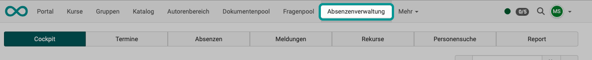
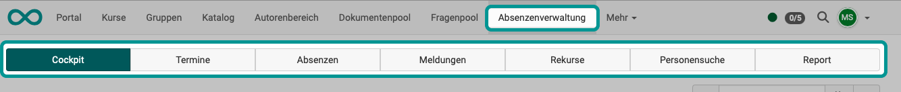
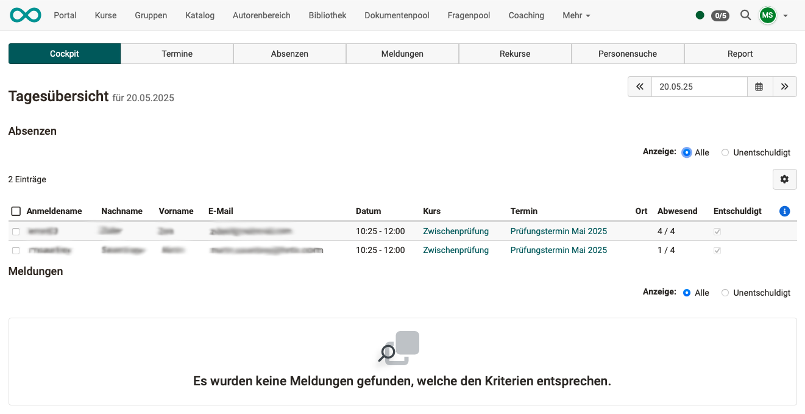
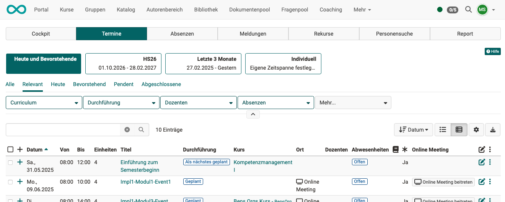
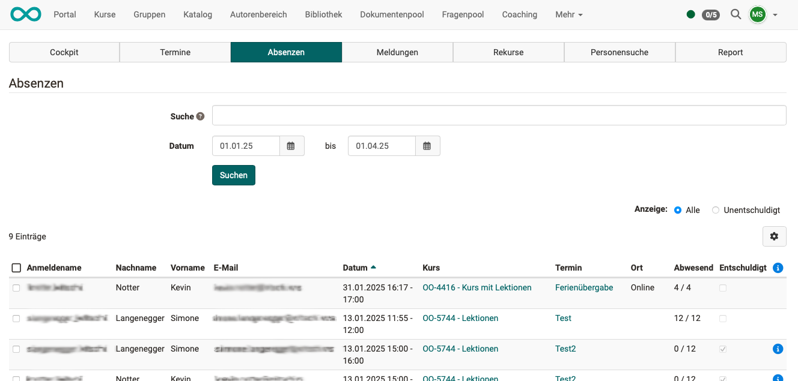
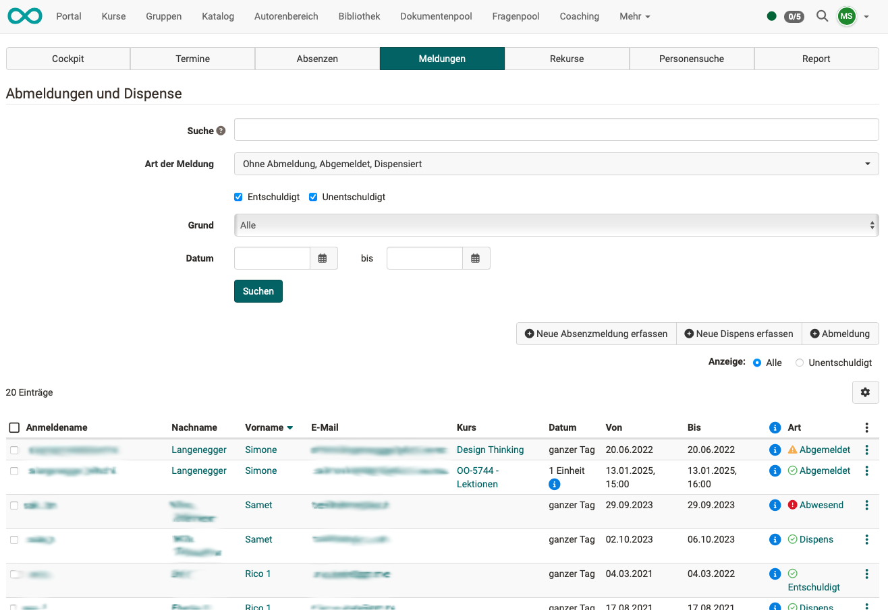
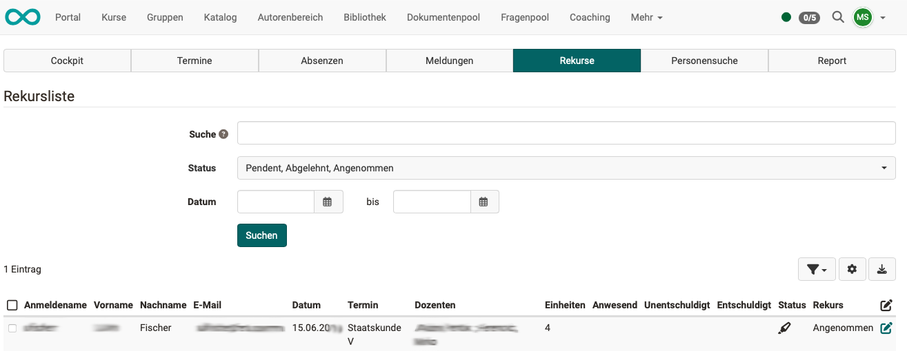
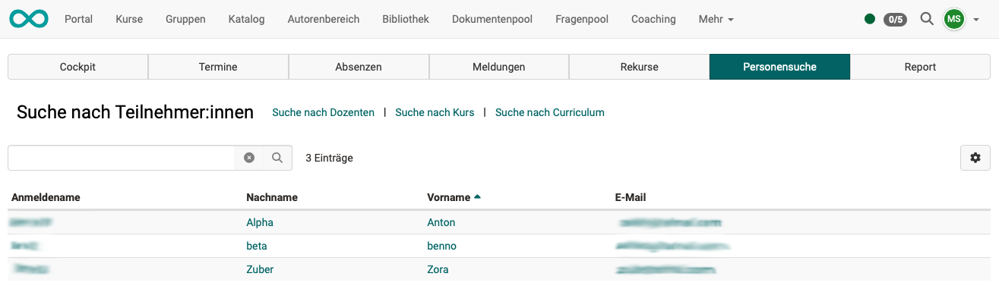
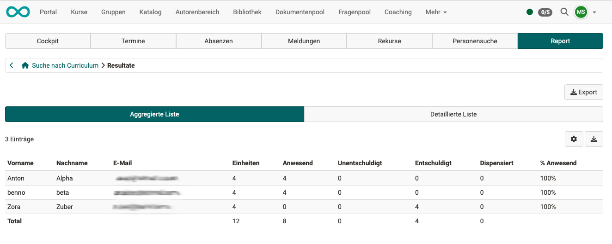
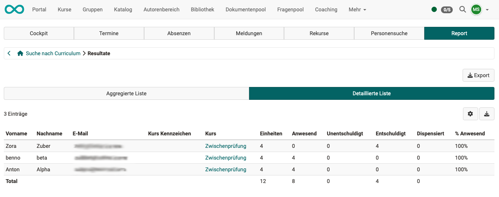

# Absence management {: #absence_management}

## What does absence management enable?  {: #purpose}

The absence management displayed in the main menu refers to **cross-course absence management** by authorized persons with the **role of absence manager**.

Users with this role process dispensations and appeals, for example. This administrative task goes beyond the simple recording that takes place in a specific course, and is therefore assigned to a separate role.

Absences can also be queried or recorded in other places. 
Links to explanations of the remaining points can be found under [further information](#further_information) and in the [learning resources](../learningresources/Events_and_absences.md).

[To the top of the page ^](#absence_management)

---

## Where can I find the absence management?  {: #access}

Authorized users can find the cross-course absence management in the **header menu:**

{ class="shadow lightbox" }

!!! note "Note"

    The menu item may also be located elsewhere in the header. If there are many items displayed in the header, "Absence management" may be located under "More" on the far right.

[To the top of the page ^](#absence_management)

---

## Who can use the absence management? {: #users}

Course owners decide whether absence management is **used** in a particular course.

The **recording** of individual absences is then usually the responsibility of the coaches. That is why they will find the tools for recording absences in the courses or in the Coaching area. 
Participants record their own absences/notices of absence/appeals in the [personal menu >](../personal_menu/Absences.md).

The absence management displayed in the main menu and described below is available to **absence managers**, principals and administrators. In cross-course absence management, all absences can be accessed in the overview, and authorized persons can **manage** all absences comprehensively.

[To the top of the page ^](#absence_management)

---

## Activation of the "Events and absences" module {: #activation}

As with all modules, general activation is carried out by administrators. For absence management to be available in the main menu, the "Events and absences" module must be switched on in the system administration: 
`Administration > Modules > Events / Absences` 
Find out more under [Module Events and Absences](../../manual_admin/administration/Modules_Events_and_Absences.md).

The activation and configuration of the event and absence management for a specific course is then carried out in the course administration: 
`Course > Administration > Settings > Tab "Execution" > Section "Configuration of Event & Absence management in course"` 
Find out more under [Course Settings - Tab Execution](../learningresources/Course_Settings_Execution.md#config_event_and_absence_management).

[To the top of the page ^](#absence_management)

---

## What are the main functions/components of absence management? {: #features}

After opening the absence management, the main functions are displayed as tabs:

- [Cockpit](#tab_cockpit)
- [Events](#tab_events)
- [Absences](#tab_absences)
- [Notices](#tab_notices)
- [Appeals](#appeals)
- [User search](#user_search)
- [Report](#report)

{ class="shadow lightbox" }

[To the top of the page ^](#absence_management)

---

## Tab Cockpit {: #tab_cockpit}

The cockpit displays the **absences** and **notices** of a day in two sections below each other. The current day is displayed by default, but any other day can be selected in the top right corner.

{ class="shadow lightbox" }

[To the top of the page ^](#absence_management)

---

## Tab Events {: #tab_events}

The tab Events lists the events across courses. Use the period buttons, the quick filters and the filters to narrow down the list.

{ class="shadow lightbox" }

[To the top of the page ^](#absence_management)

---

## Tab Absences {: #tab_absences}

{ class="shadow lightbox" }

You can use the search field to search for users, coaches, course titles and events.

[To the top of the page ^](#absence_management)

---

## Tab Notices {: #tab_notices}

The tab Notices lists the notices of absence and dispensations. Use the buttons **Record new absence**, **Record new dispensation** and **Record new notice of absence** to record a notice for a person.

{ class="shadow lightbox" }

You can use the search field to search for users, coaches, course titles and events.

[To the top of the page ^](#absence_management)

---

## Tab Appeals {: #appeals}

{ class="shadow lightbox" }

An appeal must be lodged within the specified **appeal period**. Administrators set the appeal period system-wide.

You can use the search field to search for users, coaches and events.

[To the top of the page ^](#absence_management)

---

## Tab User search {: #user_search}

The user search finds participants. Use the links next to the title to switch to the search by teachers, by courses or by products.

{ class="shadow lightbox" }

[To the top of the page ^](#absence_management)

---

## Tab Report {: #report}

The report summarizes the attendances per person: as an **Aggregated list** across all courses or as a **Detailed list** per course. Use **Export** to download the result.

{ class="shadow lightbox" }

{ class="shadow lightbox" }

[To the top of the page ^](#absence_management)

---

## Further information {: #further_information}

[Basic concept Events and Absences >](../basic_concepts/Events_and_Absences.md) 
[Activation and configuration of the module Events and Absences by administrators >](../../manual_admin/administration/Modules_Events_and_Absences.md) 
[Configuration of Event & Absence management in course >](../learningresources/Course_Settings_Execution.md) 
[Recording and managing absences in a course by course owners >](../learningresources/Events_and_absences.md) 
[Recording and managing absences in a course by coaches >](../learningresources/Toolbar_Events.md) 
[Personal absences >](../personal_menu/Absences.md) 
[Cross-course absence recording in Coaching >](../area_modules/Coaching.md)

[To the top of the page ^](#absence_management)

