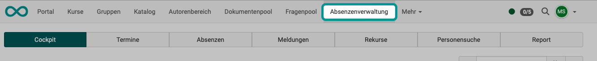
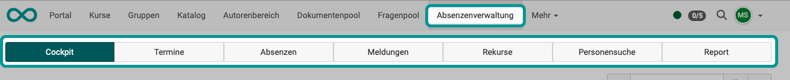
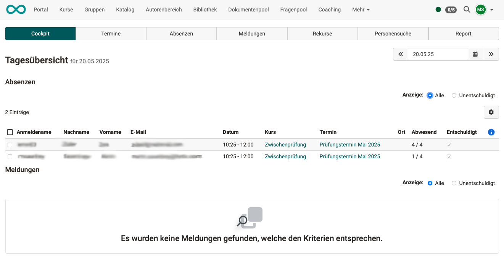
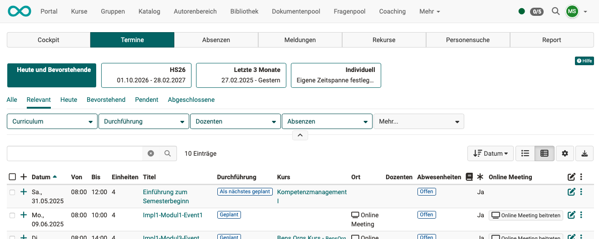
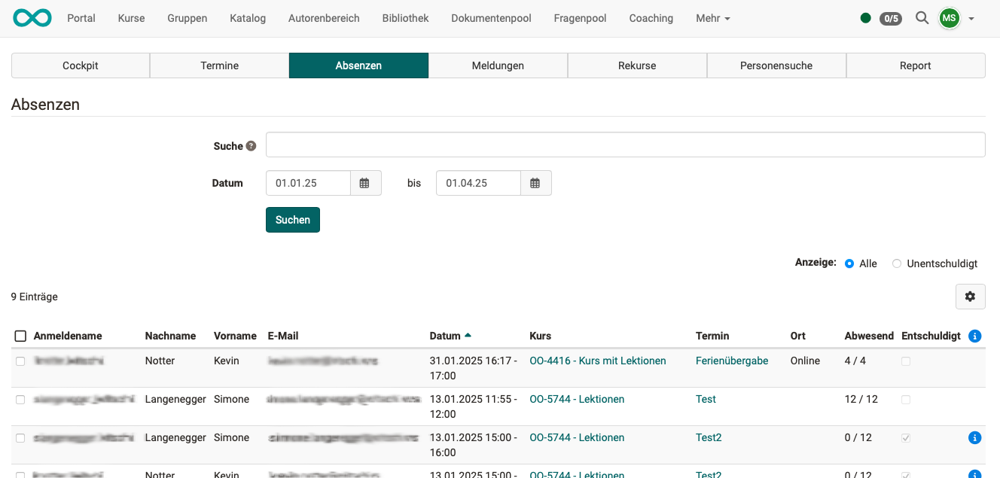
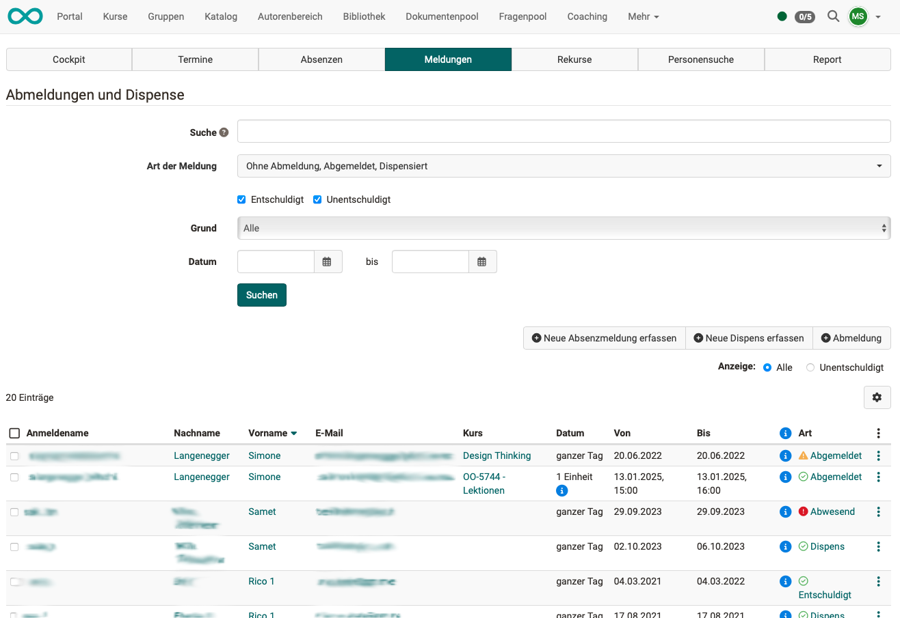
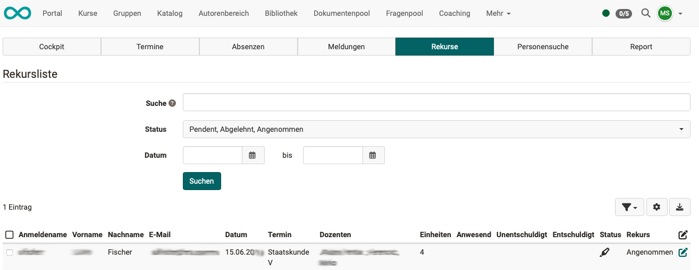
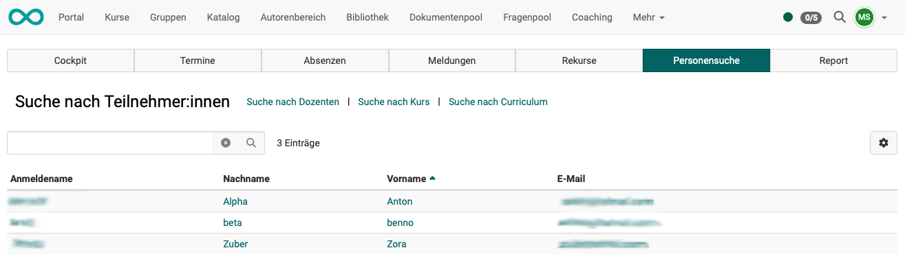
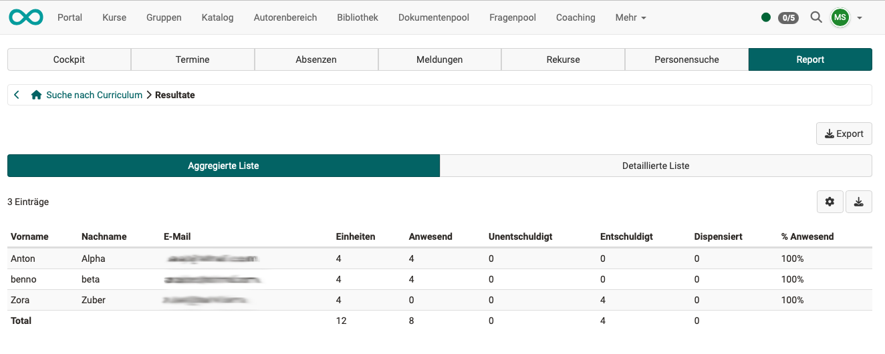
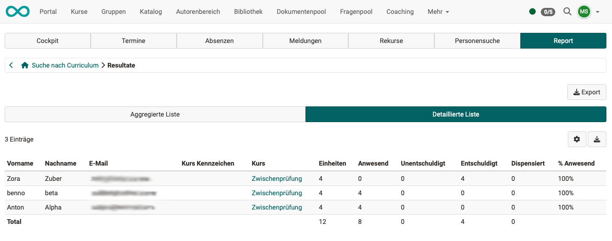

# Absence management {: #absence_management}

## Profile

Name | Absence management
---------|----------
Available since | Release 14.1 (OO-4214)

## What does absence management enable?  {: #purpose}

The absence management displayed in the main navigation refers to **cross-course absence management** by authorized persons with the **role of absence manager**.

Users with this role process dispensations and appeals, for example. This administrative task goes beyond the simple recording that takes place in a specific course, and is therefore assigned to a separate role.

Absences can also be queried or recorded in other places. 
Links to explanations of the remaining points can be found under [further information](#further_information) and in the [learning resources](../learningresources/Events_and_absences.md).

[To the top of the page ^](#absence_management)

---

## Where can I find the absence management?  {: #access}

Authorized users can find the cross-course absence management in the **main navigation**:

{ class="shadow lightbox" title="Main navigation with the absence management opened" }

!!! note "Note"

    The menu item may also be located elsewhere in the main navigation. If there are many items displayed in the main navigation, "Absence management" may be located under "More" on the far right.

[To the top of the page ^](#absence_management)

---

## Who can use the absence management? {: #users}

Course owners decide whether absence management is **used** in a particular course.

The **recording** of individual absences is then usually the responsibility of the coaches. That is why they will find the tools for recording absences in the courses or in the Coaching area. 
Participants record their own absences/notices of absence/appeals in the [personal menu >](../personal_menu/Absences.md).

The absence management displayed in the main navigation and described below is available to **absence managers**, principals and administrators. In cross-course absence management, all absences can be accessed in the overview, and authorized persons can **manage** all absences comprehensively.

[To the top of the page ^](#absence_management)

---

## Activation of the "Events and absences" module {: #activation}

As with all modules, general activation is carried out by administrators. For absence management to be available in the main navigation, the "Events and absences" module must be switched on in the system administration: 
`Administration > Modules > Events / Absences` 
Find out more under [Module Events and Absences](../../manual_admin/administration/Modules_Events_and_Absences.md).

In a specific course, OpenOlat switches on the Event & absence management itself as soon as an event is assigned to the course, for example in the Course Planner. Course owners can switch it on and off manually and configure it for the course in the course administration: 
`Course > Administration > Settings > Tab "Execution" > Section "Configuration of Event & Absence management in course"` 
Find out more, also about the cases in which OpenOlat does not switch the function on itself, under [Course Settings - Tab Execution](../learningresources/Course_Settings_Execution.md#lecture_enabled). [:octicons-tag-16:{ title="from Release 21.1.0 (OO-9711)" }](https://track.frentix.com/issue/OO-9711){:target="_blank"}

[To the top of the page ^](#absence_management)

---

## What are the main functions/components of absence management? {: #features}

After opening the absence management, the main functions are displayed as tabs:

- [Cockpit](#tab_cockpit)
- [Events](#tab_events)
- [Absences](#tab_absences)
- [Notices](#tab_notices)
- [Appeals](#appeals)
- [User search](#user_search)
- [Report](#report)

{ class="shadow lightbox" title="Tab bar of the absence management" }

[To the top of the page ^](#absence_management)

---

## Tab Cockpit {: #tab_cockpit}

The cockpit displays the **absences** and **notices** of a day in two sections below each other. The current day is displayed by default, but any other day can be selected in the top right corner.

{ class="shadow lightbox" title="Tab Cockpit of the absence management" }

[To the top of the page ^](#absence_management)

---

## Tab Events {: #tab_events}

The tab Events lists the events across courses. Use the period buttons, the quick filters and the filters to narrow down the list.

{ class="shadow lightbox" title="Tab Events of the absence management" }

[To the top of the page ^](#absence_management)

---

## Tab Absences {: #tab_absences}

{ class="shadow lightbox" title="Tab Absences of the absence management" }

You can use the search field to search for users, teachers, course titles and events. You narrow down the period with the date range. Under **Display** you choose whether the list shows all absences (**All**) or only the unauthorized ones (**Unauthorized**).

[To the top of the page ^](#absence_management)

---

## Tab Notices {: #tab_notices}

The tab Notices lists the notices of absence and dispensations. Use the buttons **Record new absence**, **Record new dispensation** and **Record new notice of absence** to record a notice for a person.

{ class="shadow lightbox" title="Tab Notices of the absence management" }

You can use the search field to search for users, teachers, course titles and events. The filters **Type of notice**, **Reason** and **Date** narrow down the list further, under **Display** you choose between **All** and **Unauthorized**.

[To the top of the page ^](#absence_management)

---

## Tab Appeals {: #appeals}

{ class="shadow lightbox" title="Tab Appeals of the absence management" }

An appeal must be lodged within the specified **appeal period**. Administrators set the appeal period system-wide.

You can use the search field to search for users, teachers and events. The **Status** filter shows the appeals by their state: pending, rejected or accepted.

[To the top of the page ^](#absence_management)

---

## Tab User search {: #user_search}

The user search finds participants. Use the links next to the title to switch to the search by teachers, by courses or by products.

{ class="shadow lightbox" title="Tab User search of the absence management" }

[To the top of the page ^](#absence_management)

---

## Tab Report {: #report}

The report summarizes the attendances per person: as an **Aggregated list** across all courses or as a **Detailed list** per course. The tab first opens a search form; the lists appear after the search. Use **Export** to download the result.

{ class="shadow lightbox" title="Aggregated list in the tab Report" }

{ class="shadow lightbox" title="Detailed list in the tab Report" }

[To the top of the page ^](#absence_management)

---

## Further information {: #further_information}

[Basic concept Events and Absences >](../basic_concepts/Events_and_Absences.md) 
[Activation and configuration of the module Events and Absences by administrators >](../../manual_admin/administration/Modules_Events_and_Absences.md) 
[Configuration of Event & Absence management in course >](../learningresources/Course_Settings_Execution.md) 
[Recording and managing absences in a course by course owners >](../learningresources/Events_and_absences.md) 
[Recording and managing absences in a course by coaches >](../learningresources/Toolbar_Events.md) 
[Personal absences >](../personal_menu/Absences.md) 
[Cross-course absence recording in Coaching >](../area_modules/Coaching.md)

[To the top of the page ^](#absence_management)

