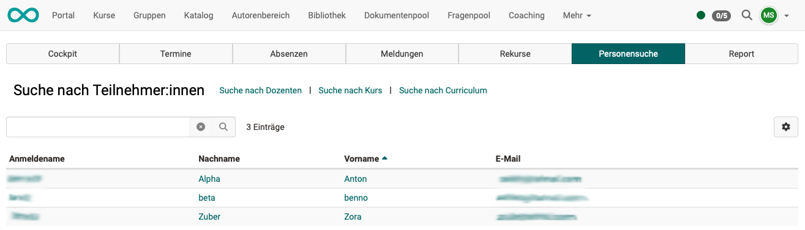

# Absence management {: #absence_management}

## What does absence management enable?  {: #purpose}

The absence management displayed in the main menu refers to **cross-course absence management** by authorized persons with the **role of absence manager**.

Users with this role process exemptions and appeals, for example. This administrative task goes beyond simple data entry, which takes place in a specific course, and is therefore assigned to a separate role.

Absences can also be queried or recorded in other places. 
Links to explanations of the remaining points can be found under [further information](#further_information) or explained in the [learning resources](../learningresources/Events_and_absences.md).

[To the top of the page ^](#absence_management)

---

## Where can I find the absence management?  {: #access}

Authorized users can find the cross-course absence management in the **header menu:**

{ class="shadow lightbox" }

!!! hint "Note"

    The menu item may also be located elsewhere in the header. If there are many items displayed in the header, "Absence Management" may be located under "More" on the far right.

[To the top of the page ^](#absence_management)

---

## Who can use the absence management? {: #users}

Course owners decide whether absence management is **used** in a particular course.

The **recording** of individual absences is then usually the responsibility of the coaches. That is why they will find the tools for recording absences in the courses or in the coaching tool.
Participants record their own absences/cancellations/appeals in the [personal menu >](../personal_menu/Absences.md).

The absence management function displayed in the main menu and described below can be made available to **absence administrators** and administrative roles. In cross-course absence management, all absences can be accessed in the overview, and authorized persons can **manage** all absences comprehensively.

[To the top of the page ^](#absence_management)

---

## Activation of the "Absence Management" module {: #activation}

As with all modules, [general activation](../../manual_admin/administration/Modules_Events_and_Absences.md) is carried out by administrators.

In order for absence management to be available in the main menu, the "Appointments and Absences" module must have been activated by an administrator. Further information can be found [here](../../manual_admin/administration/Modules_Events_and_Absences.md).

The activation and configuration of the appointment and absence management for a specific course is then carried out in the course administration: 
**Administration > Settings > Tab "Implementations" > Section "Configuration Event & Absence Management in course"** 
Find out more about this [here](../learningresources/Events_and_absences.md).

[To the top of the page ^](#absence_management)

---

## What are the main functions/components of absence management? {: #features}

After opening Absence Management, the main functions are displayed as tabs:

- [Cockpit](#tab_cockpit)
- [Events](#tab_events)
- [Absences](#tab_absences)
- [Notices](#tab_notices)
- [Appeals](#tab_appeals)
- [User search](#tab_user_search)
- [Report](#tab_report)

{ class="shadow lightbox" }

[To the top of the page ^](#absence_management)

---

## Tab Cockpit {: #tab_cockpit}

The cockpit displays the **absences** and **messages** for a given day in two sections below each other. The current day is displayed by default, but any other day can be selected in the top right corner.

{ class=" shadow lightbox" }

[To the top of the page ^](#absence_management)

---

## Tab Events {: #tab_events}

{ class=" shadow lightbox" }

[To the top of the page ^](#absence_management)

---

## Tab Absences {: #tab_absences}

{ class=" shadow lightbox" }

You can use the search field to search for users, lecturers, course titles, and dates.

[To the top of the page ^](#absence_management)

---

## Tab Notices {: #tab_notices}

{ class=" shadow lightbox" }

You can use the search field to search for users, lecturers, course titles, and dates.

[To the top of the page ^](#absence_management)

---

## Appeals {: #appeals}

{ class=" shadow lightbox" }

An appeal must be lodged within the specified **appeal period**. (The appeal period is set system-wide by your administrator.)

You can use the search field to search for users, lecturers, course titles, and dates.

[To the top of the page ^](#absence_management)

---

## User search {: #user_search}

{ class=" shadow lightbox" }

[To the top of the page ^](#absence_management)

---

## Report {: #report}

{ class=" shadow lightbox" }

{ class=" shadow lightbox" }

[To the top of the page ^](#absence_management)

---

## Further information {: #further_information}

[Basic concept Events and Absences >](../basic_concepts/Events_and_Absences.md) 
[Activation and configuration of absence management by administrators >](../../manual_admin/administration/Modules_Events_and_Absences.md) 
[Configuring absence management in a course >](../learningresources/Course_Settings_Execution.md#config_event_and_absence_management) 
[Recording and managing absences in a course by course owners >](../learningresources/Events_and_absences.md) 
[Recording and managing absences in a course by coaches >](../learningresources/Toolbar_Events.md) 
[Personal absences >](../personal_menu/Absences.md) 
[Cross-course absence recording in the coaching tool >](../area_modules/Coaching.md) 

[To the top of the page ^](#absence_management)
