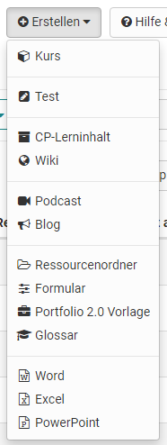

# Autorenbereich

:octicons-device-camera-video-24: **Video-Einführung**: [Voraussetzungen für Autoren](<https://www.youtube.com/embed/L0jc_LBKXLE>){:target="_blank”}

Im Autorenbereich finden OpenOlat Autoren alle Werkzeuge um Kurse und andere
Lernressourcen zu erstellen, zu importieren und zu bearbeiten.

Ruft man den Autorenbereich auf, werden standardmässig die persönlichen
Lernressourcen Favoriten angezeigt. Ferner kann rasch zur Anzeige der eigenen
Kurse ("Meine Kurse"), der eigenen Lernressourcen ("Meine Einträge") sowie zur
Suche und zu den gelöschten Lernressourcen gewechselt werden.

Standardmässig sind folgende Filter aktiviert:

Im Filter-Tab "**Favoriten**" finden Sie alle Lernressourcen, die Sie selbst
als Favorit gekennzeichnet haben.

Im Filter-Tab "**Meine Kurse**" finden Sie alle Kurse, die Sie erstellt
haben oder bei denen Sie als Besitzer (Co-Autor) eingetragen sind.

Im Filter-Tab „**Meine Einträge**“ finden Sie alle Lernressourcen, die Sie
erstellt haben oder bei denen Sie als Besitzer (Co-Autor) eingetragen sind.

Im Filter-Tab "**Suchmaske**" können Sie nach bestimmten Lernressourcen
suchen. Hier sind alle Lernressourcen auffindbar, auf die Sie Zugriff haben.
Sie können gezielt nach einem Titel suchen oder über die Filter ihre
Ergebnisse eingrenzen.

Im Filter-Tab " **Gelöscht** " haben Sie Zugriff auf Ihre gelöschten
Lernressourcen bei denen Sie als Besitzer (Co-Autor) eingetragen sind. Von
hier können sie wieder hergestellt oder durch den Administrator dauerhaft
gelöscht werden.

Weitere Details zum Umgang mit den Filteroptionen erfahren Sie
[Filtermenü](../personal/Working_with_tables.de.md).

Falls Sie einmal einen Kurs oder eine Lernressource nicht (mehr) finden, dann
überprüfen Sie doch mal die Einstellungen im Lebenszyklus. Vielleicht wurde
hier einfach die falsche Auswahl getroffen.

### Eigene Filter für die Anzeige erstellen:

Eine weitere Filterung der Anzeige ist ebenfalls möglich. So können auch
komplett neue Filterabfrage, die man häufig benötigt, generiert und
gespeichert werden. Klicken Sie zur weiteren Filterung auf den kleinen Pfeil
nach unten und es werden die Filtermöglichkeiten wie der Lernressourcen Typ, 
der technische Kurstyp, die Lizenz usw. angezeigt und es können
bestimmte Optionen gewählt werden.

### Spalten konfigurieren

Über das Zahnrad kann differenzierter ausgewählt werden, welche Informationen
jeweils in der erscheinenden Tabelle angezeigt werden. Beispielsweise erkennen
Sie in der Spalte "Ref" ob bzw. wie oft eine Lernressource in OpenOlat Kursen
referenziert wurde und können direkt zum passenden Kurs springen.

##  OpenOlat Lernressourcen erstellen und importieren

Im Autorenbereich können die folgenden Lernressourcen erstellt
werden. 

Darüber hinaus können Lernressourcen und weitere Dateien importiert
werden, sowie URLs importiert werden.

Jede Lernressource kann im Bereich "Einstellungen" der Administration weiter
konfiguriert werden. Beispielsweise können hier Beschreibungen und Metadaten hinterlegt sowie die Freigabe der Lernressource definiert werden. Je nach Lernressource sind auch weitere Konfigurationen möglich. 

In den folgenden Kapiteln finden Sie Erläuterungen zu den einzelnen [OpenOlat Lernressourcen](Various_Types_of_Learning_Resources.de.md), welche Aktionen
sie im Autorenbereich vornehmen können, und Informationen zur [Infoseite](Set_up_info_page.de.md) einer Lernressource.

