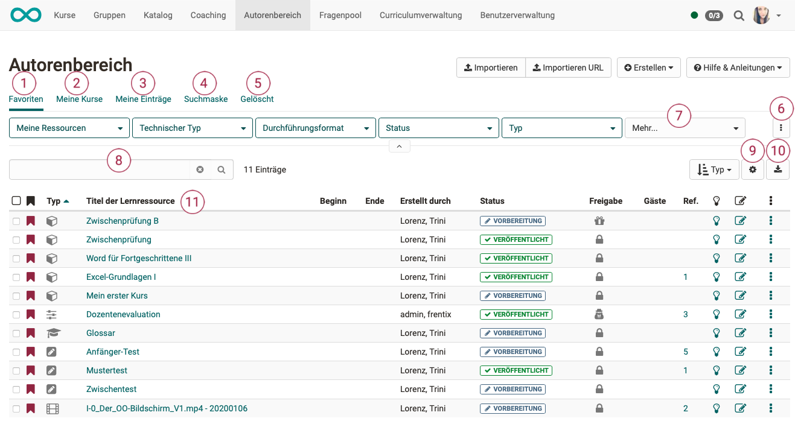
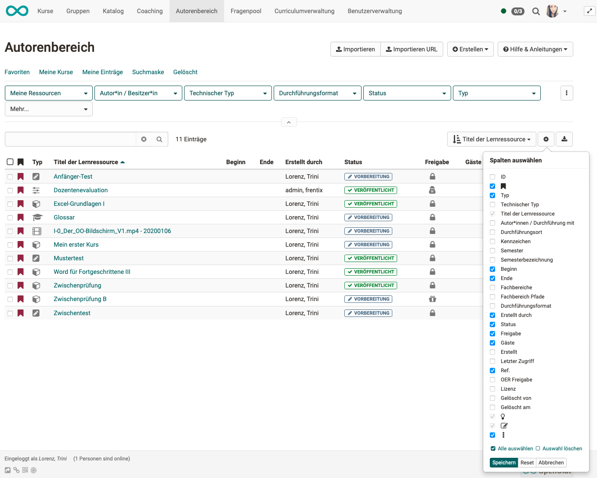

# Autorenbereich - Übersicht

:octicons-device-camera-video-24: **Video-Einführung**: [Voraussetzungen für Autoren](<https://www.youtube.com/embed/L0jc_LBKXLE>){:target="_blank”}

Im Autorenbereich finden OpenOlat Autor:innen alle Werkzeuge um Kurse und andere Lernressourcen zu erstellen, zu importieren und zu bearbeiten.

Alle bereits vorhandenen Kurse und Lernressourcen werden in einer Tabelle angezeigt.

{ class="shadow lightbox" }

### 1. Favoriten
Im Filter-Tab "**Favoriten**" finden Sie alle Lernressourcen, die Sie selbst als Favorit gekennzeichnet haben. Diese Ansicht wird standardmässig angezeigt, wenn Sie den Autorenbereich aufrufen.

### 2. Meine Kurse
Im Filter-Tab "**Meine Kurse**" finden Sie alle Kurse, die Sie erstellt
haben oder bei denen Sie als Besitzer (Co-Autor) eingetragen sind. "Meine Kurse" ist eine Teilmenge von "Meine Einträge". 

### 3. Meine Einträge 
Im Filter-Tab "**Meine Einträge**" finden Sie alle Lernressourcen, die Sie erstellt haben oder bei denen Sie als Besitzer:in (Co-Autor:in) eingetragen sind. Das sind neben den Kursen auch Test-Lernressourcen, Formulare, usw. 

### 4. Suchmaske 
Im Filter-Tab "**Suchmaske**" können Sie nach bestimmten Lernressourcen suchen. Hier sind alle Lernressourcen auffindbar, auf die Sie Zugriff haben. Sie können gezielt nach einem Titel suchen oder über die Filter ihre Ergebnisse eingrenzen.

### 5. Gelöscht
Im Filter-Tab "**Gelöscht**" haben Sie Zugriff auf Ihre gelöschten
Lernressourcen bei denen Sie als Besitzer (Co-Autor) eingetragen sind. Der Tab "Gelöscht" ist somit eine Art Papierkorb. Von hier können sie wieder hergestellt oder durch den Administrator dauerhaft gelöscht werden.

### 6. Eigene Filter-Tabs erstellen 
Sie können in der Zeile mit den Filter-Tabs (1-5) auch eine häufig benötigte Filterabfrage komplett neu erstellen. Mit Klick auf "Filter speichern" können Sie Ihrer aktuellen Filterkombination einen eigenen Namen geben, die dann direkt so wieder aufgerufen werden kann. 

### 7. Buttons zum Filtern
In der zweiten Zeile sind bereits mehrere **Buttons** mit Filteroptionen angezeigt. Unter **Mehr** können Sie weitere Buttons anzeigen. Klicken Sie zur weiteren Filterung auf den kleinen Pfeil nach unten und es werden die Filtermöglichkeiten zur Auswahl angezeigt. 

### 8. Suchfeld 
Im **Suchfeld** können Sie direkt nach dem Titel suchen. Auch Teile des Titels liefern bereits ein Suchergebnis.

Weitere Details zum Umgang mit den Filteroptionen erfahren Sie im Abschnitt zum 
[Filtermenü](../basic_concepts/Table_Concept.de.md).

!!! hint "Tipp"

    Falls Sie einmal einen Kurs oder eine Lernressource nicht (mehr) finden, könnte es eventuell am Lebenszyklus liegen. Überprüfen Sie dort die Einstellungen. Vielleicht wurde hier einfach die falsche Auswahl getroffen.

### 9. Spalten konfigurieren

Über das Zahnrad-Icon kann ausgewählt werden, welche Spalten in der Tabelle angezeigt werden. Sie können so individuell die relevanten Informationen zusammenstellen.

{ class="shadow lightbox" }

**Beispiel**: 
In der Spalte "Ref." ist angezeigt, ob bzw. wie oft eine Lernressource in OpenOlat Kursen referenziert wurde. Klicken Sie auf diese Zahl, werden Ihnen die Kurse namentlich angezeigt. Sie können dann direkt zum gewünschten Kurs springen.

{ class="shadow lightbox" }

### 10. Tabelle downloaden
Sie können die gesamte Tabelle in dem aktuell angezeigten Zustand herunterladen.

### 11. Spalten sortieren
Durch Klick auf einen Spaltentitel werden alle Einträge der Tabelle alphabetisch, nach Datum, usw. sortiert.

**Beispiel**: Klick auf Spaltentitel "Titel der Lernressource" sortiert die Tabelle alphabetisch nach dem Titel. Bei nochmaligem Klick umgekehrt alphabetisch.

