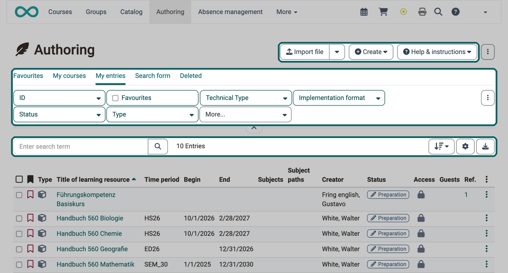
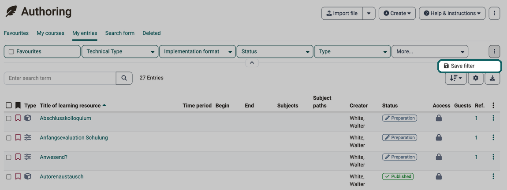
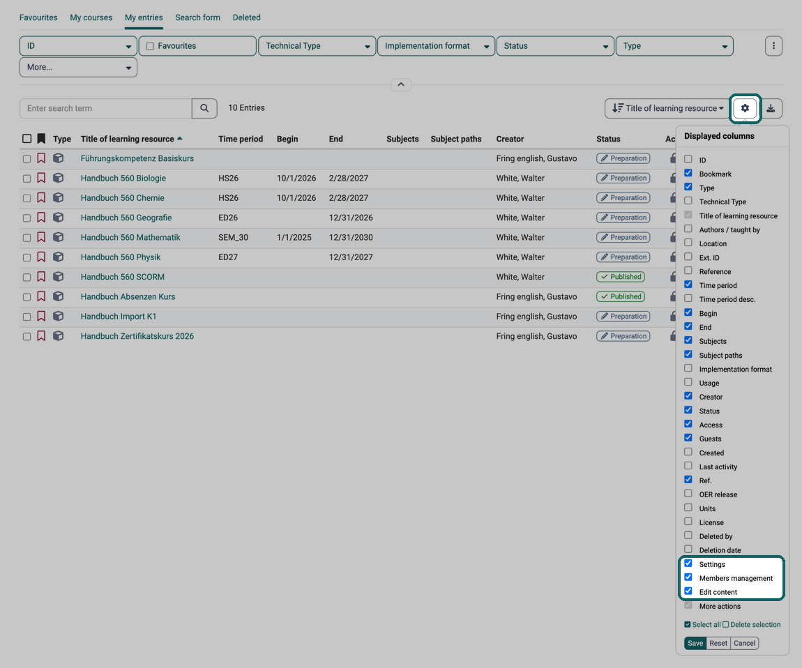
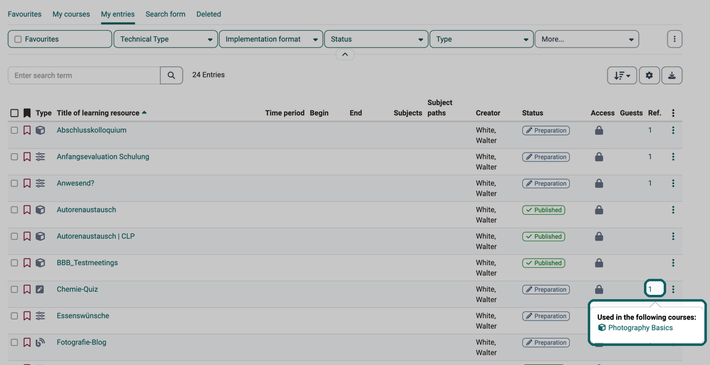
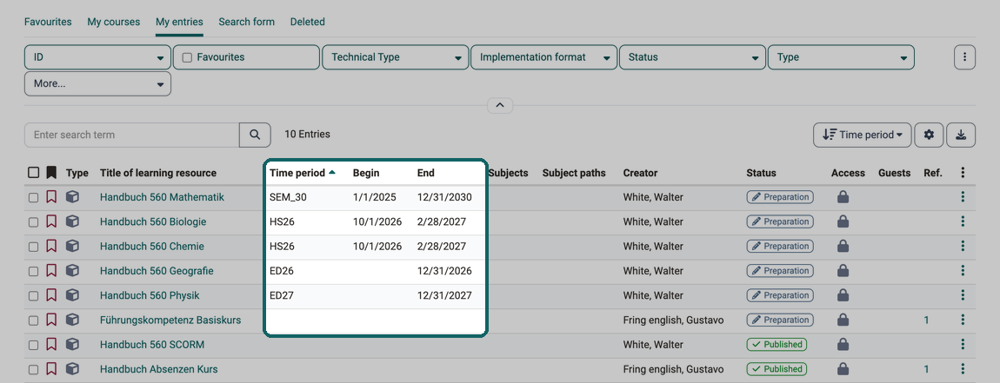

# Authoring - Overview {: #authoring}

:octicons-device-camera-video-24: **Video introduction (German)**: [Voraussetzungen für Autoren](<https://www.youtube.com/embed/L0jc_LBKXLE>){:target="_blank"}

In "Authoring" OpenOlat authors will find all the tools to create, import and edit courses and other learning resources.

All existing courses and learning resources are displayed in a table.

{ class="shadow lightbox" title="Tab My entries in Authoring · 2026.10.08" }

With the buttons "Import file" and "Create" at the top right, you add new courses and learning resources, see [Authoring - Create courses and learning resources](authoring_new_course.md). Under "Help & instructions" you find the help offers set up for Authoring.

### Favourites {: #favourites}
In the filter tab "Favourites", you will find all the learning resources you have marked as favourites. This view is displayed by default when you open Authoring. If you have not marked any learning resource as a favourite yet, OpenOlat opens the filter tab "My entries" instead.

### My courses {: #my_courses}
In the filter tab "My courses", you will find all the courses that you have created or for which you are entered as owner (co-author). "My courses" is a subset of "My entries".

### My entries {: #my_entries}
In the filter tab "My entries", you will find all learning resources you have created or for which you are entered as owner (co-author). In addition to courses, these are also test learning resources, forms, etc.

### Search form {: #search}
In the filter tab "Search form", you can search for specific learning resources. All learning resources to which you have access can be found here. You can search for a specific title or use the filters to narrow down your results.

### Deleted {: #authoring-deleted}

In the filter tab "Deleted", you have access to your deleted learning resources for which you are listed as the owner (co-author). The tab "Deleted" is therefore a kind of trash bin. Here you can restore your learning resources/courses. Only administrators or learning resource managers can permanently delete learning resources/courses.

### Create your own filter tabs [:octicons-tag-16:{ title="from Release 16.0 (OO-5482)" }](https://track.frentix.com/issue/OO-5482){:target="_blank"} {: #custom_filter_tabs}
You can also completely recreate a frequently needed filter query in the line with the filter tabs "Favourites" to "Deleted". By clicking on "Save filter" you can give your current filter combination a name of your own, which can then be called up again the same way.

{ class="shadow lightbox" title="Tab My entries in Authoring · 2026.09.29" }

### Filter buttons {: #filter_buttons}
The second line already shows several buttons with filter options, for example "Technical Type", "Implementation format", "Status" and "Type". By pressing "More...", additional buttons will be displayed. For further filtering, click on the small arrow pointing downwards and the filter options will be displayed for selection. 
The "Author / owner" filter searches across the owner's first name, last name, username and email address. Searching by email is especially useful when multiple authors share the same last name.

### Search field {: #search_field}
In the search field you can search directly for the title. Even parts of the title already provide a search result.

You can find more details on the filter options and the table concept on the page [Working with tables](../basic_concepts/Table_Concept.md).

!!! tip "Tip"

    If you cannot find a course or learning resource (anymore), it could be due to the "Status" filter. Check which status values are selected there. Deleted learning resources are in the "Deleted" tab.

### Configure columns {: #configure_columns}

The cogwheel icon can be used to select which columns are displayed in the table. This allows you to compile the relevant information individually.

{ class="shadow lightbox" title="Displayed columns list in Authoring · 2026.10.08" }

**Example:** 
The column "Ref." shows whether or how often a learning resource has been referenced in OpenOlat courses. Click on this number and the courses will be displayed by name. You can then jump directly to the desired course.

{ class="shadow lightbox" title="Ref. column in the Authoring table · 2026.09.28" }

#### Columns for frequent actions [:octicons-tag-16:{ title="from Release 21.1 (OO-9780)" }](https://track.frentix.com/issue/OO-9780){:target="_blank"} {: #action_columns}

If you need the same action often, for example the members of many courses one after the other, a symbol column saves you the way through the menu under the 3 dots. You show three such columns through the cogwheel:

* **Settings:** The cogwheel symbol opens the settings of the learning resource in the tab "Metadata".
* **Members management:** The symbol opens the members management of the learning resource.
* **Edit content:** The pencil symbol opens the editor of the learning resource. The tooltip names it, for example "Course editor" or "Test editor". For learning resources that cannot be edited or that are finished or in the trash, the cell stays empty.

The three columns are hidden by default. The column selection offers them to authors, learning resource managers and administrators.

### Download table {: #download_table}
You can download the entire table in the currently displayed state.

### Sort columns [:octicons-tag-16:{ title="from Release 20.3.0 (OO-9204)" }](https://track.frentix.com/issue/OO-9204){:target="_blank"} {: #sort_columns}
By clicking on a column title, all entries in the table will be sorted alphabetically, by date, etc. Empty entries always appear at the end of the list, regardless of the sort direction.

**Example**: Click on column title "Title of learning resource" to sort the table alphabetically by title. Click again and it will appear in reverse alphabetical order.

The "Status" column is always sorted in the following fixed order: Preparation, Review, Access for coach, Published, Finished, Trash.

#### Sorting by time period [:octicons-tag-16:{ title="from Release 20.3.0 (OO-9218)" }](https://track.frentix.com/issue/OO-9218){:target="_blank"}

!!! note "Note"
    The "Time period" column sorts entries chronologically by the time frame and not alphabetically by the short label. The order is:

    1. by begin date
    2. without begin date: by end date
    3. without time frame: to the end of the list
    4. within the same time period: alphabetically

    Entries without a time period always appear at the end of the list.

{ class="shadow lightbox" title="Time period column in the Authoring table · 2026.10.08" }

The available time periods are provided by the system administration. The page [Module Time periods](../../manual_admin/administration/Modules_Time_Period.md) describes how administrators manage time periods.

[To the top of the page ^](#authoring)

---

### Type filter [:octicons-tag-16:{ title="from Release 20.3.0 (OO-9204)" }](https://track.frentix.com/issue/OO-9204){:target="_blank"} {: #type_filter}

The "Type" filter offers, among others, the following labels: "Audio" as well as an "Others" group, which combines the following types: "Test (QTI 1.2 - no longer supported)", "Questionnaire", "Movie", "Animation", "Other file".

[To the top of the page ^](#authoring)

---

## Further information {: #further_information}

[Authoring - Create courses and learning resources >](authoring_new_course.md) 
[Working with tables >](../basic_concepts/Table_Concept.md) 
[Module Time periods >](../../manual_admin/administration/Modules_Time_Period.md) 
[Creating Courses >](../../manual_user/learningresources/Creating_Course.md) 
[How do I create my first OpenOlat course? >](../../manual_how-to/my_first_course/my_first_course.md) 
[Course elements in the Course editor >](../../manual_user/learningresources/General_Configuration_of_Course_Elements.md) 
[Learning path course - Overview >](../../manual_user/learningresources/Learning_path_course.md)

**youtube** 
[Voraussetzungen für Autoren](<https://www.youtube.com/embed/L0jc_LBKXLE>)

[To the top of the page ^](#authoring)
