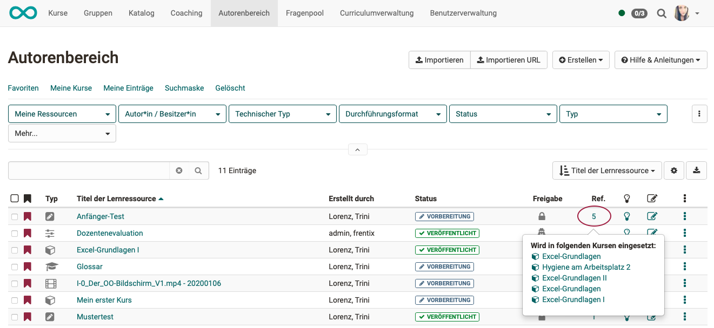

# Authoring - Overview

:octicons-device-camera-video-24: **Video introduction (German)**: [Voraussetzungen für Autoren](<https://www.youtube.com/embed/L0jc_LBKXLE>){:target="_blank”}

In "Authoring" OpenOlat authors will find all the tools to create, import and edit courses and other learning resources.

All existing courses and learning resources are displayed in a table.

{ class="shadow lightbox" }

### 1. Favourites
In the filter tab "**Favourites**", you will find all the learning resources you have marked as favourites. This view is displayed by default when you call up the "Authoring".

### 2. My courses
In the filter tab "**My courses**", you will find all the courses that you have or for which you are entered as owner (co-author). "My courses" is a subset of "My entries".

### 3. My entries 
In the filter tab "**My entries**", you will find all learning resources you have created or for which you are entered as owner (co-author). In addition to courses, these are also test learning resources, forms, etc. 

### 4. Search form
In the filter tab "**Search form**", you can search for specific learning resources. All learning resources to which you have access can be found here. You can search for a specific title or use the filters to narrow down your results.

### 5. Deleted {: #authoring-deleted}

In the filter tab "**Deleted**", you have access to your deleted learning resources for which you are listed as the owner (co-author). The tab "Deleted" is therefore a kind of trash bin.
Here you can restore your learning resources/courses.
Only administrators or learning resource managers can permanently delete learning resources/courses.

### 6. Create your own filter tabs 
You can also completely recreate a frequently needed filter query in the line with the filter tabs (1-5). By clicking on "Save filter" you can give your current filter combination a name of your own, which can then be called up again the same way. 

### 7. Filter buttons
The second line already shows several **buttons** with filter options. By pressing "**More**", additional buttons will be displayed. For further filtering, click on the small arrow pointing downwards and the filter options will be displayed for selection.

### 8. Search box 
In the **Search box** you can search directly for the title. Even parts of the title already provide a search result.

You can find out more details on how to use the filter options in the article on the 
[Filter Menu](../basic_concepts/Table_Concept.md).

!!! hint "Hint"

    If you cannot find a course or learning resource (anymore), it could possibly be due to the lifecycle. Check the settings there. Perhaps the wrong selection was made.

### 9. Configure columns

The cogwheel icon can be used to select which columns are displayed in the table. This allows you to compile the relevant information individually.

{ class="shadow lightbox" }

**Example:** 
The column "Ref." shows whether or how often a learning resource has been referenced in OpenOlat courses. Click on this number and the courses will be displayed by name. You can then jump directly to the desired course.

{ class="shadow lightbox" }

### 10. Download table
You can download the entire table in the currently displayed state.

### 11. Sort columns
By clicking on a column title, all entries in the table will be sorted alphabetically, by date, etc.

**Example**: Click on column title "Title of learning resource" to sort the table alphabetically by title. Click again and it will appear in reverse alphabetical order.